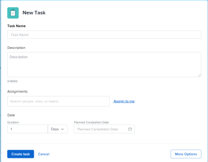

# Criar tarefas recorrentes

<!--Audited: 01/2024-->

É possível criar tarefas recorrentes para tarefas que você precisa repetir como parte de um único projeto.

Para obter informações gerais sobre tarefas recorrentes, incluindo o impacto da edição de uma tarefa recorrente existente, consulte [Visão geral de tarefas recorrentes](../../../manage-work/tasks/manage-tasks/recurring-tasks-overview.md).

## Requisitos de acesso

+++ Expanda para visualizar os requisitos de acesso para a funcionalidade neste artigo.

<table style="table-layout:auto"> 
 <col> 
 <col> 
 <tbody> 
  <tr> 
   <td role="rowheader">Pacote do Adobe Workfront</td> 
   <td> 
Qualquer
 </td> 
  </tr> 
  <tr> 
   <td role="rowheader">Licença do Adobe Workfront</td> 
   <td> 
Standard
 
   
Trabalhar ou superior
 </td> 
  </tr> 
  <tr> 
   <td role="rowheader">Configurações de nível de acesso</td> 
   <td> 
Editar acesso a tarefas e projetos
 </td> 
  </tr> 
  <tr> 
   <td role="rowheader">Permissões de objeto</td> 
   <td> 
Contribuir com permissões para o projeto com a capacidade de adicionar tarefas ou superior
 
   
Ao criar uma tarefa, você recebe automaticamente permissões Gerenciar para a tarefa
 
    </td> 
  </tr> 
 </tbody> 
</table>

Para obter mais informações, consulte [Requisitos de acesso na documentação do Workfront](/help/quicksilver/administration-and-setup/add-users/access-levels-and-object-permissions/access-level-requirements-in-documentation.md).

+++

<!--Old:

<table style="table-layout:auto"> 
 <col> 
 <col> 
 <tbody> 
  <tr> 
   <td role="rowheader">Adobe Workfront plan*</td> 
   <td> 
Any
 </td> 
  </tr> 
  <tr> 
   <td role="rowheader">Adobe Workfront license*</td> 
   <td> 
New: Standard
 
   
Current: Work or higher
 </td> 
  </tr> 
  <tr> 
   <td role="rowheader">Access level configurations*</td> 
   <td> 
Edit access to Tasks and Projects
 </td> 
  </tr> 
  <tr> 
   <td role="rowheader">Object permissions</td> 
   <td> 
Contribute permissions to the project with ability to Add Tasks or higher
 
   
When you create a task you automatically receive Manage permissions to the task
 
   
 For information about task permissions, see <a href="../../../workfront-basics/grant-and-request-access-to-objects/share-a-task.md" class="MCXref xref">Share a task </a>.
  </td> 
  </tr> 
 </tbody> 
</table>

&#42;To find out what plan, license type, or access you have, contact your Workfront administrator. For more information about access requirements, see [Access requirements in Workfront documentation](/help/quicksilver/administration-and-setup/add-users/access-levels-and-object-permissions/access-level-requirements-in-documentation.md). -->

## Criar uma tarefa recorrente

>[!NOTE]
>
>Não é possível criar uma tarefa recorrente modificando uma tarefa existente. Você deve criar uma tarefa do zero.

1. Vá para o projeto em que deseja criar uma tarefa recorrente e clique na seção **Tarefas** no painel esquerdo.
1. Clique em **Nova tarefa**.

   A caixa de diálogo Nova Tarefa é exibida.

   

1. Clique em **Mais opções** e digite um nome para a tarefa no campo **Nome da Tarefa**.
1. Continue atualizando a tarefa da mesma forma que faria se adicionasse uma nova tarefa. Para obter mais informações sobre como adicionar uma nova tarefa, consulte [Criar tarefas em um projeto](../../../manage-work/tasks/create-tasks/create-tasks-in-project.md).

   >[!TIP]
   >
   >   A Duração e as Horas planejadas indicadas para uma nova tarefa recorrente são a Duração e as Horas planejadas de cada ocorrência. A Duração da tarefa pai é o tempo entre a Data de Início Planejada da tarefa mais antiga e a Data de Conclusão Planejada da tarefa mais recente. As Horas Planejadas da tarefa pai é o total de todas as Horas Planejadas de todas as ocorrências.

1. Clique em **Visão geral** no painel esquerdo.
1. Role para baixo até a seção **Agendamento de Recorrência** e selecione a opção **Tornar esta tarefa recorrente**.

   

1. Na lista suspensa **Frequência**, selecione o número de unidades de tempo quando desejar que a tarefa ocorra e o tipo de unidades de tempo. Selecione entre as seguintes opções:

   <table style="table-layout:auto"> 
    <col> 
    <col> 
    <thead> 
     <tr> 
      <th>Tipo de periodicidade</th> 
      <th>Descrição</th> 
     </tr> 
    </thead> 
    <tbody> 
     <tr> 
      <td role="rowheader"><strong>Dia</strong> </td> 
      <td> 
A tarefa é repetida todos os dias, a cada dois dias, a cada três dias e assim por diante, dependendo da cadência selecionada. Você pode configurar tarefas para repetição até o dia 6. A configuração padrão é 1 dia. 
 </td> 
     </tr> 
     <tr> 
      <td role="rowheader"><strong>Dia de Trabalho</strong> </td> 
      <td> 
 A tarefa se repete todos os dias úteis, a cada dois dias úteis, a cada três dias úteis e assim por diante, dependendo da cadência selecionada. Você pode configurar tarefas para repetir até a cada 6° dia útil.
 
Esta opção usa o agendamento padrão definido pelo administrador do sistema, conforme descrito em <a href="../../../administration-and-setup/set-up-workfront/configure-timesheets-schedules/create-schedules.md" class="MCXref xref">Criar um agendamento</a>.
 </td> 
     </tr> 
     <tr> 
      <td role="rowheader"><strong>Semana</strong> </td> 
      <td> 
 A tarefa é repetida a cada semana, a cada 2 semanas, a cada 3 semanas e assim por diante, dependendo da cadência selecionada.
 
No campo <strong>Repetições</strong>, selecione o dia da semana em que você deseja que cada tarefa ocorra. Você pode selecionar vários dias. 
 </td> 
     </tr> 
     <tr> 
      <td role="rowheader"><strong>Mês</strong> </td> 
      <td> 
A tarefa é repetida a cada mês, a cada dois meses, a cada três meses e assim por diante, dependendo da cadência selecionada. Você pode selecionar entre 1 e 12 meses. 
 
No campo <strong>Repetições</strong>, selecione uma das seguintes opções quando desejar que a tarefa ocorra:
 
       <ul> 
        <li> 
<strong>todo mês no dia &lt;data do mês&gt;</strong> 
 
Você pode selecionar dias de 1 a 30 ou selecionar <strong>último</strong>. Por exemplo, você pode selecionar "todo mês no dia 30". 
 </li> 
        <li> 
<strong>todo mês no &lt;número&gt; &lt;dia da semana&gt;</strong> 
 
No primeiro menu suspenso, você pode selecionar um número entre 1 e 4 para o número da semana no mês ou selecionar "último". 
 
No segundo menu suspenso, é possível selecionar qualquer dia da semana. 
 
Por exemplo, você pode selecionar "todo mês na 2ª terça-feira". 
 </li> 
       </ul> </td> 
     </tr> 
    </tbody> 
   </table>

   >[!NOTE]
   >
   >Se você tiver uma Exceção de Cronograma associada ao cronograma do projeto, as tarefas recorrentes não poderão ser iniciadas durante a exceção. As tarefas recorrentes que ocorrem durante a exceção de programação são programadas para iniciar no primeiro dia útil após a exceção. Para obter mais informações sobre exceções de agendamento, consulte o artigo [Criar um agendamento](../../../administration-and-setup/set-up-workfront/configure-timesheets-schedules/create-schedules.md).

1. No campo **Inícios**, selecione a data e a hora em que deseja que as tarefas recorrentes comecem.
1. No campo **Términos**, selecione a data e a hora em que deseja concluir as tarefas recorrentes

   Ou

   Selecione **após `<number>` ocorrências** para indicar quantas vezes a tarefa recorrente deve ocorrer. O Workfront cria o mesmo número de recorrências para as tarefas que o número indicado neste campo.

1. Clique em **Criar tarefa.**

   A lista de tarefas é exibida. A tarefa recorrente é criada como um pai e todas as recorrências são seus filhos. O Workfront gerou automaticamente os nomes das tarefas filhas, usando o nome inserido para o pai seguido por um número. As tarefas recorrentes são colocadas no final da lista de tarefas.

   Para obter mais informações sobre quais campos são preenchidos automaticamente na tarefa pai recorrente, consulte [Visão geral das tarefas recorrentes](../../../manage-work/tasks/manage-tasks/recurring-tasks-overview.md).

   

1. (Opcional) Modifique cada tarefa recorrente como faria com qualquer outra tarefa no projeto.

   Por exemplo, você pode adicionar atribuições, predecessores, durações e modificar quaisquer outras informações sobre a tarefa, incluindo campos personalizados.

   >[!IMPORTANT]
   >
   >Modificar a recorrência pai depois que os filhos forem modificados individualmente pode causar informações diferentes entre os filhos ou entre os filhos e o pai. Para obter mais informações, consulte [Visão geral das tarefas recorrentes](../../../manage-work/tasks/manage-tasks/recurring-tasks-overview.md).
