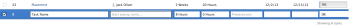

# Criar tarefas em um projeto

Você pode criar tarefas em um projeto somente depois de criá-lo.

Por exemplo, depois de criar um projeto, você pode querer adicionar tarefas e modificá-las para organizar o plano do projeto. Para obter mais informações sobre como criar um projeto, consulte [Criar um projeto](../../../manage-work/projects/create-projects/create-project.md).

Para obter informações sobre como criar tarefas pessoais que não estão em um projeto, consulte a seção &quot;Criar uma tarefa pessoal&quot; no artigo [Criar itens de trabalho a partir da área inicial](../../../workfront-basics/using-home/using-the-home-area/create-work-items-in-home.md).

Este artigo descreve como criar tarefas do zero. Você também pode criar tarefas das seguintes maneiras:

* Copiando ou duplicando tarefas existentes. Para obter mais informações, consulte [Copiar e duplicar tarefas](../../../manage-work/tasks/manage-tasks/copy-and-duplicate-tasks.md).
* Ao mover tarefas de um projeto para outro. Para obter mais informações, consulte [Mover tarefas](../../../manage-work/tasks/manage-tasks/move-tasks.md).

## Requisitos de acesso

<!--drafted for P&P - replace the table:

<table style="table-layout:auto"> 
 <col> 
 <col> 
 <tbody> 
  <tr> 
   <td role="rowheader">Adobe Workfront plan*</td> 
   <td> 
Any
 </td> 
  </tr> 
  <tr> 
   <td role="rowheader"> 
Adobe Workfront license*
 </td> 
   <td>
Current license: Standard
 
   Or
   
Legacy license: Work or higher
 </td> 
  </tr> 
  <tr> 
   <td role="rowheader">Access level configurations*</td> 
   <td> 
Edit access to Tasks and Projects
 
Note: If you still don't have access, ask your Workfront administrator if they set additional restrictions in your access level. For information about access to tasks, see <a href="../../../administration-and-setup/add-users/configure-and-grant-access/grant-access-tasks.md" class="MCXref xref">Grant access to tasks</a>. For information on how a Workfront administrator can change your access level, see <a href="../../../administration-and-setup/add-users/configure-and-grant-access/create-modify-access-levels.md" class="MCXref xref">Create or modify custom access levels</a>. 
 </td> 
  </tr> 
  <tr> 
   <td role="rowheader">Object permissions</td> 
   <td> 
Contribute permissions to the project with ability to Add Tasks or higher
 
When you create a task you automatically receive Manage permissions to the task
 
 For information about task permissions, see <a href="../../../workfront-basics/grant-and-request-access-to-objects/share-a-task.md" class="MCXref xref">Share a task </a>. 
 
For information on requesting additional permissions, see <a href="../../../workfront-basics/grant-and-request-access-to-objects/request-access.md" class="MCXref xref">Request access to objects </a>.
 </td> 
  </tr> 
 </tbody> 
</table>
-->
Você deve ter o seguinte acesso para executar as etapas neste artigo:

<table style="table-layout:auto"> 
 <col> 
 <col> 
 <tbody> 
  <tr> 
   <td role="rowheader">Plano Adobe Workfront*</td> 
   <td> 
Qualquer Um
 </td> 
  </tr> 
  <tr> 
   <td role="rowheader"> 
Licença da Adobe Workfront*
 </td> 
   <td> 
Trabalho ou superior
 </td> 
  </tr> 
  <tr> 
   <td role="rowheader">Configurações de nível de acesso*</td> 
   <td> 
Editar acesso a Tarefas e Projetos
 
Observação: Caso ainda não tenha acesso, pergunte ao administrador do Workfront se ele definiu restrições adicionais em seu nível de acesso. Para obter informações sobre o acesso a tarefas, consulte <a href="../../../administration-and-setup/add-users/configure-and-grant-access/grant-access-tasks.md" class="MCXref xref">Conceder acesso a tarefas</a>. Para obter informações sobre como um administrador do Workfront pode alterar seu nível de acesso, consulte <a href="../../../administration-and-setup/add-users/configure-and-grant-access/create-modify-access-levels.md" class="MCXref xref">Criar ou modificar níveis de acesso personalizados</a>. 
 </td> 
  </tr> 
  <tr> 
   <td role="rowheader">Permissões de objeto</td> 
   <td> 
Contribuir com permissões para o projeto com capacidade de adicionar tarefas ou superior
 
Ao criar uma tarefa, você recebe automaticamente permissões de gerenciamento para a tarefa
 
 Para obter informações sobre permissões de tarefa, consulte <a href="../../../workfront-basics/grant-and-request-access-to-objects/share-a-task.md" class="MCXref xref">Compartilhar uma tarefa </a>. 
 
Para obter informações sobre a solicitação de permissões adicionais, consulte <a href="../../../workfront-basics/grant-and-request-access-to-objects/request-access.md" class="MCXref xref">Solicitar acesso a objetos </a>.
 </td> 
  </tr> 
 </tbody> 
</table>

&#42;Para descobrir qual plano, tipo de licença ou acesso você tem, entre em contato com o administrador da Workfront.

## Criar tarefas em um projeto

1. Vá para o projeto onde deseja criar uma tarefa.
1. Clique em **Tarefas** no painel esquerdo.
1. (Condicional) Se você estiver visualizando a lista de tarefas em uma visualização ágil, clique no botão **Exibição de lista** ícone  no canto superior direito para exibir a lista de tarefas.
1. (Opcional) Clique no botão **Modo de Plano** ícone  e selecione **Salvar manualmente**, em seguida selecione **Padrão** ou **Planejamento de linha do tempo**. Isso desativa o **Salvar automaticamente** que é ativada por padrão.

   

   >[!TIP]
   >
   >Você pode reverter as alterações ao selecionar Salvar Manual.

1. Crie uma nova tarefa seguindo um destes procedimentos:

   * Clique em **Nova tarefa** na parte superior da lista de tarefas
   * Clique em **Adicionar mais tarefas** na parte inferior da lista de tarefas

   

1. (Condicional) Se você clicou **Nova tarefa** faça o seguinte:

   1. Especifique qualquer um dos campos na lista limitada de campos dentro do **Nova tarefa** e, em seguida, clique em **Criar tarefa** se quiser criar uma tarefa rapidamente.

      Ou

      Para atualizar todos os campos da tarefa, clique em **Mais opções** para abrir o **Criar tarefa** caixa.

      

      O **Criar tarefa** será aberta.

      

       

      >[!NOTE]
      >
      >Dependendo de como o administrador do Workfront configurar o Modelo de layout, os campos na caixa Criar tarefa podem exibir campos diferentes no ambiente. Para obter mais informações, consulte [Personalizar a visualização de Detalhes usando um modelo de layout](../../../administration-and-setup/customize-workfront/use-layout-templates/customize-details-view-layout-template.md).

   1. Especifique as informações para as seguintes áreas no painel esquerdo da caixa Criar tarefa :

      * Nome da tarefa
      * Visão geral
      * Atribuições
      * Forms personalizada
      * Finanças
      * Configurações

         Para obter informações sobre como definir todos os campos relacionados à tarefa em uma tarefa, consulte [Editar tarefas](../../../manage-work/tasks/manage-tasks/edit-tasks.md).
   1. (Condicional e opcional) Se desejar que a tarefa seja recorrente, atualize o **Frequência de recorrência** campo. Para obter mais informações sobre como criar tarefas recorrentes, consulte [Criar tarefas recorrentes](../../../manage-work/tasks/create-tasks/create-recurring-tasks.md).
   1. (Opcional) Clique em **Documentos** no painel esquerdo para anexar um documento à nova tarefa, em seguida, clique em **Adicionar ou vincular arquivos** para adicionar um documento à tarefa a partir do computador, outro serviço ou para vincular documentos e pastas do computador ou de outro serviço.

1. (Condicional) Se você clicou **Adicionar mais tarefas** na etapa 5, comece a inserir as informações da tarefa usando a edição em linha e pressione Enter.

   <!--
   
(NOTE: ensure this stays accurate)

   -->

   Recomendamos usar essa opção especialmente ao adicionar várias tarefas à lista.

   

1. (Condicional) Siga um destes procedimentos:

   * Se você clicou **Nova tarefa** na etapa 5, clique em **Criar tarefa** para salvar as alterações e adicionar a nova tarefa ao projeto.

      <!--   
     
(NOTE: is this step still right?)
   
     -->

   * Se você clicou **Adicionar mais tarefas** na etapa 5, faça o seguinte:

      <!--   
     
(NOTE: is this step still right?) 
   
     -->

      1. Clique em qualquer lugar no navegador para enviar suas alterações ou pressione Enter.
      1. (Opcional) Na lista de tarefas, selecione a tarefa recém-criada e clique em **Recuo**.

         Isso faz com que a nova tarefa seja filho ou subtarefa da tarefa anterior.

         Para obter mais informações sobre tarefas secundárias, consulte [Visão geral das tarefas](../../../manage-work/tasks/task-information/tasks-overview.md).

      1. (Condicional) Se você desabilitou o **Salvar automaticamente** opção após pressionar **Adicionar mais tarefas**, você pode fazer o seguinte:

         * Clique em **Desfazer** a qualquer momento para reverter a última alteração, ou **Cancelar** para reverter todas as alterações feitas na lista de tarefas.
         * Se você clicou anteriormente **Desfazer**, clique em **Refazer** para aplicar novamente a última alteração cancelada.
         * Clique em **Salvar** para salvar as alterações na lista de tarefas.
