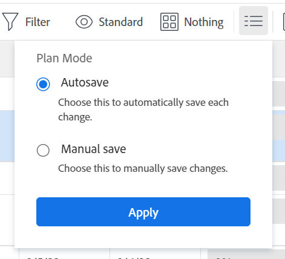
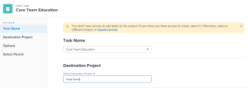

# Copiar e duplicar tarefas

Você pode copiar uma tarefa de um projeto para outro ou duplicar uma tarefa dentro do mesmo projeto.

É possível copiar ou duplicar uma ou várias tarefas ou tarefas pai de cada vez.

## Requisitos de acesso

<!-- drafted for P&P:

<table style="table-layout:auto"> 
 <col> 
 <col> 
 <tbody> 
  <tr> 
   <td role="rowheader">Adobe Workfront plan*</td> 
   <td> 
Any 
 </td> 
  </tr> 
  <tr> 
   <td role="rowheader">Adobe Workfront license*</td> 
   <td> 
Current license: Standard
 
   Or
   
Legacy license: Work or higher 
 </td> 
  </tr> 
  <tr> 
   <td role="rowheader">Access level configurations*</td> 
   <td> 
Edit access to Tasks and Projects
 
<b>NOTE</b>
   
   If you still don't have access, ask your Workfront administrator if they set additional restrictions in your access level. For information on how a Workfront administrator can modify your access level, see <a href="../../../administration-and-setup/add-users/configure-and-grant-access/create-modify-access-levels.md" class="MCXref xref">Create or modify custom access levels</a>.
 </td> 
  </tr> 
  <tr> 
   <td role="rowheader">Object permissions</td> 
   <td> 
Manage permissions to a task
 
Contribute or higher permissions to the project
 
   
For information on requesting additional access, see <a href="../../../workfront-basics/grant-and-request-access-to-objects/request-access.md" class="MCXref xref">Request access to objects </a>.
 </td> 
  </tr> 
 </tbody> 
</table>
-->

Você deve ter o seguinte acesso para executar as etapas deste artigo:

<table style="table-layout:auto"> 
 <col> 
 <col> 
 <tbody> 
  <tr> 
   <td role="rowheader">plano do Adobe Workfront*</td> 
   <td> 
Qualquer
 </td> 
  </tr> 
  <tr> 
   <td role="rowheader">Licença da Adobe Workfront*</td> 
   <td> 
Trabalhar ou superior 
 </td> 
  </tr> 
  <tr> 
   <td role="rowheader">Configurações de nível de acesso*</td> 
   <td> 
Editar acesso a tarefas e projetos
 
<b>Nota</b>

Se você ainda não tiver acesso, pergunte ao administrador do Workfront se ele definiu restrições adicionais em seu nível de acesso. Para obter informações sobre como um administrador do Workfront pode modificar seu nível de acesso, consulte <a href="../../../administration-and-setup/add-users/configure-and-grant-access/create-modify-access-levels.md" class="MCXref xref">Criar ou modificar níveis de acesso personalizados</a>.
 </td>
</tr> 
  <tr> 
   <td role="rowheader">Permissões de objeto</td> 
   <td> 
Gerenciar permissões para uma tarefa 
 
Permissões do Contribute ou superiores para o projeto
 
Para obter informações sobre como solicitar acesso adicional, consulte <a href="../../../workfront-basics/grant-and-request-access-to-objects/request-access.md" class="MCXref xref">Solicitar acesso aos objetos </a>.
 </td> 
  </tr> 
 </tbody> 
</table>

&#42;Para saber qual plano, tipo de licença ou acesso você tem, contate o administrador do Workfront.

## Considerações para copiar tarefas

Considere o seguinte ao copiar uma tarefa:

* Ao copiar uma tarefa de um projeto para outro, as datas da tarefa podem ser recalculadas. O recálculo levará em consideração o cronograma que o novo projeto usa e as informações de Cronograma de início do projeto.
* Formulários personalizados são copiados com a tarefa. As informações nos campos personalizados são transferidas para as tarefas copiadas somente quando você seleciona copiar Dados Personalizados ao copiar a tarefa.
* Você tem a chance de optar por copiar alguns itens associados à tarefa para a tarefa copiada durante o processo de cópia. No entanto, por padrão, os seguintes objetos não são transferidos para a tarefa copiada:
   * Problemas
   * Horas registradas
   * Comentários do usuário <!--not sure about this, enable only if requested by users and verified by Product: System activity comments transfer to the new task if they relate to information that you specifically select to be copied. For example, if you select to copy Expenses to the new task, system comments that identify adding expenses to the task will transfer to the copied task. -->
* Os seguintes itens são movidos para a tarefa copiada por padrão:

   * As etapas são transferidas para a tarefa copiada e removidas da tarefa original.
   * As subtarefas são transferidas para a nova tarefa.

* É possível copiar uma tarefa de cada vez ou várias tarefas de cada vez ao editar tarefas em uma lista.

## Copiar tarefas em uma lista {#copy-tasks-in-a-list}

1. Vá para o projeto que contém a(s) tarefa(s) que deseja copiar.

   Ou

   Ir para um relatório de tarefa.

1. (Condicional) Clique em **Tarefas** no painel esquerdo, se você tiver aberto o projeto que contém as tarefas.
1. Clique no ícone  do **Modo de Plano** e verifique se a opção **Salvamento automático** está habilitada.

   

   >[!IMPORTANT]
   >
   >Você pode copiar tarefas em uma lista somente quando salva automaticamente suas alterações. Para obter informações sobre como salvar opções ao editar tarefas, consulte [Editar tarefas em uma lista](../../../manage-work/tasks/manage-tasks/edit-tasks-in-a-list.md).

1. Selecione a tarefa ou tarefas que deseja copiar e siga um destes procedimentos:

   * Clique no **Mais menu** na parte superior da lista de tarefas e clique em **Copiar para**.
   * Clique com o botão direito do mouse nas tarefas selecionadas e clique em **Copiar para**.
   * Ao selecionar uma tarefa, clique no menu **Mais**  ao lado do nome da tarefa na lista e clique em **Copiar para**.

   

1. Continue copiando a tarefa, conforme descrito na seção [Copiar uma tarefa no nível da tarefa](#copy-a-task-at-the-task-level), começando com a Etapa 4.

   <!--
      (NOTE: is this still accurate?!)
   -->

## Copiar uma tarefa no nível da tarefa {#copy-a-task-at-the-task-level}

Além de copiar tarefas em uma lista de tarefas, você também pode copiar uma tarefa depois de abri-la.

1. Encontre uma tarefa em seu sistema Workfront procurando por ela.
1. Clique no nome da tarefa para abri-la.
1. Clique no menu suspenso **Mais**  ao lado do nome da tarefa e clique em **Copiar para**.

   

   A caixa Copiar Tarefa é exibida.

1. (Opcional) Atualize o **Nome da tarefa**.

   >[!TIP]
   >
   >Este campo fica esmaecido e não é editável ao selecionar para copiar várias tarefas em uma lista. Você pode passar o mouse sobre o campo Nome da tarefa e uma lista de todas as tarefas selecionadas é exibida.
   >
   >

1. Digite o nome do **Projeto de destino** para o qual você deseja copiar a tarefa no campo **Selecionar projeto de destino**.

   >[!TIP]
   >
   >* O nome do projeto diferencia maiúsculas de minúsculas.
   >* Você também pode começar a digitar o número de referência ou inserir a ID do projeto. Isso pode ajudá-lo a distinguir entre projetos com nomes idênticos.
   >* Somente 100 projetos são exibidos na lista.

   O nome do projeto atual é exibido por padrão. Se quiser copiar a tarefa dentro do mesmo projeto, deixe esse campo inalterado.

1. (Condicional) Clique em **solicitar acesso** para solicitar acesso ao projeto, caso não tenha acesso ao projeto selecionado.
1. (Condicional) Continue a copiar a tarefa para o projeto de destino selecionado sem solicitar acesso se tiver acesso para adicionar tarefas a uma das tarefas no projeto de destino.

   

   >[!TIP]
   >
   >Mensagens semelhantes serão exibidas se o projeto selecionado estiver com aprovação pendente, concluído ou inativo, quando o administrador do Workfront impedir a adição de tarefas a esses projetos. Para obter mais informações, consulte [Configurar preferências de projeto do sistema](../../../administration-and-setup/set-up-workfront/configure-system-defaults/set-project-preferences.md).

1. Clique em **Opções** no painel esquerdo e desmarque os atributos de tarefa que você não deseja copiar com a tarefa. Todas as opções são selecionadas por padrão.

   >[!TIP]
   >
   >Selecionar e desmarcar **Selecionar tudo** desmarca todas as opções.

   Desmarque as opções a seguir para não transferi-las para a tarefa copiada. A tabela a seguir descreve o que acontece quando as opções são desmarcadas:

   <table style="table-layout:auto"> 
    <col> 
    <col> 
    <tbody> 
     <tr> 
      <td role="rowheader">Dt Restr</td> 
      <td> 
A restrição da tarefa é definida como O Mais Breve Possível ou O Mais Tarde Possível com base na configuração do Modo de Cronograma do projeto.
 
 Quando selecionada, a restrição atual da tarefa é transferida para a tarefa copiada. 
 
Nota: Ao mover ou copiar uma tarefa com restrições específicas de data para outro projeto e as datas de restrição da tarefa estiverem fora das datas do novo projeto, a Restrição de Tarefa será alterada para O Mais Breve Possível ou o Mais Tarde Possível ou as datas de Início Planejado ou de Conclusão Planejada dos projetos serão ajustadas. Alguns exemplos de restrições específicas de data são: Deve iniciar em, Deve terminar em, Não iniciar antes de, Não iniciar depois de, etc. Para obter informações sobre restrições de tarefa e como restrições de tarefa ou datas de projeto podem ser afetadas, consulte <a href="../../../manage-work/tasks/task-constraints/task-constraint-overview.md" class="MCXref xref">Visão geral de Restrição de Tarefa</a> e procure uma restrição específica.
 </td> 
     </tr> 
     <tr> 
      <td role="rowheader">Atribuições</td> 
      <td> 
Todas as atribuições são removidas da tarefa. 
 </td> 
     </tr> 
     <tr> 
      <td role="rowheader">Processo de aprovação</td> 
      <td>Todos os processos de aprovação são removidos da tarefa.</td> 
     </tr> 
     <tr> 
      <td role="rowheader">Progresso</td> 
      <td>O status da tarefa é New. Caso contrário, a tarefa copiada manterá o status da tarefa existente.</td> 
     </tr> 
     <tr> 
      <td role="rowheader">Informações financeiras</td> 
      <td>As informações financeiras da tarefa são removidas.</td> 
     </tr> 
     <tr> 
      <td role="rowheader">Todos os predecessores</td> 
      <td> 
Isso significa que as dependências não serão transferidas para as tarefas copiadas. 
 
Quando selecionados, os predecessores dentro do grupo de tarefas copiadas são preservados, outros são excluídos.
 </td> 
     </tr> 
     <tr> 
      <td role="rowheader">Documentos</td> 
      <td> 
Os documentos anexados à tarefa não são transferidos para a tarefa copiada. Isso inclui versões, provas e documentos vinculados.
 
Isso não inclui aprovações de documentos. Aprovações de documentos nunca podem ser copiadas quando uma tarefa é copiada.
 </td> 
     </tr> 
     <tr> 
      <td role="rowheader">Notificações de Lembrete</td> 
      <td>Os lembretes de tarefa não são transferidos para a tarefa copiada. </td> 
     </tr> 
     <tr> 
      <td role="rowheader">Despesas</td> 
      <td>As despesas registradas na tarefa não são transferidas para a tarefa copiada. </td> 
     </tr> 
     <tr> 
      <td role="rowheader">Permissões</td> 
      <td>O Workfront remove os nomes de todas as entidades exibidas na lista Compartilhamento da tarefa. </td> 
     </tr> 
     <tr> 
      <td role="rowheader">Dados personalizados</td> 
      <td> 
Os valores dos campos personalizados são apagados e os formulários personalizados são transferidos para a tarefa copiada. 
 
Quando selecionados, os formulários e os valores dos campos personalizados são transferidos para a tarefa copiada. 
 </td> 
     </tr> 
    </tbody> 
   </table>

1. (Opcional) Clique em **Selecionar pai** no painel esquerdo e selecione a tarefa no projeto de destino que você deseja que se torne a principal da tarefa copiada.

   >[!TIP]
   >
   >Ao selecionar para copiar várias tarefas em uma lista, todas as tarefas selecionadas se tornarão as filhas da tarefa pai selecionada.

   Selecione um pai seguindo um destes procedimentos:

   * Na lista de tarefas, selecione um dos pais no plano de projeto.
   * Clique no ícone de pesquisa  e procure uma tarefa pai por nome.

   A tarefa é exibida na lista.

   

1. Selecione o botão de opção do pai depois de encontrá-lo.

   Se você não selecionar uma tarefa pai, as tarefas serão copiadas como tarefas principais em vez de subtarefas e serão colocadas no final da lista de tarefas no projeto de destino.

1. Clique em **Copiar tarefa**

   Ou

   Clique em **Copiar tarefas** ao selecionar várias tarefas em uma lista.
As tarefas copiadas agora estão no projeto especificado e são subtarefas da tarefa pai selecionada ou as últimas tarefas do projeto.

## Tarefas duplicadas

Você pode duplicar rapidamente uma tarefa em uma lista de tarefas, se precisar de uma tarefa idêntica no mesmo projeto.

* [Considerações sobre tarefas duplicadas](#considerations-for-duplicating-tasks)
* [Tarefas duplicadas](#duplicate-tasks)

### Considerações para duplicação de tarefas {#considerations-for-duplicating-tasks}

* Você pode duplicar uma tarefa em uma lista de tarefas somente quando a lista é classificada pelo número da tarefa.
* A nova tarefa terá o mesmo nome da tarefa original.
* Não é possível selecionar quais informações estão duplicadas para a nova tarefa. Quase todas as informações da tarefa original serão transferidas para a tarefa duplicada, incluindo o relacionamento principal, por padrão.
* Os itens a seguir não são transferidos para a nova tarefa:

   * Horas registradas
   * Notas
   * Problemas
   * Somente as predecessoras que estão no mesmo grupo de tarefas copiadas também são copiadas com suas tarefas sucessoras.

     **EXEMPLO**

     Por exemplo, se você copiar a Tarefa 2 e sua antecessora, a Tarefa 1, ao mesmo tempo, terá uma cópia da Tarefa 2 e uma cópia da Tarefa 1. A cópia da Tarefa 1 será a predecessora da cópia da Tarefa 2. Mas se você copiar apenas a Tarefa 2 sem copiar seu antecessor, sua cópia não terá antecessor.

* Quando você duplica uma tarefa pai, todas as tarefas filho também são duplicadas, mesmo quando as tarefas filho não estão selecionadas.
* É possível duplicar uma ou várias tarefas ao mesmo tempo.

  No entanto, não é possível duplicar várias tarefas que não são sequenciais ao mesmo tempo.

* Os marcos são movidos para a nova tarefa e removidos da tarefa original.

### Tarefas duplicadas

1. Vá para o projeto que contém a(s) tarefa(s) que deseja duplicar.
1. Clique em **Tarefas** no painel esquerdo.
1. Siga um destes procedimentos:

   * (Condicional) Clique no ícone  do **Modo de Plano** e verifique se a opção **Salvamento automático** está habilitada, selecione as tarefas que deseja duplicar e clique no **menu Mais**  > **Duplicar**.

     

   * (Condicional) Clique no ícone **Modo de Plano**  > **Salvamento manual** > **Padrão** ou **Planejamento de Linha do Tempo** e faça o seguinte:

      1. Selecione a(s) tarefa(s) que deseja duplicar e clique em **Duplicar**.
      1. (Opcional) Clique em **Desfazer** para reverter suas alterações e não duplicar as tarefas.
      1. (Opcional e condicional) Clique em **Refazer** se você já clicou em **Desfazer** para manter as alterações e duplicar as tarefas.

      1. Clique em **Salvar** para salvar as alterações.

         As tarefas são duplicadas e adicionadas ao mesmo projeto que as tarefas originais.
