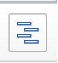

# Visão geral do caminho crítico do projeto

Determinar o caminho crítico de um projeto é uma maneira automática de o Adobe Workfront sinalizar uma sequência de tarefas em um projeto que tem o potencial de afetar a linha do tempo do projeto. As tarefas que podem afetar a linha do tempo do projeto são sinalizadas como tarefas de Caminho Crítico.

Os seguintes recursos podem afetar o Caminho Crítico de um projeto:

* A estrutura de detalhamento de trabalho do projeto.

   Para obter mais informações sobre a Estrutura de Detalhamento do Trabalho, consulte [Determinar a estrutura de detalhamento de trabalho em um projeto](../../../manage-work/projects/planning-a-project/determine-project-work-breakdown-structure.md)

* O tempo (duração) que cada tarefa levará para ser concluída.
* As dependências entre as tarefas.

   Considere o seguinte:

   * Quando uma tarefa do Caminho Crítico tem uma relação antecessora, seus antecessores e sucessores também estão no Caminho Crítico se as alterações nas datas dos antecessores ou dos sucessores afetarem diretamente seus dependentes.

      >[!TIP]
      >
      >Quando a data do sucessor de uma tarefa não afeta diretamente a data de suas tarefas dependentes e não afeta as datas do projeto, a tarefa sucessora não está no Caminho Crítico.
      >
      >
      >     >

   * Quando uma subtarefa é identificada como um Caminho Crítico, a tarefa pai também é identificada como uma tarefa Caminho Crítico, se a Data e a hora de Início Projetadas do pai forem as mesmas da subtarefa.

Levando em consideração esses recursos, o sistema calcula o Caminho Crítico usando o caminho mais longo entre a tarefa mais antiga e a tarefa que determina o fim do projeto. O Cálculo de Caminho Crítico leva em conta o que é o tempo mais antigo e o mais recente em que cada tarefa pode iniciar e concluir sem tornar o projeto mais longo. Esse processo determina quais tarefas são &quot;críticas&quot; (e pertencem ao caminho mais longo) e quais têm &quot;total flutuante&quot; (pode ser atrasado sem tornar o projeto mais longo).

Qualquer atraso na atividade de uma tarefa no Caminho Crítico afeta diretamente a Data de Conclusão Projetada do projeto (não há flutuante no caminho crítico).

## Requisitos de acesso

Você deve ter o seguinte acesso para executar as etapas neste artigo:

<table style="table-layout:auto"> 
 <col> 
 <col> 
 <tbody> 
  <tr> 
   <td role="rowheader">Plano Adobe Workfront*</td> 
   <td> 
Qualquer Um
 </td> 
  </tr> 
  <tr> 
   <td role="rowheader">Licença da Adobe Workfront*</td> 
   <td> 
Trabalho ou superior
 </td> 
  </tr> 
  <tr> 
   <td role="rowheader">Configurações de nível de acesso*</td> 
   <td> 
Exibir ou acessar mais alto as Tarefas
 
Observação: Caso ainda não tenha acesso, pergunte ao administrador do Workfront se ele definiu restrições adicionais em seu nível de acesso. Para obter informações sobre como um administrador do Workfront pode modificar seu nível de acesso, consulte <a href="../../../administration-and-setup/add-users/configure-and-grant-access/create-modify-access-levels.md" class="MCXref xref">Criar ou modificar níveis de acesso personalizados</a>.
 </td> 
  </tr> 
  <tr> 
   <td role="rowheader">Permissões de objeto</td> 
   <td> 
Exibir permissões ou permissões superiores em uma tarefa 
 
Para obter informações sobre como solicitar acesso adicional, consulte <a href="../../../workfront-basics/grant-and-request-access-to-objects/request-access.md" class="MCXref xref">Solicitar acesso a objetos </a>.
 </td> 
  </tr> 
 </tbody> 
</table>

&#42;Para descobrir qual plano, tipo de licença ou acesso você tem, entre em contato com o administrador da Workfront.

## Exibir o caminho crítico

Você pode visualizar as tarefas que pertencem ao Caminho Crítico nas seguintes áreas do aplicativo Workfront:

* [Exibir o caminho crítico no gráfico de Gantt](#view-the-critical-path-in-the-gantt-chart)
* [Exibir o Caminho Crítico em uma lista de tarefas ou relatório](#view-the-critical-path-in-a-task-list-or-report)

### Exibir o caminho crítico no gráfico de Gantt {#view-the-critical-path-in-the-gantt-chart}

Para exibir tarefas no Caminho Crítico no gráfico de Gantt:

1. Vá para um projeto para o qual deseja exibir o Caminho Crítico.
1. Clique em **Tarefas** no painel esquerdo.
1. Clique no botão **Gráfico de Gantt** no canto superior direito da lista de tarefas.

   

1. Expanda o **Opções** , em seguida, ative a **Caminho Crítico** opção.

   As tarefas que estão no Caminho Crítico têm uma linha vermelha acima de sua linha do tempo no gráfico de Gantt.

   

### Exibir o Caminho Crítico em uma lista de tarefas ou relatório {#view-the-critical-path-in-a-task-list-or-report}

Para exibir quais tarefas estão no caminho crítico em uma lista de tarefas:

1. Vá para um projeto para o qual deseja exibir o Caminho Crítico.
1. Clique em **Tarefas** no painel esquerdo.
1. No **Exibir** , selecione **Status**.

   As tarefas que estão no Caminho Crítico têm um **Caminho Crítico** sinalizador no **Sinalizadores** da lista.

   É possível aplicar a mesma exibição a um relatório de tarefa.

   Para obter mais informações sobre como criar relatórios, consulte o artigo [Criar um relatório personalizado](../../../reports-and-dashboards/reports/creating-and-managing-reports/create-custom-report.md).

   Ou

   No **Filtro** , selecione **Novo filtro**.

1. Clique em **Adicionar regra de filtro** e começar a digitar **É Crítico** no **Mostrar apenas as tarefas nas quais...** campo.

1. Selecione-o quando aparecer na lista.
1. Clique em **Salvar filtro**.

   A lista deve exibir somente as tarefas que estão no Caminho Crítico.
