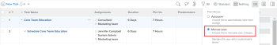

# Excluir tarefas

Você pode excluir tarefas que podem estar duplicadas ou que foram criadas com erro.

Para tarefas que têm informações históricas (atualizações, alterações de agendamento, status ou outros campos), recomendamos fechá-las ou marcá-las como inativas, em vez de excluí-las. Isso ajuda você a manter as informações históricas de seus projetos.

## Requisitos de acesso

Você deve ter o seguinte acesso para executar as etapas neste artigo:

<table style="table-layout:auto"> 
 <col> 
 <col> 
 <tbody> 
  <tr> 
   <td role="rowheader">Plano Adobe Workfront*</td> 
   <td> 
Qualquer Um
 </td> 
  </tr> 
  <tr> 
   <td role="rowheader">Licença da Adobe Workfront*</td> 
   <td> 
Trabalho ou superior
 </td> 
  </tr> 
  <tr> 
   <td role="rowheader">Configurações de nível de acesso*</td> 
   <td> 
Editar acesso a Tarefas e Projetos com acesso a Excluir
 
Observação: Caso ainda não tenha acesso, pergunte ao administrador do Workfront se ele definiu restrições adicionais em seu nível de acesso. Para obter informações sobre o acesso a tarefas, consulte <a href="../../../administration-and-setup/add-users/configure-and-grant-access/grant-access-tasks.md" class="MCXref xref">Conceder acesso a tarefas</a>. Para obter informações sobre como um administrador do Workfront pode alterar seu nível de acesso, consulte <a href="../../../administration-and-setup/add-users/configure-and-grant-access/create-modify-access-levels.md" class="MCXref xref">Criar ou modificar níveis de acesso personalizados</a>. 
 </td> 
  </tr> 
  <tr> 
   <td role="rowheader">Permissões de objeto</td> 
   <td> 
Contribuir com permissões para o projeto com capacidade de adicionar tarefas ou superior
 
Ao criar uma tarefa, você recebe automaticamente permissões de gerenciamento para a tarefa
 
 Para obter informações sobre permissões de tarefa, consulte <a href="../../../workfront-basics/grant-and-request-access-to-objects/share-a-task.md" class="MCXref xref">Compartilhar uma tarefa </a>. 
 
Para obter informações sobre a solicitação de permissões adicionais, consulte <a href="../../../workfront-basics/grant-and-request-access-to-objects/request-access.md" class="MCXref xref">Solicitar acesso a objetos </a>.
 </td> 
  </tr> 
 </tbody> 
</table>

&#42;Para descobrir qual plano, tipo de licença ou acesso você tem, entre em contato com o administrador da Workfront.

## Entender o processo de exclusão de tarefas

* [Limitações para excluir tarefas](#limitations-for-deleting-tasks)
* [O impacto da exclusão de tarefas](#the-impact-of-deleting-tasks)

### Limitações para excluir tarefas  {#limitations-for-deleting-tasks}

* Quando um projeto tem o status Concluído, é possível excluir tarefas somente se o administrador do Workfront ou um administrador de grupo tiver permitido isso em sua área Preferências do projeto . Para obter informações sobre como configurar preferências de projeto, consulte [Configurar preferências de projeto em todo o sistema](../../../administration-and-setup/set-up-workfront/configure-system-defaults/set-project-preferences.md).

* Se a tarefa tiver horas registradas, o Workfront ou o administrador de grupo deverá permitir a exclusão dessas tarefas configurando as Preferências de tarefa e ocorrência na sua instância do Workfront. Isso também se aplica quando você tenta excluir projetos que têm tarefas com horas conectadas.

   <!--
  (NOTE: the last statement is NWE&nbsp;only; not possible in classic)
  -->

   Para obter mais informações sobre como ativar a exclusão de tarefas em que as horas são registradas, consulte a seção &quot;Exclusão&quot; em [Configurar preferências de emissão e tarefa em todo o sistema](../../../administration-and-setup/set-up-workfront/configure-system-defaults/set-task-issue-preferences.md).

### O impacto da exclusão de tarefas {#the-impact-of-deleting-tasks}

Ao excluir uma tarefa, você afeta outros objetos vinculados à tarefa.

Os seguintes objetos anexados a uma tarefa também são excluídos quando você exclui uma tarefa:

* Documentos

   Não é possível excluir uma tarefa que tenha um documento cujo check-out foi anexado a ela. Para obter mais informações sobre como fazer check-out de documentos, consulte [Verificar documentos](../../../documents/managing-documents/check-out-documents.md).

* Problemas
* Subtarefas
* Notas
* Aprovações

Dependendo de como o administrador do Workfront configura o Projeto, a Tarefa ou as Preferências de Exclusão de Problemas no Folheto de Horas e Folhas de Horas da sua instância do Workfront, as horas registradas para as tarefas são tratadas de uma das seguintes maneiras ao excluir uma tarefa:

* Mova para o projeto e não será restaurado na tarefa, se a tarefa for restaurada posteriormente.
* São excluídas e serão restauradas na tarefa, se a tarefa for restaurada posteriormente.

   Isso também se aplica quando você tenta excluir projetos que têm tarefas com horas conectadas.

   <!--
  <MadCap:conditionalText data-mc-conditions="QuicksilverOrClassic.Draft mode">
  (NOTE: this stays NWE; not possible in classic;)
  </MadCap:conditionalText>
  -->

   Para obter mais informações sobre como configurar as preferências de exclusão para horas registradas em problemas, consulte [Configurar preferências de hora e folha de ponto](../../../administration-and-setup/set-up-workfront/configure-timesheets-schedules/timesheet-and-hour-preferences.md).

* As despesas da tarefa serão movidas para o projeto.

* Os usuários atribuídos à tarefa ou à aprovação da tarefa permanecem na equipe do projeto.

   Para obter mais informações sobre equipes de projeto, consulte [Visão geral da equipe do projeto](../../../manage-work/projects/planning-a-project/project-team-overview.md).

## Excluir tarefas

* [Excluir várias tarefas em um projeto simultaneamente](#delete-multiple-tasks-in-a-project-simultaneously)
* [Excluir uma única tarefa](#delete-a-single-task)

### Excluir várias tarefas em um projeto simultaneamente  {#delete-multiple-tasks-in-a-project-simultaneously}

1. Clique no botão **Menu principal** ícone  no canto superior direito do Adobe Workfront.

1. Clique em **Projetos**.
1. Clique no nome do projeto que contém as tarefas que deseja excluir.
1. Clique em **Tarefas** no painel esquerdo.
1. Siga um destes procedimentos:

   1. (Condicional) Quando a variável **Salvar automaticamente** alternar está ativado:

      1. Selecione as tarefas que deseja excluir e clique em **Mais**
      1. Clique em **Excluir**, em seguida **Sim, Excluir** para confirmar a exclusão.

         As tarefas são excluídas.
   1. (Condicional) Clique no botão **Modo de Plano** e selecione **Salvar manualmente** se desejar reverter as alterações feitas na lista de tarefas.

      

      Faça o seguinte:

      1. Selecione as tarefas que deseja excluir.
      1. Clique em **Excluir**.
      1. (Opcional) Clique em **Desfazer** para reverter a alteração e não excluir as tarefas.
      1. Clique em **Refazer** se quiser manter a alteração e excluir a tarefa.
      1. Clique em **Salvar** para excluir as tarefas.

         As tarefas são excluídas somente após salvar suas alterações.

### Excluir uma única tarefa {#delete-a-single-task}

1. Clique no botão **Menu principal** ícone  no canto superior direito do Adobe Workfront.

1. Clique em **Projetos**.
1. Clique no nome do projeto que contém a tarefa que deseja excluir.
1. Clique em **Tarefas** no painel esquerdo.
1. Clique no nome da tarefa que deseja excluir.
1. Clique no botão **Mais** ícone no canto superior direito.

   

1. Clique em **Excluir tarefa**.
1. Se a exclusão for permitida, clique em **Sim, excluir**.

   O administrador do Workfront ou o administrador do grupo pode não permitir a exclusão de tarefas em que as horas são registradas.

   Para obter mais informações sobre o acesso e as permissões necessárias para excluir uma tarefa, consulte a seção [Limitações para excluir tarefas](#limitations-for-deleting-tasks) neste artigo.

## Restaurar tarefas excluídas

Um administrador de grupo ou Workfront pode restaurar tarefas em 30 dias após sua exclusão, conforme descrito em [Restaurar itens excluídos](../../../administration-and-setup/manage-workfront/manage-deleted-items/restore-deleted-items.md).
