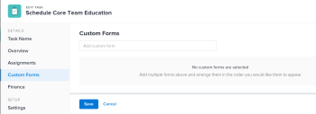

# Editar tarefas

<!--Audited: 07/2024-->

<!--

(NOTE: some information in this area is repeated in the following articles. If you need to update a field, update it in both:

** Task finances in details

** Task information in overview)

-->

É possível editar informações sobre tarefas que você criou, ou que você tenha permissões do Contribute ou de Gerenciar para.

## Requisitos de acesso

+++ Expanda para visualizar os requisitos de acesso para a funcionalidade neste artigo.

<table style="table-layout:auto"> 
 <col> 
 <col> 
 <tbody> 
  <tr> 
   <td role="rowheader">plano do Adobe Workfront</td> 
   <td> 
Qualquer 
 </td> 
  </tr> 
  <tr> 
   <td role="rowheader">Licença da Adobe Workfront*</td> 
   <td> 
Novo: Padrão

   
Atual: trabalho ou superior
 </td> 
  </tr> 
  <tr> 
   <td role="rowheader">Nível de acesso</td> 
   <td> 
Editar acesso a tarefas e projetos
 </td> 
  </tr> 
  <tr> 
   <td role="rowheader">Permissões de objeto</td> 
   <td> 
    <ul> 
     <li> 
Permissões do Contribute para uma tarefa para editar as seguintes informações na área Detalhes da tarefa: 

     <ul>
     <li>Descrição</li>
     <li>Status</li>
     </ul>  
      </li> 
     <li> 
Gerenciar permissões de uma tarefa para editar todas as informações na área Detalhes e na caixa Editar Tarefa
 </li> 
    </ul> 
    <ul> 
     <li> 
Permissões do Contribute ou superiores para o projeto
 </li> 
    </ul> </td> 
  </tr> 
 </tbody> 
</table>

*Para obter informações, consulte [Requisitos de acesso na documentação do Workfront](/help/quicksilver/administration-and-setup/add-users/access-levels-and-object-permissions/access-level-requirements-in-documentation.md).

+++

## Limitações para editar tarefas

Existem algumas limitações que podem impedir a edição de tarefas.

Considere o seguinte ao editar tarefas:

* Atualizar tarefas aciona notificações para projetos com status Atual. Para evitar confusão para usuários atribuídos às tarefas, limite a edição de tarefas o máximo possível quando o projeto estiver no status Atual.
* Não é possível editar tarefas que estejam em um Processo de Aprovação. Você só pode registrar horas ou atualizar o Status de uma tarefa em um processo de aprovação.

  

* Você pode editar e adicionar documentos a tarefas em um projeto com status Concluído, Inativo ou Pendente de Aprovação somente quando o administrador do Workfront ou um administrador de grupo ativou essa funcionalidade na área Preferências do projeto. Para obter informações sobre como definir preferências de projeto, consulte [Configurar preferências de projeto do sistema](../../../administration-and-setup/set-up-workfront/configure-system-defaults/set-project-preferences.md).

* Você sempre pode editar as seguintes informações em uma tarefa quando o projeto estiver marcado como Concluído, Inativo ou estiver em um Processo de aprovação:

   * Registrar de tempo
   * Editar despesas existentes
   * Anexar um formulário personalizado

* Outros usuários devem atualizar suas páginas antes de visualizarem as atualizações feitas em uma tarefa.

## Editar uma tarefa em uma lista

É possível editar informações de tarefas em uma lista de tarefas, editando campos em linha exibidos na visualização da lista.

Para obter informações sobre como editar tarefas em listas, consulte [Editar tarefas em uma lista](../../../manage-work/tasks/manage-tasks/edit-tasks-in-a-list.md).

## Editar uma tarefa em uma lista usando o Resumo

É possível editar uma tarefa em uma lista usando o painel Summary. Para obter informações sobre como editar uma tarefa no painel Resumo, consulte a seção &quot;Editar uma tarefa no Resumo&quot; no artigo [Editar tarefas em uma lista](../../../manage-work/tasks/manage-tasks/edit-tasks-in-a-list.md).

## Editar uma tarefa na caixa Editar tarefa

É possível editar uma tarefa usando as áreas Editar tarefa ou Detalhes da tarefa. As etapas a seguir descrevem a edição de uma tarefa na caixa Editar tarefa.

{{step1-click-main-menu}}

1. Clique em **Projetos** e no nome de um projeto para abri-lo.
1. Clique em **Tarefas** no painel esquerdo.
1. Clique na tarefa que deseja editar.
1. (Condicional) Para editar informações limitadas sobre uma tarefa, clique em **Detalhes da tarefa** no painel esquerdo.

   

   Considere editar informações nas seguintes áreas na seção Detalhes da tarefa:

   * **Visão geral**

     Essa área é expandida por padrão.

   * **Formulários personalizados**

     Os nomes dos formulários de alfândega são exibidos somente se houver formulários personalizados anexados ao objeto.

   * **Finanças**

   >[!NOTE]
   >
   >Dependendo de como o administrador do Workfront ou do Administrador de grupo modificou o Modelo de layout, os campos na área Detalhes da tarefa podem ser reorganizados ou não ser exibidos. Para obter informações, consulte [Personalizar o modo de exibição de Detalhes usando um modelo de layout](../../../administration-and-setup/customize-workfront/use-layout-templates/customize-details-view-layout-template.md).

   Para obter informações sobre os campos visíveis na seção Detalhes da Tarefa, continue editando a tarefa na caixa Editar Tarefa, conforme descrito abaixo.

   Para editar informações na seção Detalhes, faça o seguinte:

   1. (Opcional) Clique no ícone  de **Recolher Tudo** no canto superior direito para recolher todas as áreas.
   1. (Opcional e condicional) Quando uma área for recolhida, clique na **seta apontando para a direita**  ao lado de cada área para expandir a área que você deseja editar.
   1. Para obter mais informações sobre como editar informações na guia Detalhes da tarefa, consulte os seguintes artigos:

      * [Gerenciar informações da tarefa na área de Visão Geral de Detalhes da Tarefa](../../../manage-work/tasks/manage-tasks/task-information-in-overview.md)
      * [Gerenciar finanças da tarefa na seção Detalhes da tarefa](../../../manage-work/tasks/manage-tasks/task-finances-in-details.md)

   1. (Opcional) Se não houver formulários personalizados anexados à tarefa, comece digitando o nome de um formulário no campo **Adicionar formulário personalizado**, selecione-o quando ele for exibido na lista e clique em **Salvar alterações**.
   1. (Opcional) Clique no ícone **Exportar**  para exportar as informações de Visão geral e formulários personalizados para um arquivo PDF e, em seguida, clique em **Exportar**. Selecione entre as seguintes opções:

      * Selecionar tudo (é exibido somente quando há pelo menos um formulário personalizado anexado)
      * Visão geral
      * O nome de um ou vários formulários personalizados

      O arquivo PDF é baixado no computador.

      

      Para obter mais informações, consulte [Exportar detalhes de formulários e objetos personalizados](../../../workfront-basics/work-with-custom-forms/export-custom-forms-details.md).

1. (Condicional) Para editar todas as informações sobre a tarefa, como um usuário com permissões para Gerenciar a tarefa, clique no menu **Mais**  ao lado do nome da tarefa e clique em **Editar**.

   Ou

   Em uma lista de tarefas, selecione uma tarefa e clique no ícone **Editar**  na parte superior da lista.

   A caixa Editar tarefa é aberta.

   >[!IMPORTANT]
   >
   >Você deve ter permissões de gerenciamento para a tarefa para ver a opção Editar.

   Todos os campos de tarefa estão disponíveis na caixa Editar tarefa e são agrupados pelas áreas listadas no painel esquerdo.

   >[!NOTE]
   >
   >Dependendo de como o administrador do Workfront ou do Administrador de grupo modificou o Modelo de layout, os campos na área Detalhes da tarefa podem ser reorganizados ou não ser exibidos. Para obter informações, consulte [Personalizar o modo de exibição de Detalhes usando um modelo de layout](../../../administration-and-setup/customize-workfront/use-layout-templates/customize-details-view-layout-template.md).

   Considere especificar informações em qualquer uma das seguintes seções:

   * [Nome da tarefa](#task-name)
   * [Visão geral](#overview)
   * [Atribuições](#assignments)
   * [Formulários personalizados](#Custom%C2%A0F)
   * [Finanças](#finance)
   * [Configurações](#settings)

   >[!NOTE]
   >
   >Dependendo de como o administrador do Workfront ou do Administrador de grupo configurar o Modelo de layout, os campos na caixa Editar tarefa podem ser reorganizados ou não ser exibidos. Para obter informações, consulte [Personalizar o modo de exibição de Detalhes usando um modelo de layout](../../../administration-and-setup/customize-workfront/use-layout-templates/customize-details-view-layout-template.md).

### Nome da tarefa {#task-name}

1. Comece a editar sua tarefa conforme descrito acima.
1. Clique em **Nome da tarefa** no painel esquerdo.

   

1. Atualize o nome da tarefa.

1. Clique em **Salvar** ou continue com as seções a seguir.

### Visão geral {#overview}

1. Comece a editar sua tarefa conforme descrito acima.
1. Clique em **Visão geral** no painel esquerdo.

   

1. Atualize as seguintes informações sobre a tarefa:

   <table style="table-layout:auto"> 
    <col> 
    <col> 
    <tbody> 
     <tr> 
      <td role="rowheader">Descrição</td> 
      <td>Adicione mais informações sobre a tarefa. </td> 
     </tr> 
     <tr> 
      <td colspan="2" role="rowheader">Seção de informações básicas </td> 
     </tr> 
     <tr> 
      <td role="rowheader">Status</td> 
      <td> 
Selecione o status da tarefa que indica em qual estágio de desenvolvimento a tarefa está.
 
<b>DICA</b>

   Você pode atualizar o Status da tarefa no cabeçalho da tarefa. 
 </td>
   </tr> 
     <tr> 
      <td role="rowheader">Prioridade</td> 
      <td> 
Este é um sinalizador visual para você que permite priorizar suas tarefas. 
 
Selecione entre as seguintes opções: 
 
       <ul> 
      <li> 
 Nenhum(a)
 </li> 
      <li> 
 Baixa 
 </li> 
      <li> 
Normal 
 </li> 
      <li> 
Alta 
 </li> 
      <li> 
 Urgente 
 </li> 
       </ul> 
Dependendo das Preferências do projeto selecionadas pelo administrador do Workfront, os nomes das prioridades podem ser diferentes para você. Para obter informações sobre as prioridades da tarefa, consulte <a href="../../../manage-work/tasks/task-information/task-priority.md" class="MCXref xref">Atualizar prioridade da tarefa</a>. 
 </td> 
     </tr> 
     <tr> 
      <td colspan="2" role="rowheader">Seção de datas e restrições de tarefas </td> 
     </tr> 
     <tr> 
      <td role="rowheader">Restrição de Tarefa</td> 
      <td> 
Decida quando a tarefa deve ser concluída especificando uma Restrição de Tarefa. 
 
Selecione entre as seguintes opções: 
 
       <ul> 
      <li> 
Datas Fixas 
 
Especifique um <strong>Início Planejado</strong> e uma <strong>Data de Conclusão Planejada</strong>. 
 </li> 
      <li> 
Deve Iniciar Em 
 
Especifique uma <strong>Data de Início Planejada</strong>. 
 </li> 
      <li> 
Deve Terminar Em 
 
Especifique uma <strong>Data de conclusão planejada</strong>. 
 </li> 
       </ul> 
       <ul> 
      <li> 
Assim que possível
 </li> 
      <li> 
O mais tarde possível
 </li> 
      <li> 
Momento Mais Cedo Disponível
 </li> 
      <li> 
 Último Horário Disponível
 </li> 
      <li> 
Não Iniciar Depois De 
 </li> 
      <li> 
Especificar uma Data de Início Planejada
 </li> 
      <li> 
Não Iniciar Antes De 
 
Especifique uma <strong>Data de Início Planejada</strong>. 
 </li> 
      <li> 
 Concluir Não Depois De
 
Especifique uma <strong>Data de conclusão planejada</strong>. 
 </li> 
      <li> 
 Concluir Não Antes De
 
Especifique uma <strong>Data de conclusão planejada</strong>
 </li> 
       </ul> 
Para obter mais informações sobre Restrição de Tarefa, consulte <a href="../../../manage-work/tasks/task-constraints/task-constraint-overview.md" class="MCXref xref">Visão geral sobre Restrição de Tarefa</a>.
 </td> 
     </tr> 
     <tr> 
      <td role="rowheader">Data e hora de confirmação</td> 
      <td> 
Essa é a data na qual o usuário atribuído à tarefa se compromete a tê-la concluída. Pode ser diferente da Data de conclusão planejada. Somente os atribuídos podem editar este campo. Para obter informações sobre as Datas de confirmação no Workfront, consulte <a href="../../../manage-work/projects/updating-work-in-a-project/overview-of-commit-dates.md" class="MCXref xref">Visão geral da Data de confirmação</a>. 
 </td> 
     </tr> 
     <tr> 
      <td role="rowheader">Data e hora de início planejadas</td> 
      <td> 
Quando a tarefa estiver planejada para iniciar. A data de início planejada de uma tarefa é definida e influenciada por vários fatores:
 
       <ul> 
      <li>Dependendo da preferência do sistema para a data de início planejada da tarefa, a data de início de uma nova tarefa em um projeto pode ser hoje ou a data de início do projeto, por padrão. O administrador de grupo do grupo associado ao projeto também pode definir esta preferência para o grupo. Para obter mais informações sobre as preferências de tarefas no nível do sistema ou do grupo, consulte <a href="../../../administration-and-setup/set-up-workfront/configure-system-defaults/set-task-issue-preferences.md" class="MCXref xref">Configurar preferências de tarefas e problemas em todo o sistema</a>.</li> 
      <li>Dependendo dos predecessores da tarefa, a data de início planejada é escolhida pelo Workfront para ser a próxima data disponível após a conclusão ou início dos predecessores, dependendo do relacionamento do antecessor. Para obter mais informações sobre relações de predecessoras, consulte <a href="../../../manage-work/tasks/use-prdcssrs/predecessors-overview.md" class="MCXref xref">Visão geral das predecessoras da tarefa</a>.</li> 
      <li>O gerente de projeto ou o proprietário da tarefa pode definir manualmente a data de início planejada quando a restrição da tarefa for Datas Fixas ou Deve Iniciar em. Para obter mais informações sobre restrições de tarefa, consulte <a href="../../../manage-work/tasks/task-constraints/task-constraint-overview.md" class="MCXref xref">Visão geral da Restrição de Tarefa</a>.</li> 
       </ul> </td> 
     </tr> 
     <tr> 
      <td role="rowheader">Data e hora de conclusão planejadas</td> 
      <td> 
A data de conclusão prevista, conforme mostrado quando a tarefa é planejada. O Workfront define a Data de conclusão planejada usando alguns dos seguintes fatores:
 
       <ul> 
      <li>A data de conclusão planejada é calculada a partir da data de início planejada adicionando a Duration da tarefa à data de início planejada. Quando o gerente de projeto ou o Workfront especifica a Duração da tarefa, isso aciona uma atualização para a data de conclusão planejada. Se a data planejada mudar, será porque a Duração da tarefa foi atualizada.</li> 
      <li>O gerente de projeto ou o proprietário da tarefa pode definir manualmente a data de conclusão planejada quando a restrição da tarefa for Datas Fixas ou Deve Terminar em. Para obter mais informações sobre restrições de tarefa, consulte <a href="../../../manage-work/tasks/task-constraints/task-constraint-overview.md" class="MCXref xref">Visão geral da Restrição de Tarefa</a>.</li> 
      <li>Se o Tipo de Duração da tarefa for alterado, e o número de recursos nas tarefas for alterado ao mesmo tempo, a data de conclusão planejada também será alterada. Para obter mais informações sobre tipos de duração, consulte <a href="../../../manage-work/tasks/taskdurtn/task-duration-and-duration-type.md" class="MCXref xref">Visão Geral da Duração e do Tipo de Duração da Tarefa</a>.</li> 
       </ul> </td> 
     </tr> 
     <tr> 
      <td role="rowheader">Data e Hora de Início Efetivo</td> 
      <td> 
Especifique uma Data de Início Real para a tarefa. Normalmente, o padrão é preenchido automaticamente quando você altera o status da tarefa para In Progress. A data de início real também pode ser modificada manualmente pelo gerente do projeto ou pelo proprietário da tarefa. 
 </td> 
     </tr> 
     <tr> 
      <td role="rowheader">Data e hora de término efetivo</td> 
      <td> 
Especifique a data e a hora reais em que a tarefa é concluída. A data e hora padrão em que uma tarefa é concluída sempre coincide com a hora real em que o status se torna Concluído. A data de conclusão real também pode ser modificada manualmente pelo gerente do projeto ou pelo proprietário da tarefa. 
 </td> 
     </tr> 
     <tr> 
      <td role="rowheader"><b>Seção de tempo de trabalho</b></td> 
     </tr> 
     <tr> 
      <td role="rowheader">Esforço do trabalho </td> 
      <td>

   
O esforço necessário para concluir a tarefa. Seu gerente de projeto pode decidir usar esse campo em vez do Trabalho necessário para estimar o esforço necessário para concluir uma tarefa. Este campo fica visível somente quando as seguintes condições são atendidas:
 
      <ul> 
      <li> 
A tarefa tem um tipo de duração simples. 
 
<b>DICA</b>

   Se você alterar o Tipo de duração da tarefa, esse campo ficará esmaecido. 
 </li>
   <li>O gerente de projeto ativou o campo Usar esforço do trabalho para calcular automaticamente as Horas planejadas das tarefas no projeto. </li> 
      </ul> 
      
Selecione entre as seguintes opções:
 
      <ul> 
      <li>Pequena</li> 
      <li>Medium (este é o valor padrão para uma nova tarefa)</li> 
      <li>Grande</li> 
      </ul> 
      
<b>Nota</b>

   A atualização da quantidade de esforço pode atualizar as Horas planejadas da tarefa. A atualização será imediata se o Tipo de atualização do projeto for Automático. Quando o Tipo de atualização do projeto é Manual, você deve recalcular a linha do tempo para ver as Horas planejadas atualizadas. 

   
Para obter informações sobre como usar o Esforço de trabalho em vez das Horas planejadas para estimar o esforço da tarefa, consulte <a href="../../../manage-work/tasks/task-information/work-effort.md" class="MCXref xref">Visão geral do Esforço de trabalho</a>. 
 
    </td> 
     </tr> 
    </tbody> 
   </table>

1. Clique em **Salvar** ou continue com as seções a seguir.

### Atribuições {#assignments}

1. Comece a editar sua tarefa conforme descrito acima.
1. Clique em **Atribuições** no painel esquerdo.

   

1. Clique em **Pesquisar pessoas, funções e equipes** e comece a digitar o nome de um usuário, função ou equipe que deseja atribuir à tarefa, em seguida, clique nele ou pressione Enter quando ele for exibido na lista.

   >[!NOTE]
   >
   >Se o nome do usuário contiver um caractere especial, você deverá incluí-lo no campo de pesquisa.

   >[!TIP]
   >
   >Você pode atribuir vários usuários, funções de trabalho ou equipes. Você pode atribuir somente usuários, funções de trabalho e equipes ativos.
   >
   >Se um usuário, função de trabalho ou equipe foi atribuído antes de ser desativado, ele permanece atribuído ao item de trabalho. Nesse caso, recomendamos o seguinte:
   >
   >* Reatribuir o item de trabalho aos recursos ativos.
   >* Associe os usuários de uma equipe desativada a uma equipe ativa e reatribua o item de trabalho à equipe ativa.

1. (Opcional) Indique se um destinatário é o principal atribuído na tarefa, selecionando o botão de opção **Proprietário** ao lado do nome. Uma equipe não pode ser o principal destinatário de uma tarefa.
1. (Condicional e opcional) Atualize os seguintes campos:

   <table style="table-layout:auto"> 
    <col> 
    <col> 
    <tbody> 
     <tr> 
      <td role="rowheader">Tipo de Duração</td> 
      <td> 
Isso identifica a relação entre o seguinte: 
 
       <ul> 
      <li> 
O número de recursos atribuídos a uma tarefa 
 </li> 
      <li> 
O esforço total necessário para concluir a tarefa 
 </li> 
      <li> 
 A duração total da tarefa. 
 </li> 
       </ul> 
O administrador do Workfront ou um administrador de grupo seleciona a configuração padrão Tipo de duração para as tarefas em seu sistema ou grupo. Para obter informações sobre como definir padrões de projeto, consulte <a href="../../../administration-and-setup/set-up-workfront/configure-system-defaults/set-project-preferences.md" class="MCXref xref">Configurar preferências de projeto do sistema</a>. 
 
Os Tipos de duração permitem definir atribuições de recursos consistentes com base nas necessidades da tarefa. Para obter mais informações sobre o Tipo de Duração de uma tarefa, consulte <a href="../../../manage-work/tasks/taskdurtn/task-duration-and-duration-type.md" class="MCXref xref">Visão Geral da Duração da Tarefa e do Tipo de Duração</a>. 
 
Selecione entre as seguintes opções: 
 
       <ul> 
      <li> 
Atribuição Calculada 
 </li> 
      <li> 
 Trabalho Calculado 
 </li> 
      <li> 
Controlado pelo empenho 
 </li> 
      <li> 
Simples
 </li> 
       </ul> </td> 
     </tr> 
     <tr data-mc-conditions="QuicksilverOrClassic.Quicksilver"> 
      <td role="rowheader">Duração por Ocorrência</td> 
      <td> 
É exibido apenas no pai de tarefas recorrentes. Ela exibe a duração de cada tarefa recorrente, conforme definido quando a tarefa foi criada. Para obter informações sobre como criar tarefas recorrentes, consulte <a href="../../../manage-work/tasks/create-tasks/create-recurring-tasks.md" class="MCXref xref">Criar tarefas recorrentes</a>. 
 
 <b>OBSERVAÇÃO</b>

   As durações modificadas em tarefas recorrentes individuais não exibem o valor indicado neste campo. 
 </td>
   </tr> 
     <tr> 
      <td role="rowheader">Duração</td> 
      <td> 
      
 
      
 
      
Período em que você permite que uma tarefa permaneça aberta antes de ser concluída. 
 
      
<b>IMPORTANTE</b>

   Como a duração da tarefa normalmente é a quantidade de tempo entre o Início planejado e as Datas de conclusão planejadas, ela afeta a linha do tempo do projeto.

   
Para indicar a Duração da tarefa e a unidade de tempo, faça o seguinte:
 
      <ul> 
      <li> 
Digite o tempo e selecione nas unidades de tempo disponíveis no menu suspenso.
 
<b>DICA</b>

      Ao atualizar a Duração das tarefas em uma lista de tarefas, você pode usar a abreviação da unidade de tempo. 
 </li> 
      </ul> 
      
 Você pode escolher entre as opções de tempo regular ou tempo decorrido na tabela a seguir: 
 
      <table style="table-layout:auto"> 
      <col> 
      <col data-mc-conditions=""> 
      <tbody> 
      <tr> 
      <td>Unidade de Tempo</td> 
      <td>Abreviação</td> 
      </tr> 
      <tr> 
      <td>Minutos</td> 
      <td>M</td> 
      </tr> 
      <tr> 
      <td>Horas</td> 
      <td>H</td> 
      </tr> 
      <tr> 
      <td>Dias. Este é o padrão. </td> 
      <td>E</td> 
      </tr> 
      <tr> 
      <td>Semanas</td> 
      <td>S</td> 
      </tr> 
      <tr> 
      <td>Meses</td> 
      <td>T</td> 
      </tr> 
      <tr> 
      <td>Minutos corridos</td> 
      <td>EM</td> 
      </tr> 
      <tr> 
      <td>Horas corridas</td> 
      <td>EH</td> 
      </tr> 
      <tr> 
      <td>Dias corridos</td> 
      <td>ED</td> 
      </tr> 
      <tr> 
      <td>Semanas corridas</td> 
      <td>NOVO</td> 
      </tr> 
      <tr> 
      <td>Meses decorridos</td> 
      <td>ET</td> 
      </tr> 
      </tbody> 
   </table>

   
<b>Nota</b>

   
Tempo decorrido é uma unidade de tempo da Duração de uma tarefa. É o tempo entre a Data de Início Planejada e a Data de Conclusão Planejada de uma tarefa que inclui feriados, finais de semana e folga. Em outras palavras, o tempo decorrido é a passagem de dias do calendário.

   O tempo normal leva em conta feriados, fins de semana e folga e os exclui da Duração da tarefa. Para obter mais informações sobre a duração da tarefa, consulte <a href="../../../manage-work/tasks/taskdurtn/task-duration-and-duration-type.md" class="MCXref xref">Visão Geral da Duração e do Tipo de Duração da Tarefa</a>. 

   
 
   
 </td> 
   </tr> 
   <tr> 
   <td role="rowheader">Horas planejadas</td> 
   <td> 
Especifique o número de Horas Planejadas para a tarefa, em horas. Essa é a quantidade de tempo real que os atribuídos da tarefa levariam para concluí-la. Você só poderá especificar o número de Horas Planejadas para uma tarefa quando o Tipo de Duração estiver definido como Atribuição Calculada. Para obter mais informações sobre tipos de duração, consulte <a href="../../../manage-work/tasks/taskdurtn/task-duration-and-duration-type.md" class="MCXref xref">Visão Geral da Duração e do Tipo de Duração da Tarefa</a>.
 
   <b>OBSERVAÇÃO</b>
   

   Ao criar tarefas recorrentes, as Horas planejadas são as de cada ocorrência. As horas planejadas das tarefas pai são o total de todas as horas planejadas de todas as ocorrências. Para obter informações sobre como criar tarefas recorrentes, consulte <a href="../../../manage-work/tasks/create-tasks/create-recurring-tasks.md" class="MCXref xref">Criar tarefas recorrentes</a>.
   

   </td> 
   </tr> 
   <tr> 
   <td role="rowheader">Alocação</td> 
   <td> 
Se a sua Restrição de Tarefa for Calculated Work or Effort Driven, especifique a <strong>Alocação %</strong> (porcentagem de alocação) para cada destinatário. Quantidade de tempo do agendamento do destinatário que ele pode gastar nesta tarefa. Alterar a porcentagem de alocação para um destinatário irá alterar as Horas planejadas de uma tarefa. 
 
Quando a Restrição da Tarefa é Simples, você pode especificar o seguinte:
 
      <ul> 
      <li> 
Horas de Alocação de cada destinatário.
 </li> 
      <li> 
Horas planejadas da tarefa
 </li> 
      <li> 
Duração da tarefa
 </li> 
      </ul> </td> 
   </tr> 
   <tr> 
   <td role="rowheader">Função do atribuidor</td> 
   <td> 
Selecione uma função no menu suspenso <strong>Função do destinatário</strong> ao selecionar uma pessoa como destinatário. Essa é a função que o destinatário pode desempenhar nessa tarefa. 
 
<b>DICA</b>

   Somente as funções de trabalho associadas a cada destinatário em seu perfil são exibidas no menu suspenso.
 </td>
   </tr> 
      </tbody> 
      </table>

1. Clique em **Salvar** ou continue com as seções a seguir.

### Formulários personalizados

Você pode definir formulários personalizados padrão para serem anexados automaticamente a tarefas quando as tarefas forem adicionadas a um projeto. Para obter informações sobre como configurar o projeto para incluir formulários de tarefa personalizados padrão para todas as novas tarefas, consulte a seção &quot;Tarefas&quot; no artigo [Editar projetos](../../../manage-work/projects/manage-projects/edit-projects.md).

1. Comece a editar a tarefa conforme descrito acima.
1. Clique em **Forms Personalizado** no painel esquerdo ou clique no nome de um formulário personalizado se ele já estiver anexado.

   

1. Clique em **Adicionar formulário personalizado** e selecione o(s) formulário(s) personalizado(s) que deseja associar à tarefa. Você deve criar os formulários personalizados antes que eles estejam disponíveis para seleção neste campo. Somente formulários personalizados ativos são exibidos na lista.

   Para obter mais informações sobre a criação de formulários personalizados, consulte [Criar ou editar um formulário personalizado](../../../administration-and-setup/customize-workfront/create-manage-custom-forms/create-or-edit-a-custom-form.md). Você pode adicionar até dez formulários personalizados a uma tarefa.

1. (Condicional) Se você anexou um formulário personalizado à tarefa, edite os campos no formulário. Você deve especificar todos os campos obrigatórios antes de poder salvar a tarefa.

   >[!NOTE]
   >
   >Dependendo de como o administrador do Workfront definiu as permissões para as seções no formulário personalizado, nem todos podem exibir ou editar os mesmos campos em um determinado formulário personalizado. As permissões para editar campos em uma seção de um formulário personalizado dependem das permissões que você tem na própria tarefa. Para obter informações sobre como definir permissões de tarefa, consulte [Compartilhar uma tarefa](../../../workfront-basics/grant-and-request-access-to-objects/share-a-task.md).

1. Clique em **Salvar** ou continue com as seções a seguir.

### Finanças {#finance}

1. Comece a editar sua tarefa conforme descrito na seção [Editar tarefas](#Edit2) deste artigo.
1. Clique em **Finanças** no painel esquerdo.

   

1. Atualize os seguintes campos:

   <table style="table-layout:auto"> 
    <col> 
    <col> 
    <tbody> 
     <tr> 
      <td role="rowheader">Tipo de Custo</td> 
      <td> 
Especifique o Tipo de Custo para a tarefa. Isso vai determinar como o custo da tarefa é calculado, com base no número de horas nas tarefas. 
 
Selecione entre as seguintes opções: 
 
       <ul> 
        <li> 
Sem Custo
 </li> 
        <li> 
Horas por Valor de Hora Fixo 
 </li> 
        <li> 
 Horas por Valor da Hora do Recurso 
 </li> 
        <li> 
 Horas por Valor da Hora do Perfil
 </li> 
       </ul> 
Para obter mais informações sobre o rastreamento de custos, consulte <a href="../../../manage-work/projects/project-finances/track-costs.md" class="MCXref xref">Rastrear custos</a>. O administrador do Workfront ou um administrador de grupo seleciona a configuração Tipo de custo padrão para as tarefas no seu sistema ou grupo. Para obter informações sobre como definir padrões de projeto, consulte <a href="../../../administration-and-setup/set-up-workfront/configure-system-defaults/set-project-preferences.md" class="MCXref xref">Configurar preferências de projeto do sistema</a>.
 </td> 
     </tr> 
     <tr> 
      <td role="rowheader">Tipo de Receita</td> 
      <td> 
Especifique o Tipo de Receita para a tarefa. Isso vai determinar como a Receita na tarefa é calculada, com base no número de horas nas tarefas. 
 
Selecione entre as seguintes opções: 
 
       <ul> 
      <li> 
 Não Faturável 
 </li> 
      <li> 
Horas por Valor da Hora do Recurso 
 </li> 
      <li> 
Horas por Valor da Hora do Perfil 
 </li> 
      <li> 
Horas por Valor de Hora Fixo 
 </li> 
      <li> 
Horas por Valor da Hora dos Recursos, com Teto 
 </li> 
      <li> 
Horas por Valor da Hora do Perfil, com Teto 
 </li> 
      <li> 
Horas por Valor da Hora do Recurso mais Taxa Fixa 
 </li> 
      <li> 
Horas por Valor da Hora do Perfil mais Taxa Fixa 
 </li> 
      <li> 
Receita com Valor Fixo 
 </li> 
       </ul> 
Para obter mais informações sobre o rastreamento da receita, consulte<a href="../../../manage-work/projects/project-finances/billing-and-revenue-overview.md" class="MCXref xref">Visão Geral de Faturamento e Receita</a>. 
 
O administrador do Workfront ou do grupo seleciona a configuração Tipo de receita padrão para as tarefas no seu sistema ou grupo. Para obter informações sobre como definir padrões de projeto, consulte <a href="../../../administration-and-setup/set-up-workfront/configure-system-defaults/set-project-preferences.md" class="MCXref xref">Configurar preferências de projeto do sistema</a>.
 </td> 
     </tr> 
    </tbody> 
   </table>

1. Clique em **Salvar** ou continue com a seção a seguir.

### Configurações {#settings}

1. Comece a editar sua tarefa conforme descrito na seção [Editar tarefas](#Edit2) deste artigo.
1. Clique em **Configurações** no painel esquerdo.

   

1. Atualize os seguintes campos:

   <table style="table-layout:auto"> 
    <col> 
    <col> 
    <tbody> 
     <tr> 
      <td role="rowheader">Modo de Acompanhamento</td> 
      <td> 
Especifique como o status do progresso da tarefa é rastreado. 
 
Selecione entre as seguintes opções: 
 
       <ul> 
      <li> 
 Usuário deve atualizar 
 </li> 
      <li> 
Assumir no Prazo 
 </li> 
      <li> 
Ignorar avisos de atrasos
 </li> 
      <li> 
 Preenchimento automático 
 </li> 
      <li> 
Predecessor 
 </li> 
       </ul> 
Para obter mais informações sobre o Modo de Acompanhamento nas tarefas, consulte <a href="../../../manage-work/tasks/task-information/task-tracking-mode.md" class="MCXref xref">Visão geral do Modo de Acompanhamento de Tarefas</a>.
 </td> 
     </tr> 
     <tr> 
      <td role="rowheader">Nivelamento de recurso</td> 
      <td> 
Selecione o campo <strong>Excluir do nivelamento de recursos</strong> se desejar que os recursos atribuídos à tarefa sejam excluídos do nivelamento.
 </td> 
     </tr> 
     <tr> 
      <td role="rowheader">Atraso de Nivelamento</td> 
      <td> 
Especifique o Atraso de Nivelamento em horas. 
 
 Para obter mais informações sobre atrasos de nivelamento, consulte <a href="../../../manage-work/tasks/task-information/task-leveling-delay.md" class="MCXref xref">Atualizar atraso de nivelamento da tarefa</a>. 
 </td> 
     </tr> 
     <tr> 
      <td role="rowheader">Processo de aprovação</td> 
      <td> 
Selecione um processo de aprovação que deseja associar à tarefa. O administrador do Workfront deve definir Processos de aprovação no nível do sistema antes de associá-los a tarefas. Um usuário com acesso administrativo aos processos de Aprovação também pode criar processos de aprovação específicos do grupo. 
 
Para obter mais informações sobre como criar Processos de Aprovação, consulte <a href="../../../administration-and-setup/customize-workfront/configure-approval-milestone-processes/create-approval-processes.md">Criar um processo de aprovação para itens de trabalho</a>. Considere o seguinte ao adicionar processos de aprovação: 
 
       <ul>

   <li> 
Somente os processos de aprovação ativos são exibidos na lista. 
 </li>

   <li> 
Os processos de aprovação específicos do grupo e de todo o sistema são exibidos na lista. Um processo de aprovação associado a um grupo diferente daquele do projeto não é exibido na lista. 

   
<b>IMPORTANTE</b>

   Se o grupo do projeto mudar, o processo de aprovação específico do grupo anteriormente anexado se tornará um processo de aprovação de uso único. Para obter mais informações sobre como as alterações no grupo do projeto ou no processo de aprovação afetam as configurações de aprovação, consulte <a href="../../../administration-and-setup/customize-workfront/configure-approval-milestone-processes/how-changes-affect-group-approvals.md">Como as alterações no grupo e no processo de aprovação afetam os processos de aprovação atribuídos</a>. 

   </li>

   <li> 
Você pode definir processos de aprovação padrão para serem anexados automaticamente a tarefas quando as tarefas forem adicionadas a um projeto. Para obter informações sobre como configurar o projeto para incluir processos de aprovação de tarefa padrão, consulte a seção "Tarefas" no artigo <a href="../../../manage-work/projects/manage-projects/edit-projects.md" class="MCXref xref">Editar projetos</a>. 
 </li>

   <li> 
Quando tarefas de edição em massa, os seguintes cenários existem: 
 
      <ul> 
      <li> 
Quando você seleciona várias tarefas do mesmo grupo, os processos de aprovação de nível de sistema e de grupo são exibidos nesse campo. 
 </li> 
      <li> 
Quando você seleciona várias tarefas de grupos diferentes, somente os processos de aprovação no nível do sistema são exibidos nesse campo. 
 </li> 
      <li> 
Quando qualquer uma das tarefas tiver um processo de aprovação de uso único anexado, ele será substituído pelo processo de aprovação no nível do sistema ou do grupo selecionado. 
 </li>

   </ul> </li> 
      </ul> </td> 
     </tr> 
    </tbody> 
   </table>
    </li>

1. Clique em **Salvar**.

<!--notes from the table: 
(NOTE: this bullet stays here although the sections it might appear in are QS only, so we can use the snippet for both Qs and classic)
       -->

## Editar uma tarefa no cabeçalho da tarefa (limitado)

É possível editar uma quantidade limitada de informações no cabeçalho da tarefa.

O administrador do sistema ou do grupo pode personalizar os campos exibidos no cabeçalho da tarefa. Para obter mais informações, consulte [Personalizar cabeçalhos de objetos usando um modelo de layout](../../../administration-and-setup/customize-workfront/use-layout-templates/customize-object-headers.md).

Os seguintes campos são incluídos no cabeçalho da tarefa, por padrão:

* Nomes da tarefa
* Percentual completo
* Atribuições
* Data de conclusão planejada

  >[!CAUTION]
  >
  >Algumas restrições de tarefa e outras dependências podem impedir que você edite esse campo. Para obter informações sobre Restrições de Tarefa, consulte [Visão geral da Restrição de Tarefa](../../../manage-work/tasks/task-constraints/task-constraint-overview.md).

* Status
* Tome decisões de aprovação se você estiver definido como aprovador em um processo de aprovação atual

## Editar tarefas em massa

É possível editar tarefas em massa em uma lista e atualizar todas as suas informações ao mesmo tempo em que você opta por salvar automaticamente as alterações feitas nas tarefas da lista.

Para obter informações sobre como salvar tarefas em massa, consulte a seção &quot;Editar tarefas em massa&quot; no artigo [Editar tarefas em uma lista](../../../manage-work/tasks/manage-tasks/edit-tasks-in-a-list.md).
