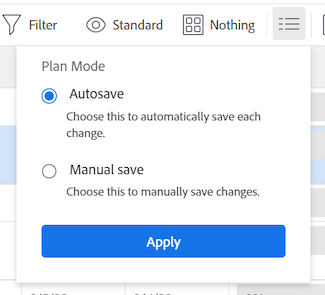

# Mover tarefas

<!--Audited: 5/2025-->

<!--The highlighted information on this page refers to functionality not yet generally available. It is available only in the Preview environment for all customers. After the monthly releases to Production, the same features are also available in the Production environment for customers who enabled fast releases.    

For information about fast releases, see [Enable or disable fast releases for your organization](/help/quicksilver/administration-and-setup/set-up-workfront/configure-system-defaults/enable-fast-release-process.md). -->

Você pode mover tarefas no Adobe Workfront entre os seguintes objetos:

* Uma tarefa ad hoc para um projeto.
* Uma tarefa de um projeto para outro projeto.
* Uma tarefa de um projeto em um pai diferente em outro projeto.
* Uma tarefa dentro do mesmo projeto sob um pai diferente.

Você pode mover uma tarefa no nível da tarefa ou pode mover uma tarefa de uma lista de tarefas.

Você pode mover uma única tarefa ou pode mover várias tarefas de uma lista de tarefas de uma só vez.

## Requisitos de acesso

+++ Expanda para visualizar os requisitos de acesso para a funcionalidade neste artigo. 

<table style="table-layout:auto"> 
 <col> 
 <col> 
 <tbody> 
  <tr> 
   <td role="rowheader">Pacote do Adobe Workfront</td> 
   <td> 
Qualquer
 </td> 
  </tr> 
  <tr> 
   <td role="rowheader">Licença do Adobe Workfront</td> 
   <td> 
Standard 
 
 
Trabalhar ou superior
 </td> 
  </tr> 
  <tr> 
   <td role="rowheader">Configurações de nível de acesso</td> 
   <td> 
Editar acesso a tarefas e projetos
 </td> 
  </tr> 
  <tr> 
   <td role="rowheader">Permissões de objeto</td> 
   <td> 
Gerenciar permissões para as tarefas
 
Permissões do Contribute ou superiores para o projeto com a capacidade de adicionar tarefas
  </td> 
  </tr> 
 </tbody> 
</table>

Para obter mais informações, consulte [Requisitos de acesso na documentação do Workfront](/help/quicksilver/administration-and-setup/add-users/access-levels-and-object-permissions/access-level-requirements-in-documentation.md).

+++

<!--Old:

<table style="table-layout:auto"> 
 <col> 
 <col> 
 <tbody> 
  <tr> 
   <td role="rowheader">Adobe Workfront plan</td> 
   <td> 
Any
 </td> 
  </tr> 
  <tr> 
   <td role="rowheader">Adobe Workfront license</td> 
   <td> 
New: Standard 
 
 
or
  

Current: Work or higher 
 </td> 
  </tr> 
  <tr> 
   <td role="rowheader">Access level configurations</td> 
   <td> 
Edit access to Tasks and Projects
 </td> 
  </tr> 
  <tr> 
   <td role="rowheader">Object permissions</td> 
   <td> 
Manage permissions to the tasks
 
Contribute or higher permissions to the project with ability to Add Tasks
  </td> 
  </tr> 
 </tbody> 
</table>-->

## Considerações para mover tarefas

Considere o seguinte ao mover uma tarefa:

* O administrador do sistema ou do grupo pode impedir que você mova tarefas que tenham horas reportadas, dependendo de como ele configura a preferência Permitir que os usuários movam tarefas e problemas com horas reportadas na área Configuração. Para obter informações, consulte [Configurar preferências de tarefas e problemas do sistema](/help/quicksilver/administration-and-setup/set-up-workfront/configure-system-defaults/set-task-issue-preferences.md).

* Quando você move uma tarefa de um projeto para outro, as datas da tarefa podem ser recalculadas. O recálculo levará em consideração o cronograma que o novo projeto usa e as informações de Cronograma de início do projeto.

* Você pode mover alguns itens associados à tarefa para a tarefa movida durante o processo de movimentação. No entanto, por padrão, os seguintes objetos são transferidos para a tarefa movida:

   * Problemas
   * Horas registradas
   * Comentários do usuário
   * Formulários personalizados e informações de campos personalizados
   * Subtarefas

* Por padrão, os seguintes itens não são movidos com a tarefa:

   * Etapas

## Mover tarefas em uma lista

{{step1-to-projects}}

1. Na página **Projetos**, selecione o projeto que contém a(s) tarefa(s) que deseja mover.
1. Clique em **Tarefas** no painel esquerdo para exibir a lista de tarefas.
1. Clique no ícone **Modo de Plano** , verifique se a opção **Salvar automaticamente** está habilitada e selecione a(s) tarefa(s) que deseja mover.

   

   >[!IMPORTANT]
   >
   >Não é possível mover tarefas quando a opção **Salvar automaticamente** está desabilitada.

1. (Opcional e condicional) Se quiser mover as tarefas selecionadas no mesmo projeto, clique nas tarefas selecionadas e arraste-as e solte-as no local para onde deseja movê-las no projeto. As alterações na hierarquia da tarefa são salvas imediatamente e as informações associadas a cada tarefa são movidas com as tarefas.

1. (Condicional) Selecione a(s) tarefa(s) que deseja mover e siga um destes procedimentos:

   * Clique no **Mais** ícone  na parte superior da lista de tarefas e clique em **Mover para**.
   * Clique com o botão direito do mouse nas tarefas selecionadas e clique em **Mover para**.
   * Ao selecionar uma tarefa, clique no menu **Mais**  ao lado do nome da tarefa na lista e clique em **Mover para**.

   A caixa **Mover Tarefa** é exibida.

1. Continue movendo a tarefa, conforme descrito na seção [Mover uma tarefa no nível de tarefa](#move-a-task-at-the-task-level) deste artigo.

   <!--
   is this still accurate?!
   -->

## Mover uma tarefa no nível da tarefa {#move-a-task-at-the-task-level}

Além de mover tarefas de uma lista de tarefas, você pode mover uma tarefa no nível da tarefa depois de abri-la.

1. Encontre uma tarefa em seu sistema Workfront procurando por ela.
1. Clique no nome da tarefa para abri-la.
1. Clique no menu suspenso **Mais**  ao lado do nome da tarefa e clique em **Mover para**. O painel lateral **Mover Tarefa** é exibido.

1. (Opcional) Atualize o **Nome da tarefa**. A tarefa é movida com o novo nome no novo local.

   >[!TIP]
   >
   >O campo **Nome da Tarefa** fica esmaecido e não pode ser editado ao selecionar a movimentação de várias tarefas em uma lista. Você pode passar o mouse sobre o campo **Nome da tarefa** e uma lista de todas as tarefas selecionadas será exibida.
   >
   >
   >

1. No campo **Selecionar projeto de destino**, digite o nome do projeto para o qual deseja mover a tarefa. Se desejar mover a tarefa dentro do mesmo projeto, digite o nome do projeto atual.

   >[!TIP]
   >
   >* O nome do projeto diferencia maiúsculas de minúsculas.
   >* Você pode pesquisar um projeto digitando o Número de Referência ou inserindo a ID do projeto. Isso pode ajudá-lo a distinguir entre projetos com nomes idênticos.
   >* Somente 100 projetos são exibidos na lista.

1. (Condicional) Se você não tiver acesso ao projeto, clique em **Solicitar acesso**.
1. (Condicional) Continue a mover a tarefa para o projeto de destino sem solicitar acesso se tiver acesso para adicionar tarefas a uma das tarefas no projeto de destino.

   

   >[!TIP]
   >
   >Mensagens semelhantes serão exibidas se o projeto selecionado estiver com aprovação pendente, concluído ou inativo, quando o administrador do Workfront impedir a adição de tarefas a esses projetos. Para obter mais informações, consulte [Configurar preferências de projeto do sistema](../../../administration-and-setup/set-up-workfront/configure-system-defaults/set-project-preferences.md).

1. (Opcional) Na seção **Opções**, desmarque qualquer um dos itens listados na tabela abaixo para removê-los das tarefas movidas. Todas as opções são selecionadas por padrão.

   >[!IMPORTANT]
   >
   >Desmarcar itens na lista **Opções** resulta em perda de dados. As informações da tarefa existente serão removidas e não poderão ser recuperadas.

   <table style="table-layout:auto"> 
    <col> 
    <col> 
    <tbody> 
     <tr> 
      <td role="rowheader">Selecionar tudo</td> 
      <td>Desmarque essa opção para remover todas as informações da tarefa ao movê-la para seu novo local. </td> 
     </tr> 
     <tr> 
      <td role="rowheader">Dt Restr</td> 
      <td> 
A restrição da tarefa é definida como O Mais Breve Possível ou O Mais Tarde Possível com base na configuração do Modo de Cronograma do projeto.
 
 Quando selecionada, a restrição atual da tarefa é transferida com a tarefa. 
 
      
Nota: Ao mover ou copiar uma tarefa com restrições específicas de data para outro projeto e as datas de restrição da tarefa estiverem fora das novas datas do projeto, a Restrição de Tarefa será alterada para O Mais Breve Possível ou o Mais Tarde Possível ou as datas de Início Planejado ou de Conclusão Planejada dos projetos serão ajustadas.

   Veja a seguir exemplos de restrições específicas de data:
   <ul>
      <li> Início em</li>
      <li> Deve concluir em</li>
      <li> Não Iniciar Antes De</li>
      <li> Não Iniciar Depois De</li>
      </ul>

   Para obter mais informações, consulte <a href="../../../manage-work/tasks/task-constraints/task-constraint-overview.md" class="MCXref xref">Visão geral da Restrição de Tarefa</a>.
 </td>
   </tr> 
     <tr> 
      <td role="rowheader">Atribuições</td> 
      <td> 
Todas as atribuições são removidas da tarefa. 
 </td> 
     </tr> 
     <tr> 
      <td role="rowheader">Processo de aprovação</td> 
      <td>Todos os processos de aprovação são removidos da tarefa.</td> 
     </tr> 
     <tr> 
      <td role="rowheader">Progresso</td> 
      <td>O status da tarefa é definido como New. Caso contrário, o status da tarefa existente será preservado. </td> 
     </tr> 
     <tr> 
      <td role="rowheader">Informações financeiras</td> 
      <td>As informações financeiras da tarefa são removidas e o Workfront atualiza o Tipo de Custo da tarefa para Sem Custo e o Tipo de Receita da tarefa como Não Faturável. </td> 
     </tr> 
     <tr> 
      <td role="rowheader">Todos os predecessores</td> 
      <td> 
Quando selecionada, a dependência se torna uma predecessora entre projetos quando você move a tarefa para outro projeto. 
 </td> 
     </tr> 
     <tr> 
      <td role="rowheader">Documentos</td> 
      <td> 
Os documentos anexados à tarefa não são transferidos para a tarefa movida. Isso inclui versões, provas e documentos vinculados.
 
Isso não inclui aprovações de documentos. Aprovações de documentos nunca podem ser movidas quando uma tarefa é movida.
 
      
Observação: se você optar por não mover os documentos com a tarefa, eles serão excluídos e colocados na Lixeira por 30 dias. Um administrador pode restaurá-los e eles serão restaurados na tarefa movida. 

   
Se a tarefa for excluída depois de movida, os documentos restaurados serão colocados na área Documentos da página do usuário do administrador que os restaura.

   </td> 
     </tr> 
     <tr> 
      <td role="rowheader">Notificações de Lembrete</td> 
      <td>Os lembretes de tarefa não são transferidos para a tarefa movida. </td> 
     </tr> 
     <tr> 
      <td role="rowheader">Despesas</td> 
      <td>As despesas registradas na tarefa não são transferidas para a tarefa movida. </td> 
     </tr> 
     <tr> 
      <td role="rowheader">Permissões</td> 
      <td> 
O Workfront remove os nomes de todas as entidades exibidas na lista Compartilhamento da tarefa. 
 </td> 
     </tr> 
    </tbody> 
   </table>

1. (Opcional) Na seção **Selecionar pai**, selecione a tarefa no projeto de destino que se tornará a principal da tarefa movida.

   >[!TIP]
   >
   >Ao selecionar para mover várias tarefas em uma lista, todas as tarefas selecionadas se tornam as filhas da tarefa principal selecionada.

   Selecione um pai seguindo um destes procedimentos:

   * Na lista de tarefas, selecione um dos pais no plano de projeto.
   * Clique no ícone de pesquisa  e procure uma tarefa pai por nome.

   A tarefa é exibida na lista.

   

   >[!NOTE]
   >
   >Se você não selecionar uma tarefa pai, as tarefas serão movidas como tarefas principais em vez de subtarefas e serão colocadas no final da lista de tarefas no projeto de destino.

1. Clique em **Mover tarefa**. As tarefas são movidas para o projeto especificado como subtarefas para uma tarefa pai ou as últimas tarefas no projeto.
