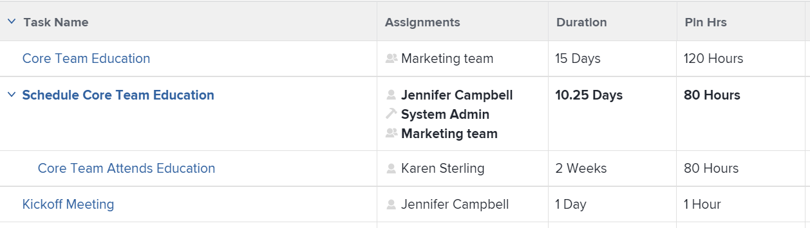

# Visão geral das Horas planejadas

<!-- Audited: 01/2024 -->

As Horas Planejadas associadas a uma tarefa, problema ou projeto representam a quantidade de tempo necessária para que os usuários atribuídos concluam a tarefa, problema ou projeto.

## Considerações sobre o planejamento de horas no Adobe Workfront

* As horas planejadas estão associadas principalmente a itens de trabalho (tarefas e problemas) no Adobe Workfront. As Horas planejadas dos itens de trabalho são acumuladas nas Horas planejadas dos seus projetos.
* Por padrão, o Workfront distribui as Horas planejadas de tarefas e problemas igualmente para todos os dias na Duração da tarefa ou problema.
* Quando usuários e funções são atribuídos a tarefas e problemas, as Horas planejadas das tarefas e problemas são associadas a atribuições de usuários ou funções.
* Você deve definir o valor de Horas planejadas para tarefas e problemas se quiser usar as ferramentas de Gerenciamento de recursos no Workfront.
* Você pode modificar o valor de Horas planejadas em tarefas somente para alguns Tipos de duração.

  Para obter mais informações sobre como modificar as Horas Planejadas nas tarefas em relação ao Tipo de Duração das tarefas, consulte a seção [Atualizar Horas Planejadas da tarefa com base no Tipo de Duração](#update-task-planned-hours-based-on-duration-type) neste artigo.

* Você pode modificar o valor de Horas planejadas em ocorrências a qualquer momento.
* Você não pode modificar o valor de Horas planejadas de projetos ou de tarefas pai, pois elas são um total calculado de todas as Horas planejadas de todas as suas tarefas e subtarefas.
* O gerenciamento de alocações de usuários usando ferramentas de gerenciamento de recursos pode alterar o número de Horas Planejadas de tarefas, problemas e projetos e das atribuições associadas aos itens de trabalho.

## Horas planejadas nas tarefas vs. Horas planejadas nos projetos {#planned-hours-on-tasks-vs-planned-hours-on-projects}

As horas planejadas das tarefas são acumuladas até as horas planejadas do projeto. As horas planejadas dos problemas nem sempre correspondem às horas planejadas do projeto.

Esta seção descreve as diferenças entre as Horas Planejadas da tarefa e do projeto. Também descreve onde você pode visualizar o problema de Horas planejadas acumuladas no projeto.

### Horas planejadas das tarefas {#planned-hours-on-tasks}

As horas planejadas de uma tarefa indicam a quantidade de tempo estimado que o trabalho real na tarefa pode levar. Por padrão, o Workfront distribui a quantidade total de horas planejadas uniformemente para cada dia dentro da duração de cada tarefa. A quantidade diária de horas planejadas torna-se a alocação diária da tarefa. Se a tarefa for atribuída a vários recursos, cada recurso receberá uma quantidade igual de horas diárias, por padrão.

Usando o Balanceador de carga de trabalho, você pode modificar as alocações diárias para os usuários atribuídos às tarefas. Isso também pode atualizar as Horas planejadas da tarefa quando o Tipo de duração da tarefa for Simples. Para obter mais informações, consulte a seção &quot;Atualizar horas planejadas da tarefa ao gerenciar alocações de usuário&quot; no artigo [Gerenciar alocações de usuário no Balanceador de carga de trabalho](../../../resource-mgmt/workload-balancer/manage-user-allocations-workload-balancer.md).

Quando uma tarefa contém subtarefas, as Horas Planejadas da tarefa pai é a soma de todas as Horas Planejadas em qualquer subtarefa. Você não pode atualizar as Horas planejadas de uma tarefa pai.

>[!NOTE]
>
>Diferentemente das Horas Planejadas, as Horas Reais em uma tarefa pai são horas registradas diretamente na tarefa pai. Elas não representam uma soma das Horas Reais das tarefas filhas.\
>Para obter mais informações sobre Horas Reais, consulte [Exibir Horas Reais](../../../manage-work/tasks/task-information/actual-hours.md).

### Horas planejadas dos projetos {#planned-hours-on-projects}

Não é possível editar a quantidade de Horas planejadas em um projeto. As horas planejadas em um projeto são uma soma calculada de todas as horas planejadas de todas as tarefas no projeto.

Se os problemas são incluídos no cálculo das Horas planejadas depende do local do projeto onde você está visualizando as Horas planejadas. Você pode exibir as Horas Planejadas do projeto nos seguintes locais dentro de um projeto:

* **Seção de detalhes do projeto e caixa Editar projeto**: somente as horas planejadas das tarefas no projeto são consideradas. As horas planejadas para os problemas no projeto não são consideradas ao visualizar o número total de horas planejadas para o projeto na seção Detalhes do projeto ou na caixa Editar projeto.

* **O Balanceador de Carga de Trabalho**: somente as Horas Planejadas associadas às tarefas visíveis no Balanceador de Carga de Trabalho são exibidas no Balanceador de Carga de Trabalho para projetos. As alocações diárias do usuário podem alterar as Horas planejadas diárias do projeto no Balanceador de carga de trabalho.
* **Seção de Utilização**: as Horas Planejadas associadas aos usuários atribuídos às tarefas e os problemas no projeto são levados em consideração ao exibir o número total de Horas Planejadas do projeto na seção de Utilização.
* **Painel de alocação de função** na lista de tarefas: as horas planejadas das tarefas e os problemas do projeto atribuídos a uma função de trabalho ou a um usuário associado a uma função de trabalho são exibidos nesta área. As horas planejadas associadas a tarefas e problemas que não estão atribuídos ou atribuídos a equipes não são exibidas nessa área. Para obter mais informações, consulte [Exibir horas planejadas do projeto no painel Alocação de função](../../../manage-work/projects/planning-a-project/view-planed-hours-in-role-allocation-panel.md).

## Distribuição de horas planejadas na duração de uma tarefa

Por padrão, o Workfront distribui as Horas planejadas uniformemente pela Duração de uma tarefa, alocando um número igual de Horas planejadas para cada dia da tarefa, de acordo com a disponibilidade do agendamento do projeto.

Por exemplo, se uma tarefa estiver definida para iniciar às 16h e o agendamento tiver uma hora restante no primeiro dia da tarefa, o Workfront colocará uma Hora planejada no primeiro dia da Duração da tarefa e dividirá o restante das Horas planejadas igualmente entre o restante dos dias na Duração da tarefa.

>[!NOTE]
>
>As Horas Planejadas por Dia ou a alocação diária é a alocação de Horas Planejadas para cada dia durante a Duração da tarefa. Se a tarefa tiver uma atribuição, esse número representará as Horas Planejadas por Dia por atribuição. Se a tarefa tiver várias atribuições, as Horas Planejadas por Dia por atribuição serão diferentes das Horas Planejadas por Dia para a tarefa. Não há representação visual no Workfront para as Horas planejadas por dia por atribuição, para tarefas com várias atribuições.

## Localize e entenda os valores de Horas planejadas

Você pode encontrar valores de Horas planejadas em várias áreas do Workfront.

O número de Horas planejadas exibidas origina-se dos itens de trabalho no projeto ou é calculado de forma diferente, dependendo da área e do objeto em que você os visualiza.

Você pode localizar Horas planejadas nas seguintes áreas do Workfront:

* [A seção Detalhes de um projeto, tarefa ou problema](#the-details-section-of-a-project-task-or-issue)
* [A caixa Editar Tarefa ou Editar Problema](#the-edit-task-or-edit-issue-box)
* [Relatórios](#reports)
* [O Balanceador de Carga de Trabalho](#the-workload-balancer)
* [O Planejador de Recursos](#the-resource-planner)
* [O relatório de utilização](#the-utilization-report)
* [O painel Alocação de função](#the-role-allocation-panel)

### A seção Detalhes de um projeto, tarefa ou problema {#the-details-section-of-a-project-task-or-issue}

As Horas Planejadas na seção Detalhes de uma tarefa, problema ou projeto são o total de Horas Planejadas associadas ao item.

Para obter mais informações sobre o Trabalho necessário, consulte a seção [Trabalho necessário em tarefas vs. Trabalho necessário em projetos](#planned-hours-on-tasks-vs-planned-hours-on-projects) neste artigo.

### A caixa Editar tarefa ou Editar problema {#the-edit-task-or-edit-issue-box}

As Horas planejadas na caixa Editar de uma tarefa ou problema são o total de Horas planejadas do respectivo item.

Para obter mais informações sobre o Trabalho necessário, consulte a seção [Trabalho necessário em tarefas vs. Trabalho necessário em projetos](#planned-hours-on-tasks-vs-planned-hours-on-projects) neste artigo.

Para tarefas, você pode editar a quantidade de Horas planejadas somente para certos Tipos de duração. Para obter informações, consulte a seção [Atualizar horas planejadas da tarefa com base no Tipo de duração](#update-task-planned-hours-based-on-duration-type) neste artigo.

Você pode exibir a alocação individual de Horas Planejadas para cada usuário ou função de trabalho atribuída à tarefa ou problema na área Atribuições.

### Relatórios {#reports}

Você pode adicionar o campo Horas planejadas nos relatórios de projetos, tarefas e problemas.

A coluna Horas planejadas é incluída na exibição Padrão de uma lista de tarefas, por padrão.

O relatório de Horas planejadas em uma tarefa, problema ou projeto é o total de Horas planejadas do respectivo item, conforme exibido na seção Detalhes ou na caixa Editar dos itens.

Para obter informações sobre como criar relatórios, consulte [Criar um relatório personalizado](../../../reports-and-dashboards/reports/creating-and-managing-reports/create-custom-report.md).

>[!NOTE]
>
>Se você criar um relatório de Projeto (Dados financeiros) e agrupá-lo por data, as Horas planejadas podem exibir uma parte das Horas planejadas do projeto, dependendo da linha do tempo das tarefas no projeto. Por padrão, o Workfront distribui as Horas planejadas de tarefas igualmente para cada dia de Duração da tarefa. As horas planejadas para um determinado período correspondem à distribuição igual definida pelo Workfront para esse período no relatório Projeto (Dados financeiros).

<!--
### The Scheduling areas  {#the-scheduling-areas}

The Planned Hours for tasks and issues display in the Scheduling areas in the Planned Hours field.

You can view the daily allocation of Planned Hours for each user assigned to a task or an issue in the Scheduling areas.

The daily hour amount represents one of the following:

* the default amount equally distributed by Workfront for each day of the Duration of the tasks or issues
* the adjusted daily allocation managed by resource managers.

  For information about adjusting daily allocations in the Scheduling tools, see [Manage user allocations in the Scheduling areas](../../../resource-mgmt/resource-scheduling/manage-allocations-scheduling-areas.md).
-->

### O Balanceador de carga de trabalho {#the-workload-balancer}

As seguintes Horas planejadas de tarefas, problemas e projetos são exibidas no Balanceador de carga de trabalho à direita do nome da tarefa, problema ou projeto:

* Para tarefas e problemas, as Horas planejadas associadas a eles são exibidas.
* Para projetos, um total de Horas planejadas das tarefas e problemas visíveis na tela.

  >[!TIP]
  >
  >O Balanceador de carga de trabalho não exibe todas as Horas planejadas de um projeto como visíveis na área Detalhes do projeto.

Você pode visualizar a alocação diária de Horas planejadas para cada usuário atribuído a uma tarefa ou um problema no Balanceador de carga de trabalho.

A quantidade de horas diárias de Horas planejadas representa um dos seguintes: 

* o valor padrão distribuído igualmente pela Workfront para cada dia da Duração das tarefas, problemas ou do projeto
* a alocação diária ajustada gerenciada pelos gerentes de recursos

  Para obter informações sobre como ajustar alocações diárias no Balanceador de carga de trabalho, consulte [Gerenciar alocações de usuário no Balanceador de carga de trabalho](../../../resource-mgmt/workload-balancer/manage-user-allocations-workload-balancer.md).

### O Planejador de Recursos {#the-resource-planner}

O Planejador de recursos exibe as Horas planejadas dos projetos, tarefas e problemas.

Você pode exibir alocações semanais de Horas Planejadas para os usuários e funções de trabalho associadas aos itens de trabalho na coluna PLN do Planejador de Recursos.

>[!TIP]
>
>Os ajustes de alocação diários no Balanceador de carga de trabalho influenciam as alocações semanais para tarefas e problemas no Planejador de recursos.

O número de Horas Planejadas para cada objeto difere dependendo de qual visualização você aplica ao Planejador de Recursos. Para obter mais informações, consulte [Visão geral de horas, FTE e informações de custo nas exibições de Projeto e Função do Planejador de Recursos](../../../resource-mgmt/resource-planning/overview-of-planner-hour-fte-cost-information-in-role-project-views.md).

A quantidade de horas semanais planejadas para tarefas e problemas representa um dos seguintes:

* o valor semanal padrão distribuído igualmente pela Workfront para cada dia da Duração das tarefas ou problemas
* a alocação semanal ajustada gerenciada pelos gerentes de recursos no Balanceador de carga de trabalho

  Para obter informações sobre como ajustar alocações diárias no Balanceador de carga de trabalho, consulte [Gerenciar alocações de usuário no Balanceador de carga de trabalho](../../../resource-mgmt/workload-balancer/manage-user-allocations-workload-balancer.md).

O valor semanal para projetos, usuários e funções é influenciado pelos valores semanais de Horas planejadas para as tarefas e problemas associados a eles.

### O relatório de Utilização {#the-utilization-report}

As Horas Planejadas do projeto são aquelas associadas com as atribuições em cada tarefa e problema.

>[!IMPORTANT]
>
>Observe que as Horas Planejadas no relatório de Utilização estão associadas às atribuições e não às tarefas e problemas propriamente ditas. As Horas Planejadas no relatório de Utilização nem sempre correspondem às Horas Planejadas nas tarefas e problemas do projeto. No entanto, as Horas planejadas correspondem às horas associadas às atribuições em tarefas e problemas.

Você pode exibir os seguintes tipos de Horas Planejadas no relatório de Utilização:

* o total de Horas Planejadas de todas as atribuições no projeto durante a vida geral dos projetos incluídos
* o total de Horas Planejadas de todas as atribuições apenas para o intervalo de datas especificado (você pode especificar uma semana ou mês individual).

  Quando a alocação diária do usuário para horas tiver sido ajustada usando o Balanceador de carga de trabalho, as Horas planejadas para um intervalo de datas específico poderão ser afetadas se as datas selecionadas no relatório de Utilização contiverem apenas uma parte da Duração de uma tarefa ou problema. Para obter informações sobre como ajustar alocações diárias para usuários, consulte [Gerenciar alocações de usuários no Balanceador de carga de trabalho](../../../resource-mgmt/workload-balancer/manage-user-allocations-workload-balancer.md).

Para obter mais informações, consulte [Exibir informações sobre a utilização de recursos](../../../resource-mgmt/resource-utilization/view-utilization-information.md).

### O painel Alocação de função

As Horas planejadas no painel Alocação de função representam o número de Horas planejadas associadas a cada função de trabalho atribuída às tarefas ou problemas no projeto durante a duração total do projeto. O número corresponde à função Horas planejadas do Planejador de recursos.

>[!TIP]
>
>Observe que as Horas planejadas associadas aos usuários não são exibidas no painel Alocação de função.

Para obter mais informações, consulte [Mostrar alocação de funções para projetos e iniciativas no Balanceador de Carga de Trabalho](../../../scenario-planner/show-role-allocation-workload-balancer.md).

## Atualizar horas planejadas da tarefa de acordo com o tipo de duração {#update-task-planned-hours-based-on-duration-type}

Você pode atualizar o total de Horas planejadas nas tarefas ao editar tarefas somente se as tarefas tiverem um determinado Tipo de duração.

Existem os seguintes cenários:

* Você pode modificar Horas Planejadas para tarefas somente ao usar a Atribuição Calculada ou os Tipos de Duração Simples ao editar uma tarefa.

  Para obter mais informações sobre o Tipo de Duração da Atribuição Calculada, consulte [Visão geral do Tipo de Duração: Atribuição Calculada](../../../manage-work/tasks/taskdurtn/calculated-assignment.md).

  Para obter mais informações sobre o Tipo de Duração Simples, consulte [Visão geral do Tipo de Duração: Simples](../../../manage-work/tasks/taskdurtn/simple-duration-type.md).

* Você pode atualizar as Horas planejadas da tarefa no Balanceador de carga de trabalho somente para tarefas do Tipo duração simples quando gerencia as alocações dos usuários para tarefas. Para obter informações sobre como gerenciar alocações de usuários no Balanceador de carga de trabalho, consulte [Gerenciar alocações de usuários no Balanceador de carga de trabalho](../../../resource-mgmt/workload-balancer/manage-user-allocations-workload-balancer.md).
* Não é possível modificar as Horas Planejadas de tarefas com um Tipo de Duração de Trabalho Calculado ou Orientado pelo Esforço. Nesses casos, o Workfront determina as Horas planejadas com base na Duração da tarefa; no entanto, nesse caso, as Horas planejadas são sempre iguais à Duração (em horas) e não são afetadas pela alocação percentual dos recursos atribuídos.

  Para obter mais informações sobre o Tipo de Duração Conduzido pelo Esforço, consulte [Visão geral do Tipo de Duração: Conduzido pelo Esforço](../../../manage-work/tasks/taskdurtn/effort-driven.md).

  Para obter mais informações sobre o Tipo de Duração do Trabalho Calculado, consulte [Visão geral do Tipo de Duração: Trabalho Calculado](../../../manage-work/tasks/taskdurtn/calculated-work.md).

## Atualizar Trabalho de Horas Planejadas da tarefa ao gerenciar alocações de usuários

Você pode atualizar Horas planejadas para tarefas ao atualizar manualmente as alocações de usuário ou função de trabalho para tarefas. Isso é possível somente quando as tarefas têm um Tipo de duração de Simples.

Para obter mais informações, consulte [Visão geral do Tipo de Duração: Simples](../../../manage-work/tasks/taskdurtn/simple-duration-type.md).

Você pode atualizar a alocação geral dos usuários e funções atribuídos à tarefa ou as alocações diárias dos usuários ao usar o Balanceador de carga de trabalho.

Para obter informações sobre como gerenciar alocações gerais de usuários e funções de trabalho para tarefas, consulte [Gerenciar horas de alocação de usuários e funções em tarefas](../../../manage-work/tasks/assign-tasks/manage-allocation-hours-on-tasks.md).

Para obter informações sobre como gerenciar alocações diárias para tarefas, consulte [Gerenciar alocações de usuário no Balanceador de carga de trabalho](../../../resource-mgmt/workload-balancer/manage-user-allocations-workload-balancer.md).

Os cenários a seguir existem ao atualizar manualmente as alocações de usuário ou função de trabalho para tarefas:

* Quando você não atualiza manualmente as alocações de usuário ou função individuais para acionar uma alteração nas Horas Planejadas da tarefa, as Horas Planejadas permanecem inalteradas quando você adiciona, remove ou substitui atribuições na tarefa. Ao adicionar uma nova atribuição à tarefa, as alocações individuais são redistribuídas entre todos os atribuídos.
* Quando você atualiza manualmente as alocações para acionar uma alteração nas Horas Planejadas da tarefa, as Horas Planejadas diminuem quando você remove atribuições da tarefa. Elas permanecem inalteradas quando você substitui uma atribuição.
* Quando você atualiza manualmente as alocações para acionar uma alteração nas Horas Planejadas da tarefa e adiciona uma atribuição à tarefa, a nova atribuição recebe 0 horas por padrão. Você deve atualizar manualmente a alocação para a tarefa, o que pode afetar as Horas planejadas.
* Quando você não atualiza manualmente as alocações para acionar uma alteração nas Horas Planejadas da tarefa e remove todas as atribuições da tarefa, as Horas Planejadas permanecem inalteradas.
* Quando você atualiza manualmente as alocações para acionar uma alteração nas Horas Planejadas da tarefa e remove todas as atribuições da tarefa, as Horas Planejadas também são removidas e as Horas Planejadas da tarefa se tornam 0.

>[!NOTE]
>
>Por exemplo, se uma tarefa tiver 10 Horas planejadas e você tiver dois atribuídos, eles serão alocados 5 horas cada, por padrão.
>
>* Se você não atualizar a alocação de usuário individual ou as alocações diárias usando o Balanceador de carga de trabalho e remover algum ou todos os atribuídos da tarefa, as Horas planejadas da tarefa permanecerão 10 horas.
>* Se você alterar manualmente as alocações das atribuições para 4 e 6 horas, respectivamente, e remover o usuário alocado para 6 horas, bem como sua função de trabalho, a tarefa Horas Planejadas será atualizada para 4 horas. Se você também remover o usuário alocado para 4 horas, mas manter a função de trabalho associada ao usuário removido, as Horas planejadas da tarefa permanecerão 4 horas. Se você remover o último usuário alocado para 4 horas, bem como sua função de trabalho e a tarefa permanecer não atribuída, as Horas planejadas da tarefa se tornarão 0.

## Atualizar automaticamente as Horas Planejadas das tarefas usando o Esforço de trabalho

Quando você usa o Esforço de trabalho para estimar o esforço necessário para a conclusão de uma tarefa, a quantidade de Horas planejadas das tarefas é atualizada automaticamente. Isso é possível somente para tarefas com um Tipo de duração simples.

Para obter informações sobre como usar o Esforço de trabalho para estimar o esforço da tarefa, consulte [Visão geral do Esforço de trabalho](../../../manage-work/tasks/task-information/work-effort.md).

<!--

(NOTE: this issue has the explanation of how Planned Hours should work - from Vazgen and Anna: https://hub.workfront.com/issue/6217dced00730b7034c4b808339a35ce/

-->

<!--

Details of their comments: 

-->

<!--

Anna Asatryan

3/22/2022 At 3:16 PM

&nbsp;

to Mark Paul, Corrie Butler, Arman Simonyan, Gagik Khalatyan, Alina Wilson, Artur Sargsyan, Vazgen Babayan, Anna Asatryan

I have done some rough calculations on what the planned hours/revenues should look like Book.xlsx . And if we look, for example at the 2 users highlighted in one of the screenshots their planned hours look way off from what the calculation looks like in the spreadsheet (i.e. equally distributed allocation). When looking at the Workload balancer (the second screenshot), as an example for the user Yashas Mitta, I can see that the allocation has been modified. Obviously the utilization report calculates the allocations based on the modified contouring using the new work per day calculation. The project financial report uses the old, equal distribution of allocation along the full duration of the task. Hence. there is a difference when grouping per periods.

Vazgen Babayan

I believe we will need to prioritise syncing the project financial data report with the new work per day.

Alina Wilson

@Anna Asatryan , do you have a definition of what we should say in documentation (glossary, for example) for how the Planned Hours (or Planned Revenue) is calculated, keeping in mind that we don't document the concept of "workPerDay". We call them "daily allocations", for example, but let me know if that's accurate, too.

Vazgen Babayan

Last Thursday at 3:13 PM

I think an important note here is that regardless the calculation, even if the both views used the same formula, they will not display the same data, because the underlying data sources are different. The Financial Data report does not respect user-entered allocations in Workload Balancer at this moment. So there will be a clear discrepancy, as Anna showed in her message. My recommendation for communication will be to explain that the data sources are different so there can be a mismatch in data and that we will look into addressing that on our roadmap.

Alina Wilson

So far, I hear you guys say this (with my questions for confirmation/ comments in bold):

- the utilization report calculates the allocations based on the modified contouring using the new work per day calculation (so this is what we see in the Workload Balancer, right?)

- the project financial report uses the old, equal distribution of allocation along the full duration of the task (this is before the daily allocations for example were modified in the WB, right?)

I have these additional questions:

- what does the Project Details show? Which Planned Hours, for instance - because earlier, we had a question about this also. - which numbers?

- what does any Planned Hours/ Planned Revenue field that can be pulled in any other report (outside of Financial Data and Utilization reports) show? - which numbers?

- are there any other areas I am not thinking of that we need to document, @Corrie Butler

I will try to document all the possible areas where these display but please help. Thanks!

Vazgen Babayan

Last Saturday at 3:41 PM

<ul>
<li> 
Confirming the first two points 
 </li>
</ul>

For the following questions

<ul>
<li> 
Project details show an aggregated sum of task planned hours. It doesn't have anything to do with the work per day because it always deals with total numbers for the whole duration of the Project/Task.
 </li>
<li> 
Same thing applies to the Planned Hours and Planned Revenue fields in reports - they show totals for the whole Project/Task duration and thus have no use of work per day.
 </li>
<li> 
Can't think of any other fields related to this right now.
 </li>
<li> 
In general, if I were to summarize the system behavior, it's as follows:
 </li>
<li> 
Every area that only deals with total numbers of Planned Hours / Planned Revenue, uses the numbers entered on the tasks. Those are Task / Project Details, reports exposing those fields.
 </li>
<li> 
Areas that deal with time-sensitive portions of Planned Hours / Planned Revenue, use work per day. Those are all Resource Management tools - Workload Balancer, Resource Planner, Utilization Report, importing projects via Scenario Planner.
 </li>
<li> 
All the areas in the second point support user-edited allocations made in Workload Balancer.
 </li>
<li> 
Scheduling area and Project Financial Data reports use the old version of the work per day, which doesn't respect user-edited allocations from Workload Balancer.
 </li>
<li> 
Scheduling will be removed this year, and we need to do work to move the Project Financial Data reports to the new work per day sometime after Q3.
 </li>
</ul>

Alina Wilson

@Vazgen Babayan , one clarifying question: when you say "Scheduling and Project Financial Data reports use the old version of the work per day, which doesn't respect user-edited allocations from WB" - you mean that those use the system default which spreads the allocations evenly, correct? Because you can edit (daily) allocations in Scheduling tools, but it doesn't use that, correct? It uses the default of the daily allocation that the system figures out when dividing the Planned Hours by the number of days in the Duration. Please let me know. And thanks!

Anna Asatryan

Yesterday at 11:42 AM

@Alina Wilson , that's correct, when saying "Scheduling and Project Financial Data reports use the old version of the work per day, which doesn't respect user-edited allocations from WB" Vazgen meant that it spreads the allocation evenly.

As for the scheduling, the allocation modification that's being done there isn't reflected anywhere else in the application other than in the Scheduling itself. That's probably one of the reasons it's being deprecated.

-->

<!--

   

-->

<!--

(NOTE: everything below is drafted because I replaced it with the table above)

-->

<!--

You can find the Planned Hours information on tasks, issues, or projects in the following locations:

-->

<!--

The Planned Hours in the Details  section  of a task, issue, or project are the total Planned Hours of the respective item. 

Finding the Planned Hours in the Details  section  is identical for tasks, issues, and projects. 
 <note type="tip">
You cannot edit the Planned Hours of projects manually, as they are a calculation of all Planned Hours of all the tasks on the project.
</note>

To locate the Planned Hours value on the Details  section  of a task: 

<ol>
<li value="1">Go to a task for which you want to review the Planned Hours.</li>
<li value="2"> 
Click <strong>Task Details</strong> in the left panel. 
 </li>
<li value="3"> 
Click the <strong>Overview</strong> area and notice the Planned Hours value.
 
This value represents the time it would take the user assigned to the task to complete it. 
 </li>
</ol>

-->

<!--

<h3> </h3>

The Planned Hours in the Edit box of a task, issue, or project are the total Planned Hours of the respective item. 

Finding the Planned Hours while editing a task or an issue is identical. 
 <note type="tip">
You cannot edit the Planned Hours of projects manually, as they are a calculation of all Planned Hours of all the tasks on the project.
</note>

To locate the value of Planned Hours while editing a task:

<ol>
<li value="1">Go to the task or issue you want to view Planned Hours for.</li>
<li value="2"> 
Click the <strong>More</strong> icon  next to the task name, then click <strong>Edit</strong>.
 
The Planned Hours are located in the <strong>Overview</strong> section. 
 </li>
</ol>

-->

<!--

The Planned Hours column is included in the Standard view of a task list, by default. For issues and projects, you can add it to the view, when you are editing the view or when you build a report. 

The Planned Hours in a task, issue, or project report are the total Planned Hours of the respective item as they display in the Details  section  or the Edit box of the items. 

Adding the Planned Hours column to a project view is similar to building a view in a project report. 

To show Planned Hours in a project report:

<ol>
<li value="1"> 
Click the <strong>Main Menu</strong> icon  in the upper-right corner of Workfront, then click <strong>Reports</strong>. 
 </li>
<li value="2">Click <strong>New Report</strong>, then choose <strong>Project</strong> as your object.</li>
<li value="3">Click <strong>Add Column</strong>, and start typing <strong>Planned Hours</strong> when the <strong>Show in this column</strong> drop-down field is displayed. Select the field when it appears in the list.</li>
<li value="4"> 
Click <strong>Save + Close</strong> to save the report. 
 
The Planned Hours column shows the total number of Planned Hours on each project. 
 </li>
</ol>

-->

<!--

Planned Hours in Resource Management tools
 <note type="important">
When viewing Planned Hours in the Resource Management tools by a specific time frame, the daily allocations for each work item and the daily allocations for the resources assigned to the work items during that time frame can influence the daily Planned Hours of projects or work items.
</note>

You can see the value of Planned Hours for your tasks, issues, or projects when using the following Resource Management tools:

<ul>
<li> 
Resource Planner
 
For information about using the Resource Planner, see <a href="../../../resource-mgmt/resource-planning/get-started-resource-planner.md" class="MCXref xref">Resource Planner overview</a>.
 </li>
<li> 
Utilization Report.
 
For information about the utilization report, see <a href="../../../reports-and-dashboards/reports/using-built-in-reports/resource-utilization-report.md" class="MCXref xref">Overview of the Resource Utilization report</a>.
 </li>
<li>

Workload Balancer or Scheduling areas in the following sections:

<ul>
<li>Scheduling or Workload Balancer sections in the Resourcing area</li>
<li>Scheduling or Workload Balancer section at the project level</li>
<li>Schedule or Workload Balancer section at the team level</li>
</ul>

 
For information about scheduling resources, see <a href="../../../resource-mgmt/resource-scheduling/get-started-resource-scheduling.md" class="MCXref xref">Get started with Resource Scheduling</a>.
 
For information about the Workload Balancer, see <a href="../../../resource-mgmt/workload-balancer/overview-workload-balancer.md" class="MCXref xref">Workload Balancer overview</a>. 
 </li>
<li> 
<b>Role Allocation panel</b> in the project  task list or  Workload Balancer: The Planned Hours for the tasks and the issues on the project that are assigned to a job role or a user associated with a job role are taken into account in this area. For more information, see <a href="../../../manage-work/projects/planning-a-project/view-planed-hours-in-role-allocation-panel.md" class="MCXref xref">View project Planned Hours in the Role Allocation panel</a>. 
 </li>
</ul>

-->
