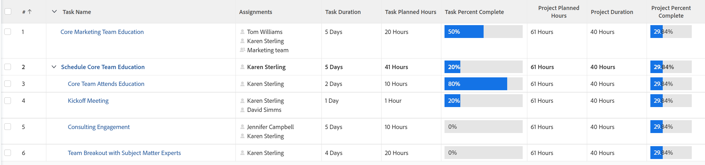

# Visão geral da porcentagem de projetos concluída

O valor Porcentagem concluída de um projeto é calculado com base na Duração ou nas Horas planejadas das tarefas no projeto. O administrador do Adobe Workfront ou um administrador de grupo define qual valor é levado em conta ao calcular a porcentagem concluída no sistema quando eles configuram as informações na área Preferências do projeto .

Para obter informações sobre como configurar as preferências do projeto, consulte [Configurar preferências de projeto em todo o sistema](../../../administration-and-setup/set-up-workfront/configure-system-defaults/set-project-preferences.md).

A porcentagem de conclusão de uma tarefa pai é baseada na Duração ou nas Horas Planejadas de cada uma de suas subtarefas.

Da mesma forma, a porcentagem de conclusão de um projeto se baseia nas durações ou horas planejadas de cada tarefa principal no projeto.

As principais tarefas são as tarefas principais e as tarefas independentes que não têm filhos.

>[!TIP]
>
>As tarefas principais não são recuadas em um plano de projeto.

## Como o Workfront calcula a porcentagem concluída

* [Atualizar a porcentagem concluída em uma tarefa](#update-the-percent-complete-on-a-task)
* [Como o Workfront calcula a porcentagem concluída em uma tarefa pai](#how-workfront-calculates-percent-complete-on-a-parent-task)
* [Como a Workfront calcula a porcentagem concluída em um projeto](#how-workfront-calculates-percent-complete-on-a-project)

### Atualizar a porcentagem concluída em uma tarefa {#update-the-percent-complete-on-a-task}

Você pode modificar o percentual de conclusão de uma tarefa manualmente. Isso não é um cálculo.

O Workfront usa a porcentagem completa de uma tarefa individual para calcular a porcentagem completa da tarefa pai ou a porcentagem total do projeto.

Para obter informações sobre como atualizar a porcentagem completa de uma tarefa, consulte [Exibir e atualizar porcentagem concluída para tarefas](../../../manage-work/projects/updating-work-in-a-project/view-update-percent-complete-for-tasks.md).

### Como o Workfront calcula a porcentagem concluída em uma tarefa pai {#how-workfront-calculates-percent-complete-on-a-parent-task}

Dependendo do que seu Workfront ou administrador de grupo selecionado nas Preferências do projeto no nível do sistema ou grupo, a porcentagem concluída de uma tarefa pai é calculada com base na Duração ou nas Horas Planejadas de tarefas.

Considere os seguintes cenários:

* Se o sistema calcular o percentual de conclusão com base nas Horas Planejadas, o percentual de conclusão da tarefa pai será calculado usando a seguinte fórmula:

   `Parent Task Percent Complete = (((Task 1 Planned Hours * Task 1 Percent Complete) + (Task 2 Planned Hours * Task 2 Percent Complete))/Total Planned Hours of Parent)*100`

   O Total de Horas Planejadas do pai representa a soma de todas as Horas Planejadas de cada filho.

   

* Se o sistema calcular o percentual completo com base na Duração, o percentual de conclusão da tarefa pai será calculado usando a seguinte fórmula:

   `Parent Task Percent Complete = (((Task 1 Duration * Task 1 Percent Complete) + (Task 2 Duration * Task 2 Percent Complete))/ Total Duration of Parent)*100`

   

   >[!IMPORTANT]
   >
   >A Duração Total da Tarefa Pai é o total de todas as durações das tarefas filho. Por exemplo, uma tarefa pai com dois filhos que têm uma Duração de 1 Dia e 2 Dias tem uma Duração Total de 3 Dias, mesmo quando os dois filhos podem começar no mesmo dia.

### Como a Workfront calcula a porcentagem concluída em um projeto {#how-workfront-calculates-percent-complete-on-a-project}

Dependendo do que seu Workfront ou administrador de grupo selecionou nas Preferências do projeto no nível do sistema ou grupo, a porcentagem de conclusão de um projeto é calculada com base na Duração ou nas Horas Planejadas das principais tarefas do projeto.

* Se o sistema calcula o percentual de conclusão com base nas Horas Planejadas, o percentual de conclusão do projeto é calculado usando a seguinte fórmula:

   `Project Percent Complete =(((Task 1 Planned Hours * Task 1 Percent Complete) + (Task 2 Planned Hours * Task 2 Percent Complete))/Total Planned Hours of the Project)*100`

   O Total de Horas Planejadas do projeto é a soma das Horas Planejadas de todas as principais tarefas do projeto.

   

   >[!NOTE]
   >
   >A Tarefa 1 ou a Tarefa 2 só podem ser tarefas principais ou tarefas independentes. As tarefas Horas Planejadas e Porcentagem Concluída de Filhos não são usadas neste cálculo.

* Se o sistema calcula a porcentagem completa com base na Duração, a porcentagem completa do projeto é calculada usando a seguinte fórmula:

   `Project Percent Complete = (((Task 1 Duration * Task 1 Percent Complete) + (Task 2 Duration * Task 2 Percent Complete))/Duration of the Project)*100`

   >[!IMPORTANT]
   >
   >A Duração do projeto é o total de todas as durações das principais tarefas que exibem uma porcentagem concluída. Por exemplo, um projeto com uma tarefa independente com Duração de 2 Dias e uma tarefa pai com Duração de 5 Dias que teve trabalho concluído com ela terá uma Duração total de 7 Dias, mesmo que as duas tarefas possam ser iniciadas no mesmo dia.

   

   >[!NOTE]
   >
   >A Tarefa 1 ou a Tarefa 2 só podem ser tarefas principais ou tarefas independentes. As tarefas Duração e Porcentagem concluída das crianças não são usadas neste cálculo.

## Exemplo de porcentagem concluída em um projeto usando Duração

Ao usar a Duração das tarefas para calcular a porcentagem completa de um projeto, considere o seguinte exemplo:

As informações a seguir são usadas para calcular a porcentagem completa do projeto

* A porcentagem completa da tarefa independente (Tarefa 1 - 20%)
* A porcentagem concluída da tarefa pai (Tarefa 2 - 25%)
* A Duração da Tarefa 1 (5 Dias)
* A Duração da Tarefa 2 (2 Dias)
* Duração do projeto (7 dias)

Para calcular a porcentagem completa do projeto usando Duração:

`Project Percent Complete = (((Task 1 Duration * Task 1 Percent Complete) + (Task 2 Duration * Task 2 Percent Complete))/Duration of the Project)*100`

Ou

`(((5*0.2)+(2*0.25))/7)*100= 21.43%`

<!--drafted, this was the old example:

When using the Planned Duration of the tasks to calculate the percent complete of a project, consider the following example:

percent_complete_on_project_example.png

Only the parent task (Task 1) and the standalone task (Task 8) are used to calculate the percent complete of the project.

The secondary parents of Task 1 are used to calculate the percent complete of the main parent (Task 1).

To calculate the percent complete of the main parent (Task 1), first calculate the percent complete of its secondary parents:

Task 5 Percent Complete = ((14 * 0.75 + 12 * 0.25)/(12 + 14))*100 = 51.92%

Task 2 Percent Complete = ((5 * 0.7 + 2 * 0.5)/(5 + 2))*100 = 64.29 %

Then, to calculate the percent complete of the main parent (Task 1), use the following formula:

Task 1 Percent Complete =((56 * 0.5192 + 7 * 0.6429)/63)*100 = 53.29%

To calculate the percent complete of the project, you will need to have the following numbers ready:

Task 1 Duration (63 hours) and Percent Complete (53.29%)
Task 8 Duration (100 hours) and Percent Complete (4%)
Now, to calculate the percent complete of the project, use the following formula:

Project Percent Complete =((100 * 0.04 + 63 * 0.5329))/163)*100 = 23.05%
-->