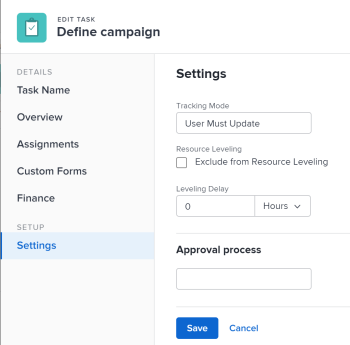

# Atualizar atraso de nivelamento da tarefa

Às vezes, pode haver conflitos entre agendamentos de tarefas em um projeto. Você pode nivelar recursos ou resolver conflitos de recursos reprogramando recursos e tarefas para que todas as tarefas possam ser concluídas dentro de um cronograma realista. Para obter informações sobre tarefas de nivelamento, consulte [Nivelar Recursos no Gráfico de Gantt](../../../manage-work/gantt-chart/use-the-gantt-chart/level-resources-in-gantt.md).

Como gerente de projeto ou designado da tarefa, você também pode adicionar um Atraso de Nivelamento em tarefas individuais para levar em conta quaisquer conflitos de recursos ou de programação. Em outras palavras, uma tarefa pode ser agendada com atraso para garantir que, quando o Adobe Workfront nivelar as tarefas, um agendamento mais realista supere os conflitos de recursos.

Adicionar um atraso de nivelamento a uma tarefa ajusta a Data de Conclusão Projetada da tarefa. Para obter informações sobre a data de conclusão projetada, consulte [Visão geral da data de conclusão projetada para projetos, tarefas e problemas](../../../manage-work/projects/planning-a-project/project-projected-completion-date.md).

## Requisitos de acesso

+++ Expanda para visualizar os requisitos de acesso da funcionalidade neste artigo.

<table style="table-layout:auto"> 
 <col> 
 <col> 
 <tbody> 
  <tr> 
   <td role="rowheader">Pacote do Adobe Workfront</td> 
   <td> 
Qualquer
 </td> 
  </tr> 
  <tr> 
   <td role="rowheader">Licença do Adobe Workfront</td> 
   <td> 
Padrão

   
Trabalho ou maior
 </td> 
  </tr> 
  <tr> 
   <td role="rowheader">Configurações de nível de acesso</td> 
   <td> 
Editar acesso a tarefas e projetos
</td> 
  </tr> 
  <tr> 
   <td role="rowheader">Permissões de objeto</td> 
   <td> 
Gerenciar permissões para Tarefas 
 
Contribuir com permissões ou mais altas para projetos
 </td> 
  </tr> 
 </tbody> 
</table>

Para obter mais informações, consulte [Requisitos de acesso na documentação do Workfront](/help/quicksilver/administration-and-setup/add-users/access-levels-and-object-permissions/access-level-requirements-in-documentation.md).

+++

<!--
Old:

<table style="table-layout:auto"> 
 <col> 
 <col> 
 <tbody> 
  <tr> 
   <td role="rowheader">Adobe Workfront plan*</td> 
   <td> 
Any
 </td> 
  </tr> 
  <tr> 
   <td role="rowheader">Adobe Workfront license*</td> 
   <td> 
Work or higher
 </td> 
  </tr> 
  <tr> 
   <td role="rowheader">Access level configurations*</td> 
   <td> 
Edit access to Tasks and Projects
 
Note: If you still don't have access, ask your Workfront administrator if they set additional restrictions in your access level. For information on how a Workfront administrator can modify your access level, see <a href="../../../administration-and-setup/add-users/configure-and-grant-access/create-modify-access-levels.md" class="MCXref xref">Create or modify custom access levels</a>.
 </td> 
  </tr> 
  <tr> 
   <td role="rowheader">Object permissions</td> 
   <td> 
Manage permissions to Tasks 
 
Contribute or higher permissions to Projects
 
For information on requesting additional access, see <a href="../../../workfront-basics/grant-and-request-access-to-objects/request-access.md" class="MCXref xref">Request access to objects </a>.
 </td> 
  </tr> 
 </tbody> 
</table>
-->

## Adicionar um Atraso de Nivelamento a uma tarefa

1. Vá para uma tarefa para a qual deseja adicionar um Atraso de Nivelamento.
1. Clique no **ícone Mais** à direita do nome da tarefa e em **Editar**.

1. Clique em **Configurações**.

   

1. Especifique o **Atraso no Nivelamento**, em horas, e escolha uma unidade de tempo.\
   Este é o momento em que o recurso será atrasado ao iniciar a tarefa devido a conflitos de recursos.

   Selecione entre as seguintes opções de unidades de tempo:

   * Minutes
   * Horas. Este é o padrão.
   * Days
   * Weeks
   * Months
   * Minutos corridos
   * Horas corridas
   * Dias corridos
   * Semanas corridas
   * Meses decorridos

   >[!TIP]
   >
   >Tempo decorrido é uma unidade de tempo da Duração de uma tarefa. É o tempo entre a Data de Início Planejada e a Data de Conclusão Planejada de uma tarefa que inclui feriados, finais de semana e folga. Em outras palavras, o tempo decorrido é a passagem de dias do calendário.

1. Clique em **Salvar**.

