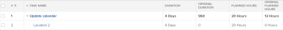

# Visão geral da duração original da tarefa e das horas planejadas originais

Como parte do planejamento de um projeto, você deve determinar os valores das Horas planejadas e da Duração (ou Duração planejada) de cada tarefa no projeto.

Para obter mais informações sobre as Horas planejadas das tarefas, consulte [visão geral das Horas planejadas](../../../manage-work/tasks/task-information/planned-hours.md).

Para obter mais informações sobre a Duração da tarefa, consulte [Visão Geral da Duração e do Tipo de Duração da Tarefa](../../../manage-work/tasks/taskdurtn/task-duration-and-duration-type.md).

Você pode ver esses valores na guia Detalhes da tarefa ou ao editar uma tarefa.

Se você criar uma exibição para uma lista de tarefas ou um relatório de tarefas, poderá também ver os campos Horas Planejadas Originais e Duração Original para as tarefas.

## Horas planejadas originalmente

As Horas Planejadas Originais de uma tarefa representam o número de Horas Planejadas que uma tarefa tinha originalmente antes de se tornar uma tarefa pai. Quando uma tarefa se torna uma tarefa pai, as Horas Planejadas das tarefas filho são acumuladas na tarefa pai para indicar as Horas Planejadas do pai.

Exibindo o campo Horas planejadas originais em um relatório ou lista de tarefas, você pode ver o número original de Horas planejadas antes que a tarefa herde o número de Horas planejadas de seus filhos.

>[!NOTE]
>
>Quando você cria uma tarefa, o número de Horas planejadas originais é zero. Se a tarefa se tornar uma tarefa pai, o valor desse campo será preenchido com o número das Horas planejadas da tarefa antes dela ser alterada para uma tarefa pai. Esse valor permanece nesse campo mesmo quando a tarefa é revertida para ser uma tarefa independente.

## Duração Original

A duração original de uma tarefa é a duração que uma tarefa tinha originalmente antes de se tornar uma tarefa pai, em minutos. Quando uma tarefa se torna pai, a Duração entre a Data Inicial Planejada do filho mais antigo e a Data de Conclusão Planejada do último filho é totalizada para a tarefa pai e se torna a Duração da tarefa pai. Isso substitui a Duração da tarefa original.

Ao exibir o campo Duração original em um relatório ou lista de tarefas, é possível visualizar o número original de dias para a Duração da tarefa antes que ela herde a Duração de seus filhos.

>[!NOTE]
>
>Quando você cria uma tarefa, a Duração original é zero. Se a tarefa se tornar uma tarefa pai, o valor desse campo será preenchido com a Duração da tarefa antes de ser alterado para um pai. Esse valor permanece nesse campo mesmo quando a tarefa é revertida para ser uma tarefa independente. Esse valor é exibido em minutos.

## Exemplo

Por exemplo, quando duas tarefas são independentes, sua Duração original e as Horas planejadas originais são zero.

Quando a primeira tarefa se torna pai da segunda tarefa, os campos Duração original e Horas planejadas originais são preenchidos com os valores para a Duração e Horas planejadas da tarefa antes que ela se torne pai. A Duração Original é exibida em minutos. A Duração e as Horas Planejadas do filho se tornam a Duração e as Horas Planejadas do pai.

Quando o pai se torna uma tarefa independente novamente, a Duração e as Horas planejadas são revertidas para os valores originais, enquanto a Duração original e as Horas planejadas originais permanecem preenchidas. Eles não revertem para zero.

