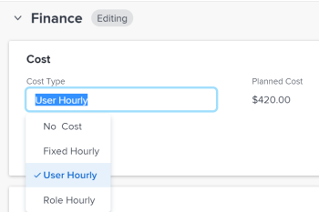

# Atualizar tipo de custo da tarefa

O Custo Planejado e Efetivo das tarefas e seus Custos de Mão-de-Obra são determinados pelo Tipo de Custo de cada tarefa.

Você pode configurar o Tipo de custo para tarefas individuais dentro do projeto. Cada tipo de custo afeta os valores de Custo Planejado e Custo Efetivo.

Para obter informações sobre como rastrear custos no Adobe Workfront, consulte [Rastrear custos](../../../manage-work/projects/project-finances/track-costs.md).

## Requisitos de acesso

+++ Expanda para visualizar os requisitos de acesso da funcionalidade neste artigo.

<table style="table-layout:auto"> 
 <col> 
 <col> 
 <tbody> 
  <tr> 
   <td role="rowheader">Pacote do Adobe Workfront</td> 
   <td> 
Qualquer
 </td> 
  </tr> 
  <tr> 
   <td role="rowheader">Licença do Adobe Workfront</td> 
   <td> 
Padrão

   
Plano
 </td> 
  </tr> 
  <tr> 
   <td role="rowheader">Configurações de nível de acesso</td> 
   <td> 
Editar acesso a Projetos, Tarefas e Dados Financeiros
</td> 
  </tr> 
  <tr> 
   <td role="rowheader">Permissões de objeto</td> 
   <td> 
Contribuir com permissões ou mais altas para um projeto
 
Gerenciar permissões para uma tarefa
 </td> 
  </tr> 
 </tbody> 
</table>

Para obter mais informações, consulte [Requisitos de acesso na documentação do Workfront](/help/quicksilver/administration-and-setup/add-users/access-levels-and-object-permissions/access-level-requirements-in-documentation.md).

+++

<!--
Old:

<table style="table-layout:auto"> 
 <col> 
 <col> 
 <tbody> 
  <tr> 
   <td role="rowheader">Adobe Workfront plan*</td> 
   <td> 
Any
 </td> 
  </tr> 
  <tr> 
   <td role="rowheader">Adobe Workfront license*</td> 
   <td> 
Plan 
 </td> 
  </tr> 
  <tr> 
   <td role="rowheader">Access level configurations*</td> 
   <td> 
Edit access to Projects, Tasks, and Financial Data
 
Note: If you still don't have access, ask your Workfront administrator if they set additional restrictions in your access level. For information on how a Workfront administrator can modify your access level, see <a href="../../../administration-and-setup/add-users/configure-and-grant-access/create-modify-access-levels.md" class="MCXref xref">Create or modify custom access levels</a>.
 </td> 
  </tr> 
  <tr> 
   <td role="rowheader">Object permissions</td> 
   <td> 
Contribute or higher permissions to a project
 
Manage permissions to a task
 
For information on requesting additional access, see <a href="../../../workfront-basics/grant-and-request-access-to-objects/request-access.md" class="MCXref xref">Request access to objects </a>.
 </td> 
  </tr> 
 </tbody> 
</table>
-->

## Configurar o Tipo de Custo de uma tarefa individual

1. Vá para a tarefa em que deseja configurar o Tipo de Custo.
1. Clique em **Detalhes da tarefa** no painel esquerdo e expanda a área **Finanças**.
1. Clique duas vezes em **Tipo de Custo** e selecione o tipo de custo que deseja aplicar à tarefa.

   

   Selecione entre as seguintes opções:

   * Sem Custo
   * Horas por Valor de Hora Fixo
   * Horas por Valor da Hora do Recurso
   * Horas por Valor da Hora do Perfil

   Para obter mais informações sobre cada tipo de custo de tarefa, consulte [Rastrear custos](../../../manage-work/projects/project-finances/track-costs.md).

1. Clique em **Salvar** **Alterações** **.**
