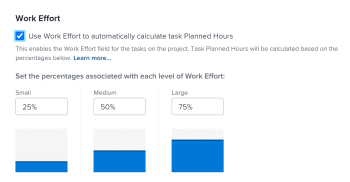

# Visão geral do esforço de trabalho

<!--Audited: 01/2024-->

<!--
(NOTE: Linked to the UI >> in the Project/ Template edit box > Tasks area> Learn more)
-->

Como gerente de projeto, você pode decidir como deseja estimar a quantidade de trabalho necessário para que as tarefas sejam concluídas em um projeto. Estime a quantidade de trabalho necessário para concluir tarefas usando um dos seguintes indicadores:

<table style="table-layout:auto"> 
 <col> 
 <col> 
 <tbody> 
  <tr> 
   <td role="rowheader">Horas planejadas</td> 
   <td> <p> Uma entrada numérica manual ou um cálculo de Adobe Workfront que exibe o número de horas que seriam necessárias para que os recursos atribuídos a uma tarefa fossem concluídos. </p> <p>Considere o seguinte sobre as Horas planejadas: </p> 
    <ul> 
     <li>Este é o método padrão. </li> 
     <li>Você pode atualizar manualmente as Horas Planejadas apenas para tarefas com um Tipo de Duração de Atribuição Calculada ou Simples. </li> 
    </ul> <p>Para obter informações sobre o Trabalho necessário, consulte <a href="../../../manage-work/tasks/task-information/planned-hours.md" class="MCXref xref">Visão geral das Horas planejadas</a>. </p> </td> 
  </tr> 
  <tr> 
   <td role="rowheader">Esforço do trabalho </td> 
   <td> <p>Um rótulo manual que define se um usuário precisa de uma pequena, média ou grande quantidade de esforço diário para concluir uma tarefa. <!--
      <MadCap:conditionalText data-mc-conditions="QuicksilverOrClassic.Draft mode">
       The level of effort is estimated to be a percentage of the daily amount of working time. (NOTE: keep this drafted. Vazgen said it's not needed, but waiting for feedback from users)
      </MadCap:conditionalText>
     --> </p> <p>Considere o seguinte sobre o Esforço de trabalho:</p> 
    <ul> 
     <li>Este campo está disponível somente para tarefas com um Tipo de Duração Simples. </li> 
     <li>Você pode habilitar o uso desse rótulo e definir a porcentagem de tempo de trabalho associada a ele no nível do projeto. </li> 
    </ul> </td> 
  </tr> 
 </tbody> 
</table>

Este artigo descreve o que é o Esforço de trabalho e como você deve usá-lo ao estimar a quantidade de trabalho para suas tarefas.

>[!NOTE]
>
>As horas planejadas e o esforço de trabalho influenciam-se mutuamente. Atualizar as Horas Planejadas pode atualizar o Esforço de trabalho e atualizar o Esforço de trabalho pode atualizar as Horas Planejadas da tarefa.

## Requisitos de acesso

Você deve ter o seguinte acesso para executar as etapas deste artigo:

<table style="table-layout:auto"> 
 <col> 
 <col> 
 <tbody> 
  <tr> 
   <td role="rowheader">plano do Adobe Workfront</td> 
   <td> <p>Qualquer</p> </td> 
  </tr> 
  <tr> 
   <td role="rowheader">Licença da Adobe Workfront*</td> 
   <td> <p>Atual: Plano </p>
   Ou
   <p>Novo: Padrão </p>
    </td> 
  </tr> 
  <tr> 
   <td role="rowheader">Configuração do nível de acesso</td> 
   <td> <p>Editar acesso a projetos e tarefas</p> </td> 
  </tr> 
  <tr> 
   <td role="rowheader">Permissões de objeto</td> 
   <td> <p>Gerenciar permissões para um projeto e suas tarefas</p>  </td> 
  </tr> 
 </tbody> 
</table>

&#42;Para descobrir seu plano, tipo de licença ou acesso, entre em contato com o administrador do Workfront. Para obter mais informações, consulte [Requisitos de acesso na documentação do Workfront](/help/quicksilver/administration-and-setup/add-users/access-levels-and-object-permissions/access-level-requirements-in-documentation.md).

## Considerações sobre o uso do esforço de trabalho

* Quando as tarefas do projeto tiverem 0 Horas Planejadas e você ativar a configuração Usar esforço de trabalho para calcular automaticamente as Horas Planejadas da tarefa no projeto, o nível padrão do Esforço de trabalho associado a elas será Médio. As Horas planejadas são atualizadas automaticamente para tarefas do Tipo duração simples. Para obter mais informações, consulte a seção  [Níveis de esforço de trabalho](#levels-of-work-effort) neste artigo.
* Quando as tarefas do projeto têm Horas Planejadas maiores que 0 e você ativa a configuração Usar esforço de trabalho para calcular automaticamente as Horas Planejadas da tarefa no projeto, o nível do esforço de trabalho é atualizado de acordo com a quantidade de Horas Planejadas sem alterar a quantidade de Horas Planejadas para tarefas do Tipo Duração Simples. Para obter mais informações, consulte a seção [Como o Workfront calcula o esforço de trabalho com base nas horas planejadas](#how-workfront-calculates-work-effort-based-on-planned-hours) neste artigo.
* Quando as tarefas do projeto tiverem 0 Horas Planejadas e você ativar o Esforço de trabalho para calcular automaticamente a configuração das Horas Planejadas da tarefa no projeto e, em seguida, atualizar o nível do Esforço de trabalho de Médio para Pequeno ou Grande, as Horas Planejadas também serão atualizadas. Para obter mais informações, consulte a seção [Como o Workfront calcula as horas planejadas com base no esforço de trabalho](#how-workfront-calculates-planned-hours-based-on-work-effort) neste artigo.
* Quando você edita tarefas em linha e modifica o campo Horas planejadas e Esforço de trabalho para tarefa ao mesmo tempo, as Horas planejadas serão atualizadas com o valor especificado, enquanto o valor do Esforço de trabalho é calculado com base nas Horas planejadas atualizadas.
* Quando você atualiza o valor do Esforço de trabalho de uma tarefa, a Duração não é mais calculada automaticamente com base nas Horas planejadas. Para obter mais informações sobre como a Duração é calculada para tarefas de Duração simples, consulte [Visão geral do tipo de duração: simples](../../../manage-work/tasks/taskdurtn/simple-duration-type.md).
* Quando você altera o Tipo de Duração de uma tarefa de Simples para qualquer outro tipo, o campo Esforço de trabalho fica oculto na tarefa. As horas planejadas permanecem inalteradas.
* Não é possível atualizar o nível de Esforço de trabalho em uma tarefa-pai. O nível de Esforço de trabalho de uma tarefa-pai é calculado automaticamente com base no número de Horas Planejadas das tarefas, que é uma totalização de todas as tarefas-filho. Para obter informações sobre tarefas pai, consulte [Criar subtarefas](../../../manage-work/tasks/create-tasks/create-subtasks.md).

## Ativar usando o Esforço de trabalho em vez das horas planejadas

1. Vá para um projeto e clique no botão **Mais** menu e, em seguida, clique em **Editar**.
1. Clique em **Configurações da tarefa** e selecione a opção **Use o esforço do trabalho para calcular automaticamente as horas planejadas das tarefas**. Essa opção é desmarcada por padrão.

   

   Para obter mais informações sobre como ativar o uso do Esforço de trabalho em um projeto, consulte a seção &quot;Configurações de tarefas&quot; no [Editar projetos](../../../manage-work/projects/manage-projects/edit-projects.md) artigo.

1. Clique em **Tarefas** no painel esquerdo, clique no nome de uma tarefa para acessá-la.
1. Clique em **Mais** menu e, em seguida, clique em **Editar**. Certifique-se de que a tarefa tenha um Tipo de duração simples.

   >[!TIP]
   >
   >Também é possível atualizar o Esforço de trabalho de uma tarefa na seção Detalhes da tarefa.

1. No **Visão geral** clique no menu suspenso Esforço de trabalho para corrigir a quantidade de esforço necessário para concluir a tarefa.

   

   Para obter mais informações sobre como atualizar o campo Esforço de trabalho em uma tarefa, consulte os seguintes artigos:

   * A seção &quot;Visão geral&quot; no [Editar tarefas](../../../manage-work/tasks/manage-tasks/edit-tasks.md) artigo
   * [Gerenciar informações da tarefa na área Visão geral de detalhes da tarefa](../../../manage-work/tasks/manage-tasks/task-information-in-overview.md)

## Níveis de esforço de trabalho {#levels-of-work-effort}

Como gerente de projeto, você pode identificar três níveis de Esforço de trabalho para seus projetos. Cada nível de esforço equivale a uma porcentagem de tempo diário de que os usuários precisam para concluir a tarefa.

Ao configurar o nível de Esforço de trabalho, você deve se perguntar: &quot;Quanto tempo um usuário atribuído a essa tarefa deve gastar diariamente para fazer isso a tempo?&quot;

A tabela a seguir ilustra os possíveis níveis de Esforço de trabalho e suas porcentagens correspondentes padrão. Como gerente de projeto, você pode atualizar as porcentagens para atender às necessidades da organização. Faça isso ao editar um projeto. Para obter informações sobre a edição de projetos, consulte [Editar projetos](../../../manage-work/projects/manage-projects/edit-projects.md).

Como administrador do Workfront, você define as horas típicas por dia de trabalho na área Preferências do projeto da Configuração. Essa é a quantidade diária de tempo considerada como tempo de trabalho. Para obter informações sobre como configurar as Preferências do projeto para sua instância do Workfront, consulte [Configurar preferências de projeto em todo o sistema](../../../administration-and-setup/set-up-workfront/configure-system-defaults/set-project-preferences.md).

>[!NOTE]
>
>Nos exemplos abaixo, pressupomos que o administrador do Workfront definiu a quantidade de horas Típicas por dia de trabalho para 8 horas.

<table style="table-layout:auto"> 
 <col> 
 <col> 
 <tbody> 
  <tr> 
   <td>Nível do esforço de trabalho</td> 
   <td>Valores percentuais</td> 
  </tr> 
  <tr> 
   <td>Pequena </td> 
   <td>Um pequeno nível de esforço para concluir uma tarefa é definido como 25% das horas típicas por dia de trabalho. Isso significa que uma tarefa atribuída a esse nível de Esforço de trabalho deve levar até 2 horas por dia para ser concluída em um dia. <code>(0.25*8=2)</code></td> 
  </tr> 
  <tr> 
   <td>Média</td> 
   <td> <p>Um nível médio de esforço para concluir uma tarefa é definido como 50% das horas Típicas por dia de trabalho. Isso significa que uma tarefa atribuída a esse nível de Esforço de trabalho deve levar mais de 2 e menos de 6 horas para ser concluída em um dia. <code>(0.50*80=4)</code> </p> <p>Nota: Quando a configuração Usar esforço do trabalho para calcular automaticamente as Horas planejadas da tarefa estiver ativada no projeto, essa será a configuração padrão para uma tarefa, se a tarefa tiver 0 Horas planejadas antes dessa configuração ter sido ativada. Isso faz com que as Horas planejadas da tarefa sejam atualizadas para 4 horas. </p> </td> 
  </tr> 
  <tr> 
   <td>Grande</td> 
   <td>Um grande nível de esforço para concluir uma tarefa é definido como 75% das horas Típicas por dia de trabalho. Isso significa que uma tarefa atribuída a esse nível de Esforço de trabalho deve levar 6 horas ou mais para ser concluída em um dia. <code>(0.75*8=6)</code></td> 
  </tr> 
 </tbody> 
</table>

## Como o Workfront calcula as horas planejadas com base no esforço de trabalho {#how-workfront-calculates-planned-hours-based-on-work-effort}

Quando você ativa a opção Usar esforço do trabalho para calcular automaticamente as Horas Planejadas de uma tarefa em um projeto, o Workfront calcula o número de Horas Planejadas para uma tarefa com um Tipo de Duração Simples usando a seguinte fórmula:

```
Task Planned Hours = Number of days in task Duration * Work Effort percentage * Typical hours per work day
```

Por exemplo, uma tarefa com Duração de 3 dias e Esforço de trabalho Médio tem 12 Horas planejadas:

```
Planned Hours = 3*4=12
```

em que o valor Típico de horas por dia de trabalho é de 8 horas.

>[!TIP]
>
>Quando uma tarefa é atribuída a vários recursos, as Horas planejadas são distribuídas uniformemente para cada recurso para cada dia da duração da tarefa.

## Como o Workfront calcula o esforço de trabalho com base nas horas planejadas {#how-workfront-calculates-work-effort-based-on-planned-hours}

Quando você ativa o Esforço de trabalho para calcular automaticamente a configuração de Horas planejadas de uma tarefa em um projeto e já tem Horas planejadas na tarefa ou edita o número de Horas planejadas na tarefa, o Workfront atualiza o valor do Esforço de trabalho.

O Workfront usa a seguinte fórmula para atualizar o nível de Esforço de trabalho de acordo com as Horas planejadas:

```
Work Effort level = Task Planned Hours / Duration / Typical hours per work day
```

Por exemplo, se você tiver uma tarefa com uma Duração de 2 dias e atualizar as Horas planejadas de 8 para 20 horas, o Esforço de trabalho para a tarefa será atualizado de Médio para Grande:

```
Work Effort level = 20 / 2 / 8 = 125 % = Large
```

## Localizar Esforço de trabalho para tarefas e projetos

* [Esforço de trabalho para projetos](#work-effort-for-projects)
* [Esforço de trabalho para tarefas](#work-effort-for-tasks)

### Esforço de trabalho para projetos {#work-effort-for-projects}

Você pode localizar a seção Esforço de trabalho em um projeto na seguinte área:

* A área Configurações da tarefa na caixa Editar projeto

### Esforço de trabalho para tarefas {#work-effort-for-tasks}

Você pode localizar o campo Esforço de trabalho de uma tarefa nas seguintes áreas:

* A área Visão Geral na caixa Editar Tarefa
* A área Visão Geral da seção Detalhes da Tarefa, na área Horário de Trabalho
* Uma lista de tarefas ou um relatório
