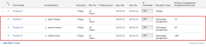

# Visão geral do tipo de duração: atribuição calculada

<!-- Audited: 5/2025 -->

A Atribuição calculada é um Tipo de duração que pode ser definido para uma tarefa no Adobe Workfront. Para obter informações gerais sobre os Tipos de Duração no Workfront, consulte [Visão Geral da Duração e do Tipo de Duração da Tarefa](../../../manage-work/tasks/taskdurtn/task-duration-and-duration-type.md).

## Visão Geral do Tipo de Duração da Atribuição Calculada

<!--
<p data-mc-conditions="QuicksilverOrClassic.Draft mode">(NOTE: This Hub issue has a powerpoint that highlights information that is useful to users when using Calculated Assignment duration type. I don't think we can use the powerpoint, because it's old. I also don't know if the things they discuss are still relevant, since the PP is from 2015. I've closed the issue, but I'm putting a link here just in case the info is useful. https://hub.workfront.com/issue/5a9dd7d5007d02a8966014557c23cc89/updates)</p>
-->

* Quando você usa um Tipo de Duração de Atribuição Calculada, deve especificar uma Duração e um número de Horas Planejadas para a tarefa. O Workfront divide a quantidade de Horas Planejadas pela quantidade de horas na Duração e, em seguida, pelo número de recursos atribuídos à tarefa para calcular a porcentagem de alocação (calcula a atribuição) para cada recurso. Cada recurso terá igualmente o mesmo valor para sua porcentagem de alocação. Nesse caso, não é possível modificar os valores de alocação para cada recurso.
* O Workfront ou um administrador de grupo pode definir o Tipo de duração padrão do sistema ou grupo como Atribuição calculada. Nesse caso, todas as novas tarefas serão criadas com esse Tipo de Duração. Para obter informações sobre como alterar as preferências de tarefas e problemas como parte das preferências de projetos no nível do sistema ou do grupo, consulte [Configurar preferências de tarefas e problemas em todo o sistema](../../../administration-and-setup/set-up-workfront/configure-system-defaults/set-task-issue-preferences.md).

  Nesse caso, a tarefa tem um padrão de Duração de um dia e um padrão de 0 horas de Horas planejadas. A menos que o gerente de projeto defina uma Duração mais precisa e preencha o campo Horas planejadas com uma estimativa realista, os recursos parecerão subalocados.

A Atribuição Calculada é o Tipo de Duração preferido nas seguintes situações:

* Quando as atribuições têm uma janela de atividade, mas não usam toda a Duração alocada para concluir o trabalho. Por exemplo, você é designado a entregar um relatório ao seu supervisor até o final da semana. Você tem uma duração de cinco dias, mas o rascunho do documento levará apenas 10 horas.
* Quando um único recurso é atribuído a uma tarefa porque o gerente de projeto pode estimar a Duração planejada e a quantidade planejada de esforço independente um do outro.

  Você pode usar o Tipo de Duração do Trabalho Calculado para o mesmo resultado, mas o gerente de projeto deve inserir uma alocação de porcentagem para o recurso, a fim de afetar o valor calculado para as Horas Planejadas. Isso torna o planejamento de projetos mais difícil e demorado.

A porcentagem de alocação para cada recurso é calculada da seguinte maneira:

```
Planned Hours / Duration / Number of Resources = Allocation Percentage for each resource
```

Por exemplo, no cenário descrito abaixo, cada tarefa tem uma Duração de 3 dias. O gerente de projeto insere manualmente a Duração (3 dias ou 24 horas) e as Horas planejadas e, como resultado, a porcentagem de alocação (ou porcentagem de atribuição) é calculada:



## Alterar o Tipo de Duração de uma tarefa para Atribuição Calculada

Para obter informações sobre como alterar o Tipo de Duração de uma tarefa, consulte [Atualizar o Tipo de Duração de uma tarefa](../../../manage-work/tasks/taskdurtn/update-duration-type-of-task.md).

<!--
<p data-mc-conditions="QuicksilverOrClassic.Draft mode">(NOTE: replaced with new article linked above)</p>
-->

<!--
<ol data-mc-conditions="QuicksilverOrClassic.Draft mode">
<li value="1">Go to a task for which you want to change the Duration Type.</li>
<li value="2"> <p data-mc-conditions="QuicksilverOrClassic.Quicksilver">Click <strong>Task Details</strong> in the left panel, then in the Overview area double click <strong>Duration Type</strong>. </p> </li>
<li value="3">Select <strong>Calculated Assignment</strong> from the drop-down menu.</li>
<li value="4">Click <strong>Save</strong> <strong>Changes</strong>.</li>
</ol>
-->
