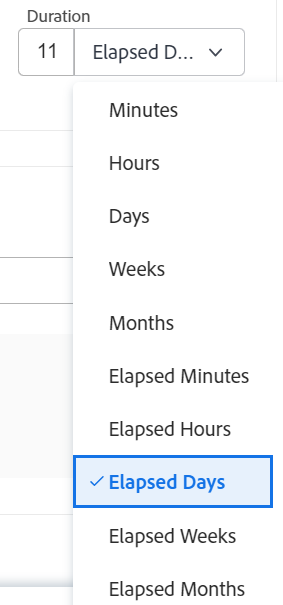

# Visão Geral da Duração da Tarefa e do Tipo de Duração

<!-- Audited: 12/2023 -->

<!--The highlighted information on this page refers to functionality not yet generally available. It is available only in the Preview environment for all customers. After the monthly releases to Production, the same features are also available in the Production environment for customers who enabled fast releases.    

For information about fast releases, see [Enable or disable fast releases for your organization](/help/quicksilver/administration-and-setup/set-up-workfront/configure-system-defaults/enable-fast-release-process.md). -->

A Duração da tarefa é a diferença entre a Data de conclusão planejada e a Data inicial planejada da tarefa. A Duração indica o período disponível para a tarefa ser concluída.

O Tipo de Duração de uma tarefa identifica a relação entre o número de recursos atribuídos a uma tarefa, o esforço total e a Duração total da tarefa.

## Visão geral da duração da tarefa

Se o Início Efetivo e as Datas de Término Efetivo da tarefa estiverem fora do cronograma do projeto, do responsável principal ou do Cronograma Padrão, a Duração da tarefa será zero.

>[!BEGINSHADEBOX]

**EXEMPLO**
Se você tiver uma programação que comece às 9h e termine às 12h e uma tarefa que esteja programada para iniciar às 14h e terminar às 16h, a Duração da tarefa será zero.

>[!ENDSHADEBOX]

Veja a seguir dois cenários que existem ao calcular a duração no Adobe Workfront:

* Se a tarefa for atribuída a um usuário:

   1. O Workfront considera o agendamento do projeto ou o do usuário atribuído à tarefa.

      O administrador do Workfront ou do grupo determina qual agendamento o Workfront usa quando uma tarefa é atribuída a um usuário. Para obter informações, consulte [Configurar preferências de projeto do sistema](../../../administration-and-setup/set-up-workfront/configure-system-defaults/set-project-preferences.md).

   1. Se o usuário ou o projeto não tiver um agendamento, o Workfront usará o Agendamento padrão do sistema.

      As etapas são semelhantes ao primeiro cenário depois de entender qual agendamento o Workfront usa para calcular a Duração.

* Se a tarefa for atribuída a vários usuários:

   1. A Workfront considera a programação do projeto ou a do responsável principal.

      O administrador do Workfront ou do grupo determina qual agendamento o Workfront usa quando uma tarefa é atribuída a vários usuários. Para obter informações, consulte [Configurar preferências de projeto do sistema](../../../administration-and-setup/set-up-workfront/configure-system-defaults/set-project-preferences.md).

   1. Se o responsável principal ou o projeto não tiver um agendamento, o Workfront usará o Agendamento padrão do sistema.

  As etapas são semelhantes ao primeiro cenário depois de entender qual agendamento o Workfront usa para calcular a Duração.

>[!NOTE]
>
>Ao considerar o tempo de folga do responsável principal em um projeto, as datas planejadas da tarefa podem ser ajustadas, mas a Duração da tarefa permanece a mesma. Para obter informações sobre como considerar o tempo de folga do Atribuído principal ao planejar um projeto, consulte [Configurar preferências de projeto do sistema](../../../administration-and-setup/set-up-workfront/configure-system-defaults/set-project-preferences.md).

## Unidades de tempo para a Duração da Tarefa

Você pode indicar a Duração da tarefa tanto no tempo normal quanto no tempo decorrido entre as Datas de Início Planejado e de Conclusão Planejada.

Ao atualizar a Duração das tarefas em uma lista, você pode usar as seguintes abreviações para indicar unidades de tempo no Workfront:

| Unidade de Tempo | Abreviação |
|---|---|
| Minutos | M |
| Horas | H |
| Dias. Este é o padrão. | E |
| Semanas | S |
| Meses | T, MO |
| Minutos corridos | EM |
| Horas corridas | EH |
| Dias corridos | ED |
| Semanas corridas | NOVO |
| Meses decorridos | ET |

{style="table-layout:auto"}

>[!BEGINSHADEBOX]

**EXEMPLO**

Se você quiser indicar que a duração de uma tarefa é de 3 dias decorridos, digite &quot;3 ED&quot; no campo Duração em uma lista de tarefas .  Você também pode selecionar a opção preferida para a Unidade de tempo de duração no menu suspenso disponível ao editar uma tarefa ou na seção Detalhes da tarefa. Para obter informações sobre como editar tarefas, consulte [Editar tarefas](../../../manage-work/tasks/manage-tasks/edit-tasks.md).

>[!ENDSHADEBOX]

<!--

(NOTE: stays QS only forever; for the pictures below: make the first one classic at preview time and the second one stays QS always. The second one is yellow >> take out at 21.2 production!!)

-->

Considere o seguinte ao indicar a Duração de uma tarefa:

* Tempo decorrido é uma unidade de tempo da Duração de uma tarefa. É o tempo entre a Data de Início Planejada e a Data de Conclusão Planejada de uma tarefa que inclui feriados, finais de semana e folga. Em outras palavras, o tempo decorrido é a passagem de dias do calendário.
* Dias representa os dias úteis definidos no sistema e ele é configurável na área Configuração. Na maioria dos casos, um dia consiste em 8 horas.
* O tempo normal (dias ou dias úteis) leva em conta feriados, finais de semana e folga e os exclui da Duração da tarefa.
* Quando você indica a Duração de uma tarefa em semanas, o Workfront calcula a Duração em dias e horas com base nas configurações de Dias de trabalho típicos por semana e Horas típicas por dia de trabalho definidas pelo administrador do Workfront na área Preferências do projeto da Configuração.
* O Workfront usa a duração padrão de 4 semanas para um mês ao calcular a Duração em meses.

## Visão geral do Tipo de duração da tarefa

O gerenciamento do Tipo de Duração de uma tarefa permite definir atribuições de recursos consistentes com base nas necessidades da tarefa.

O Tipo de duração ajuda a responder às seguintes perguntas:

* Quão ocupados vamos estar?
* Qual é o tamanho do trabalho?
* Quanto tempo vai demorar?

## Definir Tipos de Duração

<table border="1" cellspacing="15" cellpadding="1"> 
 <col> 
 <col> 
 <col> 
 <thead> 
  <tr> 
   <th scope="row">
<strong>Tipo de Duração</strong>
</th> 
   <th scope="col"> 
<strong>Função</strong> 
 </th> 
   <th scope="col"> 
<strong>Como Os Recursos O Afetam</strong> 
 </th> 
  </tr> 
 </thead> 
 <tbody> 
  <tr> 
   <th scope="col"> 
<strong>Atribuição calculada</strong> 
 </th> 
   <td scope="col"> 
Calcula a porcentagem de alocação para cada destinatário em uma tarefa. 
 
Ao escolher esse Tipo de duração, você pode inserir Duração individual e Horas planejadas para a tarefa. O Workfront divide as Horas planejadas pelo número de horas dentro da Duração da tarefa e, em seguida, pelo número de recursos atribuídos à tarefa para calcular a alocação para cada destinatário.
 
Para obter informações mais detalhadas, consulte <a href="../../../manage-work/tasks/taskdurtn/calculated-assignment.md" class="MCXref xref">Visão geral do Tipo de Duração: Atribuição Calculada</a>.
 </td> 
   <td scope="col">A duração e as horas planejadas não são alteradas ao adicionar ou remover atribuídos à tarefa. </td> 
  </tr> 
  <tr> 
   <th scope="col"> 
<strong>Trabalho Calculado</strong> 
 </th> 
   <td scope="col"> 
Determina as horas planejadas (quantidade de esforço) necessárias para a tarefa ser concluída.
 
Normalmente usado quando os recursos atribuídos à tarefa são alocados para toda a duração da tarefa.
 
Ao escolher esse Tipo de duração, você tem a capacidade de inserir uma Duração individual para a tarefa. O Workfront calcula as Horas planejadas para a tarefa multiplicando o número de dias na Duração pelo número de horas de trabalho no cronograma e pelo número de atribuídos à tarefa. 
 
Você pode alterar manualmente a porcentagem de alocação de cada destinatário para a tarefa, o que reduzirá a quantidade de Horas planejadas.
 
Para obter informações mais detalhadas, consulte <a href="../../../manage-work/tasks/taskdurtn/calculated-work.md" class="MCXref xref">Visão geral do Tipo de Duração: Trabalho Calculado</a>.
 </td> 
   <td scope="col"> 
As Horas planejadas aumentam quando os atribuídos são adicionados à tarefa. 
 
As horas planejadas diminuem quando os atribuídos são removidos da tarefa.
 </td> 
  </tr> 
  <tr> 
   <th scope="col"> 
<strong>Controlado pelo empenho</strong>
 </th> 
   <td scope="col"> 
Determina as horas planejadas com base no número de recursos.
 
Ao escolher esse Tipo de duração, você tem a capacidade de inserir uma Duração individual para a tarefa. O Workfront calcula as Horas Planejadas para a tarefa multiplicando o número de dias na Duração pelo número de horas de trabalho no cronograma e dividindo esse número pelo número de atribuídos à tarefa. 
 
Você pode alterar manualmente a porcentagem de alocação de cada destinatário para a tarefa, mas o número de Horas planejadas permanece o mesmo.
 
Para obter informações mais detalhadas, consulte <a href="../../../manage-work/tasks/taskdurtn/effort-driven.md" class="MCXref xref">Visão geral do Tipo de Duração: Orientado pelo Esforço</a>.
 </td> 
   <td scope="col"> 
As horas planejadas aumentam quando os atribuídos são removidos da tarefa.
 
As horas planejadas diminuem quando os atribuídos são adicionados à tarefa. 
 
A duração não é alterada, independentemente das alterações no número de responsáveis ou em seu agendamento. 
 
A duração é igual às Horas planejadas. A Duração Planejada é igual às Horas Planejadas divididas pelo número de atribuídos.
 </td> 
  </tr> 
  <tr> 
   <th scope="col"> 
<strong>Simples</strong> 
 </th> 
   <td scope="col"> 
Determina as horas planejadas e a duração (que são as mesmas, para este tipo de duração) com base no número de horas para as quais cada destinatário é alocado. 
 
O Workfront calcula as Horas planejadas somando as horas alocadas planejadas para cada destinatário. 
 
Você pode alterar manualmente a quantidade de horas para a qual cada destinatário está alocado, e o número de Horas planejadas e a quantidade de Duração são alterados de acordo. Se você escolher um número total de horas alocadas para todos os designados, esse número será dividido igualmente entre cada designado.
 
Para obter informações mais detalhadas, consulte <a href="../../../manage-work/tasks/taskdurtn/simple-duration-type.md" class="MCXref xref">Visão geral do Tipo de Duração: Simples</a>.
 </td> 
   <td scope="col"> 
As horas são distribuídas uniformemente entre os designados se você escolher um número total de horas alocadas. No entanto, como gerente de projeto, você pode ajustar manualmente as horas para cada destinatário. 
 
Você pode editar as Horas planejadas e a Duração de uma tarefa com um Tipo de duração simples em linha ou no nível da tarefa. 
 
Se uma Equipe Ágil for atribuída a uma tarefa, o Tipo de duração será automaticamente definido como Simples e não poderá ser alterado. A duração da tarefa para uma Equipe Ágil deve ser maior que 0 minutos.
 </td> 
  </tr> 
 </tbody> 
</table>

## O tipo de duração das novas tarefas

O Tipo de Duração de uma nova tarefa corresponde ao Tipo de Duração configurado em seu sistema. O tipo de duração padrão é Atribuição calculada. O administrador do Workfront ou um administrador de grupo pode atualizar o Tipo de duração padrão para o seu sistema ou para o grupo associado ao projeto. Para obter informações, consulte [Configurar preferências de tarefas e problemas do sistema](../../../administration-and-setup/set-up-workfront/configure-system-defaults/set-task-issue-preferences.md).

## A duração original de uma tarefa pai

A duração original de uma tarefa é a duração que uma tarefa tinha originalmente antes de se tornar uma tarefa pai, em minutos.

Quando uma tarefa se torna pai, a Duração entre a Data Inicial Planejada do filho mais antigo e a Data de Conclusão Planejada do último filho é totalizada para a tarefa pai e se torna a Duração da tarefa pai. Isso substitui a Duração da tarefa original.

Quando os filhos usam a unidade Duração de Dias Decorridos e seus pais usam a unidade Duração de Dias, pode haver discrepâncias na maneira como o Workfront calcula a Duração da tarefa pai.

Considere o seguinte:

* A unidade de duração Dias Decorridos representa dias do calendário, que sempre consiste em 24 horas por dia.
* A unidade de duração Dias representa o dia útil definido no sistema e é configurável. Na maioria dos casos, consiste em 8 horas por dia.
* A fórmula para calcular a duração da tarefa pai é a seguinte:

  `Parent task duration = Planned Completion Date of the child task that is planned to end the latest - Planned Start Date of the child task that starts the earliest`

* Ao calcular a duração da tarefa pai, o sistema calcula primeiro a duração pela fórmula acima e, em seguida, aplica o agendamento.

Para obter mais informações, consulte [Visão geral da duração original da tarefa e das horas planejadas originais](/help/quicksilver/manage-work/tasks/task-information/task-original-duration-and-original-planned-hours.md).

## Alterar o tipo de duração de uma tarefa

Para obter informações sobre como alterar o Tipo de Duração de uma tarefa, consulte [Atualizar o Tipo de Duração de uma tarefa](../../../manage-work/tasks/taskdurtn/update-duration-type-of-task.md).
