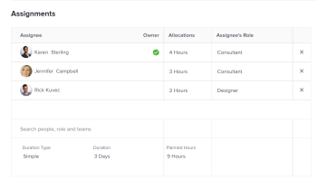

# Atualizar as horas planejadas e a duração de uma tarefa com um tipo de duração simples

Por padrão, o Adobe Workfront calcula a Duração de uma tarefa com um Tipo de duração simples com base na quantidade de Horas planejadas. No entanto, você também pode editar manualmente a quantidade de Horas planejadas e a duração de uma tarefa de Duração simples em determinadas áreas do Workfront.

Você pode editar as Horas planejadas e a Duração de uma tarefa com um Tipo de duração simples em linha ou no nível da tarefa na área Atribuições.

Para obter mais informações sobre como editar informações em linha, consulte [Itens de edição em linha em uma lista no Adobe Workfront](../../../workfront-basics/navigate-workfront/use-lists/inline-edit-objects.md).

Este artigo descreve como você pode atualizar as Horas planejadas e a Duração de uma tarefa com um Tipo de Duração simples no nível da tarefa, na área Atribuições.

## Requisitos de acesso

+++ Expanda para visualizar os requisitos de acesso da funcionalidade neste artigo.

<table style="table-layout:auto"> 
 <col> 
 <col> 
 <tbody> 
  <tr> 
   <td role="rowheader">Pacote do Adobe Workfront</td> 
   <td> 
Qualquer
 </td> 
  </tr> 
  <tr> 
   <td role="rowheader">Licença do Adobe Workfront</td> 
   <td>
Padrão ou superior
 
   
Trabalho ou maior
 </td> 
  </tr> 
  <tr> 
   <td role="rowheader">Configurações de nível de acesso</td> 
   <td> 
Acesso de visualização ou superior aos Projetos
 
Editar acesso a tarefas
 </td> 
  </tr> 
  <tr> 
   <td role="rowheader">Permissões de objeto</td> 
   <td> 
Gerenciar acesso à tarefa 
</td> 
  </tr> 
 </tbody> 
</table>

Para obter mais informações, consulte [Requisitos de acesso na documentação do Workfront](/help/quicksilver/administration-and-setup/add-users/access-levels-and-object-permissions/access-level-requirements-in-documentation.md).

+++

<!--
Old:

<table style="table-layout:auto"> 
 <col> 
 <col> 
 <tbody> 
  <tr> 
   <td role="rowheader">Adobe Workfront plan*</td> 
   <td> 
Any
 </td> 
  </tr> 
  <tr> 
   <td role="rowheader">Adobe Workfront license*</td> 
   <td> 
Work or higher
 </td> 
  </tr> 
  <tr> 
   <td role="rowheader">Access level configurations*</td> 
   <td> 
Edit access to Tasks
 
Note: If you still don't have access, ask your Workfront administrator if they set additional restrictions in your access level. For information on how a Workfront administrator can modify your access level, see <a href="../../../administration-and-setup/add-users/configure-and-grant-access/create-modify-access-levels.md" class="MCXref xref">Create or modify custom access levels</a>.
 </td> 
  </tr> 
  <tr> 
   <td role="rowheader">Object permissions</td> 
   <td> 
Manage permissions to the task
 
For information on requesting additional access, see <a href="../../../workfront-basics/grant-and-request-access-to-objects/request-access.md" class="MCXref xref">Request access to objects </a>.
 </td> 
  </tr> 
 </tbody> 
</table>
-->

## Atualizar as horas planejadas e a duração de uma tarefa com um tipo de duração simples

>[!IMPORTANT]
>
>Depois de atualizar manualmente a Duração em uma tarefa de Duração simples, o Workfront para de calculá-la com base nas Horas planejadas.

Para editar as Horas Planejadas e a Duração de uma tarefa com um Tipo de Duração Simples na caixa Atribuições Avançadas:

1. Em uma lista de tarefas, clique no nome da tarefa para a qual deseja alterar o tipo de duração.
1. Siga um destes procedimentos:

   * Clique no ícone **Mais** ícone  ao lado do nome da tarefa, clique em **Editar** e depois em **Atribuições**.
   * Clique em **Atribuído a** ou no nome das atribuições na área Atribuições do cabeçalho da tarefa e clique em **Avançado**.

1. Insira um valor total para as **Horas Planejadas** para todas as atribuições, por exemplo, 10 horas. O número total de Horas Planejadas é distribuído igualmente entre todos os recursos atribuídos à tarefa.
1. (Opcional) Ajuste manualmente as Horas Planejadas de cada recurso atribuído à tarefa. O número total de Horas Planejadas para que a tarefa seja atualizada para refletir as novas horas atribuídas individualmente aos seus recursos.
1. Insira um valor para a tarefa **Duração**, por exemplo, 2 Dias.

   

1. Clique em **Salvar**.
