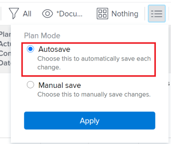

# Criar relacionamentos de predecessores por encadeamento de tarefas

Você pode criar relações de predecessoras de várias maneiras no Adobe Workfront. Um método é encadear tarefas.

Para obter informações sobre tarefas predecessoras, consulte [Visão geral das predecessoras da tarefa](../../../manage-work/tasks/use-prdcssrs/predecessors-overview.md).

Ao encadear tarefas, você pode permitir que o sistema crie os relacionamentos de predecessora automaticamente em tarefas selecionadas, em vez de criar manualmente um relacionamento em cada tarefa. Ainda é possível usar diferentes tipos de relações de predecessoras entre tarefas.

## Requisitos de acesso

Você deve ter o seguinte acesso para executar as etapas deste artigo:

<table style="table-layout:auto"> 
 <col> 
 <col> 
 <tbody> 
  <tr> 
   <td role="rowheader">plano do Adobe Workfront*</td> 
   <td> 
Qualquer
 </td> 
  </tr> 
  <tr> 
   <td role="rowheader">Licença da Adobe Workfront*</td> 
   <td> 
Plano 
 </td> 
  </tr> 
  <tr> 
   <td role="rowheader">Configurações de nível de acesso*</td> 
   <td> 
Editar acesso a tarefas e projetos
 
Observação: se você ainda não tiver acesso, pergunte ao administrador do Workfront se ele definiu restrições adicionais em seu nível de acesso. Para obter informações sobre como um administrador do Workfront pode modificar seu nível de acesso, consulte <a href="../../../administration-and-setup/add-users/configure-and-grant-access/create-modify-access-levels.md" class="MCXref xref">Criar ou modificar níveis de acesso personalizados</a>.
 </td> 
  </tr> 
  <tr> 
   <td role="rowheader">Permissões de objeto</td> 
   <td> 
Gerenciar permissões para as tarefas e o projeto
 
Para obter informações sobre como solicitar acesso adicional, consulte <a href="../../../workfront-basics/grant-and-request-access-to-objects/request-access.md" class="MCXref xref">Solicitar acesso aos objetos </a>.
 </td> 
  </tr> 
 </tbody> 
</table>

&#42;Para saber qual plano, tipo de licença ou acesso você tem, contate o administrador do Workfront.

## Encadear tarefas para criar relacionamentos predecessores

1. Vá para o projeto que contém as tarefas que você deseja encadear.
1. Clique em **Tarefas** no painel esquerdo.
1. (Condicional) Selecione **Salvar automaticamente** no canto superior direito da lista de tarefas e selecione as tarefas que deseja encadear.

   

   >[!IMPORTANT]
   >
   >Não é possível encadear tarefas em uma lista de tarefas quando você salva manualmente as alterações em tarefas ou usa o modo de Planejamento de linha do tempo para salvar tarefas.

1. Clique com o botão direito do mouse nas tarefas selecionadas e clique em **Cadeia**.
1. Selecione um dos seguintes tipos de dependência:

   * **Término-Início**
   * **Término-Término**
   * **Início-Início**
   * **Início-Término**

   Para obter mais informações sobre tipos de dependência predecessora, consulte [Visão geral dos tipos de dependência de tarefa](../../../manage-work/tasks/use-prdcssrs/task-dependency-types.md).

1. (Opcional) Clique em **Desencadear** se algumas das tarefas tiverem sido encadeadas anteriormente.

   >[!CAUTION]
   >
   >Somente predecessores sequenciais são removidos usando a opção unchain ao editar tarefas em massa.

   Suas tarefas selecionadas agora estão vinculadas por relacionamentos de predecessores.
