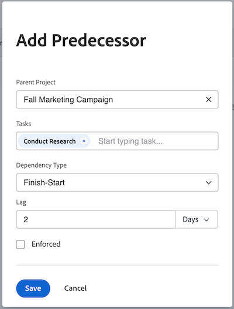

# Criar uma relação de predecessor usando a área Predecessores

<!-- Audited: 5/2025 -->

É possível usar tarefas predecessoras (ou apenas predecessoras) para vincular tarefas que dependem de outras tarefas para serem iniciadas ou concluídas. Por exemplo, você não gostaria de hospedar um participante (tarefa dependente) antes de enviar os convites (tarefa predecessora).

Este artigo mostra como definir predecessores usando a guia Predecessores em uma tarefa.

Para obter informações sobre como definir predecessores em uma lista de tarefas, consulte [Criar uma relação de predecessora na lista de tarefas](../../../manage-work/tasks/use-prdcssrs/create-predecessors-on-task-list.md).

É possível exibir os predecessores das tarefas nas seguintes áreas do Adobe Workfront:

* Na seção Predecessoras das tarefas dependentes
* No Gráfico de Gantt
* Na lista de tarefas da coluna Predecessores

Para obter informações sobre predecessores, consulte [Visão geral dos predecessores da tarefa](../../../manage-work/tasks/use-prdcssrs/predecessors-overview.md).

## Requisitos de acesso

+++ Expanda para visualizar os requisitos de acesso da funcionalidade neste artigo.

<table style="table-layout:auto"> 
 <col> 
 <col> 
 <tbody> 
  <tr> 
   <td role="rowheader">Pacote do Adobe Workfront</td> 
   <td> 
Qualquer
 </td> 
  </tr> 
  <tr> 
   <td role="rowheader">Licença do Adobe Workfront</td> 
   <td>
Padrão
 
   
Plano
 </td> 
  </tr> 
  <tr> 
   <td role="rowheader">Configurações de nível de acesso</td> 
   <td> 
Editar acesso a tarefas e projetos
 </td> 
  </tr> 
  <tr> 
   <td role="rowheader">Permissões de objeto</td> 
   <td> 
Gerenciar permissões para as tarefas e o projeto
</td> 
  </tr> 
 </tbody> 
</table>

Para obter mais informações, consulte [Requisitos de acesso na documentação do Workfront](/help/quicksilver/administration-and-setup/add-users/access-levels-and-object-permissions/access-level-requirements-in-documentation.md).

+++

## Criar um predecessor para uma tarefa

Criar um predecessor para uma tarefa do projeto usando a área Predecessores é semelhante a criar predecessores para uma tarefa de modelo em um modelo.

Para criar uma tarefa predecessora para uma tarefa do projeto:

1. Navegue até a tarefa que deseja designar como uma tarefa dependente.

1. No painel esquerdo, clique em **Predecessores**.

1. Na seção **Predecessoras**, clique em **Adicionar Predecessora**. A caixa de diálogo **Adicionar Predecessora** é aberta.

1. (Opcional) Para adicionar um predecessor entre projetos, substitua o nome do projeto no campo **Projeto principal** por outro projeto.

   Para obter informações, consulte [Criar predecessores entre projetos](../../../manage-work/tasks/use-prdcssrs/cross-project-predecessors.md).

   >[!TIP]
   >
   >Não é possível criar predecessores entre modelos para tarefas de modelo.

1. No campo **Tarefas**, digite o nome da(s) tarefa(s) que deseja designar como predecessoras e, em seguida, selecione-as quando elas aparecerem no menu suspenso.

1. Selecione um **Tipo de dependência**.

   Para obter informações, consulte [Visão geral dos tipos de dependência de tarefa](../../../manage-work/tasks/use-prdcssrs/task-dependency-types.md).

1. Insira um valor de **Defasagem**.

   Para obter informações, consulte &#x200B;[visão geral sobre Tipos de Defasagem](../../../manage-work/tasks/use-prdcssrs/lag-types.md).

   

1. Marque a caixa de seleção **Enforced** se desejar impor a relação de predecessora entre as duas tarefas.

   Para obter informações, consulte [Impor predecessores](../../../manage-work/tasks/use-prdcssrs/enforced-predecessors.md).

1. Clique em **Salvar**.

1. (Opcional) Para remover um predecessor, selecione-o na lista de predecessores, em seguida, clique no ícone **Remover** ícone .

   O antecessor é removido da lista. A tarefa predecessora não é excluída de seu projeto.
