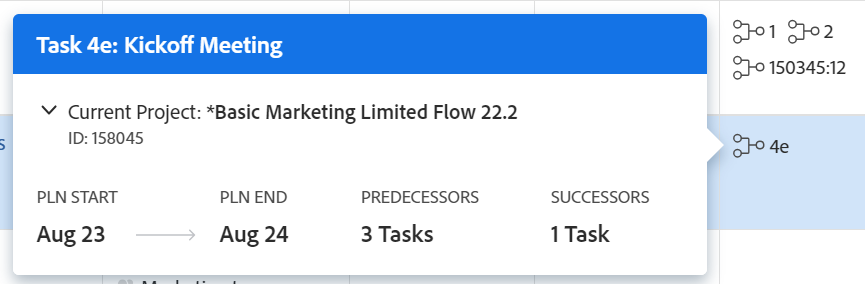

# Criar uma relação de predecessora na lista de tarefas

<!-- Audited: 5/2025 -->

É possível usar tarefas predecessoras (ou apenas predecessoras) para vincular tarefas que dependem de outras tarefas para serem iniciadas ou concluídas. Por exemplo, você não gostaria de hospedar um participante (tarefa dependente) antes de enviar os convites (tarefa predecessora).

Este artigo mostra como criar predecessores na lista de tarefas.

É possível exibir os predecessores das tarefas nas seguintes áreas do Adobe Workfront:

* Na lista de tarefas da coluna Predecessores.
* No gráfico de Gantt.
* Na seção Predecessoras de uma tarefa dependente.

Para obter mais informações, consulte [Visão geral dos predecessores da tarefa](../../../manage-work/tasks/use-prdcssrs/predecessors-overview.md).

## Requisitos de acesso

+++ Expanda para visualizar os requisitos de acesso.

<table style="table-layout:auto"> 
 <col> 
 <col> 
 <tbody> 
  <tr> 
   <td role="rowheader">plano do Adobe Workfront</td> 
   <td> 
Qualquer
 </td> 
  </tr> 
  <tr> 
   <td role="rowheader">Licença do Adobe Workfront</td> 
   <td> 
Padrão 

Plano 
 </td> 
  </tr> 
  <tr> 
   <td role="rowheader">Configurações de nível de acesso</td> 
   <td> 
Editar acesso a tarefas e projetos
 
Observação: se você ainda não tiver acesso, pergunte ao administrador do Workfront se ele definiu restrições adicionais em seu nível de acesso. 
 </td> 
  </tr> 
  <tr> 
   <td role="rowheader">Permissões de objeto</td> 
   <td> 
Gerenciar permissões para as tarefas e o projeto
 </td> 
  </tr> 
 </tbody> 
</table>

Para obter mais detalhes sobre as informações nesta tabela, consulte [Requisitos de acesso na documentação do Workfront](/help/quicksilver/administration-and-setup/add-users/access-levels-and-object-permissions/access-level-requirements-in-documentation.md).

+++

## Criar um predecessor

{{step1-to-projects}}

1. Selecione um projeto na página **Projetos**.
1. Clique em **Tarefas** no painel esquerdo.
1. No menu suspenso **Exibições**, selecione um modo de exibição que exiba a coluna **Predecessora** ou adicione a coluna ao modo de exibição atual.

1. Selecione a tarefa que deseja designar como a tarefa dependente.
1. Clique dentro da coluna **Predecessores** da tarefa.
1. Digite o número da tarefa que você deseja designar como predecessora da tarefa selecionada e pressione **Enter**.

   >[!TIP]
   >
   >Para adicionar uma predecessora entre projetos, faça o seguinte:
   >
   >1. Clique no ícone **Modo de Plano** e escolha **Salvamento Automático**.
   >
   >1. Digite o Número de Referência do projeto do antecessor seguido, por dois pontos e o número da tarefa. Por exemplo, digitar *765021:12* indica que o Número de Referência do projeto do predecessor é 765021 e o predecessor é o número de tarefa 12 no projeto.
   >
   >1. Adicione o tipo de dependência para este predecessor. Para obter mais informações, consulte [Criar predecessores entre projetos](/help/quicksilver/manage-work/tasks/use-prdcssrs/cross-project-predecessors.md).
   >
   >1. Pressione **Enter**.
   >
   >**IMPORTANTE**
   >
   >Não é possível adicionar uma predecessora entre projetos quando a lista de tarefas é exibida no modo de salvamento Manual.

   O ícone predecessor fica verde quando a tarefa predecessora é marcada como concluída. Isso indica que a tarefa dependente está pronta para o trabalho.

   Para obter mais informações sobre os tipos de relação disponíveis na coluna Predecessores, consulte [Visão geral dos predecessores da tarefa](../../../manage-work/tasks/use-prdcssrs/predecessors-overview.md).

## Exibir detalhes da predecessora

Você pode visualizar rapidamente os detalhes sobre o predecessor na lista de tarefas.

1. Na lista de tarefas, passe o mouse sobre o número do predecessor na coluna **Predecessores**. Uma caixa com os detalhes do antecessor é exibida.

   

   Os seguintes detalhes são exibidos:

   **Nome do predecessor:** O nome do predecessor que está sendo referenciado. O número da tarefa do antecessor é incluído. Clique no nome da tarefa para abri-la.

   **Nome do projeto:** O nome do projeto no qual o antecessor reside. O projeto é identificado como o projeto atual se o predecessor pertencer aos mesmos projetos que a tarefa, ou como um projeto cruzado, se o predecessor pertencer a um projeto diferente. Para obter mais informações sobre predecessores entre projetos, consulte [Criar predecessores entre projetos](../../tasks/use-prdcssrs/cross-project-predecessors.md).

   Você pode expandir os detalhes do projeto para ver as datas de início e término planejadas do projeto, a condição, o status, o percentual concluído e o proprietário. Para um projeto cruzado, você pode clicar em **Ver Projeto** para abrir o projeto.

   **ID:** O número de referência do projeto onde a predecessora está localizada.

   **Início Planejado:** A Data de Início Planejada da tarefa predecessora.

   **Fim Planejado:** A Data de Término Planejada da tarefa predecessora.

   **Número de predecessores:** O número de predecessores do predecessor que está sendo referenciado.

   **Número de sucessores:** o número de tarefas sucessoras (ou dependentes) para a predecessora que está sendo referenciada.
