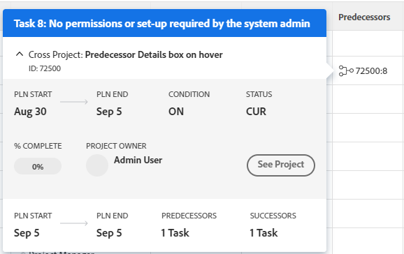

# Criar predecessores entre projetos

<!--Audited: 12/2023-->

Uma predecessora entre projetos é uma tarefa da qual outra tarefa (chamada tarefa sucessora) em outro projeto depende. O predecessor é a tarefa que tem prioridade sobre a tarefa dependente (sucessora). Por exemplo, você pode criar uma dependência que exija que a tarefa predecessora seja marcada como Concluída antes que a tarefa dependente possa ser iniciada.

O Adobe Workfront permite que as tarefas sejam dependentes de tarefas em outros projetos, da mesma forma que permite predecessores em um único projeto.

>[!INFO]
>
>Por exemplo, uma empresa de escavação tem apenas uma retroescavadeira e dois projetos têm tarefas que exigem o uso da retroescavadeira. O gerente de projeto pode tornar a tarefa no primeiro projeto uma predecessora da tarefa no segundo projeto. Isso mostra que o segundo projeto pode começar a usar a retroescavadeira quando o primeiro projeto for concluído com ela.

Ao vincular projetos por meio de predecessores entre projetos, as datas do projeto principal (aquele que tem a tarefa predecessora) afetarão o projeto secundário (aquele que tem a tarefa sucessora).

>[!TIP]
>
>Você deve recalcular as linhas do tempo dos projetos para ver as datas atualizadas do projeto secundário. Para obter mais informações sobre como recalcular linhas do tempo, consulte [Configurar recálculos de linha do tempo para projetos](../../../administration-and-setup/set-up-workfront/configure-system-defaults/configure-timeline-recalculations-projects.md).

Para obter mais informações sobre relações de predecessoras, consulte [Visão geral das predecessoras da tarefa](../../../manage-work/tasks/use-prdcssrs/predecessors-overview.md).

## Requisitos de acesso

+++ Expanda para visualizar os requisitos de acesso para a funcionalidade neste artigo.

Você deve ter o seguinte acesso para executar as etapas deste artigo:

<table style="table-layout:auto"> 
 <col> 
 <col> 
 <tbody> 
  <tr> 
   <td role="rowheader">plano do Adobe Workfront</td> 
   <td> 
Qualquer
 </td> 
  </tr> 
  <tr> 
   <td role="rowheader">Licença da Adobe Workfront*</td> 
   <td> 
Novo: Padrão 
 
   Ou
   
Atual: Plano 

   </td> 
  </tr> 
  <tr> 
   <td role="rowheader">Nível de acesso</td> 
   <td> 
Editar acesso a tarefas e projetos
 </td> 
  </tr> 
  <tr> 
   <td role="rowheader">Permissões de objeto</td> 
   <td> 
Gerenciar permissões para as tarefas e os projetos
 </td> 
  </tr> 
 </tbody> 
</table>

*Para obter mais detalhes sobre as informações nesta tabela, consulte [Requisitos de acesso na documentação da Workfront](/help/quicksilver/administration-and-setup/add-users/access-levels-and-object-permissions/access-level-requirements-in-documentation.md).

+++

## Criar uma predecessora entre projetos

1. Vá para a tarefa que será sua sucessora (tarefa dependente).
1. Clique em **Predecessores** no painel esquerdo.
1. Clique em **Adicionar Predecessora.**
1. No campo **Projeto principal**, comece digitando o nome do projeto que contém a tarefa que você deseja que seja a predecessora da tarefa atual.
1. Clique no nome quando ele aparecer na lista suspensa.
1. No campo **Tarefas**, comece digitando o nome da tarefa que você deseja que seja a predecessora da tarefa atual.
1. Especifique as seguintes informações para definir a relação entre a tarefa predecessora e a tarefa dependente:

   * **Tipo de Dependência:** Selecione a relação que você deseja que a tarefa predecessora tenha com a tarefa dependente. A relação padrão é &quot;Término-Início&quot;, o que significa que a tarefa predecessora deve terminar antes que a tarefa dependente possa iniciar. Para obter mais informações sobre os vários tipos de dependência, consulte [Visão geral dos tipos de dependência de tarefa](../../../manage-work/tasks/use-prdcssrs/task-dependency-types.md).

   * **Atraso:** especifique a quantidade de tempo que deve decorrer após a conclusão de uma predecessora imposta até que a tarefa dependente possa começar. Para obter mais informações sobre os vários tipos de atraso, consulte [Visão geral dos Tipos de Atraso](../../../manage-work/tasks/use-prdcssrs/lag-types.md).

   * **Imposto:** quando esta opção é selecionada, a relação de dependência entre as duas tarefas não pode ser contornada pelos usuários que iniciam as tarefas antecipadamente. Por exemplo, se você impor uma relação entre a Tarefa A e a Tarefa B, a Tarefa B não poderá ser iniciada até que a Tarefa A seja concluída. Para obter mais informações sobre como impor predecessores, consulte [Impor predecessores](../../../manage-work/tasks/use-prdcssrs/enforced-predecessors.md).

     Quando essa opção não está selecionada, a dependência é tratada como uma sugestão para os usuários. Por exemplo, os usuários podem iniciar a Tarefa B antes que a Tarefa A seja concluída.

1. Clique em **Salvar**.

   As tarefas com predecessoras entre projetos exibem o número de referência do projeto ao qual a predecessora pertence e o número da tarefa, separado por dois pontos, na coluna Predecessoras em uma lista de tarefas.

   

   O ícone predecessor fica verde quando a tarefa predecessora é marcada como concluída. Isso indica que a tarefa dependente está pronta para o trabalho.

   Passe o mouse sobre esse valor para obter mais informações sobre o predecessor, o projeto e as datas. Clique no predecessor entre projetos na caixa de detalhes para abrir a tarefa.

   Clique próximo à parte superior da janela de flutuação para ver mais informações sobre o projeto do predecessor.

   Clique em **Ver projeto** para abrir o projeto do antecessor.

   

   >[!TIP]
   >
   >   A opção **Ver Projeto** é exibida somente durante a exibição de um predecessor entre projetos.

