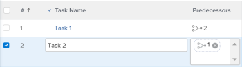

# Visão geral do loop de dependência da tarefa

Ao adicionar relações de predecessoras a tarefas, você pode encontrar loops de dependência. Para obter informações sobre predecessores, consulte [Visão geral dos predecessores da tarefa](../../../manage-work/tasks/use-prdcssrs/predecessors-overview.md).

## Visão geral do loop de dependência

Os loops de dependência ocorrem quando você tem duas ou mais tarefas que dependem umas das outras para serem concluídas. O Adobe Workfront não permite criar uma relação de predecessora entre tarefas se criar um loop de dependência.

**Exemplo:** a Tarefa 2 é predecessora da Tarefa 1, o que significa que você deve concluir a Tarefa 2 antes de começar a trabalhar na Tarefa 1.

Se você tentar tornar a Tarefa 1 uma predecessora da Tarefa 2, receberá um erro de loop de dependência porque não poderá iniciar a Tarefa 1 até que a Tarefa 2 tenha sido concluída, mas a tarefa 2 não poderá ser iniciada até que a Tarefa 1 seja concluída.

## Considerações sobre loops de dependência

* Os loops de dependência podem envolver mais de duas tarefas. Às vezes, qualquer número de pais das tarefas que você está conectando a um relacionamento de predecessor é o que cria o loop de dependência.
* Um loop de dependência também pode ocorrer se você tentar tornar um pai o predecessor de um filho.
* No caso de um loop de dependência, não é possível salvar as tarefas ou o projeto. Para corrigir o loop de dependência, você deve reavaliar a relação de predecessora entre as tarefas listadas na mensagem de erro e remover os conflitos antes de salvar as tarefas ou o projeto.

