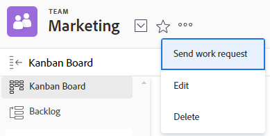

# Editar configurações da equipe

Como administrador do [!DNL Adobe Workfront] ou usuário com uma licença do [!UICONTROL Padrão], do [!UICONTROL Plano] ou do [!UICONTROL Trabalho], você pode editar as [!UICONTROL Configurações de Equipe].

Você pode adicionar usuários a uma equipe, definir o modelo de layout da equipe e definir como o status será registrado quando os itens de trabalho forem concluídos por uma equipe.

## Requisitos de acesso

+++ Expanda para visualizar os requisitos de acesso da funcionalidade neste artigo.

<table style="table-layout:auto"> 
 <col> 
 <col> 
 <tbody> 
  <tr data-mc-conditions=""> 
   <td role="rowheader"> 
Pacote do Adobe Workfront
 </td> 
   <td>Qualquer</td> 
  </tr> 
  <tr> 
   <td role="rowheader">Licença do Adobe Workfront</td> 
   <td>
   
Padrão

   
Trabalho ou maior
</td>
  </tr> 
 </tbody> 
</table>

Para obter mais detalhes sobre as informações contidas nesta tabela, consulte [Requisitos de acesso na documentação do Workfront](/help/quicksilver/administration-and-setup/add-users/access-levels-and-object-permissions/access-level-requirements-in-documentation.md).

+++

## Editar configurações da equipe

{{step1-to-team}}

1. Clique no ícone **[!UICONTROL Alternar equipe]**  e, em seguida, selecione uma nova equipe no menu suspenso ou pesquise uma equipe na barra de pesquisa.

1. Clique no menu **[!UICONTROL Mais]**  e selecione **[!UICONTROL Editar]**.

   Somente os membros da equipe com uma licença [!UICONTROL Padrão], [!UICONTROL Plano] ou [!UICONTROL Trabalho] veem esta opção.

   Se você tiver a opção [!UICONTROL Editar], mas não a vir, peça ao administrador do Workfront para verificar se as [!UICONTROL Configurações da Equipe] estão visíveis no modelo de layout para a [!UICONTROL Equipe Scrum], a [!UICONTROL Equipe Kanban] ou a [!UICONTROL Equipe Waterfall].

   

1. Nas configurações do grupo, é possível fazer os seguintes tipos de alterações:

   * Modificar o nome da equipe
   * Desativar a equipe
   * Associar a equipe a um grupo

     >[!NOTE]
     >
     >Quando uma equipe é atribuída a um grupo ou subgrupo, qualquer administrador desse grupo ou subgrupo pode gerenciar a equipe sem ser um membro dele. Os administradores de grupo podem ir para a área Equipes no menu principal e clicar na seta [!UICONTROL Alternar equipes]  para listar todas as equipes atribuídas aos grupos que eles gerenciam.

     Você pode verificar se está associando o grupo certo à equipe passando o mouse sobre ele e clicando no ícone de informações  que é exibido ao lado dele. Uma dica de ferramenta será exibida listando informações sobre o grupo, como a hierarquia dos grupos acima dele e seus administradores.

   * Designar o proprietário da equipe
   * Adicionar e remover membros da equipe
   * Adicionar uma descrição da equipe
   * Aplicar um modelo de layout à equipe

     Para obter mais informações sobre como aplicar um modelo de layout personalizado a uma equipe, consulte a seção “Aplicar um modelo personalizado a uma equipe” em Alterar as áreas [!UICONTROL Meu trabalho] e [!UICONTROL Solicitações de trabalho] com Modelos de layout.

   * Decida se esta equipe é ágil selecionando a opção **[!UICONTROL Esta é uma Equipe Ágil]**.

     Para obter mais informações sobre equipes Ágeis e como gerenciar o trabalho dentro de uma equipe Ágil, consulte [Criar uma equipe Ágil](../../agile/get-started-with-agile-in-workfront/create-an-agile-team.md).

   * Altere o botão [!UICONTROL Trabalhar] para um botão [!UICONTROL Iniciar]. Para obter mais informações sobre como configurar o botão [!UICONTROL Iniciar], consulte [Substituir o botão Trabalhar nele por um botão [!UICONTROL Iniciar]](../../people-teams-and-groups/create-and-manage-teams/work-on-it-button-to-start-button.md).
   * Personalize o botão **[!UICONTROL Concluído]**. Para obter mais informações sobre como personalizar o botão [!UICONTROL Concluído], consulte:

      * [Configurar o botão [!UICONTROL Concluído] para tarefas](../../people-teams-and-groups/create-and-manage-teams/configure-the-done-button-for-tasks.md)
      * [Configurar o botão [!UICONTROL Concluído] para problemas](../../people-teams-and-groups/create-and-manage-teams/configure-the-done-button-for-issues.md)

1. Clique em **[!UICONTROL Salvar alterações]**.
