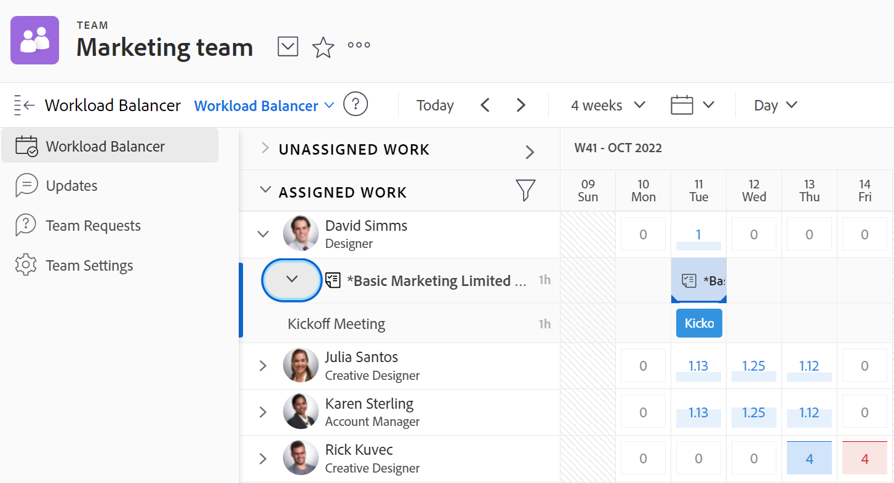

# Gerenciar no que sua equipe está trabalhando

Você pode ver uma lista de itens nos quais sua equipe está trabalhando na seção [!UICONTROL Solicitações da equipe] da sua equipe.

Você pode atribuir itens não atribuídos, ajustar atribuições atuais, ajustar alocações atuais e muito mais na seção [!UICONTROL Balanceador de carga de trabalho] da sua equipe.

Para obter informações detalhadas sobre como gerenciar o trabalho atribuído à sua equipe, consulte [[!UICONTROL Balanceador de carga de trabalho]](../../resource-mgmt/workload-balancer/assign-work-in-workload-balancer.md).

