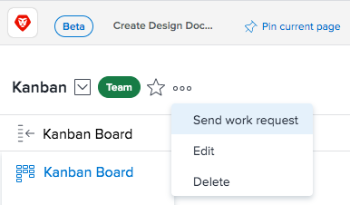

# Gerenciar solicitações de trabalho e da equipe

Uma solicitação representa uma atribuição pendente de tarefa ou problema. As solicitações de trabalho são feitas a indivíduos e as solicitações de equipe são feitas a equipes.

>[!NOTE]
>
>Equipes ágeis não têm solicitações de equipe.

## Requisitos de acesso

+++ Expanda para visualizar os requisitos de acesso da funcionalidade neste artigo.

<table style="table-layout:auto"> 
 <col> 
 <col> 
 <tbody> 
  <tr data-mc-conditions=""> 
   <td role="rowheader">Pacote do Adobe Workfront</td> 
   <td>Qualquer</td> 
  </tr> 
  <tr> 
   <td role="rowheader">Licença do Adobe Workfront</td> 
   <td>
   
Para atribuir ou trabalhar em uma solicitação:
   
Claro ou superior

  
Revisar ou superior

   
Para reatribuir uma solicitação:
   
Padrão

   
Trabalho ou maior
</td>
  </tr> 
 </tbody> 
</table>

Para obter mais detalhes sobre as informações contidas nesta tabela, consulte [Requisitos de acesso na documentação do Workfront](/help/quicksilver/administration-and-setup/add-users/access-levels-and-object-permissions/access-level-requirements-in-documentation.md).

+++

## Atribuir uma solicitação a uma equipe {#assign-a-request-to-a-team}

Os gerentes de projeto e os solicitantes de emissão podem atribuir trabalho às equipes quando não souberem qual recurso é certo para realizar o trabalho ou quando não importa quem o conclui.

As tarefas atribuídas à equipe permanecem na guia [!UICONTROL Solicitações de equipe] até que um usuário da equipe se volunte para trabalhar na solicitação.

Quando uma solicitação é atribuída a uma equipe e a um usuário que não é membro da equipe, a solicitação fica visível na guia [!UICONTROL Solicitações de equipe] e na área de solicitações de trabalho do usuário. Se o usuário que não está na equipe se voluntariar para trabalhar na tarefa, a tarefa ainda permanecerá na guia [!UICONTROL Solicitações de equipe] até que um usuário da equipe se voluntarie para trabalhar nela.

As equipes podem ser atribuídas a tarefas e problemas de qualquer uma das seguintes maneiras:

* Pelo [!UICONTROL Gráfico de Gantt]
* De uma lista de tarefas ou problemas (individualmente ou em massa)
* Quando uma tarefa ou problema é criado ou modificado
* Por meio de regras de roteamento em uma solicitação (somente emissões)

É possível atribuir manualmente uma solicitação a uma equipe na página da equipe, conforme descrito nesta seção.

Para atribuir manualmente uma solicitação a uma equipe na página da equipe:

{{step1-to-team}}

1. Clique no ícone **[!UICONTROL Alternar equipe]**  e, em seguida, selecione uma nova equipe no menu suspenso ou pesquise uma equipe na barra de pesquisa.

1. Clique no ícone **[!UICONTROL Mais]**  e selecione **[!UICONTROL Enviar solicitação de trabalho]**.

   

1. Preencha as informações na caixa que é aberta.
1. Clique em **[!UICONTROL Enviar Solicitação]**.\
   Agora é atribuída à equipe uma nova tarefa, que é exibida na guia Solicitações de equipe. Esta tarefa não está atualmente associada a um projeto, mas pode ser movida, conforme descrito em [Mover tarefas](../../manage-work/tasks/manage-tasks/move-tasks.md).

## Reatribuir solicitações {#reassign-requests}

É possível reatribuir solicitações que foram atribuídas à sua equipe:

{{step1-to-team}}

1. Clique no ícone **[!UICONTROL Equipe de comutação]**  e selecione uma nova equipe no menu suspenso ou procure uma equipe na barra de pesquisa.
1. No painel de navegação esquerdo, selecione **[!UICONTROL Solicitações de equipe]**.
1. Clique no ícone **[!UICONTROL Reatribuir]**.

1. Comece a digitar o nome do usuário, grupo ou equipe à qual deseja reatribuir a solicitação e clique em **[!UICONTROL Atribuir]**.\
   A solicitação é reatribuída.
