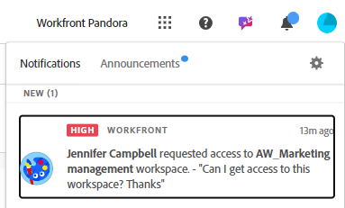

# Solicitar permissões para uma exibição ou um espaço de trabalho

As informações destacadas nesta página referem-se a funcionalidades que ainda não estão disponíveis. Ela está disponível somente no ambiente de Pré-visualização para todos os clientes. Depois das versões mensais para produção, os mesmos recursos também ficam disponíveis no ambiente de produção para clientes que ativaram versões rápidas. 

Para obter informações sobre versões rápidas, consulte [Habilitar ou desabilitar versões rápidas para sua organização](/help/quicksilver/administration-and-setup/set-up-workfront/configure-system-defaults/enable-fast-release-process.md). 

>[!IMPORTANT]
>
>A funcionalidade descrita neste artigo só estará disponível quando sua organização tiver sido integrada à Adobe Unified Experience.
>
>Para obter mais informações, consulte [Experiência unificada da Adobe para Workfront](/help/quicksilver/workfront-basics/navigate-workfront/workfront-navigation/adobe-unified-experience.md).

Você pode solicitar permissões para uma view ou um espaço de trabalho quando alguém compartilhar um link com você para a view ou o espaço de trabalho ao qual você não tem acesso.

A solicitação de permissões para uma visualização é semelhante à solicitação de permissões para um espaço de trabalho.

Este artigo descreve como solicitar acesso a uma visualização ou a um espaço de trabalho quando alguém compartilha um link com você e você não pode acessar a página compartilhada.

Para obter informações sobre a concessão de permissões para exibições e espaços de trabalho, consulte os seguintes artigos:

* [Compartilhar exibições](/help/quicksilver/planning/access/share-views.md)
* [Compartilhar espaços de trabalho](/help/quicksilver/planning/access/share-workspaces.md)

## Requisitos de acesso

+++ Expanda para visualizar os requisitos de acesso.

Você deve ter o seguinte acesso para executar as etapas deste artigo:

<table style="table-layout:auto"> 
<col> 
</col> 
<col> 
</col> 
<tbody> 
    <tr> 
<tr> 
<td> 
   
 Produtos
 </td> 
   <td> 
   <ul><li>
 Adobe Workfront
</li> 
   <li>
 Planejamento do Adobe Workfront
</li></ul></td> 
  </tr>   
<tr> 
   <td role="rowheader">
plano do Adobe Workfront*
</td> 
   <td> 

Qualquer um dos seguintes planos da Workfront:
 
<ul><li>Selecionar</li> 
<li>Prime</li> 
<li>Ultimate</li></ul> 

O Workfront Planning não está disponível para planos herdados do Workfront
 
   </td> 
<tr> 
   <td role="rowheader">
Pacote de planejamento do Adobe Workfront*
</td> 
   <td> 

Qualquer 
 

Para obter mais informações sobre o que está incluído em cada plano do Workfront Planning, entre em contato com seu gerente de conta da Workfront. 
 
   </td> 
 <tr> 
   <td role="rowheader">
plataforma Adobe Workfront
</td> 
   <td> 

A instância da Workfront de sua organização deve ser integrada à Adobe Unified Experience para acessar todos os recursos do Workfront Planning.
 

<b>IMPORTANTE</b>

Os usuários em sua organização podem solicitar permissões para exibições e espaços de trabalho somente quando sua organização é integrada à Adobe Unified Experience. 

Para obter mais informações, consulte <a href="/help/quicksilver/workfront-basics/navigate-workfront/workfront-navigation/adobe-unified-experience.md">Experiência unificada da Adobe para Workfront</a>. 
 
   </td> 
   </tr> 
  </tr> 
  <tr> 
   <td role="rowheader">
Licença da Adobe Workfront*
</td> 
   <td>
 Padrão, Claro ou Contribuinte

   
O Workfront Planning não está disponível para licenças herdadas do Workfront
 
  </td> 
  </tr> 
  <tr> 
   <td role="rowheader">
Configuração do nível de acesso
</td> 
   <td> 
Não há controles de nível de acesso para o Adobe Workfront Planning
   
</td> 
  </tr> 
<tr> 
   <td role="rowheader">
Permissões de objeto
</td> 
   <td>  
Após receber sua solicitação de permissão, você pode obter as seguintes permissões:

   <ul><li>
Exibir ou Gerenciar para um modo de exibição
</li>
   <li>
Exibir, contribuir ou gerenciar para um espaço de trabalho
</li></ul>  
   
Somente usuários com permissões para Gerenciar um espaço de trabalho e uma visualização podem compartilhar uma visualização publicamente.
</td> 
  </tr> 
<tr> 
   <td role="rowheader">
Modelo de layout
</td> 
   <td> 
   
No ambiente de Produção, todos os usuários, inclusive os administradores do Sistema, devem ser atribuídos a um modelo de layout que inclua as áreas de Planejamento.

   

 No ambiente de Pré-visualização, os usuários com uma licença Light ou de Colaborador devem receber um modelo de layout que inclua a opção Planejamento nas seguintes áreas:

   <ul><li>Menu principal</li>
   <li>Painel esquerdo de projetos, portfólios e programas</li>
   </ul>
   
Para obter mais informações, consulte <a href="/help/quicksilver/administration-and-setup/customize-workfront/use-layout-templates/create-and-manage-layout-templates.md">Criar e gerenciar modelos de layout</a>.

   
Usuários padrão e Administradores do sistema têm as áreas do Planning habilitadas por padrão.

   </td> 
  </tr> 
</tbody> 
</table>

*Para obter mais informações sobre requisitos de acesso do Workfront, consulte [Requisitos de acesso na documentação do Workfront](/help/quicksilver/administration-and-setup/add-users/access-levels-and-object-permissions/access-level-requirements-in-documentation.md).

+++

## Solicitar permissões para uma exibição ou espaço de trabalho

A solicitação de permissões para uma visualização é semelhante à solicitação de permissão para um espaço de trabalho.

Quando alguém compartilha com você um link para um espaço de trabalho ou uma visualização à qual você não tem acesso:

1. Clique no link compartilhado com você para a exibição ou o espaço de trabalho.

   Uma página **Você não tem acesso** é exibida para informá-lo de que você não tem acesso à exibição ou ao espaço de trabalho.

   

1. (Condicional) Se o link compartilhado for para uma exibição de um espaço de trabalho ao qual você tem acesso, clique em **Abrir com exibição existente**. Se você tiver permissões para acessar o espaço de trabalho, a página do tipo de registro será aberta na exibição padrão.

1. (Opcional e condicional) Se você não tiver permissões para exibir o espaço de trabalho, adicione uma mensagem personalizada na caixa disponível e clique em **Solicitar acesso**.

   Todos os usuários com permissões para Gerenciar a exibição ou o espaço de trabalho recebem as seguintes notificações para a solicitação de acesso:
   * Uma notificação no aplicativo
     
   * Uma notificação por email
     

1. (Condicional) Quando a exibição ou o gerenciador de espaço de trabalho concede permissões para a exibição ou o espaço de trabalho, você recebe uma notificação por email e uma notificação no aplicativo com uma confirmação de que a permissão foi concedida. <!--check this - I was not able to test this, but Isk confirmed.-->
