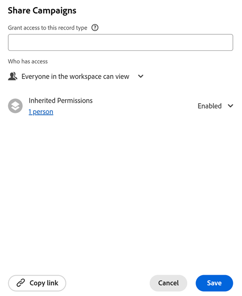

<!-- add these to metadata on release:

author: Alina
feature: Workfront Planning
role: User, Admin
recommendations: noDisplay, noCatalog-->

# Compartilhar tipos de registro

As informações nesta página se referem a funcionalidades que ainda não estão disponíveis. Ela está disponível somente no ambiente de Pré-visualização para todos os clientes. Depois das versões mensais para produção, os mesmos recursos também ficam disponíveis no ambiente de produção para clientes que ativaram versões rápidas. 

Para obter informações sobre versões rápidas, consulte [Habilitar ou desabilitar versões rápidas para sua organização](/help/quicksilver/administration-and-setup/set-up-workfront/configure-system-defaults/enable-fast-release-process.md). 

{{planning-important-intro}}

Você pode compartilhar um tipo de registro com outras pessoas para garantir a colaboração ao trabalhar com registros no Adobe Workfront Planning.

>[!IMPORTANT]
>
>* Por padrão, conceder permissões a um espaço de trabalho fornece aos usuários as mesmas permissões para os tipos de registros no espaço de trabalho.
>* Além disso, você pode ajustar permissões em tipos de registros individuais.
>* No entanto, você não pode conceder às pessoas permissões mais altas para um tipo de registro do que as permissões que elas têm para o espaço de trabalho.
>* As pessoas com permissão para Gerenciar no espaço de trabalho sempre mantêm o acesso de Gerenciar a todos os tipos de registros no espaço de trabalho. Suas permissões não podem ser reduzidas em tipos de registros, mesmo quando as permissões herdadas estão desativadas.
> 
> Para obter mais informações, consulte a seção [Considerações ao compartilhar tipos de registro](#considerations-when-sharing-record-types) neste artigo.

## Requisitos de acesso

+++ Expanda para visualizar os requisitos de acesso.

<!--at GA, check that the Workfront plans article linked below has Planning info-->

Você deve ter o seguinte acesso para executar as etapas deste artigo:

<table style="table-layout:auto"> 
<col> 
</col> 
<col> 
</col> 
<tbody> 
    <tr> 
<tr> 
<td> 
   
 Produtos
 </td> 
   <td> 
   <ul><li>
 Adobe Workfront
</li> 
   <li>
 Planejamento do Adobe Workfront
</li></ul></td> 
  </tr>   
<tr> 
   <td role="rowheader">
plano do Adobe Workfront*
</td> 
   <td> 

Qualquer um dos seguintes planos da Workfront:
 
<ul><li>Selecionar</li> 
<li>Prime</li> 
<li>Ultimate</li></ul> 

O Workfront Planning não está disponível para planos herdados do Workfront
 
   </td> 
<tr> 
   <td role="rowheader">
Pacote de planejamento do Adobe Workfront*
</td> 
   <td> 

Qualquer 
 

Para obter mais informações sobre o que está incluído em cada plano do Workfront Planning, entre em contato com seu gerente de conta da Workfront. 
 
   </td> 
 <tr> 
   <td role="rowheader">
plataforma Adobe Workfront
</td> 
   <td> 

A instância da Workfront de sua organização deve ser integrada à Adobe Unified Experience para acessar todos os recursos do Workfront Planning.
 

Sua organização deve estar integrada à Adobe Unified Experience para que os usuários possam solicitar e conceder permissões para uma exibição a partir de uma solicitação de permissão. 

Para obter mais informações, consulte <a href="/help/quicksilver/workfront-basics/navigate-workfront/workfront-navigation/adobe-unified-experience.md">Experiência unificada da Adobe para Workfront</a>. 
 
   </td> 
   </tr> 
  </tr> 
  <tr> 
   <td role="rowheader">
Licença da Adobe Workfront*
</td> 
   <td>
 Padrão

   
O Workfront Planning não está disponível para licenças herdadas do Workfront
 
  </td> 
  </tr> 
  <tr> 
   <td role="rowheader">
Configuração do nível de acesso
</td> 
   <td> 
Não há controles de nível de acesso para o Adobe Workfront Planning
   
</td> 
  </tr> 
<tr> 
   <td role="rowheader">
Permissões de objeto
</td> 
   <td>  
Gerenciar permissões para um tipo de registro
  
   
Somente usuários com permissões para Gerenciar em um espaço de trabalho podem compartilhar permissões para gerenciar um tipo de registro
</td> 
  </tr> 
<tr> 
   <td role="rowheader">
Modelo de layout
</td> 
   <td> 
Todos os usuários, incluindo administradores do Workfront, devem receber um modelo de layout que inclua a área Planejamento no Menu principal. 
 </td> 
  </tr> 
</tbody> 
</table>

*Para obter mais informações sobre requisitos de acesso do Workfront, consulte [Requisitos de acesso na documentação do Workfront](/help/quicksilver/administration-and-setup/add-users/access-levels-and-object-permissions/access-level-requirements-in-documentation.md).

+++

## Considerações ao compartilhar tipos de registro

* Para obter informações gerais sobre o compartilhamento de objetos no Workfront Planning, consulte também [Visão geral das permissões de compartilhamento no Adobe Workfront Planning](/help/quicksilver/planning/access/sharing-permissions-overview.md).

* Atualmente, é possível fazer o seguinte ao compartilhar tipos de registro:
   * Conceda permissões de Exibição a pessoas para um espaço de trabalho, quando você compartilhar um tipo de registro com elas pela primeira vez e elas não tiverem permissões para o espaço de trabalho.

     Isso também dá a eles permissões de Exibição para todos os tipos de registros no espaço de trabalho.

     À medida que você dá a eles permissões para o tipo de registro, há uma indicação na caixa de compartilhamento de que eles também são adicionados ao espaço de trabalho.
   * Tornar o tipo de registro somente para visualização para todos no espaço de trabalho (exceto para gerenciadores de espaço de trabalho), ao desativar as Permissões herdadas.

     As pessoas com permissões Gerenciar no espaço de trabalho sempre têm permissões Gerenciar nos tipos de registro, mesmo quando você desativa Permissões herdadas no tipo de registro.
  <!-- checking with Lilit - this doesn't make much sense: * Add people with Contribute permission to the workspace, who will retain Contribute permission to the record type. This way, only the selected people can manage records in the record type, while others can only view them. -->
   * Diminua a permissão das pessoas para um tipo de registro. Não é possível aumentar a permissão de alguém para um tipo de registro a partir do que ele tem no espaço de trabalho.

     Por exemplo, se alguém tiver permissão do Contribute para o espaço de trabalho, você poderá alterar a permissão para um tipo de registro específico para Exibir. No entanto, se eles tiverem a permissão Exibir para o espaço de trabalho, você não poderá conceder a eles a permissão Contribute para qualquer tipo de registro.

* Não é possível remover o acesso a um tipo de registro para pessoas no espaço de trabalho. Todos sempre têm pelo menos a permissão Exibir.

* Você pode compartilhar um tipo de registro internamente com as seguintes entidades:

   * Usuários, grupos, equipes, empresas e funções do Workfront
* Não é possível compartilhar tipos de registro externamente, com usuários fora do Workfront.
* Para conceder a um usuário que não tem permissões de espaço de trabalho superiores às permissões de Exibição para um tipo de registro, primeiro você deve compartilhar o espaço de trabalho com ele com uma permissão superior à de Exibição.

## Compartilhar permissões para um tipo de registro

É possível ajustar permissões para tipos de registros individuais de um espaço de trabalho se você tiver a permissão Gerenciar para o espaço de trabalho.

{{step1-to-planning}}

1. Abra o espaço de trabalho cujos tipos de registro você deseja compartilhar e clique em um cartão de tipo de registro.

   Isso abre a página do tipo de registro.

1. Na guia de qualquer modo de exibição, clique em **Compartilhar** no canto superior direito do tipo de registro.

   A caixa **Compartilhar** é aberta.

   

1. (Opcional) Na área **Quem tem acesso**, selecione uma das seguintes opções: <!--the Only invited people is supposed to be removed - rewrite this - according to Vahan-->

   * **Somente pessoas convidadas podem acessar**: você deve especificar usuários, grupos, equipe, empresa ou funções de trabalho com as quais deseja compartilhar a exibição.
   * **Todos no espaço de trabalho podem exibir**: todos os usuários com permissões de Exibição ou superiores para o espaço de trabalho podem acessar a exibição. Esta é a opção padrão. <!--rewrite this based on what Lilit says in the proof: At this point, once the inherited permissions are disabled, everyone in the workspace except workspace managers will have View permission to the record type because the "Everyone in the workspace can view"  setting cannot be changed. -->

1. (Opcional) Expanda a opção **Permissões herdadas** para exibir usuários, equipes, grupos, empresas ou funções de trabalho que herdam permissões do espaço de trabalho.

   >[!TIP]
   >
   >Não é possível remover entidades individuais da lista de permissões herdadas.

1. (Opcional e condicional) Se quiser compartilhar o tipo de registro com entidades específicas e conceder a elas um acesso diferente ao tipo de registro do que já têm para o espaço de trabalho, faça o seguinte:

1. **Desative** permissões herdadas.

   >[!TIP]
   >
   >Os gerentes do Workspace continuam a ter permissões de gerenciamento para o tipo de registro.

   1. No campo **Conceder acesso a este tipo de registro**, adicione os usuários, equipes, grupos, empresas ou funções de trabalho aos quais você deseja conceder um nível de permissão diferente.
   1. Escolha um nível de permissão.

   >[!IMPORTANT]
   >
   >* Você nunca pode conceder aos usuários permissões maiores em um tipo de registro do que em um espaço de trabalho.
   >* Você não pode conceder aos usuários uma permissão menor que Gerenciar para um tipo de registro, se eles tiverem permissões Gerenciar para o espaço de trabalho.
   >* É possível conceder aos usuários uma permissão menor para o tipo de registro se eles tiverem permissões do Contribute para o espaço de trabalho.
   > Para obter mais informações, consulte [Visão geral das permissões de compartilhamento no Adobe Workfront Planning](/help/quicksilver/planning/access/sharing-permissions-overview.md).

1. Para conceder aos usuários que não têm permissões para o espaço de trabalho acesso para exibir o tipo de registro, no campo **Conceder acesso a este modo de exibição**, comece a digitar o nome de um usuário, grupo, equipe, empresa ou função de trabalho e, em seguida, clique nele quando ele for exibido na lista.

   A entidade selecionada foi adicionada ao tipo de registro e ao espaço de trabalho com permissões de **Exibição**.

   Os administradores do sistema sempre recebem permissões de gerenciamento para registrar tipos compartilhados com eles, e há uma indicação de que um usuário é um administrador do sistema.

1. Clique em **Copiar link** para copiar um link para o tipo de registro para a área de transferência.
1. Clique em **Salvar**.

   O tipo de registro agora é compartilhado com outros usuários.

1. Compartilhar o link copiado com outras pessoas. Os usuários que recebem o link devem ser usuários ativos e fazer logon no Workfront para acessar a página de tipo de registro e exibi-la na exibição selecionada.

<!-- This is not working yet: *************************** edit this before publishing, because this was not tested with record types - this section came from sharing views *******************: 

## Grant permissions to a record type from a permission request

Users who access a link to a record type to which they do not have permissions can request permissions to the record type. All users with Manage permissions to the view receive the permission request and can grant or deny the permissions. 

1. (Conditional) If you are are the manager of a view, you might receive a request from another user to access the view in the following areas:
   
   * An in-app notification
      
   * An email notification
      
1. (Conditional) From the notification area in Workfront, click the in-app notification
   Or
   From the email notification, click **View all notifications**, then click the notification in the list.

   The **Pending access requests** box displays. 

      
1. (Optional) For the user whose permissions you want to approve, select one of the following options from the drop-down menu to the right of the user's name: 
   * **View**
   * **Manage**
1. Select the user for whom you want to approve or deny the permission, then click **Approve all** or **Deny all**. 
1. Click the left-pointing arrow to the left of **Pending access requests**, then click **Save**.

   If you approved the request, the users are added to the sharing box of the view. The user requesting the permission receives an email confirmation that their request was approved. <!--will they also get an in-app notification??-->

## Remover permissões para um tipo de registro

<!-- take this section out - this is what Lilit said: Because of "Everyone in the workspace can view" wildcard, currently it's not possible to entirely remove access to a record type. Let's take out this section. -->

{{step1-to-planning}}

1. Abra o espaço de trabalho cujos tipos de registro você deseja interromper o compartilhamento e clique em um cartão de tipo de registro. Isso abre a página do tipo de registro.

1. Na guia de qualquer modo de exibição, clique em **Compartilhar** no canto superior direito do tipo de registro.

   A caixa **Compartilhar** é aberta.
1. Localize o usuário, grupo, equipe, empresa ou função de trabalho cujas permissões você deseja remover, expanda o menu suspenso de permissões à direita de seu nome e clique em **Remover**. <!--check the screen shot below - the UI text for View might not be accurate-->

   

1. Clique em **Salvar**.

   As pessoas não têm mais acesso ao tipo de registro. Eles ainda podem ter permissões para o espaço de trabalho, a menos que você também as remova das permissões do espaço de trabalho.

   Não há notificação para os usuários que foram removidos do acesso à visualização de que eles não têm mais esse acesso.
