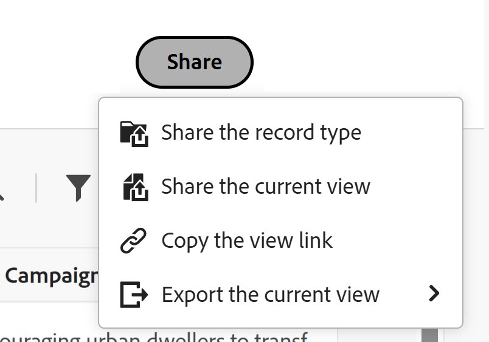

# Compartilhar exibições

<!--The highlighted information on this page refers to functionality not yet generally available. It is available only in the Preview environment for all customers. After the monthly releases to Production, the same features are also available in the Production environment for customers who enabled fast releases.    

For information about fast releases, see [Enable or disable fast releases for your organization](/help/quicksilver/administration-and-setup/set-up-workfront/configure-system-defaults/enable-fast-release-process.md). -->

{{planning-important-intro}}

Você pode compartilhar uma exibição com outras pessoas para garantir a colaboração ao trabalhar com registros no Adobe Workfront Planning.

>[!IMPORTANT]
>
>* Conceder permissões a um espaço de trabalho não concede a outros usuários permissões para as exibições nas páginas do tipo de registro. Você deve conceder permissões a exibições individuais em uma página de tipo de registro para compartilhá-las com outros usuários.
>
>* A concessão de permissões para uma exibição não altera as permissões de exibição dos registros. As permissões de registro são concedidas por espaços de trabalho de compartilhamento.
>
>* Ao compartilhar uma exibição, você concede a outras pessoas permissões para acessar todos os elementos da exibição. Por exemplo, se você conceder a eles permissões Gerenciar para uma exibição, eles poderão modificar a aparência do agrupamento, do filtro, da classificação ou da barra.

<!--
This article describes how you can share a view with others. For information about requesting, granting, or denying permissions to a view, see [Request permissions to a view or a workspace](/help/quicksilver/planning/access/request-permissions.md). -->

## Requisitos de acesso

+++ Expanda para visualizar os requisitos de acesso.

<!--at GA, check that the Workfront plans article linked below has Planning info-->

<table style="table-layout:auto"> 
<col> 
</col> 
<col> 
</col> 
<tbody> 
    <tr> 
<tr> 
<td> 
   
 Produtos
 </td> 
   <td> 
   <ul><li>
 Adobe Workfront
</li> 
   <li>
 Planejamento do Adobe Workfront
</li></ul></td> 
  </tr>   
<tr> 
   <td role="rowheader">
plano do Adobe Workfront*
</td> 
   <td> 

Qualquer um dos seguintes planos da Workfront:
 
<ul><li>Selecionar</li> 
<li>Prime</li> 
<li>Ultimate</li></ul> 

O Workfront Planning não está disponível para planos herdados do Workfront
 
   </td> 
<tr> 
   <td role="rowheader">
Pacote de planejamento do Adobe Workfront*
</td> 
   <td> 

Qualquer 
 

Para obter mais informações sobre o que está incluído em cada plano do Workfront Planning, entre em contato com seu gerente de conta da Workfront. 
 
   </td> 
 <tr> 
   <td role="rowheader">
plataforma Adobe Workfront
</td> 
   <td> 

A instância da Workfront de sua organização deve ser integrada à Adobe Unified Experience para acessar o Workfront Planning.
 

Sua organização deve estar integrada à Adobe Unified Experience para que os usuários possam solicitar e conceder permissões para uma exibição a partir de uma solicitação de permissão. 

Os usuários devem ser adicionados ao Adobe Admin Console para obter permissões para exibições do Workfront Planning.

Para obter mais informações, consulte <a href="/help/quicksilver/workfront-basics/navigate-workfront/workfront-navigation/adobe-unified-experience.md">Experiência unificada da Adobe para Workfront</a>. 
 
   </td> 
   </tr> 
  </tr> 
  <tr> 
   <td role="rowheader">
Licença da Adobe Workfront*
</td> 
   <td>
 Padrão

   
O Workfront Planning não está disponível para licenças herdadas do Workfront
 
  </td> 
  </tr> 
  <tr> 
   <td role="rowheader">
Configuração do nível de acesso
</td> 
   <td> 
Não há controles de nível de acesso para o Adobe Workfront Planning
   
</td> 
  </tr> 
<tr> 
   <td role="rowheader">
Permissões de objeto
</td> 
   <td>  
Gerenciar permissões para uma exibição
  
   
Somente usuários com permissões para Gerenciar um espaço de trabalho podem compartilhar uma visualização publicamente.
</td> 
  </tr>

</tbody> 
</table>

*Para obter mais informações sobre requisitos de acesso do Workfront, consulte [Requisitos de acesso na documentação do Workfront](/help/quicksilver/administration-and-setup/add-users/access-levels-and-object-permissions/access-level-requirements-in-documentation.md).

+++

## Considerações ao compartilhar visualizações

* Você pode compartilhar uma exibição das seguintes maneiras:

   * Internamente, com usuários, grupos, equipes, empresas e funções do Workfront
   * Publicamente, com usuários fora do Workfront
   * Copiando e compartilhando um link com uma exibição
   * Exportando-o para um arquivo Excel ou CSV. Só é possível exportar a exibição de tabela para um arquivo. Para obter informações, consulte [Gerenciar a exibição de tabela](/help/quicksilver/planning/views/manage-the-table-view.md).

* Para obter informações gerais sobre o compartilhamento de objetos no Workfront Planning, consulte também [Visão geral das permissões de compartilhamento no Adobe Workfront Planning](/help/quicksilver/planning/access/sharing-permissions-overview.md).
* É possível conceder permissões de Visualização ou Gerenciamento a uma visualização para usuários internos da Workfront.

* Os usuários com permissões para Gerenciar podem modificar, compartilhar, duplicar ou excluir as configurações de exibição.

* Você pode compartilhar visualizações com pessoas de fora da sua organização usando um link público.

* Quando você compartilha uma visualização publicamente, o link é acessível por qualquer pessoa fora da sua empresa por um tempo limitado, indicado pela data de expiração. Não é necessário fazer logon para exibir a exibição compartilhada.

* As pessoas de fora da organização que têm acesso a uma exibição não podem criar outras exibições, editar a exibição compartilhada ou adicionar, excluir ou editar informações de registro na exibição.

## Compartilhar permissões para uma exibição internamente

Você pode compartilhar exibições que criou ou exibições para as quais tem permissões de gerenciamento com usuários, grupos, equipes, empresas e funções de trabalho no Workfront Planning.

>[!NOTE]
>
>Os administradores do sistema não podem exibir ou compartilhar exibições que não foram criadas por eles mesmos. Eles só podem acessar ou compartilhar exibições compartilhadas com eles.
>
>Os administradores do sistema só podem ter permissões de Gerenciamento para uma exibição.

{{step1-to-planning}}

1. Abra o espaço de trabalho cuja exibição você deseja compartilhar e clique em um cartão de tipo de registro.

   Isso abre a página do tipo de registro.

1. Na guia exibição, execute um dos procedimentos a seguir:

   * Passe o mouse sobre o nome da guia da exibição que você deseja compartilhar e clique no menu **Mais**  à direita do nome da exibição e clique em **Compartilhar**.

     

   * Clique em **Compartilhar** > **Compartilhar a exibição atual**

     

   A caixa **Compartilhar exibição** é aberta e a guia **Compartilhamento interno** deve ser selecionada por padrão.

1. (Opcional) Na área **Quem tem acesso**, selecione uma das seguintes opções:

   * **Somente pessoas convidadas podem acessar**: você deve especificar usuários, grupos, equipe, empresa ou função de trabalho com os quais deseja compartilhar a exibição. Esta é a opção padrão.

   >[!NOTE]
   >
   >Além de equipes, grupos, empresas e funções de trabalho, você pode compartilhar somente com usuários que foram adicionados à Adobe Admin Console. Não é possível adicionar usuários somente do Workfront. Para obter informações, consulte [Gerenciar usuários na Adobe Admin Console](/help/quicksilver/administration-and-setup/add-users/create-and-manage-users/admin-console.md).

   * **Todos no espaço de trabalho podem exibir**: todos os usuários que têm permissões de Exibição ou superiores para espaços de trabalho podem acessar a exibição.

1. No campo **Conceder acesso a este modo de exibição**, comece digitando o nome de um usuário, grupo, equipe, empresa ou função de trabalho e clique nele quando ele for exibido na lista.

   

1. Selecione um dos seguintes níveis de permissão no menu suspenso:
   * Exibir
   * Gerenciar

     Para obter informações sobre níveis de permissão e quais ações os usuários podem executar para cada nível, consulte [Visão geral das permissões de compartilhamento no Adobe Workfront Planning](/help/quicksilver/planning/access/sharing-permissions-overview.md).

     Os administradores do sistema sempre recebem permissões de Gerenciamento para exibições compartilhadas com eles.

1. Clique em **Salvar**.

   A exibição é atualizada com um ícone de pessoas  para indicar que a exibição agora está compartilhada com outros usuários.

   Os usuários com os quais você compartilhou a visualização recebem uma notificação no aplicativo e por email sobre permissões para ela.

   >[!TIP]
   >
   >Visualizações sem um ícone de pessoas ou global são visualizações que você criou e não são compartilhadas com outras pessoas. As exibições não compartilhadas só estão visíveis para você.

1. Compartilhar o link copiado com outras pessoas. Os usuários que recebem o link devem ser usuários ativos e fazer logon no Workfront para acessar a página de tipo de registro e exibi-la na exibição selecionada.

## Compartilhar permissões para uma exibição pública

É possível compartilhar os modos de exibição criados ou os modos de exibição nos quais você tem permissões de gerenciamento com pessoas que não têm uma licença da Workfront e que podem ser externas à organização.

>[!IMPORTANT]
>
>Somente usuários com permissões para Gerenciar um espaço de trabalho podem compartilhar as exibições do espaço de trabalho publicamente.

Para compartilhar uma exibição publicamente no Workfront Planning:

{{step1-to-planning}}

1. Abra o espaço de trabalho cuja exibição você deseja compartilhar e clique em um cartão de tipo de registro.

   Isso abre a página do tipo de registro.

1. Na guia exibição, execute um dos procedimentos a seguir:

   * Passe o mouse sobre o nome da guia da exibição que você deseja compartilhar e clique no menu **Mais**  à direita do nome da exibição e clique em **Compartilhar**.

   
   * Clique em **Compartilhar** > **Compartilhar a exibição atual**

   A caixa **Compartilhar exibição** é aberta.

1. Clique em **Compartilhamento público**.

   

1. Habilitar a configuração **Criar link público**.

   Um link fica disponível. Este é um link público. Quando compartilhados, qualquer pessoa com o link, incluindo pessoas de fora da organização, pode acessar a página de tipo de registro e exibir registros e campos na página.

1. Clique no ícone **Copiar link**  para copiar o link para a área de transferência.

1. Insira uma data manualmente ou use o calendário no campo **Data de expiração do link** para selecionar uma data de expiração para o link público. A exibição de página de registro não estará acessível após a data selecionada.

1. Clique em **Salvar**.

   A exibição é atualizada com um ícone global  para indicar que a exibição é compartilhada publicamente.

   >[!TIP]
   >
   >Visualizações sem um ícone de pessoas ou global são visualizações que você criou e não são compartilhadas com outras pessoas. As exibições não compartilhadas só estão visíveis para você.

1. (Opcional) Cole o link copiado em um email, mensagem de chat, documento ou comentário do Workfront para compartilhá-lo com outras pessoas.

## Copiar um link para uma exibição

Você pode copiar um link para uma exibição para a área de transferência e incluí-lo em outro aplicativo ou compartilhá-lo com outras pessoas.

Para copiar um link para uma exibição compartilhada publicamente, consulte a seção [Compartilhar permissões para uma exibição pública](#share-permissions-to-a-view-publicly) neste artigo.

Esta seção descreve como você compartilha uma visualização internamente.

>[!IMPORTANT]
>
>Primeiro, é necessário compartilhar a visualização com os usuários antes de compartilhar o link com a visualização para que eles possam visualizá-la.

{{step1-to-planning}}

1. Abra o espaço de trabalho cuja exibição você deseja copiar e compartilhar o link e clique em um cartão de tipo de registro.

   Isso abre a página do tipo de registro.

1. Na guia de uma exibição, siga um destes procedimentos:

   * Passe o mouse sobre a guia do modo de exibição que você deseja compartilhar e clique no menu **Mais**  à direita do nome do modo de exibição e clique em **Compartilhar** > **Copiar link** na caixa **Compartilhar modo de exibição**.
   * Clique em **Compartilhar** > **Copiar o link de exibição** da página de tipo de registro.

   Um link para a exibição é copiado para a área de transferência e você recebe uma confirmação na parte inferior da tela.

   Agora você pode colar o link em outro aplicativo ou enviá-lo para outras pessoas.

## Conceder permissões para uma exibição a partir de uma solicitação de permissão

Os usuários que acessam um link para uma exibição para a qual não têm permissões podem solicitar permissões para a exibição. Todos os usuários com permissões para Gerenciar a exibição recebem a solicitação de permissão e podem conceder ou negar as permissões.

1. (Condicional) Se você for o gerente de uma view, poderá receber uma solicitação de outro usuário para acessar a view nas seguintes áreas:

   * Uma notificação no aplicativo

     
   * Uma notificação por email

     
1. (Condicional) Na área de notificação do Workfront, clique no link de notificação no aplicativo
Ou
Na notificação por email, clique em **Exibir todas as notificações** e clique na notificação na lista.

   A caixa **Solicitações de acesso pendentes** é exibida.

   
1. (Opcional) Para o usuário cujas permissões você deseja aprovar, selecione uma das seguintes opções no menu suspenso à direita do nome do usuário:
   * **Exibir**
   * **Gerenciar**
1. Selecione o usuário para o qual você deseja aprovar ou negar a permissão e clique em **Aprovar tudo** ou **Negar tudo**.
1. Clique na seta à esquerda de **Solicitações de acesso pendentes** e clique em **Salvar**.

   Se você aprovou a solicitação, os usuários são adicionados à caixa de compartilhamento da visualização. O usuário que solicita a permissão recebe uma confirmação por email de que sua solicitação foi aprovada. <!--will they also get an in-app notification??-->

## Remover permissões para uma exibição

{{step1-to-planning}}

1. Abra o espaço de trabalho cuja exibição você deseja interromper o compartilhamento e clique em um cartão de tipo de registro. Isso abre a página do tipo de registro.
1. Na guia exibição, execute um dos procedimentos a seguir:

   * Passe o mouse sobre o nome da guia da exibição que você deseja compartilhar e clique no menu **Mais**  à direita do nome da exibição e clique em **Compartilhar**.

   * Clique em **Compartilhar** > **Compartilhar a exibição atual**

   A caixa **Compartilhar exibição** é aberta.
1. Para remover o compartilhamento interno de uma exibição, faça o seguinte:

   1. Verifique se a guia **Compartilhamento interno** está selecionada.
   1. Localize o usuário, grupo, equipe, empresa ou função de trabalho que deseja remover, expanda o menu suspenso de permissões à direita do nome da entidade com a qual você está compartilhando o modo de exibição e clique em **Remover**.

1. Para remover o compartilhamento público de uma exibição, faça o seguinte:

   1. Clique na guia **Compartilhamento público**.
   1. Desmarque a opção **Criar link público**.

1. Clique em **Salvar**.

   As pessoas não têm mais acesso à visualização. Não há notificação para os usuários que foram removidos do acesso à visualização de que eles não têm mais esse acesso.
