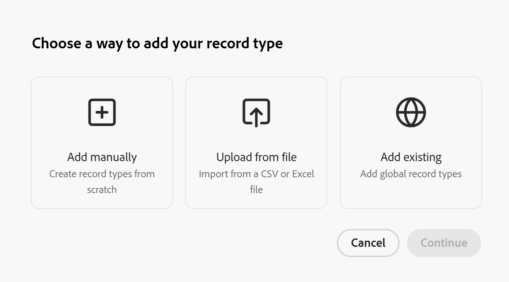

# Adicionar tipos de registro existentes de outro espaço de trabalho

{{planning-important-intro}}

<!--The information on this page refers to functionality not yet generally available. It is available only in the Preview environment for all customers. After the monthly releases to Production, the same features are also available in the Production environment for customers who enabled fast releases.    

For information about fast releases, see [Enable or disable fast releases for your organization](/help/quicksilver/administration-and-setup/set-up-workfront/configure-system-defaults/enable-fast-release-process.md). -->

Como um gerenciador de espaço de trabalho, você pode adicionar um tipo de registro que existe em outro espaço de trabalho a um espaço de trabalho gerenciado no Adobe Workfront Planning.

Um gerenciador de espaço de trabalho deve primeiro designar um tipo de registro como um tipo de registro global antes que você possa adicioná-lo aos espaços de trabalho que você gerencia como um tipo de registro existente. Os gerentes do Workspace podem designar um tipo de registro como global ao criá-lo ou editá-lo, definindo as configurações entre espaços de trabalho do tipo de registro.

Para obter informações, consulte [Configurar recursos entre espaços de trabalho para tipos de registro](/help/quicksilver/planning/architecture/configure-record-type-cross-workspace-capabilities.md).

Este artigo descreve como adicionar um tipo de registro a partir de um existente.

Antes de adicionar registros a um espaço de trabalho a partir de um tipo de registro global, consulte também o artigo [Visão geral dos tipos de registro entre espaços de trabalho](/help/quicksilver/planning/architecture/cross-workspace-record-types-overview.md).

## Requisitos de acesso

+++ Expanda para exibir os requisitos de acesso para a funcionalidade neste artigo.

<table style="table-layout:auto"> 
<col> 
</col> 
<col> 
</col> 
<tbody> 
    <tr> 
<tr> 
</tr>   
<tr> 
   <td role="rowheader">
Pacote do Adobe Workfront
</td> 
   <td> 
<ul><li>
Qualquer pacote Workfront e um pacote Planning Plus
</li>
Ou
<li>
Qualquer fluxo de trabalho e um pacote do Planning Prime ou Ultimate

</li></ul>

Para obter mais informações sobre o que está incluído em cada pacote do Workfront Planning, entre em contato com o representante de conta da Workfront. 
 
   </td> 
  <tr> 
   <td role="rowheader">
Licença do Adobe Workfront
</td> 
   <td>
Padrão

   </td> 
  </tr> 
  <tr> 
   <td role="rowheader">
Permissões de objeto
</td> 
   <td>   
Gerenciar permissões em um espaço de trabalho
  
   
Os administradores do sistema têm permissões para todos os espaços de trabalho, incluindo aqueles que não criaram
  </td> 
  </tr>  
</tbody> 
</table>

Para obter mais informações sobre requisitos de acesso do Workfront, consulte [Requisitos de acesso na documentação do Workfront](/help/quicksilver/administration-and-setup/add-users/access-levels-and-object-permissions/access-level-requirements-in-documentation.md).

+++   

<!--Old:
<table style="table-layout:auto"> 
<col> 
</col> 
<col> 
</col> 
<tbody> 
    <tr> 
<tr> 

  </tr>   
<tr> 
   <td role="rowheader">
Adobe Workfront package
</td> 
   <td> 
<ul><li>
Any Workfront package
</li>

And

<li>
Any Planning package to create connectable record types
</li>
<li>
A Planning Plus package to create global record types
</li>
</ul>
Or:
<ul><li>
A Prime or Ultimate Workflow package
 </li>
And
<li>
A Planning Prime or Ultimate package
</li></ul>

For more information about what is included in each Workfront Planning package, contact your Workfront account manager. 
 
   </td> 

  <tr> 
   <td role="rowheader">
Adobe Workfront license
</td> 
   <td>
Standard

   </td> 
  </tr> 
  <tr> 
   <td role="rowheader">
Object permissions
</td> 
   <td>   
Manage permissions to a workspace and to the record type</a> 
  
   
System Administrators have permissions to all workspaces, including the ones they did not create
  </td> 
  </tr>  
</tbody> 
</table>-->

## Criar um tipo de registro adicionando um existente de outro espaço de trabalho

>[!NOTE]
>
>Verifique se há pelo menos um tipo de registro designado como global em pelo menos um outro espaço de trabalho principal.
>
>Para obter informações, consulte [Configurar recursos entre espaços de trabalho para tipos de registro](/help/quicksilver/planning/architecture/configure-record-type-cross-workspace-capabilities.md).

1. Vá para um espaço de trabalho em que deseja criar um tipo de registro (espaço de trabalho secundário).
1. Comece a criar um tipo de registro, conforme descrito no artigo [Criar tipos de registro](/help/quicksilver/planning/architecture/create-record-types.md), em seguida, clique em **Adicionar existente**. <!--check this - the option might have been renamed in the UI-->

   

   >[!TIP]
   >
   >Quando não há tipos de registro configurados para serem adicionados a outros espaços de trabalho em seu sistema, a opção **Adicionar existente** não é exibida.

1. Clique em **Continuar**.
1. Na caixa **Escolher o tipo de registro**, clique no cartão do tipo de registro que deseja adicionar de um espaço de trabalho existente e clique em **Adicionar**.

   O tipo de registro é adicionado ao espaço de trabalho secundário selecionado e o ícone **do** tipo de registro global é exibido no cartão do tipo de registro.

   As seguintes situações ocorrem:

   * As seguintes informações também são adicionadas do tipo de registro global existente:

      * Todos os campos originais
      * Todas as conexões de registro
   * Não é possível exibir registros adicionados do espaço de trabalho original do tipo de registro do espaço de trabalho secundário.
   * Você pode exibir registros adicionados do espaço de trabalho original do tipo de registro nesse espaço de trabalho, somente no espaço de trabalho original, se tiver pelo menos permissões de Exibição para esse espaço de trabalho.
   * O campo somente leitura **Workspace** é adicionado à nova exibição de tabela do tipo de registro. O campo exibe o espaço de trabalho onde cada registro foi criado.

     >[!NOTE]
     >
     >Não é possível editar a aparência do novo tipo de registro, as configurações adicionais ou os campos originais. É possível editar o tipo de registro e todos os campos e configurações originais somente no espaço de trabalho original.
     >

1. (Opcional) Clique em, em seguida arraste e solte o tipo de registro recém-adicionado em qualquer seção no espaço de trabalho.
1. (Opcional) Clique no menu **Mais** no cartão do novo tipo de registro ou à direita do nome do tipo de registro em sua página e clique em uma das seguintes opções:

   * **Compartilhar** para compartilhar o tipo de registro do espaço de trabalho secundário.
   * **Excluir** para excluir o tipo de registro do espaço de trabalho secundário. A exclusão de tipos de registro do espaço de trabalho secundário também exclui registros adicionados do espaço de trabalho secundário.

     As exibições adicionadas do espaço de trabalho secundário não são excluídas. <!--checking with Lilit - not sure if this is by design??-->

   Para obter mais informações, consulte a seção &quot;Excluir tipos de registros globais&quot; no artigo [Excluir tipos de registros](/help/quicksilver/planning/architecture/delete-record-types.md).

<!--This will be released later with another epic: 
1. In the table view, click the **+** icon in the upper-right corner to add new fields. For information, see [Create fields](/help/quicksilver/planning/fields/create-fields.md).
1. (Optional) Click the **More** menu  in the new record type's card, or to the right of the record type's name on its page, then click **Share** to share it with other users in the same workspace, or adjust their permissions to the record type.
-->

&lt;!—verificando com Lilit se podemos adicionar automações ou solicitar formulários para RTs globais secundários??—adicione etapa com links para esses artigos se/ quando sim—>

