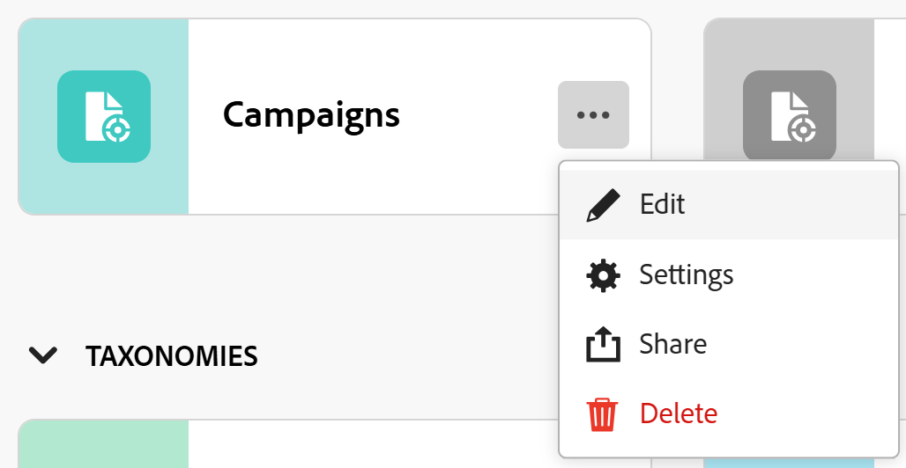

# Definir a área Configurações de um tipo de registro

As informações nesta página se referem a funcionalidades que ainda não estão disponíveis. Ela está disponível somente no ambiente de Pré-visualização para todos os clientes. Depois das versões mensais para produção, os mesmos recursos também ficam disponíveis no ambiente de produção para clientes que ativaram versões rápidas. 

Para obter informações sobre versões rápidas, consulte [Habilitar ou desabilitar versões rápidas para sua organização](/help/quicksilver/administration-and-setup/set-up-workfront/configure-system-defaults/enable-fast-release-process.md). 

{{planning-important-intro}}

Você pode definir configurações adicionais para um tipo de registro depois que elas tiverem sido salvas no Adobe Workfront Planning.

Dependendo dos recursos que deseja definir para um tipo de registro, é possível definir configurações adicionais seguindo um destes procedimentos:

<!--the above will need to be reworded when we add automations and manage request forms to this area-->

* Editá-los

  Para obter informações, consulte [Editar tipos de registros](/help/quicksilver/planning/architecture/edit-record-types.md).

* Definição da página Configurações de um tipo de registro.

  Este artigo descreve como editar um tipo de registro definindo sua página Configurações.

## Requisitos de acesso

+++ Expanda para exibir os requisitos de acesso para a funcionalidade neste artigo. 

<table style="table-layout:auto"> 
<col> 
</col> 
<col> 
</col> 
<tbody> 
    <tr> 
<tr> 
</tr>   
<tr> 
   <td role="rowheader">
Pacote do Adobe Workfront
</td> 
   <td> 

Qualquer pacote do Workfront e do Planning

Qualquer pacote de Fluxo de Trabalho e Planejamento

<b>Nota</b>

Para configurar tipos de registro conectáveis:

<ul> 
<li>
Qualquer pacote do Workfront e do Planning
</li>
Ou
<li>
Qualquer pacote de Workflow e um pacote do Planning Prime ou Ultimate
</li></ul>

Para configurar tipos de registro global:

<ul> 
<li>
Qualquer pacote Workfront e um pacote Planning Plus
</li>
Ou
<li>
Qualquer pacote de Workflow e um pacote do Planning Prime ou Ultimate
</li></ul>

Para obter mais informações sobre o que está incluído em cada pacote do Workfront Planning, entre em contato com o representante de conta da Workfront. 
 

   </td> </tr>
  <tr> 
   <td role="rowheader">
Licença do Adobe Workfront
</td> 
   <td>
Padrão

   </td> 
  </tr> 
  <tr> 
   <td role="rowheader">
Permissões de objeto
</td> 
   <td>   
Gerenciar permissões em um espaço de trabalho
  
   
Os administradores do sistema têm permissões para todos os espaços de trabalho, incluindo aqueles que não criaram
  </td> 
  </tr>  
</tbody> 
</table>

Para obter mais informações sobre requisitos de acesso do Workfront, consulte [Requisitos de acesso na documentação do Workfront](/help/quicksilver/administration-and-setup/add-users/access-levels-and-object-permissions/access-level-requirements-in-documentation.md).

+++    

<!--Old:

<table style="table-layout:auto"> 
<col> 
</col> 
<col> 
</col> 
<tbody> 
    <tr> 
<tr> 
<td> 
   
 Products
 </td> 
   <td> 
   <ul><li>
 Adobe Workfront
</li> 
   <li>
 Adobe Workfront Planning
</li></ul></td> 
  </tr>   
<tr> 
   <td role="rowheader">
Adobe Workfront plan*
</td> 
   <td> 

Any of the following Workfront plans:
 
<ul><li>Select</li> 
<li>Prime</li> 
<li>Ultimate</li></ul> 

Workfront Planning is not available for legacy Workfront plans
 
   </td> 
<tr> 
   <td role="rowheader">
Adobe Workfront Planning package*
</td> 
   <td> 

Any 
 

For more information about what is included in each Workfront Planning plan, contact your Workfront account manager. 
 
   </td> 
 <tr> 
   <td role="rowheader">
Adobe Workfront platform
</td> 
   <td> 

Your organization's instance of Workfront must be onboarded to the Adobe Unified Experience to be able to access Workfront Planning.
 

For more information, see <a href="/help/quicksilver/workfront-basics/navigate-workfront/workfront-navigation/adobe-unified-experience.md">Adobe Unified Experience for Workfront</a>. 
 
   </td> 
   </tr> 
  </tr> 
  <tr> 
   <td role="rowheader">
Adobe Workfront license*
</td> 
   <td>
 Standard 

   
Workfront Planning is not available for legacy Workfront licenses
 
  </td> 
  </tr> 
  <tr> 
   <td role="rowheader">
Access level configuration
</td> 
   <td> 
There are no access level controls for Adobe Workfront Planning
   
</td> 
  </tr> 
<tr> 
   <td role="rowheader">
Object permissions
</td> 
   <td>   
Manage permissions to a workspace and record type 
  
   
System Administrators have permissions to all workspaces, including the ones they did not create

   
Only system administrators can enable record types to connect from other workspaces
 </td> 
  </tr> 

</tbody> 
</table> 

-->

## Configurar informações de tipo de registro na página Configurações

Você pode definir recursos entre espaços de trabalho para um tipo de registro, configurando as informações na página Configurações.

<!--the intro above will change when we can configure more in this area -->

{{step1-to-planning}}

1. Clique no espaço de trabalho cujos tipos de registro você deseja editar,

   A página do espaço de trabalho é aberta e os tipos de registro são exibidos.
1. Siga um destes procedimentos:

   * Passe o mouse sobre o cartão de um tipo de registro e clique no menu **Mais**  no canto superior direito do cartão de tipo de registro e clique em **Configurações**

     

     Ou

   * Clique em um cartão de tipo de registro para abrir a página de tipo de registro, clique no menu **Mais**  à direita do nome do tipo de registro e clique em **Configurações**.

   <!--update screen shot at prod??-->

   

1. A seção **Configurações entre espaços de trabalho** está selecionada por padrão.
1. Ative ou desative uma das seguintes configurações:

   * **Permitir a adição deste tipo de registro a outros espaços de trabalho** para indicar que este é um tipo de registro global
   * **Permitir a conexão com este tipo de registro em outros espaços de trabalho** para indicar que este é um tipo de registro conectável.

   As configurações estão desativadas por padrão.

   Para obter mais informações, consulte [Configurar recursos entre espaços de trabalho para tipos de registro](/help/quicksilver/planning/architecture/configure-record-type-cross-workspace-capabilities.md)