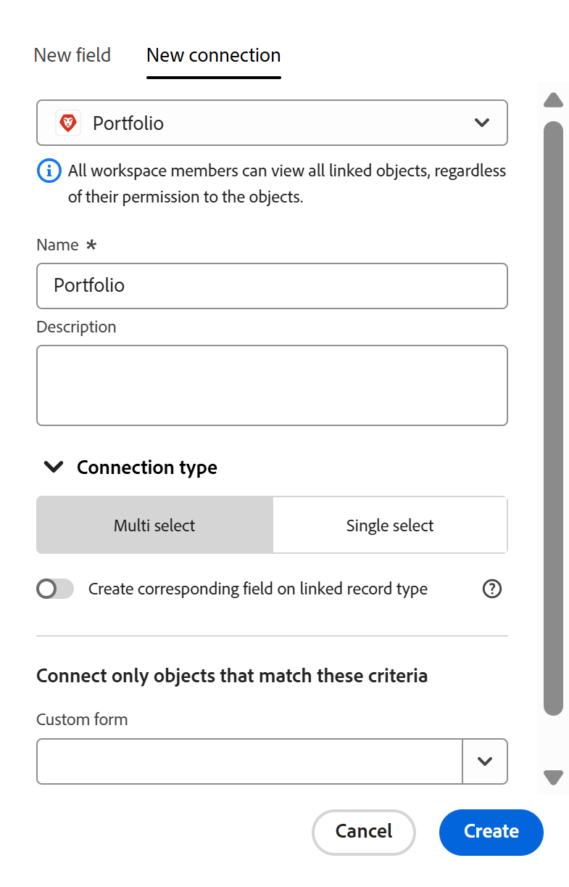
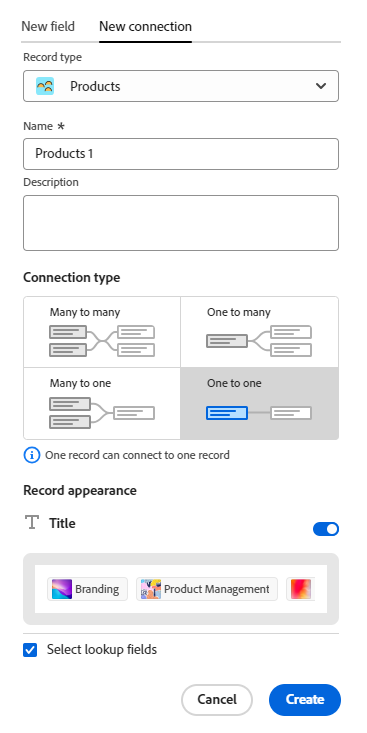

<!--keep the 30 limit verbiage in yellow til Jan 2026-->

# Visão geral dos tipos de registro conectados

<!--The highlighted information on this page refers to functionality not yet generally available. It is available only in the Preview environment for all customers. After the monthly releases to Production, the same features are also available in the Production environment for customers who enabled fast releases.    

For information about fast releases, see [Enable or disable fast releases for your organization](/help/quicksilver/administration-and-setup/set-up-workfront/configure-system-defaults/enable-fast-release-process.md).   -->

Você pode indicar que os tipos de registro individuais se relacionam entre si ou com objetos de outros aplicativos, conectando-os.

Este artigo é uma visão geral das conexões de tipo de registro e descreve os tipos de conexões que você pode estabelecer entre tipos de registro e de objeto.

Para obter informações sobre como conectar tipos de registro, consulte [Conectar tipos de registro](/help/quicksilver/planning/architecture/connect-record-types.md).

## Considerações sobre a conexão de tipos de registro

* Para que registros ou objetos individuais sejam conectados uns aos outros, os tipos de registro devem primeiro ser conectados a tipos de objeto.

  É possível conectar tipos de registro e tipos de objeto entre si das seguintes maneiras:

   * Manual
   * Automaticamente

  >[!NOTE]
  >
  >É possível ter até 30 campos conectados para um tipo de registro no Workfront Planning.

* Considere o seguinte sobre a conexão de tipos de registro e objeto:

   * Você pode adicionar manualmente um campo Nova Conexão de um tipo de registro para conectar as seguintes entidades no Workfront Planning:

      * Dois tipos de registro

        Por padrão, você pode conectar dois tipos de registro do mesmo espaço de trabalho. Você também pode configurar tipos de registro para se conectar a tipos de registro de outros espaços de trabalho, se sua organização tiver adquirido um pacote superior do Workfront ou do Planning. Para obter mais informações, consulte [Editar tipos de registros](/help/quicksilver/planning/architecture/edit-record-types.md).
      * Um tipo de registro e um tipo de objeto de outro aplicativo.

     Para obter informações sobre como conectar tipos de registro e objeto, consulte [Conectar tipos de registro](/help/quicksilver/planning/architecture/connect-record-types.md).

     Depois de conectar manualmente os tipos de registro a outros tipos de registro ou objeto, você pode conectar registros e objetos individuais.

     Para obter informações, consulte [Conectar registros](/help/quicksilver/planning/records/connect-records.md).

   * Uma conexão entre entidades é estabelecida automaticamente nos seguintes cenários:

      * Quando você usa uma automação para criar registros a partir da página de um tipo de registro.

        A conexão entre os tipos de registro ou o tipo de registro e o tipo de objeto de outro aplicativo é criada automaticamente quando a automação cria o registro ou objeto conectado.

        Para obter informações, consulte [Configurar automações do Adobe Workfront Planning](/help/quicksilver/planning/records/configure-automations-to-create-records.md).

      * Ao configurar formulários de solicitação para um tipo de registro para criar um registro ou um objeto.

        A conexão entre o tipo de registro e o tipo de objeto de solicitação é criada automaticamente quando você submete e aprova uma solicitação do Planning que cria um registro.

        Para obter informações, consulte [Enviar solicitações do Adobe Workfront Planning para criar registros](/help/quicksilver/planning/requests/submit-requests.md).

        Você pode exibir a solicitação original na área Solicitações do Workfront<!--, or in the Original Request connection field in Workfront Planning.-->.

   * Você pode conectar tipos de registro do Workfront Planning com os seguintes tipos de objeto dos seguintes aplicativos:

      * Adobe Workfront:

         * Projetos
         * Portfólios
         * Programas
         * Empresas
         * Grupo

      * Adobe Experience Manager Assets:

         * Imagens
         * Pastas

      * Adobe GenStudio for Performance Marketing

         * Marcas

        >[!IMPORTANT]
        >
        >Você deve ter o seguinte para se conectar com as Marcas Adobe Experience Manager Assets e GenStudio:
        >* Uma licença do Adobe Experience Manager Assets
        >* Uma licença do Adobe GenStudio for Performance Marketing
        >* A instância da Workfront de sua organização deve ser integrada à Adobe Business Platform ou à Adobe Admin Console para conectar os registros do Workfront Planning à Adobe Experience Manager Assets.
        >Para obter informações sobre a Adobe Admin Console, consulte as [Perguntas frequentes sobre a Experiência Unificada do Adobe](/help/quicksilver/workfront-basics/navigate-workfront/workfront-navigation/unified-experience-faq.md).

* Quando dois tipos de registro ou um tipo de registro e um tipo de objeto de outro aplicativo são conectados, os seguintes cenários existem:

   * **Quando você conecta dois tipos de registro do Planning**: um campo de registro vinculado é criado no tipo de registro do qual você está se conectando. Um campo de registro vinculado semelhante é criado no tipo de registro ao qual você está se conectando somente quando você ativa a configuração Criar campo correspondente no tipo de registro vinculado na guia Nova conexão.

     Por exemplo, se você conectar o tipo de registro &quot;Campanha&quot; ao tipo de registro &quot;Produto&quot;, um campo de registro vinculado (campo de conexão) chamado &quot;Produto vinculado&quot; será criado no tipo de registro Campanha. Um tipo de registro vinculado chamado automaticamente de &quot;Campanha&quot; é criado no tipo de registro Produto.

     Por exemplo, os seguintes cenários existem:

      * Ao habilitar a configuração Criar campo correspondente no tipo de registro vinculado e conectar o tipo de registro &quot;Campanha&quot; ao tipo de registro &quot;Produto&quot;, um campo de registro vinculado (campo de conexão) chamado &quot;Produto vinculado&quot; é criado no tipo de registro Campanha. Um tipo de registro vinculado chamado automaticamente de &quot;Campanha&quot; é criado no tipo de registro Produto.
      * Ao desativar a configuração Criar campo correspondente no tipo de registro vinculado e conectar o tipo de registro &quot;Campanha&quot; ao tipo de registro &quot;Produto&quot;, um campo de registro vinculado (campo de conexão) chamado &quot;Produto vinculado&quot; será criado no tipo de registro Campanha. Um tipo de registro vinculado chamado automaticamente de &quot;Campanha&quot; não é criado no tipo de registro Produto.

     Para obter mais informações, consulte [Tipos de registro de conexão](/help/quicksilver/planning/architecture/connect-record-types.md).

   * **Ao conectar um tipo de registro com um tipo de objeto de outro aplicativo**:

      * Um campo de registro vinculado é criado no tipo de registro ao qual você está se conectando. Nenhum campo de registro vinculado é criado automaticamente no tipo de objeto do outro aplicativo.
      * Os campos de registros de planejamento não podem ser acessados de objetos do Workfront.
      * Os registros do Planning ficam visíveis na seção Planejamento do objeto Workfront. Para obter informações, consulte [Gerenciar conexões de registro de objetos do Workfront](/help/quicksilver/planning/records/manage-records-in-planning-section.md).
      * Você pode criar um campo personalizado de conexão do Planning e anexá-lo ao formulário personalizado de um objeto do Workfront. Para obter informações, consulte [Criar um formulário personalizado](/help/quicksilver/administration-and-setup/customize-workfront/create-manage-custom-forms/form-designer/design-a-form/design-a-form.md).
      * Os campos de registro do Planning podem ser acessados a partir de ativos do Experience Manager quando o administrador do Workfront configura o mapeamento de metadados por meio da integração entre o Workfront e o Adobe Experience Manager Assets. Para obter mais informações, consulte [Configurar o mapeamento de metadados de ativos entre o Adobe Workfront e o Experience Manager Assets](https://experienceleague.adobe.com/en/docs/experience-manager-cloud-service/content/assets/integrations/configure-asset-metadata-mapping).
      * Os campos de registro de planejamento não podem ser acessados nas Marcas no GenStudio for Performance Marketing.

   * **Ao adicionar campos de pesquisa a partir do registro ou objeto ao qual você se conecta**: além de criar um campo de registro vinculado, você também pode se conectar a campos do registro ou tipo de objeto conectado que são chamados de campos de pesquisa. Um campo vinculado (ou de pesquisa) com informações do registro ao qual você está se conectando é exibido no registro do qual você está se conectando.

     Você pode conectar campos de outros tipos de registro ou objetos de outro aplicativo ao tipo de registro do Workfront Planning.

     Os campos vinculados são somente leitura e exibem automaticamente informações de registros conectados.

     Você pode fazer referência a campos de pesquisa de outros tipos de registro ou objeto em fórmulas, filtros ou agrupamentos.

     Por exemplo, se você conectar o tipo de registro &quot;Campanha&quot; com um projeto do Workfront e selecionar trazer o campo Data de conclusão planejada do projeto para o registro do Workfront Planning, um campo vinculado chamado Data de conclusão planejada (do projeto) será criado automaticamente para a campanha. Não é possível editar manualmente esse campo vinculado. O campo Data de conclusão planejada (do projeto) exibe a Data de conclusão planejada dos projetos vinculados.

     >[!IMPORTANT]
     >
     >Todos os usuários com permissões de Exibição ou superiores para o espaço de trabalho podem exibir as informações nos campos de pesquisa, independentemente de suas permissões ou nível de acesso na aplicação dos tipos de objeto vinculados ou suas permissões em outros espaços de trabalho.

     Os campos de registro vinculados são precedidos por um ícone de relação .

     Os campos vinculados são precedidos por um ícone que identifica o tipo de campo. Por exemplo, campos vinculados (ou de pesquisa) são precedidos por ícones que indicam que um campo é um número, um parágrafo ou uma data.

     >[!TIP]
     >
     >As informações do campo de data dos objetos do Workfront são exibidas no formato de 24 horas no Workfront Planning, independentemente de como são exibidas no Workfront.
     >
     >Por exemplo, se a Data de Início Planejada de um projeto for exibida como 3:00 PM no Workfront, ela será exibida como 15:00 no Workfront Planning em um campo de pesquisa importado.

   * Você deve conectar tipos de registro para poder criar hierarquias no Workfront Planning. Quando não existem, as conexões do tipo de registro são criadas automaticamente quando você cria uma hierarquia. Para obter informações, consulte [Criar hierarquias do espaço de trabalho](/help/quicksilver/planning/architecture/create-workspace-hierarchies.md).

## Tipos de conexão

Depois de estabelecer uma conexão entre dois tipos de registro ou entre um registro e um tipo de objeto de outro aplicativo, você pode adicionar registros nos campos de registro conectado.

>[!WARNING]
>
>As opções descritas nesta seção não estão disponíveis ao conectar o seguinte:
>
>* Dois registros de espaços de trabalho diferentes
>
>* Um tipo de registro e ativos do Experience Manager
>
>* Um tipo de registro e uma marca Adobe GenStudio

Você pode escolher se deseja conectar um registro a vários registros de cada vez ou um registro de cada vez entre si.

A seguir estão os tipos de conexão que você pode escolher ao conectar tipos de registro:

* Quando a configuração **Criar campo correspondente no tipo de registro vinculado** está desabilitada, você pode escolher entre:

   * [Seleção múltipla](#multi-select-connection-type)
   * [Seleção única](#single-select-connection-type)

* Quando a configuração **Criar campo correspondente no tipo de registro vinculado** estiver habilitada, você poderá escolher entre:

   * [Muitos para muitos](#many-to-many-connection-type)
   * [Um para muitos](#one-to-many-connection-type)
   * [Muitos para um](#many-to-one-connection-type)
   * [Um para um](#many-to-one-connection-type)

### Tipo de conexão de seleção múltipla

Ao criar uma conexão de seleção múltipla entre tipos de registro, você pode selecionar vários registros conectados no campo conexão do tipo de registro original.

Por exemplo, se você criar uma conexão de várias seleções entre campanhas e projetos, poderá selecionar vários projetos para uma campanha. Um tipo de registro conectado ao Campaign não é criado para o tipo de objeto Projeto.

Após selecionar esse tipo de conexão, você não poderá alterar o tipo de conexão depois de salvá-la em nenhum dos seguintes tipos:

* Seleção única
* Um para muitos
* Muitos para um
* Um para um

### Tipo de conexão de seleção única

Ao criar uma conexão de seleção única entre tipos de registro, você pode selecionar um registro no campo conexão do tipo de registro original.

Por exemplo, se você criar uma conexão de seleção única entre campanhas e empresas, poderá selecionar uma empresa para uma campanha. Um tipo de registro conectado ao Campaign não é criado para o tipo de objeto Empresa.

Após selecionar esse tipo de conexão, você não poderá alterá-lo depois de salvá-lo em uma das seguintes opções:

* Um para muitos
* Um para um

<!--
* [Many to many](#many-to-many-connection-type)
* [One to many](#one-to-many-connection-type)
* [Many to one](#many-to-one-connection-type)
* [One to one](#many-to-one-connection-type)
-->

### Tipo de conexão muitos para muitos

Ao criar uma conexão muitos para muitos entre os tipos de registro, você pode selecionar vários registros no campo de conexão de ambos os tipos de registro.

Por exemplo, se você criar uma conexão muitos para muitos entre campanhas e projetos, será possível selecionar vários projetos para cada campanha e várias campanhas para cada projeto.

Um exemplo real de um tipo de relacionamento muitos-para-muitos é o relacionamento entre filmes e atores. Cada filme pode ter vários atores, e cada ator pode jogar em vários filmes.

Ao selecionar esse tipo de conexão, você não pode alterar o tipo de conexão depois de salvá-lo.

### Tipo de conexão um para muitos

Ao criar uma conexão um para muitos entre os tipos de registro, você pode selecionar vários registros no campo conexão no tipo de registro atual, mas o campo conexão correspondente no tipo de registro ao qual você se conecta permitirá selecionar apenas um registro. O campo de registro conectado criado automaticamente no segundo tipo de registro é automaticamente definido como um tipo de relacionamento muitos para um.

Por exemplo, se você criar uma conexão um para muitos entre campanhas e projetos, será possível selecionar vários projetos para cada campanha, mas cada projeto poderá ser conectado a apenas uma campanha.

Um exemplo real de um tipo de relação um para muitos é a relação entre bibliotecas e livros: uma biblioteca tem muitos livros em seu inventário; mas um livro em particular só pode estar em uma biblioteca em um determinado momento.

Ao selecionar esse tipo de conexão, você poderá alterá-lo posteriormente somente para um tipo de conexão muitos para muitos.

### Tipo de conexão muitos para um

Ao criar uma conexão muitos para um entre os tipos de registro, você pode conectar cada registro no tipo de registro atual com apenas um registro do tipo de registro conectado. O campo de registro conectado que é criado automaticamente no segundo tipo de registro é automaticamente definido como um tipo de relacionamento um para muitos.

Por exemplo, se você conectar campanhas a projetos e escolher esse tipo de conexão, poderá adicionar apenas um projeto a uma campanha. Mas você pode adicionar várias campanhas a um projeto.

Um exemplo real de um tipo de relacionamento muitos-para-um é o relacionamento entre muitos filmes e um ator: um ator pode estar em muitos filmes, mas cada filme só pode ter um ator específico uma vez no elenco.

Ao selecionar esse tipo de conexão, você poderá alterá-lo posteriormente somente para um tipo de conexão muitos para muitos.

### Tipo de conexão um para um

Ao criar uma conexão um para um entre os tipos de registro, em ambos os tipos de registro você pode conectar cada registro somente a um registro do outro tipo.

Por exemplo, se você conectar campanhas a projetos e escolher esse tipo de conexão, será possível conectar uma campanha a um projeto. Um projeto pode ser conectado somente a uma campanha.

Um exemplo real de relação um para um é o que existe entre uma pessoa e o identificador exclusivo de seu país (como Número de Seguridade Social, ID de Passaporte, ID de identificação local): cada pessoa tem apenas um identificador exclusivo para um país e cada identificador exclusivo pode ser vinculado a apenas uma pessoa.

Ao selecionar esse tipo de conexão, você pode alterá-lo posteriormente para qualquer outro tipo.
