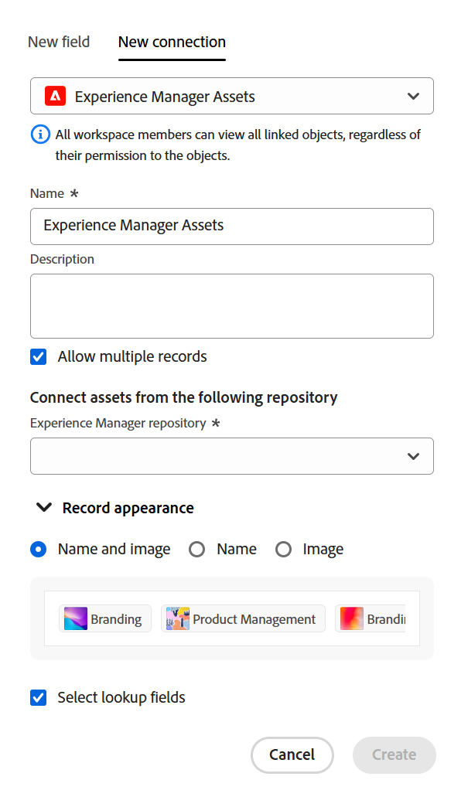

<!-----
title: Connect record types
description: A way to indicate how individual record types relate to one another is to connect them. Also, you can connect Adobe Workfront Planning record types with object types from other applications to enhance your users' experience and keep their focus in one application.
hidefromtoc: yes
hide: yes
feature: Work management
role: User
author: Alina
--->

<!--update the metadata with real information when making this avilable in TOC and in the left nav-->
<!--************ THIS MIGHT NO LONGER BE A 'RELATIONSHIP' TYPE FIELD, BECAUSE THEY WILL SHOW IT IN THE CONNECTION TAB*****************************-->

# Conectar tipos de registro

{{planning-important-intro}}

<!--
You can use Adobe Workfront Planning to design fully-customizable workspaces that contain record types needed in your organization. A way to indicate how individual record types relate to one another is to connect them. Also, you can connect Workfront Planning record types with object types from other applications to enhance your users' experience and keep their focus in one application. -->

Você pode conectar tipos de registro uns aos outros ou tipos de registro com tipos de objeto de outros aplicativos.

Este artigo descreve como é possível conectar dois tipos de registro do Workfront Planning a um tipo de registro do Workfront Planning com um objeto de outro aplicativo.

Depois de estabelecer a conexão entre registros ou tipos de objeto, você pode conectar registros individuais uns aos outros e exibir campos do registro vinculado ou tipos de objeto em um registro do Workfront Planning.

Para obter informações sobre como conectar um registro do Workfront Planning a um objeto de outro aplicativo, consulte [Conectar registros](/help/quicksilver/planning/records/connect-records.md).

Para obter um exemplo de conexão de tipos de registros e registros, consulte [Exemplo de conexão de tipos de registro e registros](/help/quicksilver/planning/architecture/example-connect-record-types-and-records.md).

<!--ensure this last linked article is right; the title and the link should have changed-->

## Requisitos de acesso

Você deve ter o seguinte acesso para executar as etapas deste artigo:

<table style="table-layout:auto">
 <col>
 </col>
 <col>
 </col>
 <tbody>
    <tr>
<tr>
<td>
   
 Produto
 </td>
   <td>
   
 Adobe Workfront
 
Para conectar tipos de registro do Adobe Workfront Planning com o Experience Manager Assets, você deve ter uma licença do Adobe Experience Manager Assets e a instância da Workfront de sua organização deve ser integrada à Experiência unificada do Adobe. Para obter informações, consulte <a href="/help/quicksilver/workfront-basics/navigate-workfront/workfront-navigation/adobe-unified-experience.md">Experiência unificada do Adobe para Workfront</a>.
 </td>
  </tr>  
 <td role="rowheader">
contrato do Adobe Workfront
</td>
   <td>

Sua organização deve estar inscrita no estágio de acesso antecipado do Workfront Planning 

   </td>
  </tr>
  <tr>
   <td role="rowheader">
plano do Adobe Workfront
</td>
   <td>

Qualquer

   </td>
  </tr>
  <tr>
   <td role="rowheader">
Licença da Adobe Workfront*
</td>
   <td>
   
Novo: Padrão
 
   
Atual: Plano

  </td>
  </tr>

<tr>
   <td role="rowheader">
Configurações de nível de acesso
</td>
   <td> 
Não há controles de nível de acesso para o Adobe Workfront Planning
  
</td>
  </tr>
<tr>
   <td role="rowheader">
Modelo de layout
</td>
   <td> 
O administrador do Workfront ou do grupo deve adicionar a área do Planning ao modelo de layout. Para obter informações, consulte <a href="/help/quicksilver/planning/access/access-overview.md">Visão geral do Access</a>. 
  
</td>
  </tr>
<tr>
   <td role="rowheader">
Permissões
</td>
   <td> 
Gerenciar permissões em um espaço de trabalho</a> 
  
   
Os administradores do sistema têm permissões para todos os espaços de trabalho, incluindo aqueles que não criaram.
</td>
  </tr>
 </tbody>
</table>

*Para obter informações, consulte [Requisitos de acesso na documentação do Workfront](/help/quicksilver/administration-and-setup/add-users/access-levels-and-object-permissions/access-level-requirements-in-documentation.md).

<!--Maybe enable this at GA - but planing is not supposed to have Access controls in the Workfront Access Level: 
>[!NOTE]
>
>If you don't have access, ask your Workfront administrator if they set additional restrictions in your access level. For information on how a Workfront administrator can change your access level, see [Create or modify custom access levels](/help/quicksilver/administration-and-setup/add-users/configure-and-grant-access/create-modify-access-levels.md). -->

<!-- Notes to add for the table: for the "Workfront plans" row: the above is only for closed beta; when going to GA - activate the following plans:    

Current plan: Prime and Ultimate

Legacy plan: Enterprise
-->

<!-- Notes for the table: for the "Workfront access" row: 
For more information, see <a href="../../administration-and-setup/add-users/access-levels-and-object-permissions/wf-licenses.md" class="MCXref xref">Adobe Workfront licenses overview</a>.
-->

## Considerações sobre a conexão de tipos de registro

* Você pode conectar as seguintes entidades no Adobe Workfront Planning:

   * Dois tipos de registro

     Os tipos de registro devem pertencer ao mesmo espaço de trabalho.
   * Um tipo de registro e um tipo de objeto de outro aplicativo.

* Você pode conectar tipos de registro do Workfront Planning com os seguintes tipos de objeto dos seguintes aplicativos:

   * Adobe Workfront:

      * Projetos
      * Portfólios
      * Programas
      * Empresas
      * Grupos

   * Adobe Experience Manager Assets:

      * Imagens
      * Pastas

     >[!IMPORTANT]
     >
     >Você deve ter uma licença do Adobe Experience Manager Assets e a instância da Workfront de sua organização deve ser integrada à Plataforma de negócios Adobe ou à Adobe Admin Console para conectar os registros do Workfront Planning à Adobe Experience Manager Assets.
     >
     >Em caso de dúvidas sobre a integração com a Adobe Admin Console, consulte [Perguntas frequentes sobre a experiência unificada do Adobe](/help/quicksilver/workfront-basics/navigate-workfront/workfront-navigation/unified-experience-faq.md).

* Depois de criar registros individuais para um tipo de registro, você pode selecionar os registros aos quais se conectar no campo Tipo de registro vinculado. Para obter informações, consulte [Conectar registros](/help/quicksilver/planning/records/connect-records.md).

* Depois de conectar um tipo de registro com outro tipo de registro ou com um tipo de objeto de outro aplicativo, existem os seguintes cenários:

   * **Quando você conecta dois tipos de registro**: um campo de registro vinculado é criado no tipo de registro ao qual você está se conectando. Um campo de registro vinculado semelhante é criado no tipo de registro ao qual você está se conectando.

     Por exemplo, se você conectar o tipo de registro &quot;Campanha&quot; ao tipo de registro &quot;Produto&quot;, um campo de registro vinculado chamado &quot;Produto vinculado&quot; será criado no tipo de registro Campanha e um tipo de registro vinculado chamado automaticamente &quot;Campanha&quot; será criado no tipo de registro Produto.

   * **Quando você conecta um tipo de registro a um tipo de objeto de outro aplicativo**:

      * Um campo de registro vinculado é criado no tipo de registro ao qual você está se conectando. Nenhum campo de registro vinculado é criado automaticamente no tipo de objeto do outro aplicativo.

      * Um novo tipo de registro somente leitura do Workfront Planning é criado apenas para o objeto do outro aplicativo quando objetos reais são conectados a registros do Workfront Planning.

        Para obter mais informações, consulte [Conectar registros](/help/quicksilver/planning/records/connect-records.md).

      * Os campos de registros de planejamento não podem ser acessados de objetos do Workfront.
      * Os campos de registro do Planning podem ser acessados de ativos do Experience Manager quando o administrador do Workfront configura o mapeamento de metadados por meio da integração entre o Workfront e o Adobe Experience Manager Assets. Para obter mais informações, consulte [Configurar o mapeamento de metadados de ativos entre o Adobe Workfront e o Experience Manager Assets](https://experienceleague.adobe.com/docs/experience-manager-cloud-service/content/assets/integrations/configure-asset-metadata-mapping.html?lang=en).

   * **Ao adicionar campos vinculados (ou de pesquisa) do registro ou objeto ao qual você se conecta**: é possível conectar campos do objeto do outro aplicativo ao tipo de registro do Workfront Planning. Os campos vinculados são somente leitura e exibem automaticamente informações de registros ou objetos conectados quando você os conecta ou aos objetos.

     Por exemplo, se você conectar o tipo de registro &quot;Campanha&quot; com um projeto do Workfront e selecionar trazer o campo Data de conclusão planejada do projeto para o registro do Workfront Planning, um campo vinculado chamado Data de conclusão planejada (do projeto) será criado automaticamente para a campanha. Não é possível editar manualmente esse campo vinculado. O campo Data de conclusão planejada (do projeto) exibe a Data de conclusão planejada dos projetos vinculados.

     >[!IMPORTANT]
     >
     >    Todos os usuários com permissões de Exibição ou superiores ao espaço de trabalho podem exibir as informações nos campos vinculados, independentemente das permissões ou do nível de acesso na aplicação dos tipos de objeto vinculados.

* Os campos de registro vinculados são precedidos por um ícone de relacionamento .

  Os campos vinculados são precedidos por um ícone que identifica o tipo de campo. Por exemplo, campos vinculados (ou de pesquisa) são precedidos por ícones que indicam que um campo é um número, um parágrafo ou uma data.

## Conectar tipos de registro

<!--when changes here, also update the article for "Connect records"-->

{{step1-to-planning}}

1. Clique no espaço de trabalho cujos tipos de registro você deseja conectar,

   Ou

   Em um espaço de trabalho, expanda a seta apontando para baixo à direita de um nome de espaço de trabalho existente e selecione o espaço de trabalho a partir do qual deseja conectar tipos de registro.
1. Clique no cartão de um tipo de registro para abrir a página do tipo de registro.
1. Clique em **+** no canto superior direito da exibição em tabela, em seguida, clique no **Nova conexão** guia.

   

1. No **Tipo de registro** , pesquise por um tipo de registro ou selecione uma das seguintes opções:

   * Outro tipo de registro da seção do espaço de trabalho selecionado

     

     >[!TIP]
     >
     >Somente os tipos de registro do espaço de trabalho selecionado estão disponíveis para conexão.
     > 
     >Se você não tiver outros tipos de registro no espaço de trabalho selecionado, a seção espaço de trabalho não será exibida.

   * A **Projeto, Portfolio, Programa, Empresa** ou **Grupo** do **Tipos de objeto do Workfront** seção.

     

   * **Experience Manager Assets** do **Aplicativos Adobe** seção.

     

1. Atualize as seguintes informações:

   * **Nome**: o nome do campo conectado, como ele aparecerá na exibição de tabela ou na página de registro do tipo de registro original. Isso cria a coluna de registro vinculado na exibição de tabela do tipo de registro original ou no campo de registro vinculado dos registros originais. Por padrão, o nome do campo é o nome do registro ou objeto ao qual você se conecta.

   >[!TIP]
   >
   >É possível ter várias conexões para o mesmo registro ou tipo de objeto. Se você não editar o nome do campo conectado, o Workfront adicionará um numeral após o nome do registro conectado, para indicar o número de tipos de registros conectados com o mesmo nome.

   * **Descrição**: informações adicionais sobre o campo de registro conectado. A descrição de um campo é exibida quando você passa o mouse sobre a coluna do campo em uma tabela.
   * **Permitir vários registros**: selecione essa opção para indicar que você permite que os usuários possam adicionar vários registros quando o campo de tipo de registro vinculado for exibido nos registros originais. É selecionado por padrão.
   * **Selecionar campos de pesquisa**: selecione essa opção para adicionar campos do tipo de registro selecionado. Os campos de pesquisa são campos associados ao registro ou tipo de objeto ao qual você está vinculando. Vinculá-los exibe informações do registro ou objeto ao qual você está vinculando no registro do qual você está gostando. É selecionado por padrão.

     >[!TIP]
     >
     > Não é possível adicionar os seguintes tipos de campo como campos de pesquisa:
     >
     >    * Pessoas
     >    * Criado por
     >    * Modificado pela última vez por
     >    * Campos de digitação antecipada do Workfront (incluindo campos como Proprietário do projeto ou Patrocinador do projeto)

1. (Condicional e opcional) Se você selecionou conectar um objeto do Workfront, selecione um **Formulário personalizado** do **Vincular somente objetos que correspondam a estes critérios** seção. Somente objetos que tenham os formulários personalizados selecionados anexados podem ser vinculados ao tipo de registro selecionado. É possível selecionar mais de um formulário.

   >[!NOTE]
   >
   > Você deve criar formulários personalizados no Workfront para os objetos selecionados antes que eles sejam exibidos nesta lista.

1. (Condicional) Se você selecionou se conectar ao Experience Manager Assets, selecione um repositório na lista **repositório Experience Manager** menu suspenso no **Vincular ativos do seguinte repositório** seção. Este campo é obrigatório. Somente repositórios aos quais você tem acesso no Experience Manager Assets são exibidos nesse campo.

   >[!NOTE]
   >
   >O administrador do Workfront pode mapear campos do Workfront Planning para campos do Experience Manager Assets por meio do mapeamento de metadados no Workfront. Para obter mais informações, consulte [Configurar o mapeamento de metadados de ativos entre o Adobe Workfront e o Experience Manager Assets](https://experienceleague.adobe.com/docs/experience-manager-cloud-service/content/assets/integrations/configure-asset-metadata-mapping.html?lang=en).

1. (Condicional) Se você selecionou se conectar ao Experience Manager Assets ou a um tipo de registro do Workfront Planning, desative a opção **Título** alternar no **Gravar aparência** se não quiser que o título dos registros ou ativos conectados seja exibido no campo vinculado. Quando desativado, somente as miniaturas dos registros são exibidas nos campos vinculados. Os registros sem uma imagem em miniatura exibem um ícone de imagem. O botão de alternância é ativado por padrão. Um exemplo de como os registros conectados serão exibidos é exibido na **Gravar aparência** área.

   >[!TIP]
   >
   >    Quando você permite que vários registros sejam vinculados, exibir somente a miniatura pode economizar espaço em áreas menores, como visualizações de registros.
   >
   >O título de um registro é o campo principal do registro. Para obter mais informações, consulte [Visão geral do campo principal](/help/quicksilver/planning/fields/primary-field-overview.md).

1. Clique em **Criar**.

1. (Condicional) Se você selecionou a variável **Selecionar campo de pesquisa** configuração, a variável **Adicionar campos de pesquisa** é aberta.

   Clique em **+** ícone para adicionar campos do **Campos não selecionados** área.

   Ou

   Clique em **-** ícone para remover campos do **Campos selecionados** área

   

   Os valores dos campos conectados são preenchidos automaticamente depois de vincular registros ou objetos.

   >[!IMPORTANT]
   >
   >    Todos os usuários com permissões de Exibição ou superiores ao espaço de trabalho podem exibir as informações nos campos vinculados, independentemente das permissões ou do nível de acesso na aplicação dos tipos de objeto vinculados.

1. (Opcional) Clique em **Ignorar** para ignorar a adição de campos do registro vinculado ou do tipo de objeto. A variável **Nome** ou o **Título** do registro vinculado é o único campo visível na exibição de tabela do tipo de registro ao qual você está se conectando.

1. (Opcional e condicional) Se você optar por vincular um campo do tipo número, moeda, porcentagem ou data, selecione também um valor agregador. Os valores dos campos vinculados são exibidos separados por vírgulas ou como um valor agregado de acordo com o agregador escolhido, quando os usuários selecionam mais de um registro vinculado no campo de registro vinculado.

   >[!IMPORTANT]
   >
   >    Você deve selecionar um valor agregador ao adicionar campos de data de pesquisa, se quiser que os campos estejam disponíveis para serem adicionados como Datas inicial e final para as exibições de linha do tempo e calendário. Por exemplo, você pode selecionar o agregador MAX ou MIN para um campo de data de pesquisa.

   

   >[!NOTE]
   >
   > Os agregadores não estão disponíveis ao conectar tipos de registro ao Experience Manager Assets.

   Selecione entre as seguintes opções:

   * **Nenhum**: exibe os valores que vêm de vários registros separados por vírgulas. Esta é a seleção padrão.
   * **MAX**: exibe o valor mais alto de todos os valores que vêm de vários registros selecionados no campo de registro vinculado.
   * **MÍN**: exibe o valor mais baixo de todos os valores que vêm de vários registros selecionados no campo de registro vinculado.
   * **SOMA**: exibe o total de todos os valores que vêm de vários registros selecionados no campo de registro vinculado.
   * **AVG**: exibe a média de todos os valores que vêm de vários registros selecionados no campo de registro vinculado.
   * **ÚNICO**: remove as duplicatas dos valores do campo de pesquisa e mostra apenas os valores exclusivos. Isso não está disponível para os seguintes tipos de campo:
      * Parágrafo
      * Caixa de seleção
      * Pessoas

   >[!NOTE]
   >
   >Por exemplo, você pode vincular o registro Product (registro vinculado) do registro Campaign (registro original) e nomeá-lo como &quot;Campo de produto&quot;. Também é possível vincular o campo Budget do registro Product do registro Campaign e chamá-lo de &quot;Product Budget&quot;. Se você tiver permissão para selecionar vários registros no &quot;campo Produto&quot;, poderá selecionar o Produto 1 com um Orçamento de $100.000 e o Produto 2 com um Orçamento de $110.000 e o Produto 3 com um Orçamento de $100.000. Você pode exibir as seguintes informações de Orçamento no campo vinculado do registro original, dependendo do agregador escolhido:
   >
   >* **Nenhum**: $100.000, $110.000, $100.000
   >* **MAX**: US$ 110.000
   >* **MÍN**: US$ 100.000
   >* **SOMA**: US$ 310.000
   >* **AVG**: US$ 103.000,33
   >* **ÚNICO**: US$ 100.000
   >

1. (Opcional) Use o **pesquisa** ícone  para procurar um campo.

1. Clique em **Adicionar campos** para salvar as alterações.

   Os seguintes itens são adicionados:

   * Um campo de registro vinculado no tipo de registro a partir do qual você está vinculando. O campo de registro vinculado exibirá registros individuais do tipo de registro vinculado depois que você os adicionar manualmente. Para obter informações sobre como adicionar registros, consulte [Conectar registros](/help/quicksilver/planning/records/connect-records.md). O nome do campo de registro vinculado é o nome selecionado na etapa 7. <!--accurate-->

   * Um campo (ou campos) vinculado (ou de pesquisa) que exibe informações sobre o registro ou os tipos de objeto vinculados depois de adicionar manualmente os registros ou objetos no campo de registro vinculado. Os campos de pesquisa são criados somente quando a variável **Selecionar campos de pesquisa** for selecionada ao criar a conexão. Os campos de pesquisa são nomeados automaticamente de acordo com este padrão:

     `<Name of the original field on the linked record> (from <Name of your linked field>)`

     Por exemplo, se você vinculou um tipo de registro de Campanha a um tipo de registro de Programa e o nome do campo de registro vinculado Programa &quot;Informações do programa&quot;, selecione para exibir também o campo Orçamento do programa na exibição de tabela da Campanha, o campo vinculado será automaticamente nomeado `Budget (from Program information)` na exibição de tabela da campanha.

   * Quando você vincula tipos de registro um ao outro, um campo de registro vinculado também é adicionado ao tipo de registro ao qual você está vinculando. O nome do campo de registro vinculado no tipo de registro vinculado é o nome do tipo de registro que você vincula.

     Por exemplo, se você vincular o tipo de registro &quot;Produto&quot; do tipo de registro &quot;Campanha&quot; e nomear o campo conectado do &quot;Produto vinculado&quot; da Campanha, um campo de registro vinculado &quot;Campanha&quot; será criado para o tipo de registro Produto.

     >[!TIP]
     >
     > Um campo de registro vinculado não é criado para objetos de outro aplicativo para o tipo de registro que você está vinculando no Workfront Planning.

1. (Opcional e condicional) Na exibição da tabela do tipo de registro original ou da tabela do tipo de registro vinculado, clique na seta para baixo no cabeçalho dos campos de registro vinculados e, em seguida, clique em uma das seguintes opções:

   * **Editar campo**: Você pode atualizar o **Nome** e a variável **Descrição** informações do campo.
   * **Editar campos de pesquisa**: adicione ou remova qualquer um dos campos do registro vinculado.

   

   Para adicionar ou remover campos de pesquisa, siga as instruções nas etapas 10 a 14 acima. <!--ensure these step numbers stay accurate-->

   >[!NOTE]
   >
   > Não é possível adicionar campos de pesquisa que pertençam a tipos de registro que você está vinculando a tipos de objeto de outro aplicativo.
   >
   > Por exemplo, não é possível adicionar o campo de pesquisa &quot;Status da campanha&quot; a um projeto do Workfront ao qual você está vinculando nas campanhas.

1. (Opcional) Clique na seta para baixo no cabeçalho de um campo de registro vinculado ou no cabeçalho de um campo de pesquisa do tipo de registro que você está vinculando e clique em **Excluir**.

   O campo de registro ou o campo de pesquisa são excluídos. Se você excluir um campo de registro, quaisquer campos de pesquisa associados ao registro vinculado também serão excluídos.
