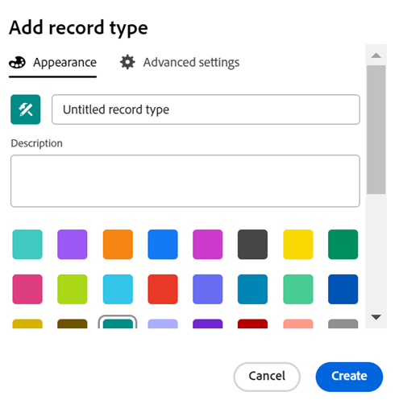

<!--this is linked to the UI in an empty workspace screen-->

# Criar tipos de registro

{{planning-important-intro}}

Os tipos de registro são os tipos de objeto do Adobe Workfront Planning. No Workfront Planning, você pode criar tipos de registro personalizados que ilustrem os itens relacionados ao trabalho necessários no ciclo de vida da organização.

Para obter mais informações sobre tipos de registros, consulte [Visão geral sobre tipos de registros](/help/quicksilver/planning/architecture/overview-of-record-types.md).

## Requisitos de acesso

+++ Expanda para exibir os requisitos de acesso do Workfront Planning.

Para acessar o Workfront Planning, é necessário ter o seguinte:

<table style="table-layout:auto"> 
<col> 
</col> 
<col> 
</col> 
<tbody> 
    <tr> 
<tr> 
<td> 
   
 Produtos
 </td> 
   <td> 
   <ul><li>
 Adobe Workfront
</li> 
   <li>
 Planejamento do Adobe Workfront
</li></ul></td> 
  </tr>   
<tr> 
   <td role="rowheader">
plano do Adobe Workfront*
</td> 
   <td> 

Qualquer um dos seguintes planos da Workfront:
 
<ul><li>Selecionar</li> 
<li>Prime</li> 
<li>Ultimate</li></ul> 

O Workfront Planning não está disponível para planos herdados do Workfront
 
   </td> 
<tr> 
   <td role="rowheader">
Plano de planejamento do Adobe Workfront*
</td> 
   <td> 

Qualquer 
 

Para obter mais informações sobre o que está incluído em cada plano do Workfront Planning, entre em contato com seu gerente de conta da Workfront. 
 
   </td> 
 <tr> 
   <td role="rowheader">
plataforma Adobe Workfront
</td> 
   <td> 

A instância da Workfront de sua organização deve ser integrada à Adobe Unified Experience para acessar todos os recursos do Workfront Planning.
 

Para obter mais informações, consulte <a href="/help/quicksilver/workfront-basics/navigate-workfront/workfront-navigation/adobe-unified-experience.md">Experiência unificada do Adobe para Workfront</a>. 
 
   </td> 
   </tr> 
  </tr> 
  <tr> 
   <td role="rowheader">
Licença da Adobe Workfront*
</td> 
   <td>
 Padrão

   
O Workfront Planning não está disponível para licenças herdadas do Workfront
 
  </td> 
  </tr> 
  <tr> 
   <td role="rowheader">
Configuração do nível de acesso
</td> 
   <td> 
Não há controles de nível de acesso para o Adobe Workfront Planning
   
</td> 
  </tr> 
<tr> 
   <td role="rowheader">
Permissões de objeto
</td> 
   <td>   
Gerenciar permissões para um espaço de trabalho</a> 
  
   
Os administradores do sistema têm permissões para todos os espaços de trabalho, incluindo aqueles que não criaram
  </td> 
  </tr> 
<tr> 
   <td role="rowheader">
Modelo de layout
</td> 
   <td> 
Todos os usuários, incluindo administradores do Workfront, devem receber um modelo de layout que inclua a área Planejamento no Menu principal. 
 </td> 
  </tr> 
</tbody> 
</table>

*Para obter mais informações sobre requisitos de acesso do Workfront, consulte [Requisitos de acesso na documentação do Workfront](/help/quicksilver/administration-and-setup/add-users/access-levels-and-object-permissions/access-level-requirements-in-documentation.md).

+++

<!--
OLD: 

<table style="table-layout:auto">
 <col>
 </col>
 <col>
 </col>
 <tbody>
    <tr>
<tr>
<td>
   
 Product
 </td>
   <td> Adobe Workfront
   </td>
  </tr>  
 <td role="rowheader">
Adobe Workfront agreement
</td>
   <td>

Your organization must be enrolled in the early access stage for Workfront Planning 

   </td>
  </tr>
  <tr>
   <td role="rowheader">
Adobe Workfront plan
</td>
   <td>

Any

   </td>
  </tr>
  <tr>
   <td role="rowheader">
Adobe Workfront license*
</td>
   <td>
   
Current: Plan

   Or
   
New: Standard 
 
  </td>
  </tr>
  
  <tr>
   <td role="rowheader">
Access level configurations
</td>
   <td> 
There are no access level controls for Workfront Planning
  
</td>
  </tr>
<tr>
   <td role="rowheader">
Layout template
</td>
   <td> 
Your Workfront or group administrator must add the Planning area in your layout template. For information, see <a href="/help/quicksilver/planning/access/access-overview.md">Access overview</a>. 
  
</td>
  </tr>
<tr>
   <td role="rowheader">
Permissions
</td>
   <td> 
Manage permissions to a workspace</a> 
  
   
System Administrators have permissions to all workspaces, including the ones they did not create

</td>
  </tr>
 </tbody>
</table>

*For information, see [Access requirements in Workfront documentation](/help/quicksilver/administration-and-setup/add-users/access-levels-and-object-permissions/access-level-requirements-in-documentation.md). 
-->

## Considerações sobre a criação de tipos de registro

* Você pode criar tipos de registro em um espaço de trabalho das seguintes maneiras:

   * Automaticamente:
      * Ao criar um espaço de trabalho usando um modelo.

        Para obter informações, consulte [Criar espaços de trabalho](/help/quicksilver/planning/architecture/create-workspaces.md).

     <!--* When you import them using an Excel or CSV file. 

            >[!IMPORTANT]
            >
            >This functionality has been temporarily removed since March 21, 2024. It will be enabled at a later date.-->

     <!--this should not ne known anymore: * When you add objects from another application to a linked record field of a record. This creates a read-only record type in Workfront Planning which is connected to object types from the original application. 
        For information about connecting record types with object types from another application, see [Connect record types](/help/quicksilver/planning/architecture/connect-record-types.md).
        For information about connecting objects with records, see [Connect records](/help/quicksilver/planning/records/connect-records.md). -->
   * Manualmente:

      * Do zero.

        Este artigo descreve como criar tipos de registro do zero.

* Você pode mover tipos de registro em uma seção e de uma seção de um espaço de trabalho para outra. Não é possível mover tipos de registro de um espaço de trabalho para outro.

## Criar tipos de registro usando um modelo de espaço de trabalho

É possível criar tipos de registro automaticamente ao criar um espaço de trabalho usando um modelo do Workfront Planning. Cada modelo contém tipos de registro de amostra.

Ao criar um espaço de trabalho a partir de um modelo, os tipos de registro são agrupados nas seguintes seções:

* Tipos de registro operacional
* Taxonomias

Você pode adicionar tipos de registro manualmente nas seções Tipos de Registro Operacionais e Taxonomias.

Para obter informações sobre como criar espaços de trabalho, consulte [Criar espaços de trabalho](/help/quicksilver/planning/architecture/create-workspaces.md).

Para obter informações sobre quais tipos de registro são incluídos em cada modelo, consulte [Lista de modelos de espaço de trabalho](/help/quicksilver/planning/architecture/workspace-templates.md).

## Criar um tipo de registro do zero

{{step1-to-planning}}

1. Clique no espaço de trabalho onde deseja criar um tipo de registro,

   Ou

   Em um espaço de trabalho, expanda a seta apontando para baixo à direita do nome de um espaço de trabalho existente, procure um espaço de trabalho e selecione-o quando ele for exibido na lista.
1. (Opcional) Clique em **Adicionar seção** para adicionar uma nova seção ao espaço de trabalho.
1. Clique em **Adicionar tipo de registro**.

   A caixa Adicionar tipo de registro é aberta.
   <!--1. (Conditional) When creating record types by importing an Excel or CSV file is enabled, click **From scratch**. Otherwise, the **Add record type** box opens. -->

   

1. Atualize as seguintes informações:

   * Substitua &quot;Tipo de registro sem título&quot; pelo nome do seu tipo de registro futuro. <!--did they bring back the field label here and did they rename it to "Name"-->
   * **Descrição**: adicione mais informações sobre o tipo de registro.
   * Selecione uma cor e uma forma para o ícone associado ao tipo de registro. Faça o seguinte:
      * Selecione uma cor para identificar o novo tipo de registro. Esta é a cor do ícone do tipo de registro. O cinza é selecionado por padrão.
      * Selecione um ícone na lista ou comece a digitar o nome de um ícone para descrever o que ele representa e, em seguida, selecione-o quando ele for exibido. Este é o ícone do tipo de registro. Um ícone de arquivo é selecionado por padrão.

1. Clique em **Criar**.

   O cartão de tipo de registro é adicionado à seção e ao espaço de trabalho selecionados.
A Descrição do tipo de registro é exibida no cartão.

   

1. (Opcional) Passe o mouse sobre o cartão de tipo de registro, clique no ícone **Mais**  no canto superior direito e clique em **Editar** para modificar as informações sobre o tipo de registro.
1. (Opcional) Clique no cartão de tipo de registro para abrir a página de tipo de registro.

   

   A página de tipo de registro é exibida na exibição de tabela por padrão. As colunas da tabela são campos associados ao novo tipo de registro. Cada linha é um registro exclusivo que deve ser adicionado.

   <!--TIP: If you import a record type from an Excel or CSV file, records are also imported.-->

   Por padrão, os seguintes campos são exibidos nas colunas de exibição de tabela de um tipo de registro operacional:

   * Nome
   * Descrição
   * Data de início
   * Data Final
   * Status

1. (Opcional) Atualize o nome do tipo de registro no cabeçalho da página

   Ou

   Clique no ícone **Mais**  à direita do nome do tipo de registro e clique em **Editar** para renomeá-lo ou alterar as informações sobre ele. Para obter mais informações, consulte [Editar tipos de registros](/help/quicksilver/planning/architecture/edit-record-types.md).

1. (Opcional) Clique em **+ Novo registro** para adicionar registros do tipo de registro selecionado. Para obter mais informações, consulte [Criar registros](/help/quicksilver/planning/records/create-records.md).
1. (Opcional) Clique no ícone **+** no canto superior direito da tabela para adicionar mais campos ao tipo de registro.

   Para obter mais informações sobre como criar campos, consulte [Criar campos](/help/quicksilver/planning/fields/create-fields.md).

1. (Opcional) Clique na seta à esquerda do nome do tipo de registro, no cabeçalho, para voltar ao espaço de trabalho selecionado.

1. (Opcional) No espaço de trabalho, clique e mantenha pressionado um cartão de tipo de registro para arrastar e soltar o tipo de registro em um ponto desejado ou para movê-lo para outra seção.

   As alterações são salvas automaticamente.

   Para obter informações adicionais sobre como adicionar registros, excluir ou editar tipos de registro ou atualizar a exibição na página tipo de registro, consulte os seguintes artigos:

   * [Criar registros](/help/quicksilver/planning/records/create-records.md)
   * [Excluir tipos de registro](/help/quicksilver/planning/architecture/delete-record-types.md)
   * [Editar tipos de registro](/help/quicksilver/planning/architecture/edit-record-types.md)
   * [Gerenciar exibições de registros](/help/quicksilver/planning/views/manage-record-views.md)

<!--
## Create record types by importing an Excel or CSV file

>[!IMPORTANT]
>
>This functionality has been temporarily removed since March 21, 2024. It will be enabled at a later date.

Consider the following when importing record types using an Excel or CSV file: 

* Each sheet of the Excel file becomes a record type. 
* The columns of each sheet become the fields associated with each record type. 
* Fields are unique for their respective record types. 
* Each row in each sheet becomes a unique record associated with its respective record type. 
* Each sheet of the Excel file should not exceed the following: 
    * 50,000 rows
    * 500 columns
* The Excel file should not be larger than 5MB.
* Empty sheets are not supported. 

To import record types using an Excel file: 

{{step1-to-planning}}

1. Click the workspace where you want to create record types, 

    Or

    From a workspace, expand the downward-pointing arrow to the right of an existing workspace name, search for a workspace, then select it when it displays in the list.
1. Click **Add record type**. 
1. Click **Excel/CSV**.
1. Drag and drop an Excel or CSV file previously saved on your computer, or click **Select a CSV or Excel file** to browse for one. 
1. Click **Review your data**.
    
    The Preview and edit box displays with the following information: 

    * The names of the sheets or of the future record types display in the left panel. Workfront Planning selects an icon and a color for each new record type by default.
    * The first sheet or record type is selected and the names of the fields associated with it display as the column headers. The type of each field is selected by default. 
    * Each row represents a new record. Only the first 10 records display in the Preview and edit box. 

    

1. (Optional) Click the name of each sheet in the left panel to review the information it contains. 

    >[!NOTE]
    >
    >    Sheets that are empty are not supported and are dimmed. 

1. (Optional) Click the **Select sheets to import** drop-down menu and deselect the sheets that you don't want to import. 

    

    Sheets you deselected display with a gray background. 

1. Click **Import** when you are ready to import your file. 

    The following information imports in to Workfront Planning:

    * New record types
    * New fields associated with each record type
    * New records associated with each record type

    You can start managing fields and records on the record types pages. 
    
    Everyone with access to Workfront Planning can now view and edit the imported record types and their information.-->

