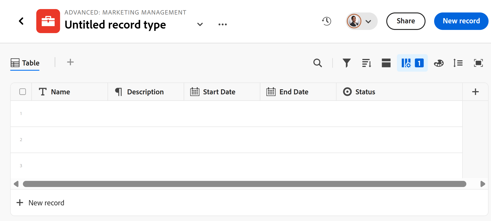

<!--this is linked to the UI in an empty workspace screen-->

# Criar tipos de registro

As informações nesta página se referem a funcionalidades que ainda não estão disponíveis. Ela está disponível somente no ambiente de Pré-visualização para todos os clientes. Depois das versões mensais para produção, os mesmos recursos também ficam disponíveis no ambiente de produção para clientes que ativaram versões rápidas. 

Para obter informações sobre versões rápidas, consulte [Habilitar ou desabilitar versões rápidas para sua organização](/help/quicksilver/administration-and-setup/set-up-workfront/configure-system-defaults/enable-fast-release-process.md). 

{{planning-important-intro}}

Os tipos de registro são os tipos de objeto do Adobe Workfront Planning. No Workfront Planning, você pode criar tipos de registro personalizados que ilustrem os itens relacionados ao trabalho necessários no ciclo de vida da organização.

Para obter mais informações sobre tipos de registros, consulte [Visão geral sobre tipos de registros](/help/quicksilver/planning/architecture/overview-of-record-types.md).

## Requisitos de acesso

+++ Expanda para exibir os requisitos de acesso do Workfront Planning.

Você deve ter o seguinte acesso para executar as etapas deste artigo:

<table style="table-layout:auto"> 
<col> 
</col> 
<col> 
</col> 
<tbody> 
    <tr> 
<tr> 
<td> 
   
 Produtos
 </td> 
   <td> 
   <ul><li>
 Adobe Workfront
</li> 
   <li>
 Planejamento do Adobe Workfront
</li></ul></td> 
  </tr>   
<tr> 
   <td role="rowheader">
plano do Adobe Workfront*
</td> 
   <td> 

Qualquer um dos seguintes planos da Workfront:
 
<ul><li>Selecionar</li> 
<li>Prime</li> 
<li>Ultimate</li></ul> 

O Workfront Planning não está disponível para planos herdados do Workfront
 
   </td> 
<tr> 
   <td role="rowheader">
Pacote de planejamento do Adobe Workfront*
</td> 
   <td> 

Qualquer 
 

Para obter mais informações sobre o que está incluído em cada plano do Workfront Planning, entre em contato com seu gerente de conta da Workfront. 
 
   </td> 
 <tr> 
   <td role="rowheader">
plataforma Adobe Workfront
</td> 
   <td> 

A instância da Workfront de sua organização deve ser integrada à Adobe Unified Experience para acessar todos os recursos do Workfront Planning.
 

Para obter mais informações, consulte <a href="/help/quicksilver/workfront-basics/navigate-workfront/workfront-navigation/adobe-unified-experience.md">Experiência unificada do Adobe para Workfront</a>. 
 
   </td> 
   </tr> 
  </tr> 
  <tr> 
   <td role="rowheader">
Licença da Adobe Workfront*
</td> 
   <td>
 Padrão

   
O Workfront Planning não está disponível para licenças herdadas do Workfront
 
  </td> 
  </tr> 
  <tr> 
   <td role="rowheader">
Configuração do nível de acesso
</td> 
   <td> 
Não há controles de nível de acesso para o Adobe Workfront Planning
   
</td> 
  </tr> 
<tr> 
   <td role="rowheader">
Permissões de objeto
</td> 
   <td>   
Gerenciar permissões para um espaço de trabalho</a> 
  
   
Os administradores do sistema têm permissões para todos os espaços de trabalho, incluindo aqueles que não criaram
  </td> 
  </tr> 
<tr> 
   <td role="rowheader">
Modelo de layout
</td> 
   <td> 
Todos os usuários, incluindo administradores do Workfront, devem receber um modelo de layout que inclua a área Planejamento no Menu principal. 
 </td> 
  </tr> 
</tbody> 
</table>

*Para obter mais informações sobre requisitos de acesso do Workfront, consulte [Requisitos de acesso na documentação do Workfront](/help/quicksilver/administration-and-setup/add-users/access-levels-and-object-permissions/access-level-requirements-in-documentation.md).

+++

## Considerações sobre a criação de tipos de registro

* Você pode criar tipos de registro em um espaço de trabalho das seguintes maneiras:

   * Automaticamente:
      * Ao criar um espaço de trabalho usando um modelo.

        Para obter informações, consulte [Criar espaços de trabalho](/help/quicksilver/planning/architecture/create-workspaces.md).

      * Ao importá-los usando um arquivo Excel ou CSV. 

     >[!TIP]
     >
     >Ao importar um tipo de registro de um arquivo do Excel ou CSV, os registros e campos também podem ser importados.

   * Manualmente:

      * Do zero.

        Este artigo descreve como criar tipos de registro do zero.

* Você pode mover tipos de registro em uma seção e de uma seção de um espaço de trabalho para outra. Não é possível mover tipos de registro de um espaço de trabalho para outro.

## Criar tipos de registro usando um modelo de espaço de trabalho

É possível criar tipos de registro automaticamente ao criar um espaço de trabalho usando um modelo do Workfront Planning. Cada modelo contém tipos de registro de amostra.

Ao criar um espaço de trabalho a partir de um modelo, os tipos de registro são agrupados nas seguintes seções:

* Tipos de registro operacional
* Taxonomias

Você pode adicionar tipos de registro manualmente nas seções Tipos de Registro Operacionais e Taxonomias.

Para obter informações sobre como criar espaços de trabalho, consulte [Criar espaços de trabalho](/help/quicksilver/planning/architecture/create-workspaces.md).

Para obter informações sobre quais tipos de registro são incluídos em cada modelo, consulte [Lista de modelos de espaço de trabalho](/help/quicksilver/planning/architecture/workspace-templates.md).

## Criar um tipo de registro do zero

{{step1-to-planning}}

1. Clique no espaço de trabalho onde deseja criar um tipo de registro,

   Ou

   Em um espaço de trabalho, expanda a seta apontando para baixo à direita do nome de um espaço de trabalho existente, procure um espaço de trabalho e selecione-o quando ele for exibido na lista.
1. (Opcional) Clique em **Adicionar seção** para adicionar uma nova seção ao espaço de trabalho.
1. Clique em **Adicionar tipo de registro** e depois em **Novo**.

   A caixa Adicionar tipo de registro é aberta.
   <!--1. (Conditional) When creating record types by importing an Excel or CSV file is enabled, click **From scratch**. Otherwise, the **Add record type** box opens. -->

   

1. Atualize as seguintes informações:

   * Substitua &quot;Tipo de registro sem título&quot; pelo nome do seu tipo de registro futuro. <!--did they bring back the field label here and did they rename it to "Name"-->
   * **Descrição**: adicione mais informações sobre o tipo de registro.
   * Selecione uma cor e uma forma para o ícone associado ao tipo de registro. Faça o seguinte:
      * Selecione uma cor para identificar o novo tipo de registro. Esta é a cor do ícone do tipo de registro. O cinza é selecionado por padrão.
      * Selecione um ícone na lista ou comece a digitar o nome de um ícone para descrever o que ele representa e, em seguida, selecione-o quando ele for exibido. Este é o ícone do tipo de registro. Um ícone de arquivo é selecionado por padrão.

1. Clique em **Criar**.

   O cartão de tipo de registro é adicionado à seção e ao espaço de trabalho selecionados.
A Descrição do tipo de registro é exibida no cartão.

   

1. (Opcional) Passe o mouse sobre o cartão de tipo de registro, clique no ícone **Mais**  no canto superior direito e clique em **Editar** para modificar as informações sobre o tipo de registro.
1. (Opcional) Clique no cartão de tipo de registro para abrir a página de tipo de registro.

   

   A página de tipo de registro é exibida na exibição de tabela por padrão. As colunas da tabela são campos associados ao novo tipo de registro. Cada linha é um registro exclusivo que deve ser adicionado.

   Por padrão, os seguintes campos são exibidos nas colunas de exibição de tabela de um tipo de registro operacional:

   * Nome
   * Descrição
   * Data de início
   * Data Final
   * Status

1. (Opcional) Atualize o nome do tipo de registro no cabeçalho da página

   Ou

   Clique no ícone **Mais**  à direita do nome do tipo de registro e clique em **Editar** para renomeá-lo ou alterar as informações sobre ele. Para obter mais informações, consulte [Editar tipos de registros](/help/quicksilver/planning/architecture/edit-record-types.md).

1. (Opcional) Clique em **+ Novo registro** para adicionar registros do tipo de registro selecionado. Para obter mais informações, consulte [Criar registros](/help/quicksilver/planning/records/create-records.md).
1. (Opcional) Clique no ícone **+** no canto superior direito da tabela para adicionar mais campos ao tipo de registro.

   Para obter mais informações sobre como criar campos, consulte [Criar campos](/help/quicksilver/planning/fields/create-fields.md).

1. (Opcional) Clique na seta à esquerda do nome do tipo de registro, no cabeçalho, para voltar ao espaço de trabalho selecionado.

1. (Opcional) No espaço de trabalho, clique e mantenha pressionado um cartão de tipo de registro para arrastar e soltar o tipo de registro em um ponto desejado ou para movê-lo para outra seção.

   As alterações são salvas automaticamente.

   Para obter informações adicionais sobre como adicionar registros, excluir ou editar tipos de registro ou atualizar a exibição na página tipo de registro, consulte os seguintes artigos:

   * [Criar registros](/help/quicksilver/planning/records/create-records.md)
   * [Excluir tipos de registro](/help/quicksilver/planning/architecture/delete-record-types.md)
   * [Editar tipos de registro](/help/quicksilver/planning/architecture/edit-record-types.md)
   * [Gerenciar exibições de registros](/help/quicksilver/planning/views/manage-record-views.md)

## Criar tipos de registro importando um arquivo Excel ou CSV

Considere o seguinte ao importar tipos de registro usando um arquivo Excel ou CSV:

* Cada folha do arquivo do Excel se torna um tipo de registro. O nome da planilha se tornará o nome do tipo de registro.
* Se houver apenas uma planilha ou se você importar um arquivo CSV, o nome do arquivo se tornará o nome do tipo de registro.
* Os cabeçalhos de coluna de cada planilha se tornam os campos associados a cada tipo de registro.
* Os campos são exclusivos para seus respectivos tipos de registro.
* Cada linha em cada planilha se torna um registro exclusivo associado ao respectivo tipo de registro.
* Cada folha do arquivo Excel não deve exceder o seguinte:
   * 10.000 linhas
   * 500 colunas
* O arquivo do Excel não deve ter mais de 5 MB.
* Planilhas vazias não são suportadas.

Para importar tipos de registro usando um arquivo Excel ou CSV:

{{step1-to-planning}}

1. Clique no espaço de trabalho onde deseja criar tipos de registro,

   Ou

   Em um espaço de trabalho, expanda a seta apontando para baixo à direita do nome de um espaço de trabalho existente, procure um espaço de trabalho e selecione-o quando ele for exibido na lista.
1. Clique em **Adicionar tipo de registro**.
1. Clique em **Do arquivo**.
1. Arraste e solte um arquivo Excel ou CSV salvo anteriormente no computador ou clique em **Selecionar um arquivo CSV ou Excel** para procurar um.
1. Clique em **Visualizar e editar**.

   A caixa **Visualizar e editar** é exibida com as seguintes informações:

   * Os nomes das planilhas ou dos futuros tipos de registros são exibidos no painel esquerdo. Por padrão, o Workfront Planning seleciona um ícone e uma cor para cada novo tipo de registro.
   * A primeira folha ou tipo de registro é selecionado e os nomes dos campos associados a ela são exibidos como cabeçalhos de coluna. O tipo de cada campo é selecionado por padrão.
   * Cada linha representa um novo registro. Somente os primeiros 10 registros são exibidos na caixa Preview and edit.

   

1. (Opcional) Clique no nome de cada planilha no painel esquerdo para revisar as informações que ela contém.

   >[!NOTE]
   >
   >Planilhas vazias não são suportadas e estão esmaecidas.

1. (Opcional) Desmarque as planilhas que você não deseja importar do painel esquerdo.

   

   As planilhas desmarcadas são exibidas com um plano de fundo cinza.

1. (Opcional) Clique na seta para baixo à direita do cabeçalho da coluna para executar um dos seguintes procedimentos:

   * Renomear um dos campos
   * Alterar o **Tipo de campo**
   * Atualizar o campo **Descrição**

1. (Condicional) Depois de atualizar as informações sobre o campo, clique em **Salvar**.

1. Clique em **Importar** quando estiver pronto para importar o arquivo.

   As seguintes informações são importadas para o Workfront Planning:

   * Novos tipos de registro
   * Novos campos associados a cada tipo de registro
   * Novos registros associados a cada tipo de registro

   Você pode começar a gerenciar campos e registros nas páginas de tipos de registro.

   Todos os usuários com acesso ao Workfront Planning agora podem exibir e editar os tipos de registros importados e suas informações.

