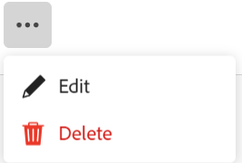

<!--update the metadata with real information when making this available in TOC and in the left nav
---
title: Edit record types
description: You can edit record types after they have been saved. Record types are the object types of Adobe Workfront Planning.
author: Alina
role: User
feature: Work Management 
topic: Architecture
hidefromtoc: yes
hide: yes
---

-->

# Editar tipos de registro

{{planning-important-intro}}

Os tipos de registro são os tipos de objeto do Adobe Workfront Planning. É possível editar a aparência dos tipos de registros criados por você ou por qualquer outra pessoa. Para obter informações sobre como criar tipos de registro do Workfront Planning, consulte [Criar tipos de registro](/help/quicksilver/planning/architecture/create-record-types.md).

## Requisitos de acesso

+++ Expanda para exibir os requisitos de acesso do Workfront Planning.

<!--update the table to say that: Only system administrators can enable record types to connect from other workspaces.-->

<table style="table-layout:auto">
 <col>
 </col>
 <col>
 </col>
 <tbody>
    <tr>
<tr>
<td>
   
 Produto
 </td>
   <td>
   
 Adobe Workfront
 
Para conectar tipos de registro do Adobe Workfront Planning com o Experience Manager Assets, você deve ter uma licença do Adobe Experience Manager Assets e a instância da Workfront de sua organização deve ser integrada à Adobe Business Platform ou à Adobe Admin Console.
 </td>
  </tr>  
 <td role="rowheader">
contrato do Adobe Workfront
</td>
   <td>

Sua organização deve estar inscrita no estágio de acesso antecipado do Workfront Planning 

   </td>
  </tr>
  <tr>
   <td role="rowheader">
plano do Adobe Workfront
</td>
   <td>

Qualquer

   </td>
  </tr>
  <tr>
   <td role="rowheader">
Licença da Adobe Workfront*
</td>
   <td>
   
Novo: Padrão

   
Atual: Plano
 
  </td>
  </tr>

<tr>
   <td role="rowheader">
Configurações de nível de acesso
</td>
   <td> 
Não há controles de nível de acesso para o Workfront Planning
  
</td>
  </tr>

<tr>
   <td role="rowheader">
Permissões
</td>
   <td> 
Gerenciar permissões para um espaço de trabalho</a> 
  
   
Os administradores do sistema têm permissões para todos os espaços de trabalho, incluindo aqueles que não criaram
</td>
  </tr>
<tr>
   <td role="rowheader">
Modelo de layout
</td>
   <td> 
O administrador do Workfront ou do grupo deve adicionar a área do Planning ao modelo de layout. Para obter informações, consulte <a href="/help/quicksilver/planning/access/access-overview.md">Visão geral sobre acesso</a>. 
  
</td>
  </tr>

</tbody>
</table>

*Para obter informações, consulte [Requisitos de acesso na documentação do Workfront](/help/quicksilver/administration-and-setup/add-users/access-levels-and-object-permissions/access-level-requirements-in-documentation.md).

+++

<!--Maybe enable this at GA - but Planning is not supposed to have Access controls in the Workfront Access Level: 
>[!NOTE]
>
>If you don't have access, ask your Workfront administrator if they set additional restrictions in your access level. For information on how a Workfront administrator can change your access level, see [Create or modify custom access levels](/help/quicksilver/administration-and-setup/add-users/configure-and-grant-access/create-modify-access-levels.md). -->

## Editar tipos de registro

{{step1-to-planning}}

1. Clique no espaço de trabalho cujos tipos de registro você deseja editar,

   A página do espaço de trabalho é aberta e os tipos de registro são exibidos.
1. Siga um destes procedimentos:

   * Passe o mouse sobre o cartão de um tipo de registro e clique no menu **Mais**  no canto superior direito do cartão de tipo de registro e clique em **Editar**
Ou
   * Clique em um cartão de tipo de registro para abrir a página de tipo de registro, clique no menu **Mais**  à direita do nome do tipo de registro e clique em **Editar**.

   

   <!--replace everything below with the commented out text below-->

1. Na caixa **Editar tipo de registro**, atualize as seguintes informações:

   * Edite o nome do tipo de registro, se necessário. <!--did they add a field label for this? -->
   * **Descrição**: edite ou adicione uma descrição para o tipo de registro com mais informações sobre ele.
   * Editar a cor e a forma do ícone associado ao tipo de registro. Faça o seguinte:
      * Selecione uma cor para identificar o tipo de registro. Esta é a cor do ícone do tipo de registro. O cinza é selecionado por padrão.
      * Selecione um ícone na lista ou comece a digitar o nome de um ícone para descrever o que ele representa e, em seguida, selecione-o quando ele for exibido. Este é o ícone do tipo de registro. Um ícone de arquivo é selecionado por padrão.

     

1. Clique em **Salvar**.
1. (Opcional) Clique no cartão de tipo de registro na área do espaço de trabalho para abrir a página do tipo de registro.
1. Clique no menu **Mais** à direita do nome do tipo de registro e clique em **Editar** para atualizar as informações sobre o tipo de registro.

   >[!TIP]
   >
   >   É possível renomear o tipo de registro no cabeçalho.

   

   <!--check this screen shot - not sure this is valid ???-->

1. (Opcional) Para editar outro tipo de registro, expanda a seta apontando para baixo à direita de um nome de tipo de registro, procure um tipo de registro e selecione-o quando ele for exibido na lista.

<!--*******************For GA - replace the above with this:

1. In the **Edit record type** box, click the **Appearance** tab and update the following information: (*******copy the screen shot above here and update it with the Appearance tab**********)

    * Edit the record type name, if needed. (*****did they add a field label for this?******)
    * **Description**: Edit or add a description for the record type with more information about it. 
    * Edit the color and shape of the icon associated with the record type. Do the following: 
        * Select a color to identify the record type. This is the color of the record type icon. Gray is selected by default.
        * Select an icon from the list, or start typing the name of an icon to describe what it represents, then select it when it displays. This is the icon of the record type. A file icon is selected by default.

        

1. (Conditional) If you are a system administrator, click the **Advanced settings** tab in the **Edit record type** box and update the following information: 

   * **Connect from other workspaces**: Select this toggle to allow users to connect to this record type from other workspaces. This is deselected by default.
   * **System wide**: Select this option to allow users to connect to this record from all workspaces in the system.
   * **Specific workspaces**: Select this option to restrict the workspaces from which users can connect to this record type, then expand the drop down menu and select the workspaces you want users to connect to this record type from. You can start typing the name of a workspace, and select it when it displays in the list. 

   

   The record type card displays a connectivity icon  in the upper-right corner to indicate that the record is now accessible from other workspaces. 

1. Click **Save**.
1. (Optional) Click the record type card from the workspace area to open the record type's page, then rename the record type in the header.  

1. (Optional) To edit another record type, from the record type page, expand the downward-pointing arrow to the right of a record type name, search for a record type, then select it when it displays in the list.

   

   -->