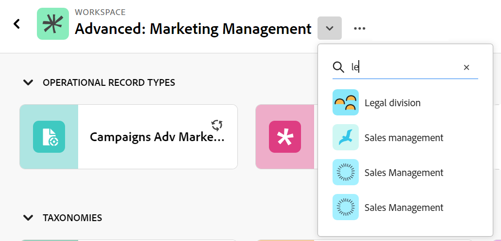

# Editar tipos de registro

{{planning-important-intro}}

Os tipos de registro são os tipos de objeto do Adobe Workfront Planning. É possível editar a aparência dos tipos de registros criados por você ou por qualquer outra pessoa. Para obter informações sobre como criar tipos de registro do Workfront Planning, consulte [Criar tipos de registro](/help/quicksilver/planning/architecture/create-record-types.md).

## Requisitos de acesso

+++ Expanda para exibir os requisitos de acesso do Workfront Planning.

Você deve ter o seguinte acesso para executar as etapas deste artigo:

<table style="table-layout:auto"> 
<col> 
</col> 
<col> 
</col> 
<tbody> 
    <tr> 
<tr> 
<td> 
   
 Produtos
 </td> 
   <td> 
   <ul><li>
 Adobe Workfront
</li> 
   <li>
 Planejamento do Adobe Workfront
</li></ul></td> 
  </tr>   
<tr> 
   <td role="rowheader">
plano do Adobe Workfront*
</td> 
   <td> 

Qualquer um dos seguintes planos da Workfront:
 
<ul><li>Selecionar</li> 
<li>Prime</li> 
<li>Ultimate</li></ul> 

O Workfront Planning não está disponível para planos herdados do Workfront
 
   </td> 
<tr> 
   <td role="rowheader">
Pacote de planejamento do Adobe Workfront*
</td> 
   <td> 

Qualquer 
 

Para obter mais informações sobre o que está incluído em cada plano do Workfront Planning, entre em contato com seu gerente de conta da Workfront. 
 
   </td> 
 <tr> 
   <td role="rowheader">
plataforma Adobe Workfront
</td> 
   <td> 

A instância da Workfront de sua organização deve ser integrada à Adobe Unified Experience para acessar todos os recursos do Workfront Planning.
 

Para obter mais informações, consulte <a href="/help/quicksilver/workfront-basics/navigate-workfront/workfront-navigation/adobe-unified-experience.md">Experiência unificada do Adobe para Workfront</a>. 
 
   </td> 
   </tr> 
  </tr> 
  <tr> 
   <td role="rowheader">
Licença da Adobe Workfront*
</td> 
   <td>
 Padrão 

   
O Workfront Planning não está disponível para licenças herdadas do Workfront
 
  </td> 
  </tr> 
  <tr> 
   <td role="rowheader">
Configuração do nível de acesso
</td> 
   <td> 
Não há controles de nível de acesso para o Adobe Workfront Planning
   
</td> 
  </tr> 
<tr> 
   <td role="rowheader">
Permissões de objeto
</td> 
   <td>   
Gerenciar permissões para um espaço de trabalho</a> 
  
   
Os administradores do sistema têm permissões para todos os espaços de trabalho, incluindo aqueles que não criaram

   
Somente administradores do sistema podem habilitar tipos de registro para se conectar de outros espaços de trabalho
 </td> 
  </tr> 
<tr> 
   <td role="rowheader">
Modelo de layout
</td> 
   <td> 
Todos os usuários, incluindo administradores do Workfront, devem receber um modelo de layout que inclua a área Planejamento no Menu principal. 
 </td> 
  </tr> 
</tbody> 
</table>

*Para obter mais informações sobre requisitos de acesso do Workfront, consulte [Requisitos de acesso na documentação do Workfront](/help/quicksilver/administration-and-setup/add-users/access-levels-and-object-permissions/access-level-requirements-in-documentation.md).

+++

<!--
OLD:

<table style="table-layout:auto">
 <col>
 </col>
 <col>
 </col>
 <tbody>
    <tr>
<tr>
<td>
   
 Product
 </td>
   <td>
   
 Adobe Workfront
 
To connect Adobe Workfront Planning record types with Experience Manager Assets, you must have an Adobe Experience Manager Assets license and your organization's instance of Workfront must be onboarded to the Adobe Business Platform or the Adobe Admin Console.
 </td>
  </tr>  
 <td role="rowheader">
Adobe Workfront agreement
</td>
   <td>

Your organization must be enrolled in the early access stage for Workfront Planning 

   </td>
  </tr>
  <tr>
   <td role="rowheader">
Adobe Workfront plan
</td>
   <td>

Any

   </td>
  </tr>
  <tr>
   <td role="rowheader">
Adobe Workfront license*
</td>
   <td>
   
New: Standard

   
Current: Plan
 
  </td>
  </tr>
  
  <tr>
   <td role="rowheader">
Access level configurations
</td>
   <td> 
There are no access level controls for Workfront Planning
  
</td>
  </tr>

  <tr>
   <td role="rowheader">
Permissions
</td>
   <td> 
Manage permissions to a workspace</a> 
  
   
System Administrators have permissions to all workspaces, including the ones they did not create

   
Only system administrators can enable record types to connect from other workspaces

</td>
  </tr>
<tr>
   <td role="rowheader">
Layout template
</td>
   <td> 
Your Workfront or group administrator must add the Planning area in your layout template. For information, see <a href="/help/quicksilver/planning/access/access-overview.md">Access overview</a>. 
  
</td>
  </tr>

 </tbody>
</table>

*For information, see [Access requirements in Workfront documentation](/help/quicksilver/administration-and-setup/add-users/access-levels-and-object-permissions/access-level-requirements-in-documentation.md).-->

## Editar tipos de registro

{{step1-to-planning}}

1. Clique no espaço de trabalho cujos tipos de registro você deseja editar,

   A página do espaço de trabalho é aberta e os tipos de registro são exibidos.
1. Siga um destes procedimentos:

   * Passe o mouse sobre o cartão de um tipo de registro e clique no menu **Mais**  no canto superior direito do cartão de tipo de registro e clique em **Editar**
Ou
   * Clique em um cartão de tipo de registro para abrir a página de tipo de registro, clique no menu **Mais**  à direita do nome do tipo de registro e clique em **Editar**.

   

1. Na caixa **Editar tipo de registro**, a guia **Aparência** é aberta por padrão.

   

   Atualize as seguintes informações na guia **Aparência**:

   * Edite o nome do tipo de registro, se necessário. <!--did they add a field label for this?-->
   * **Descrição**: edite ou adicione uma descrição para o tipo de registro com mais informações sobre ele.
   * Editar a cor e a forma do ícone associado ao tipo de registro. Faça o seguinte:
      * Selecione uma cor para identificar o tipo de registro. Esta é a cor do ícone do tipo de registro.
      * Selecione um ícone na lista ou comece a digitar o nome de um ícone para descrever o que ele representa e, em seguida, selecione-o quando ele for exibido. Este é o ícone do tipo de registro. Um ícone de arquivo é selecionado por padrão.

1. (Condicional) Se você for um administrador do sistema, clique na guia **Configurações avançadas** na caixa **Editar tipo de registro**.

   

1. (Condicional) Como administrador do sistema, atualize as seguintes informações na guia **Configurações avançadas**:

   * **Conectar de outros espaços de trabalho**: selecione esta opção para permitir que os usuários se conectem a este tipo de registro de outros espaços de trabalho. Essa opção é desmarcada por padrão.
   * **Nível do sistema**: selecione esta opção para permitir que os usuários se conectem a este registro de todos os espaços de trabalho do sistema.
   * **Espaços de trabalho específicos**: selecione esta opção para restringir os espaços de trabalho dos quais os usuários podem se conectar a este tipo de registro, expanda o menu suspenso e selecione os espaços de trabalho dos quais deseja que os usuários se conectem a este tipo de registro. Você pode começar a digitar o nome de um espaço de trabalho e selecioná-lo quando ele for exibido na lista.

1. Clique em **Salvar**.

   O cartão de tipo de registro no espaço de trabalho exibe um ícone de conectividade  no canto superior direito para indicar que o registro agora pode ser acessado de outros espaços de trabalho.

1. (Opcional) Clique no cartão de tipo de registro na área do espaço de trabalho para abrir a página do tipo de registro e, em seguida, renomeie o tipo de registro no cabeçalho.

1. (Opcional) Para editar outro tipo de registro, na página Tipo de registro, expanda a seta apontando para baixo à direita do nome de um tipo de registro, procure um tipo de registro e selecione-o quando ele for exibido na lista.

   