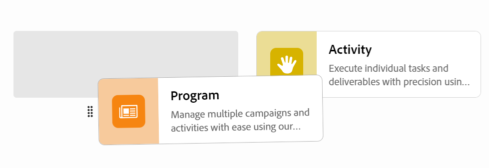

# Editar espaços de trabalho

{{planning-important-intro}}

No Adobe Workfront Planning, os espaços de trabalho são locais centralizados para as equipes planejarem o trabalho.

Um espaço de trabalho é uma coleção de tipos de registro usados por uma equipe e representa o ciclo de vida do trabalho da equipe. Você pode personalizar totalmente os espaços de trabalho no Adobe Workfront Planning.

Para obter informações sobre como criar espaços de trabalho, consulte [Criar espaços de trabalho](/help/quicksilver/planning/architecture/create-workspaces.md).

Todas as alterações feitas em um espaço de trabalho ficam visíveis para todos aqueles que têm pelo menos permissões de Exibição para o espaço de trabalho.

## Requisitos de acesso

+++ Expanda para exibir os requisitos de acesso do Workfront Planning.

Para acessar o Workfront Planning, é necessário ter o seguinte:

<table style="table-layout:auto"> 
<col> 
</col> 
<col> 
</col> 
<tbody> 
    <tr> 
<tr> 
<td> 
   
 Produtos
 </td> 
   <td> 
   <ul><li>
 Adobe Workfront
</li> 
   <li>
 Planejamento do Adobe Workfront
</li></ul></td> 
  </tr>   
<tr> 
   <td role="rowheader">
plano do Adobe Workfront*
</td> 
   <td> 

Qualquer um dos seguintes planos da Workfront:
 
<ul><li>Selecionar</li> 
<li>Prime</li> 
<li>Ultimate</li></ul> 

O Workfront Planning não está disponível para planos herdados do Workfront
 
   </td> 
<tr> 
   <td role="rowheader">
Plano de planejamento do Adobe Workfront*
</td> 
   <td> 

Qualquer 
 

Para obter mais informações sobre o que está incluído em cada plano do Workfront Planning, consulte <a href="https://business.adobe.com/products/workfront/pricing.html">Preços e pacotes do Adobe Workfront</a>. 
 
   </td> 
 <tr> 
   <td role="rowheader">
plataforma Adobe Workfront
</td> 
   <td> 

A instância da Workfront de sua organização deve ser integrada à Adobe Unified Experience para acessar todos os recursos do Workfront Planning.
 

Para obter mais informações, consulte <a href="/help/quicksilver/workfront-basics/navigate-workfront/workfront-navigation/adobe-unified-experience.md">Experiência unificada do Adobe para Workfront</a>. 
 
   </td> 
   </tr> 
  </tr> 
  <tr> 
   <td role="rowheader">
Licença da Adobe Workfront*
</td> 
   <td>
 Padrão

   
O Workfront Planning não está disponível para licenças herdadas do Workfront
 
  </td> 
  </tr> 
  <tr> 
   <td role="rowheader">
Configuração do nível de acesso
</td> 
   <td> 
Não há controles de nível de acesso para o Adobe Workfront Planning
   
</td> 
  </tr> 
<tr> 
   <td role="rowheader">
Permissões de objeto
</td> 
   <td>  
Gerenciar permissões no espaço de trabalho 
   </td> 
  </tr> 
<tr> 
   <td role="rowheader">
Modelo de layout
</td> 
   <td> 
Todos os usuários, incluindo administradores do Workfront, devem receber um modelo de layout que inclua a área Planejamento no Menu principal. 
 </td> 
  </tr> 
</tbody> 
</table>

*Para obter mais informações sobre requisitos de acesso do Workfront, consulte [Requisitos de acesso na documentação do Workfront](/help/quicksilver/administration-and-setup/add-users/access-levels-and-object-permissions/access-level-requirements-in-documentation.md).

+++

<!--OLD

<table style="table-layout:auto">
 <col>
 </col>
 <col>
 </col>
 <tbody>
    <tr>
<tr>
<td>
   
 Product
 </td>
   <td>
   
 Adobe Workfront
 </td>
  </tr>  
 <td role="rowheader">
Adobe Workfront agreement
</td>
   <td>

Your organization must be enrolled in the early access stage for Workfront Planning 

   </td>
  </tr>
  <tr>
   <td role="rowheader">
Adobe Workfront plan
</td>
   <td>

Any

   </td>
  </tr>
  <tr>
   <td role="rowheader">
Adobe Workfront license*
</td>
   <td>
   
New: Standard

   
Current: Plan
 
  </td>
  </tr>
  
  <tr>
   <td role="rowheader">
Access level configuration
</td>
   <td> 
There are no access level controls for Workfront Planning

</td>
  </tr>

<tr>
   <td role="rowheader">
Permissions
</td>
   <td> 
Manage permissions to the workspace 
  
</td>
  </tr>

<tr>
   <td role="rowheader">
Layout template
</td>
   <td> 
You must add the Planning area to your layout template. For information, see <a href="/help/quicksilver/planning/access/access-overview.md">Access overview</a>. 
  
</td>
  </tr>

 </tbody>
</table>

For more information about access requirements, see [Access requirements in Workfront documentation](/help/quicksilver/administration-and-setup/add-users/access-levels-and-object-permissions/access-level-requirements-in-documentation.md). 

-->

## Editar um espaço de trabalho

{{step1-to-planning}}

1. (Condicional) Se você for um administrador do Workfront, clique em **Espaços de trabalho em que estou** para acessar os espaços de trabalho que você criou ou em **Outros espaços de trabalho** para acessar os espaços de trabalho que outras pessoas compartilharam com você.

<!--***********Replace the steps from the next below till the "Update the following information in the Edit workspace box:" (but keep this last step)*******-->

1. (Opcional) Clique em **Mostrar tudo** para exibir espaços de trabalho adicionais. O link **Mostrar tudo** é exibido somente quando há mais de duas linhas de cartões de espaço de trabalho.
1. (Opcional) Clique em K **Mostrar menos** para limitar o número de espaços de trabalho exibidos na tela.
1. Para editar um espaço de trabalho, siga um destes procedimentos:

   * Passe o mouse sobre o cartão de espaço de trabalho e clique no menu **Mais** , no canto superior direito do cartão
Ou
   * Clique em um cartão de espaço de trabalho para abrir o espaço de trabalho e no menu **Mais**  à direita do nome do espaço de trabalho.
1. Clique em **Editar**.

   A caixa **Editar espaço de trabalho** é exibida.

   

1. Atualize as seguintes informações na caixa **Editar espaço de trabalho**:

   * Adicione um nome ao espaço de trabalho. <!--did they add a label for this field?-->
   * **Descrição**: adicionar informações sobre o espaço de trabalho.
   * Selecione um ícone para associar ao espaço de trabalho.

1. Clique em **Salvar** para fechar a caixa Editar espaço de trabalho e aplicar as alterações.

1. (Opcional) Para adicionar uma nova seção do espaço de trabalho, siga um destes procedimentos:

   * Clique em **Adicionar seção** na parte inferior do espaço de trabalho.
   * Passe o mouse sobre o nome de uma seção, clique no menu **Mais**  e clique em **Adicionar seção acima** ou **Adicionar seção abaixo**.

1. (Opcional) Para alterar o local de uma seção, siga um destes procedimentos:

   * Passe o mouse sobre o nome de uma seção, clique no ícone  de **captura** e arraste-o e solte-o no ponto correto.
   * Passe o mouse sobre o nome de uma seção, clique no menu **Mais**  e clique em **Mover para cima** ou **Mover para baixo**. A seção se move para cima ou para baixo dentro do espaço de trabalho.

1. (Opcional) Para excluir uma seção do espaço de trabalho, faça o seguinte:

   1. Passe o mouse sobre o nome de uma seção, em seguida, clique no menu **Mais**  e clique em **Excluir**. <!--add screen shot when UI is final?-->
   1. Selecione uma nova seção para mover todos os tipos de registros para ela e clique em **Excluir**. <!--check the button name; logged a bug to change it to "Delete" from "Delete section".-->

      Todos os tipos de registro são movidos para a seção de seleção, e a seção é excluída.

1. (Opcional) Clique em **Adicionar tipo de registro** para adicionar tipos de registro ao espaço de trabalho.

   Para obter informações, consulte [Criar tipos de registro](/help/quicksilver/planning/architecture/create-record-types.md).

1. (Opcional) Passe o mouse sobre um cartão de tipo de registro, clique no menu **Mais**  no canto superior direito e clique em **Editar** para modificar a aparência de um tipo de registro.

   Para obter informações, consulte [Editar tipos de registros](/help/quicksilver/planning/architecture/edit-record-types.md).

1. (Opcional) Passe o mouse sobre um cartão de tipo de registro, clique no menu **Mais**  no canto superior direito e clique em **Excluir** para excluir um tipo de registro.

   Para obter informações, consulte [Excluir tipos de registros](/help/quicksilver/planning/architecture/delete-record-types.md).

1. (Opcional) Pressione e clique em um cartão de tipo de registro para arrastá-lo e soltá-lo em um novo ponto. Você pode arrastar e soltar tipos de registro de uma seção do espaço de trabalho para outra.

   

1. (Opcional) Clique em **Compartilhar** no canto superior direito do espaço de trabalho para compartilhá-lo com outras pessoas.

   Para obter informações, consulte [Compartilhar espaços de trabalho](/help/quicksilver/planning/access/share-workspaces.md).
