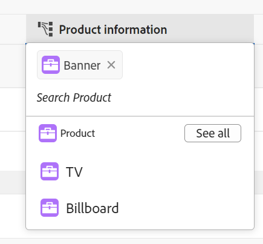
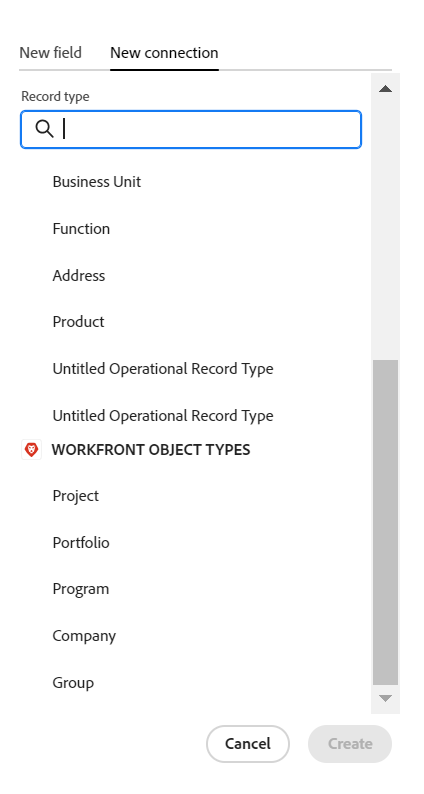

# Exemplo de conexão de tipos de registro e registros

{{planning-important-intro}}

Este artigo descreve um exemplo do seguinte:

* Como criar uma conexão entre dois tipos de registro do Workfront Planning e dois registros.

* Como criar uma conexão entre um tipo de registro do Workfront Planning e um tipo de objeto de projeto do Workfront, bem como uma conexão entre um registro e um projeto.

Para obter mais informações, consulte também os seguintes artigos:

* [Conectar tipos de registro](/help/quicksilver/planning/architecture/connect-record-types.md)
* [Conectar registros](/help/quicksilver/planning/records/connect-records.md)

## Conectar dois tipos de registro e registros do Workfront Planning (exemplo)

Por exemplo, você tem um tipo de registro chamado Campanha como o tipo de registro original.

Você também tem outro tipo de registro chamado Produto, que tem um campo de moeda chamado Orçamento.

Você deseja criar um campo no tipo de registro de Campanha, onde é possível mostrar os valores do campo Orçamento do tipo de registro Produto.

Para fazer isso:

1. Abra a exibição de tabela para o tipo de registro do Campaign em um espaço de trabalho.
1. Clique no ícone **+** no canto superior direito do modo de exibição de tabela para adicionar um novo campo, em seguida, clique em **Nova conexão** e em **Produto** na seção de espaço de trabalho selecionada.
1. Adicione as seguintes informações, por exemplo:

   * **Tipo de registro**: produto <!--did they change the casing here?-->
   * **Nome**: dê um nome ao novo campo. Por exemplo, &quot;Informações do produto&quot;. Este é o nome do campo de registro vinculado.
   * **Descrição**: adicione uma descrição para o novo campo. Por exemplo, &quot;Estes são os produtos aos quais desejo associar minhas campanhas&quot;. A descrição do campo é exibida ao passar o mouse sobre o campo no cabeçalho da coluna.
   * **Permitir vários registros**: se você deixar essa opção selecionada, os usuários poderão selecionar vários registros quando o campo de tipo de registro vinculado (Informações do produto) for exibido nos registros originais (Campanhas). Em nosso caso, os usuários podem selecionar vários produtos para serem conectados a uma campanha.
   * **Selecionar campos de pesquisa**: se você deixar essa opção selecionada, a caixa **Adicionar campos de pesquisa** será aberta em seguida, para permitir vincular campos de Produto ao tipo de registro de Campanha. Você pode clicar em **Ignorar** para ignorar esta etapa e adicionar campos de Produto posteriormente.

   

1. (Opcional) Desmarque a opção **Título** na seção **Aparência do registro** para exibir somente a imagem em miniatura do registro nos campos conectados. Se ativado, os registros exibem a miniatura e o título. O botão de alternância é ativado por padrão.
1. (Condicional) Se você selecionou a opção **Selecionar campos de pesquisa** na etapa anterior, na lista de campos associados ao tipo de registro **Produto**, clique no ícone **+** do campo **Orçamento** e clique em **Adicionar campos**. Isso cria um campo chamado **Orçamento (das informações do produto)**, que é o nome do campo vinculado. Todas as informações para o Orçamento do produto são exibidas nesse campo para os registros da Campanha.

   

   >[!TIP]
   >
   >    Para exibir o Orçamento de todos os produtos selecionados como um número total, selecione **SOMA** no menu suspenso à direita do nome do campo. Quando os usuários selecionam vários produtos no campo de registro vinculado **Informações do produto**, o campo **Orçamento (das informações do produto)** adiciona todos os valores de Orçamento e exibe o total. <!-- check the shot below - added a bug with a couple of UI changes here-->
   >
   > Se você selecionar **Nenhum**, em vez de **SOMA**, os orçamentos individuais dos produtos selecionados serão exibidos separados por vírgulas.

   Isso gera os seguintes campos:

   * Na exibição da tabela de registro da Campanha e na página Registro de campanha de uma campanha:

      * **Informações do produto** (o campo de registro vinculado): exibe o nome ou os nomes dos produtos quando você os adiciona.
      * **Budget (das informações do produto)** (o campo vinculado): exibirá os orçamentos dos produtos selecionados no campo de informações do produto.

   * Na exibição da tabela Registro do produto e na página Registro do produto de um produto:

      * **Campanha**: isso indica que o tipo de registro do Produto está vinculado ao tipo de registro da Campanha.

     

   >[!TIP]
   >
   >    Os campos de registro vinculados são precedidos pelo ícone de relação .

1. Na exibição da tabela do tipo de registro **Campanha**, crie uma campanha adicionando uma nova linha na tabela da página Tipo de registro da campanha.

1. Clique duas vezes dentro da coluna **Informações do produto** da nova campanha.

   

1. Siga um destes procedimentos:

   * Clique no nome de um produto conectado na lista para adicioná-lo ao registro selecionado. O produto é adicionado automaticamente.
   * Comece a digitar o nome de um produto e clique nele quando ele for exibido na lista. O produto é adicionado automaticamente.
   * Clique em **Ver tudo** para exibir todos os produtos.

1. (Condicional) Se você clicou em **Ver tudo** na etapa anterior, a caixa **Conectar objetos** será exibida.

   

1. Comece a digitar o nome de um produto na caixa de pesquisa e selecione-o quando ele for exibido na lista

   Ou

   Selecione os registros Product que deseja conectar com os registros Campaign e clique em **Conectar objetos**.

   >[!TIP]
   >
   >    Você pode abrir a página de registro de uma campanha, localizar o campo de registro vinculado e clicar no ícone **+** no campo para adicionar produtos do tipo de registro de produto conectado.

   As seguintes colunas são preenchidas na tabela Campaign record type:
   * O campo **Informações do produto** é preenchido para o registro de Campanha com os Produtos selecionados.
   * **O campo Orçamento (das informações do Produto)** é preenchido com o valor do Orçamento para cada Produto selecionado ou com um total de todos os orçamentos dos produtos selecionados (se você selecionou SUM para o agregador).

   

   >[!TIP]
   >
   >Quando você não seleciona um agregador para os vários valores, todos os valores dos Produtos selecionados são exibidos separados por vírgulas.

1. Para preencher o campo **Campanha** a partir da exibição de tabela **Produto**, repita as etapas de 5 a 7 a partir da exibição de tabela do tipo de registro de Produto e selecione as informações da campanha. Isso também atualizará o campo Product information na tabela da página Campaign record type. <!--ensure the step numbers remain correct-->

## Conectar um tipo de registro do Workfront Planning a um tipo de objeto de projeto do Workfront e conectar um registro a projetos individuais

>[!IMPORTANT]
>
>    Todos os usuários com permissões de Exibição ou superiores ao espaço de trabalho podem exibir as informações nos campos vinculados, independentemente das permissões ou do nível de acesso no Workfront.

Por exemplo, você tem um tipo de registro chamado Campanha como o tipo de registro original.

Você também tem projetos no Workfront com um campo chamado &quot;Receita planejada&quot;.

Crie um campo de conexão no tipo de registro do Campaign, no qual você possa mostrar os valores do campo Receita Planejada dos projetos no Workfront que estão conectados às campanhas no Workfront Planning.

Para fazer isso:

1. Vá para uma Workspace onde deseja conectar o tipo de registro Campanha com projetos Workfront.
1. Abra a exibição de tabela para o tipo de registro do Campaign no espaço de trabalho selecionado.
1. Clique no ícone **+** no canto superior direito da exibição de tabela para adicionar um novo campo, em seguida, clique em **Nova conexão** e em **Projeto** na seção **Tipos de objeto do Workfront**.
1. Adicione as seguintes informações, por exemplo:

   * **Tipo de registro**: projeto (da subseção Workfront)
   * **Nome**: dê um nome ao novo campo, por exemplo &quot;Informações do projeto&quot;.
   * **Descrição**: adicione uma descrição para o novo campo. Por exemplo, &quot;Estes são os projetos aos quais quero associar minhas campanhas&quot;. A descrição é exibida na exibição de tabela, à medida que você passa o mouse sobre o nome do campo no cabeçalho da coluna.
   * 
      * **Permitir vários registros**: se esta opção for deixada selecionada, os usuários poderão selecionar vários projetos quando o campo de tipo de projeto vinculado (Informações do projeto) for exibido nos registros originais (Campanhas).
   * **Selecionar campos de pesquisa**: se você deixar essa opção selecionada, a caixa **Adicionar campos de pesquisa** será aberta em seguida, para permitir que você vincule campos do Project ao tipo de registro do Campaign. Você pode clicar em **Ignorar** para ignorar esta etapa e adicionar campos do Project mais tarde.

   

1. (Condicional) Se você selecionou a opção **Selecionar campos de pesquisa** na etapa anterior, na lista de campos associados ao tipo de objeto **Projeto**, clique no ícone **+** do campo **Receita planejada** e clique em **Adicionar campos**. Isso cria um campo chamado **Receita planejada (das informações do projeto)**, que é o nome do campo vinculado. Qualquer informação do campo Receita planejada do projeto será exibida automaticamente neste campo para os registros da campanha.

   >[!TIP]
   >
   >    Para exibir a receita planejada de todos os projetos selecionados como um número total, selecione **SOMA** no menu suspenso à direita do nome do campo. Quando os usuários selecionam vários projetos no campo de objeto vinculado **Informações do projeto**, o campo **Receita planejada (das informações do produto)** adiciona todos os valores e exibe o total. <!-- check the shot below - added a bug with a couple of UI changes here-->
   >
   > Se você selecionar **Nenhum**, em vez de **SOMA**, as Receitas Planejadas individuais serão exibidas separadas por vírgulas.

   

   Isso gera os seguintes campos:

   * Na exibição da tabela de registro da campanha e na página Registro da campanha:

      * **Informações do projeto** (o campo de objeto vinculado): exibe o nome ou os nomes dos Projetos.
      * **Receita planejada (das informações do projeto)** (o campo vinculado): isso exibirá as Receitas planejadas dos projetos selecionados no campo de informações do projeto.

   >[!TIP]
   >
   >    Campos de objetos vinculados são precedidos pelo ícone de relação .

1. Na exibição de tabela do tipo de registro **Campanha**, crie uma campanha adicionando uma nova linha na tabela.

1. Clique duas vezes dentro da coluna Project information** da nova campanha.

   

1. Siga um destes procedimentos:

   * Clique no nome de um projeto na lista para adicioná-lo ao registro selecionado. O projeto é adicionado automaticamente.
   * Comece digitando o nome de um projeto e clique nele quando ele for exibido na lista. O projeto é adicionado automaticamente.
   * Clique em **Ver todos** para exibir todos os projetos.

1. (Condicional) Se você clicou em **Ver tudo** na etapa anterior, a caixa **Conectar objetos** será exibida.

   

1. Comece digitando o nome de um projeto na caixa de pesquisa e selecione-o quando ele for exibido na lista

   Ou

   Selecione os registros do Projeto que você deseja conectar com os registros do Campaign e clique em **Conectar objetos**.

   >[!TIP]
   >
   >    Você pode abrir a página de uma Campanha, localizar o campo de projeto vinculado e clicar no ícone **+** no campo para adicionar projetos do tipo de registro de Produto conectado.

   Isso adiciona o seguinte ao espaço de trabalho selecionado:

   * Na tabela Campaign record type:
      * O campo **Informações do projeto** é preenchido para o registro de Campanha com os projetos selecionados.
      * O campo **Receita planejada (das informações do produto)** é preenchido com o valor de Orçamento de cada produto selecionado. Este campo é somente leitura.

   

   >[!TIP]
   >
   >Quando você não seleciona um agregador para os vários valores e seleciona vários objetos no campo vinculado a objetos, todos os valores são exibidos separados por vírgulas.

1. Clique no nome de um projeto no campo de registro conectado.

   Essa ação abre o projeto no Workfront, se você tiver pelo menos permissões de Exibição para o projeto.
1. (Opcional) Atualize as informações sobre o projeto no Workfront, se você tiver permissões para isso.

1. (Opcional) Na exibição da tabela do Campaign, passe o mouse sobre o cabeçalho do campo **Informações do projeto**, clique na seta para baixo e clique em **Editar campos de pesquisa.**
1. Clique no ícone **+** para qualquer campo de projeto que você deseja adicionar ao registro do Workfront Planning do Projeto na seção **Campos não selecionados**.
1. Clique no ícone **-** para qualquer campo de projeto que você deseja remover do registro do Workfront Project Planning na seção **Campos selecionados**.
1. Clique em **Salvar**.

   Campos vinculados adicionais são adicionados ao tipo de registro Campanha.
