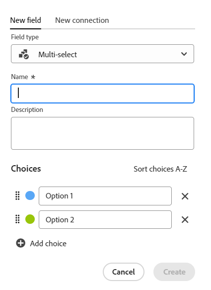
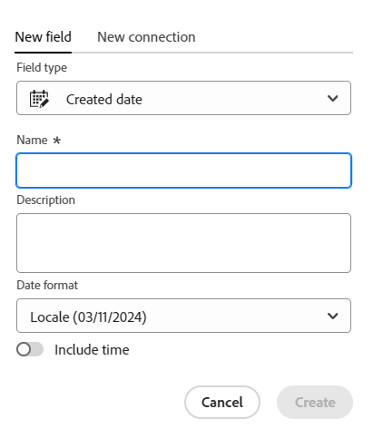
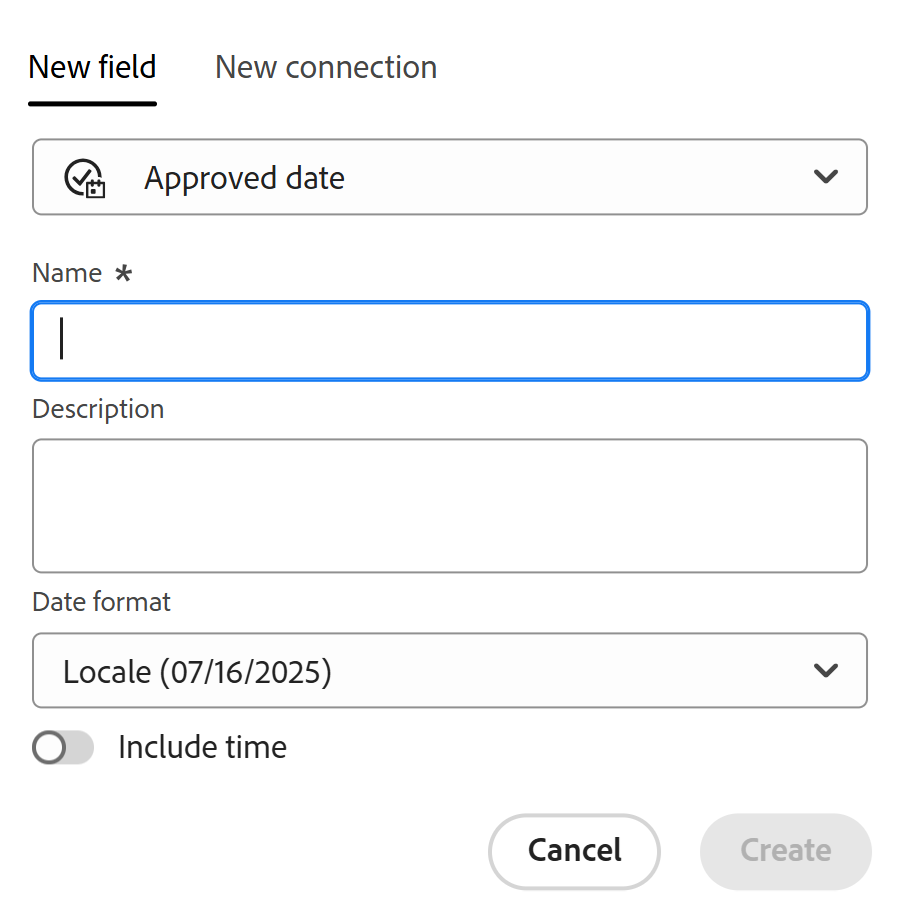
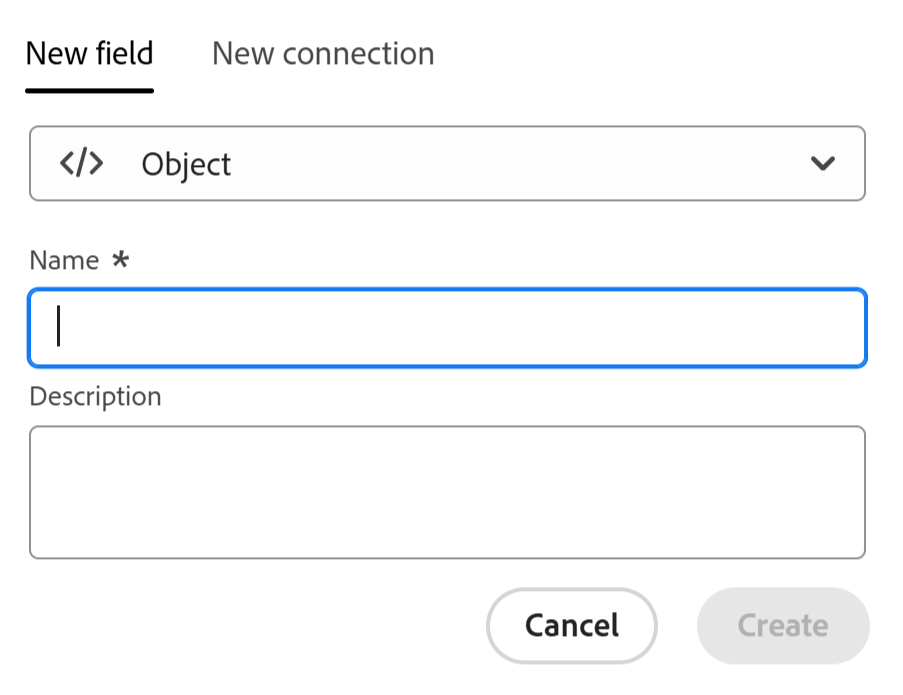

<!--Should the structure of this article be like this other one: https://experienceleague.adobe.com/docs/workfront/using/administration-and-setup/customize/custom-forms/custom-form-builder/use-the-custom-form-builder/add-a-custom-field-to-a-custom-form.html?lang=en ??-->

<!--will they add a way to create fields elsewhere than in a table?! - how will that change the structure of this article? -->

<!--Do we need this for FORMULAS: when we release permissions to RECORDS and we release referring lookup fields in a formula field, update considerations to say that lookup fields from linked records depends on the permissions to the record; if they have no permissions to view a linked record, they won't be able to use that records's lookup fields in a formula - not sure is needed??-->

# Criar campos

<span class="preview">As informações destacadas nesta página referem-se a funcionalidades que ainda não estão disponíveis. Ela está disponível somente no ambiente de Pré-visualização para todos os clientes. Depois das versões mensais para produção, os mesmos recursos também ficam disponíveis no ambiente de produção para clientes que ativaram versões rápidas. </span>

<span class="preview">Para obter informações sobre versões rápidas, consulte [Habilitar ou desabilitar versões rápidas para sua organização](/help/quicksilver/administration-and-setup/set-up-workfront/configure-system-defaults/enable-fast-release-process.md). </span>


{{planning-important-intro}}

No Adobe Workfront Planning, é possível criar campos personalizados para tipos de registro. É possível associar os campos aos registros do Workfront Planning para aprimorar as informações de registro.

Você deve criar tipos de registro antes de criar campos para associar a eles. Para obter informações, consulte [Criar tipos de registro](/help/quicksilver/planning/architecture/create-record-types.md).

Você pode criar campos das seguintes maneiras no Workfront Planning:

* [Do zero](#create-fields-from-scratch)
* [Conectando tipos de registro](#create-fields-from-scratch)
* [Criando um tipo de registro](#create-fields-by-creating-a-record-type)
* [Criando um espaço de trabalho a partir de um modelo](#create-fields-by-creating-a-workspace-from-a-template)
* [Importando tipos de registro usando um arquivo Excel ou CSV](#create-fields-when-importing-record-types-from-a-csv-or-excel-file)
* [Importando cópias de campos existentes do Workfront](#create-fields-by-importing-them-from-workfront)

Para obter mais informações sobre campos do Workfront Planning, consulte [Visão geral do campo](/help/quicksilver/planning/fields/fields-overview.md).

## Requisitos de acesso

+++ Expanda para visualizar os requisitos de acesso. 

Você deve ter o seguinte acesso para executar as etapas deste artigo:

<table style="table-layout:auto"> 
<col> 
</col> 
<col> 
</col> 
<tbody> 
    <tr> 
<tr> 
<td> 
   <p> Produtos</p> </td> 
   <td> 
   <ul><li><p> Adobe Workfront</p></li> 
   <li><p> Planejamento do Adobe Workfront<p></li></ul></td> 
  </tr>   
<tr> 
   <td role="rowheader"><p>plano do Adobe Workfront*</p></td> 
   <td> 
<p>Qualquer um dos seguintes planos da Workfront:</p> 
<ul><li>Selecionar</li> 
<li>Prime</li> 
<li>Ultimate</li></ul> 
<p>O Workfront Planning não está disponível para planos herdados do Workfront</p> 
   </td> 
<tr> 
   <td role="rowheader"><p>Pacote de planejamento do Adobe Workfront*</p></td> 
   <td> 
<p>Qualquer </p> 
<p>Para obter mais informações sobre o que está incluído em cada plano do Workfront Planning, entre em contato com seu gerente de conta da Workfront. </p> 
   </td> 
 <tr> 
   <td role="rowheader"><p>plataforma Adobe Workfront</p></td> 
   <td> 
<p>A instância da Workfront de sua organização deve ser integrada à Adobe Unified Experience para acessar o Workfront Planning.</p> 
<p>Para obter mais informações, consulte <a href="/help/quicksilver/workfront-basics/navigate-workfront/workfront-navigation/adobe-unified-experience.md">Experiência unificada da Adobe para Workfront</a>. </p> 
   </td> 
   </tr> 
  </tr> 
  <tr> 
   <td role="rowheader"><p>Licença da Adobe Workfront*</p></td> 
   <td><p> Standard </p>
   <p>O Workfront Planning não está disponível para licenças herdadas do Workfront</p> 
  </td> 
  </tr> 
  <tr> 
   <td role="rowheader"><p>Configuração do nível de acesso</p></td> 
   <td> <p>Não há controles de nível de acesso para o Adobe Workfront Planning</p>   
</td> 
  </tr> 
<tr> 
   <td role="rowheader"><p>Permissões de objeto</p></td> 
   <td>   <p>Gerenciar permissões para um espaço de trabalho e tipo de registro</a> </p>  
   <p>Os administradores do sistema têm permissões para todos os espaços de trabalho, incluindo aqueles que não criaram.</p> </td> 
  </tr> 
</tbody> 
</table>

*Para obter mais informações sobre requisitos de acesso do Workfront, consulte [Requisitos de acesso na documentação do Workfront](/help/quicksilver/administration-and-setup/add-users/access-levels-and-object-permissions/access-level-requirements-in-documentation.md).

+++   

## Criar campos conectando tipos de registro

É possível criar campos de registro vinculados ao adicionar uma nova conexão entre dois tipos de registro ou um tipo de registro e tipos de objeto de outros aplicativos.

Para obter informações sobre como conectar tipos de registro do Workfront Planning, consulte [Conectar tipos de registro](/help/quicksilver/planning/architecture/connect-record-types.md).

<!--## Create fields by importing record types using an Excel or CSV file

For more information, see [Create record types](/help/quicksilver/planning/architecture/create-record-types.md).-->

## Criar campos criando um tipo de registro

Ao criar um tipo de registro, vários campos associados ao novo tipo de registro também são criados por padrão. Para obter mais informações, consulte [Criar tipos de registro](/help/quicksilver/planning/architecture/create-record-types.md).

## Criar campos criando um espaço de trabalho a partir de um modelo

O Adobe Workfront Planning cria campos para tipos de registro quando você cria um espaço de trabalho a partir de um modelo.

Para obter informações, consulte [Criar espaços de trabalho](/help/quicksilver/planning/architecture/create-workspaces.md).


## Criar campos ao importar tipos de registro de um arquivo CSV ou do Excel

É possível importar campos ao importar tipos de registro usando um arquivo CSV ou do Excel.

Para obter informações, consulte [Criar tipos de registro](/help/quicksilver/planning/architecture/create-record-types.md).

## Criar campos importando-os do Workfront

É possível importar cópias de campos existentes do Workfront.

A importação de campos do Workfront cria uma cópia de cada campo para um tipo de registro do Workfront Planning.

Após copiar os campos, eles se tornam independentes uns dos outros e não trocam informações.

Para obter informações, consulte [Importar campos do Workfront](/help/quicksilver/planning/fields/import-fields-from-workfront.md).


## Criar campos do zero {#create-fields-from-scratch}

<!--in a table (not sure if this can be done elsewhere?!-->

<!--the first 3 steps are the same as in Import fields from Workfront-->

{{step1-to-planning}}

1. Clique no espaço de trabalho cujos registros você deseja criar campos.

   O espaço de trabalho é aberto e os tipos de registro são exibidos.

1. Clique no cartão de um tipo de registro.

   Todos os registros existentes associados ao tipo de registro são exibidos nas linhas da exibição de tabela.

   >[!TIP]
   >
   >    Se nenhum registro for exibido, talvez você ainda não tenha nenhum registro ou um filtro aplicado que limite o que você vê na tela.

   Todos os campos existentes associados ao tipo de registro são exibidos nas colunas da exibição de tabela.

   >[!TIP]
   >
   >    Alguns campos podem estar ocultos. Clique em Campos e ative a alternância dos campos que deseja exibir como colunas na exibição em tabela.

1. Clique no ícone **+** no canto superior direito da exibição de tabela

   Ou

   Passe o mouse sobre o cabeçalho de qualquer coluna, clique na seta para baixo após o nome do campo e clique em **Inserir à esquerda** ou **Inserir à direita** para adicionar o novo campo.
1. Na guia **Novo campo**, procure por um tipo de campo na caixa **Tipo de campo** ou selecione um dos seguintes tipos de campo:

   Na guia **Novo campo**, procure um tipo de campo na caixa **Tipo de campo** usando qualquer palavra-chave relacionada ou selecione um dos tipos de campo listados abaixo.

   >[!TIP]
   >
   >    Você pode digitar &quot;Orçamento&quot; e os tipos de campo Número e Moeda são exibidos em uma pequena lista.


   * [Texto de linha única](#single-line-text)
   * [Parágrafo](#paragraph)
   * [Seleção múltipla](#multi-select)
   * [Seleção única](#single-select)
   * [Data](#date)
   * [Número](#number)
   * [Porcentagem](#percentage)
   * [Moeda](#currency)
   * [Caixa de seleção](#checkbox)
   * [Fórmula](#formula)
   * [People](#people)
   * [Criado por](#created-by)
   * [Data de criação](#created-date)
   * [Modificado pela última vez por](#last-modified-by)
   * [Data da última modificação](#last-modified-date)
   * <span class="preview">[Data de aprovação](#approved-date)</span>
   * <span class="preview">[Aprovado por](#approved-by)</span>
     <!--* [Object](#object-field-type)-->

   >[!IMPORTANT]
   >
   >Não é possível alterar o tipo Field do campo depois de salvá-lo.

   <!--Add this to the IMPORTANT above and make it a NOTE - should do directly to Prod:
    * You can use any keyword that might be related to any of the field type names. For example, a search for "Budget" will display the Number or Currency field type.-->

1. Continue adicionando cada campo, conforme descrito nas seções abaixo.

### Texto de linha única {#single-line-text}

Os campos de texto de linha única capturam informações alfanuméricas limitadas. Por exemplo, você pode capturar as informações de Proprietário, Participante, Equipe ou Unidade organizacional em um campo de texto de linha única. O conteúdo de um campo de texto de linha única pode ter até 1.000 caracteres. <!-- used to be 250 but just tested with 1000 and it allowed this as a maximum. -->

1. Comece a criar um campo conforme descrito na seção [Criar campos do zero](#create-fields-from-scratch) neste artigo e selecione o tipo de campo **Texto de linha única**.

   

1. Adicione as seguintes informações na guia **Novo campo**:
   * **Nome**: o nome do campo, como ele aparecerá em uma tabela ou na página Detalhes do registro. <!--ensure they updated this; and update the screen shot: it used to be "Label"-->
   * **Descrição**: informações adicionais sobre o campo. A descrição de um campo é exibida ao passar o mouse sobre o cabeçalho da coluna do campo em uma tabela ou ao clicar no ícone de informações ao lado do nome do campo na página de detalhes do registro.
1. Clique em **Criar**.

   O novo campo de linha única é adicionado como uma coluna ao tipo de registro e seus valores podem ser associados a registros.


### Parágrafo {#paragraph}

Os campos de parágrafo capturam informações alfanuméricas adicionais sobre um registro, semelhantes ao campo Descrição.

>[!TIP]
>
>* É possível ter no máximo 20 campos de parágrafo para um tipo de registro.
>
>* O conteúdo de um campo de parágrafo pode ter até 10.000 caracteres.
>* Você pode usar a formatação Rich Text para aprimorar o conteúdo de campos de parágrafo quando eles são exibidos na exibição de tabela ou na página Detalhes de um registro. Para obter informações, consulte [Editar registros](/help/quicksilver/planning/records/edit-records.md).
>


1. Comece a criar um campo conforme descrito na seção [Criar campos do zero](#create-fields-from-scratch) neste artigo e selecione o tipo de campo **Parágrafo**.

   


1. Adicione as seguintes informações na guia **Novo campo**:
   * **Nome**: o nome do campo, como ele aparecerá em uma tabela ou na página Detalhes do registro. <!--ensure they updated this; and update the screen shot: it used to be "Label"-->
   * **Descrição**: informações adicionais sobre o campo. A descrição de um campo é exibida ao passar o mouse sobre a coluna do campo em uma tabela ou ao clicar no ícone de informações ao lado do nome do campo na página de detalhes do registro.
1. Clique em **Criar**.

   O novo campo de parágrafo é adicionado como uma coluna ao tipo de registro e seus valores podem ser associados a registros.


### Seleção múltipla {#multi-select}

Você pode usar um campo de seleção múltipla para capturar informações adicionais em qualquer formato selecionando mais de uma opção em um menu suspenso.

>[!NOTE]
>
><span class="preview">Além da funcionalidade descrita nesta seção, você pode adicionar novas opções ao editar o valor do campo de seleção múltipla de um registro em linha, no modo de exibição de tabela. Para obter mais informações, consulte a seção &quot;Editar informações sobre campos de seleção única ou múltipla&quot; no artigo [Editar registros](/help/quicksilver/planning/records/edit-records.md).</span>
>

1. Comece a criar um campo conforme descrito na seção [Criar campos do zero](#create-fields-from-scratch) neste artigo e selecione o tipo de campo **Multisseleção**.

   


1. Adicione as seguintes informações na guia **Novo campo**:
   * **Nome**: o nome do campo, como ele aparecerá em uma tabela ou na página Detalhes do registro. <!--ensure they updated this; and update the screen shot: it used to be "Label"-->
   * **Descrição**: informações adicionais sobre o campo. A descrição de um campo é exibida ao passar o mouse sobre a coluna do campo em uma tabela ou ao clicar no ícone de informações ao lado do nome do campo na página de detalhes do registro.
   * **Opções**: as opções que os usuários podem selecionar ao atualizar este campo. Você pode usar números e letras para o nome de cada escolha.
1. Clique em **Adicionar opção** para adicionar mais opções. Não há limite para quantas opções você pode adicionar a um campo de seleção múltipla.
1. (Opcional) Arraste e solte manualmente cada escolha na ordem desejada ou selecione a opção
   **Classifique a opção A-Z** se desejar que as opções sejam listadas automaticamente em ordem alfabética. <!--Add this if they added this functionality: You cannot edit this option after you save the field.-->
1. (Opcional) Para remover uma opção, clique no ícone **x** à direita.
1. Clique na amostra de cores à esquerda de uma opção para expandir o seletor de cores e personalizar a cor de cada opção.

1. Clique em **Amostras** para selecionar uma cor predefinida

   Ou

   Clique em **Personalizado** para selecionar uma cor personalizada usando um seletor de cores ou um código hexadecimal.
1. Clique fora da caixa de cores para fechá-la.
1. Clique em **Criar**.

   O novo campo de seleção múltipla é adicionado como uma coluna ao tipo de registro e seus valores podem ser associados a registros.

### Seleção única {#single-select}

Os campos de seleção única capturam informações adicionais em qualquer formato ao selecionar uma opção em um menu suspenso.

>[!NOTE]
>
><span class="preview">Além da funcionalidade descrita nesta seção, você pode adicionar novas opções ao editar o valor de campo de seleção única de um registro em linha, no modo de exibição de tabela. Para obter mais informações, consulte a seção &quot;Editar informações sobre campos de seleção única ou múltipla&quot; no artigo [Editar registros](/help/quicksilver/planning/records/edit-records.md).</span>
>


1. Comece a criar um campo conforme descrito na seção [Criar campos do zero](#create-fields-from-scratch) neste artigo e selecione o tipo de campo **Seleção única**.

   


1. Adicione as seguintes informações na guia **Novo campo**:
   * **Nome**: o nome do campo, como ele aparecerá em uma tabela ou na página Detalhes do registro. <!--ensure they updated this; and update the screen shot: it used to be "Label"-->
   * **Descrição**: informações adicionais sobre o campo. A descrição de um campo é exibida ao passar o mouse sobre a coluna do campo em uma tabela ou ao clicar no ícone de informações ao lado do nome do campo na página de detalhes do registro.
   * **Opções**: as opções disponíveis para seleção no menu suspenso depois que o campo é salvo. Você pode ter números e letras para o nome de cada escolha.

1. Clique em **Adicionar opção** para adicionar mais opções. Não há limite para quantas opções você pode adicionar a um campo de seleção única.
1. (Opcional) Arraste e solte manualmente cada opção na ordem desejada ou selecione a opção **Classificar opções de A a Z** se desejar que as opções sejam listadas automaticamente em ordem alfabética. <!--Add this if they added this functionality: You cannot edit this option after you save the field.-->
1. (Opcional) Para remover uma opção, clique no ícone **x** à direita.
1. Clique na amostra de cores à esquerda de uma opção para expandir o seletor de cores e personalizar a cor de cada opção.
1. Clique em **Amostras** para selecionar uma cor predefinida

   Ou

   Clique em **Personalizado** para selecionar uma cor personalizada usando um seletor de cores ou um código hexadecimal.

1. Clique fora da caixa de cores para fechá-la.
1. Clique em **Criar**.

   O novo campo de seleção única é adicionado como uma coluna ao tipo de registro e seus valores podem ser associados a registros.

### Data {#date}

Você pode usar um campo de data para capturar informações adicionais no formato de data e hora.

1. Comece a criar um campo conforme descrito na seção [Criar campos do zero](#create-fields-from-scratch) neste artigo e selecione o tipo de campo **Data**.

   


1. Adicione as seguintes informações na guia **Novo campo**:
   * **Nome**: o nome do campo, como ele aparecerá em uma tabela ou página de registro. <!--ensure they updated this; and update the screen shot: it used to be "Label"-->
   * **Descrição**: informações adicionais sobre o campo. A descrição de um campo é exibida ao passar o mouse sobre a coluna do campo em uma tabela ou ao clicar no ícone de informações ao lado do nome do campo na página de detalhes do registro.
   * **Formato de data**: o tipo de formato de data que você deseja exibir neste campo. <!--update this casing - submitted bug for it-->

     Selecione entre os seguintes formatos:
      * **Localidade**: corresponde à localidade do seu navegador.
      * **Padrão**: 16/05/2023
      * **Longo**: 16 de maio de 2023
      * **Europeu**: 05/16/2023
      * **ISO**: 16/05/2023
      * **Incluir horário**: selecione esta opção se desejar incluir um carimbo de data/hora. Essa opção não está selecionada por padrão. Não é possível incluir um tempo depois de salvar o campo.

     Selecione entre as seguintes opções:

      * **24hr**: Por exemplo: 18:00
      * **12hr**: Por exemplo: 18:00:00

1. Clique em **Criar**.

   O novo campo de data é adicionado como uma coluna ao tipo de registro e seus valores podem ser associados a registros.

### Número {#number}

Os tipos de campo de número capturam informações em um formato de número.

>[!TIP]
>
>Campos numéricos são exibidos como um tipo de campo Texto de linha única em um construtor de formulários de solicitação.
>
>No entanto, o formato do campo é preservado e os valores desses campos serão exibidos como números depois que a solicitação for enviada, no tipo de registro e na página de detalhes da solicitação.
>>Para obter informações, consulte [Criar e gerenciar um formulário de solicitação no Adobe Workfront Planning](/help/quicksilver/planning/requests/create-request-form.md).


1. Comece a criar um campo conforme descrito na seção [Criar campos do zero](#create-fields-from-scratch) neste artigo e selecione o tipo de campo **Número**.

   
1. Adicione as seguintes informações na guia **Novo campo**:

   * **Nome**: o nome do campo, como ele aparecerá em uma tabela ou página de registro.
   * **Descrição**: informações adicionais sobre o campo. A descrição de um campo é exibida ao passar o mouse sobre a coluna do campo em uma tabela ou ao clicar no ícone de informações ao lado do nome do campo na página de detalhes do registro.
   * **Precisão**: o número de casas decimais que você deseja gravar para o campo. É possível exibir até 6 casas decimais.
   * **Permitir números negativos**: selecione esta opção se desejar permitir números negativos neste campo. Essa opção não está selecionada por padrão.

   >[!NOTE]
   >
   >    Se você selecionar Permitir números negativos e valores negativos forem armazenados nos registros aos quais o campo está anexado, não será mais possível desmarcar a configuração no futuro.

1. Clique em **Criar**.

   O novo campo de número é adicionado como uma coluna ao tipo de registro e seus valores podem ser associados a registros.

### Porcentagem {#percentage}

Os tipos de campo Porcentagem capturam informações em um formato de número seguido por um sinal de porcentagem.

>[!TIP]
>
>Os campos de porcentagem são exibidos como um tipo de campo de texto de linha única em um construtor de formulários de solicitação.
>
>No entanto, o formato do campo é preservado e os valores desses campos serão exibidos como porcentagens após o envio da solicitação, no tipo de registro e na página de detalhes da solicitação.
>>Para obter informações, consulte [Criar e gerenciar um formulário de solicitação no Adobe Workfront Planning](/help/quicksilver/planning/requests/create-request-form.md).


1. Comece a criar um campo conforme descrito na seção [Criar campos do zero](#create-fields-from-scratch) neste artigo e selecione o tipo de campo **Porcentagem**.

   

1. Adicione as seguintes informações na guia **Novo campo**:
   * **Nome**: o nome do campo, como ele aparecerá em uma tabela ou página de registro.
   * **Descrição**: informações adicionais sobre o campo. A descrição de um campo é exibida ao passar o mouse sobre a coluna do campo em uma tabela ou ao clicar no ícone de informações ao lado do nome do campo na página de detalhes do registro.
   * **Precisão**: o número de casas decimais que você deseja gravar para o campo. É possível exibir até 6 casas decimais.
   * **Permitir números negativos**: selecione esta opção se desejar permitir valores percentuais negativos neste campo. Essa opção não está selecionada por padrão.

     >[!NOTE]
     >
     >Se você selecionar Permitir números negativos e valores negativos forem armazenados nos registros aos quais o campo está anexado, não será mais possível desmarcar a configuração no futuro.

   * **Mostrar como**: no menu suspenso, escolha como deseja que os valores percentuais sejam exibidos na exibição de tabela. Selecione entre as seguintes opções:
      * **Número**: o valor percentual é exibido como um número seguido pelo sinal de porcentagem.
      * **Barra**: o valor percentual é exibido como uma barra ao lado do número percentual. A cor de preenchimento da barra indica o valor percentual. Esta é a seleção padrão.
      * **Círculo**: o valor percentual é exibido como o contorno de um círculo ao lado do número percentual. A cor de preenchimento do contorno do círculo indica o valor percentual.

   >[!NOTE]
   >
   >* A seleção feita no campo Mostrar como se aplica somente ao valor percentual visível na exibição de tabela. O valor percentual do campo é exibido como um número seguido pelo sinal de porcentagem em todo o Workfront Planning. Isso também se aplica ao campo do tipo porcentagem quando exibido como um campo de pesquisa em outras exibições de tabela de registros.
   >* Você pode alterar a seleção Mostrar como ao editar o campo posteriormente.

1. Clique em **Criar**.

   O novo campo de porcentagem é adicionado como uma coluna ao tipo de registro e seus valores podem ser associados a registros.

### Moeda {#currency}

Os tipos de campo Moeda capturam as informações em um formato de número precedido por um símbolo de moeda.

>[!TIP]
>
>Os campos de moeda são exibidos como um tipo de campo de texto de linha única em um construtor de formulários de solicitação.
>
>No entanto, o formato do campo é preservado e os valores desses campos serão exibidos como moeda após o envio da solicitação, no tipo de registro e na página de detalhes da solicitação.
>>Para obter informações, consulte [Criar e gerenciar um formulário de solicitação no Adobe Workfront Planning](/help/quicksilver/planning/requests/create-request-form.md).

1. Comece a criar um campo conforme descrito na seção [Criar campos do zero](#create-fields-from-scratch) neste artigo e selecione o tipo de campo **Moeda**.

   

1. Adicione as seguintes informações na guia **Novo campo**:
   * **Nome**: o nome do campo, como ele aparecerá em uma tabela ou página de registro. <!--ensure they updated this; and update the screen shot: it used to be "Label"-->
   * **Descrição**: informações adicionais sobre o campo. A descrição de um campo é exibida ao passar o mouse sobre a coluna do campo em uma tabela ou ao clicar no ícone de informações ao lado do nome do campo na página de detalhes do registro.
   * **Moeda**: o tipo de moeda que você deseja exibir neste campo. Esta é uma lista de moedas de acordo com a Organização Internacional de Normalização (ISO).
   * **Precisão**: o número de casas decimais que você deseja gravar para o campo. É possível exibir até 6 decimais.
   * **Permitir números negativos**: selecione esta opção se desejar permitir valores de moeda negativos neste campo. Essa opção não está selecionada por padrão.

   >[!NOTE]
   >
   >    Se você selecionar Permitir números negativos e valores negativos forem armazenados nos registros aos quais o campo está anexado, não será mais possível desmarcar a configuração no futuro.

1. Clique em **Criar**.

   O novo campo de moeda é adicionado como uma coluna ao tipo de registro e seus valores podem ser associados a registros.

### Caixa de seleção

Você pode usar o tipo de campo Caixa de seleção para adicionar uma única opção de caixa de seleção a um registro. Você pode usar esse campo para indicar um atributo ou status específico para esse registro específico. Por exemplo, você pode usá-lo como um sinalizador para rastrear a conclusão, a aprovação ou qualquer outro atributo binário para cada registro.

1. Comece a criar um campo conforme descrito na seção [Criar campos do zero](#create-fields-from-scratch) neste artigo e selecione o tipo de campo **Caixa de seleção**.

   

1. Adicione as seguintes informações na guia **Novo campo**:
   * **Nome**: o nome do campo, como ele aparecerá em uma tabela ou página de registro. <!--ensure they updated this; and update the screen shot: it used to be "Label"-->
   * **Descrição**: informações adicionais sobre o campo. A descrição de um campo é exibida ao passar o mouse sobre a coluna do campo em uma tabela ou ao clicar no ícone de informações ao lado do nome do campo na página de detalhes do registro.
1. Clique em **Criar**.

   O novo campo de caixa de seleção é adicionado como uma coluna ao tipo de registro e seus valores podem ser associados a registros.

### Fórmula

Os campos de fórmula geram um novo valor usando valores existentes de outros campos em um tipo de registro e uma função que indica como os valores existentes devem ser calculados.

Para obter mais informações, consulte [Visão geral dos campos da fórmula](/help/quicksilver/planning/fields/formula-fields.md).

1. Comece a criar um campo conforme descrito na seção [Criar campos do zero](#create-fields-from-scratch) neste artigo e selecione o tipo de campo **Fórmula**.

   

1. Adicione as seguintes informações na guia **Novo campo**:

   * **Nome**: insira um nome para o novo campo.
   * **Descrição**: adicionar informações sobre o novo campo. A descrição de um campo é exibida ao passar o mouse sobre a coluna do campo em uma tabela ou ao clicar no ícone de informações ao lado do nome do campo na página de detalhes do registro.
   * **Fórmula**: comece a digitar pelo menos um caractere para acessar uma expressão e, em seguida, selecione-a quando ela for exibida na lista.

1. Clique na expressão selecionada para revelar a definição e exibir sua formatação.

   

   Para obter mais informações sobre quais expressões são suportadas, consulte [Visão geral dos campos de fórmula](/help/quicksilver/planning/fields/formula-fields.md).


   >[!TIP]
   >
   >Você receberá uma mensagem de aviso ao editar ou criar um campo de fórmula que pode causar uma referência circular a si mesmo ou campos compartilhados. Não é possível salvar um campo de fórmula que faça referência a ele mesmo ou a itens referenciados em seu cálculo.


1. Adicione nomes de campo conforme eles são exibidos no Workfront Planning para referenciá-los em uma fórmula.

   >[!NOTE]
   >
   >* Não é possível adicionar campos do tipo Seleção múltipla em uma fórmula.
   >
   >
   >* Você deve soletrar o nome dos campos que você inclui nas fórmulas conforme você as vê no Workfront Planning. A sintaxe e os curingas do modo de texto do Workfront não são suportados nas fórmulas do Workfront Planning.
   >
   >* Você pode fazer referência a um campo que esteja a até 4 campos (e objetos) de distância do tipo de registro atual. Por exemplo, se você estiver criando um campo de fórmula para um tipo de registro Atividade (1) e a Atividade estiver conectada ao tipo de registro Campanha (2) que está conectado a um Projeto Workfront (3), poderá fazer referência ao campo Orçamento do projeto (4) na fórmula que está sendo criada para o tipo de registro Atividade.
   >
   >
   >

1. (Opcional) Clique em **Maximizar** para abrir a caixa Fórmula em uma área maior.

   A caixa Fórmula é aberta em uma janela maior.
1. (Opcional e condicional) Se você abriu a caixa Fórmula em uma área maior, clique em **Minimizar** para retornar à caixa de campo Fórmula original.

1. No campo **Formato**, selecione uma das opções a seguir para identificar o formato do resultado exibido no campo de tipo de fórmula:

   * **Texto**: o resultado do campo de fórmula é exibido como texto simples.
   * **Número**: o resultado do campo de fórmula é exibido como um número.
   * **Percent**: o resultado do campo de fórmula é exibido como um número seguido por um símbolo de porcentagem.
   * **Moeda**: o resultado do campo de fórmula é exibido como um número precedido ou seguido por um símbolo de moeda.
   * **Marcas**: o resultado do campo de fórmula é exibido como uma marca com o nome do objeto.

     >[!TIP]
     >
     >Recomendamos tags para campos que mostram matrizes. Nesse caso, cada membro da matriz é exibido como uma tag separada.

     

   * **Data**: o resultado do campo de fórmula é exibido como uma data.

     Uma visualização da aparência do resultado é exibida abaixo do campo **Formato**.

     >[!WARNING]
     >
     >Se o resultado da fórmula não corresponder ao formato selecionado, o campo mostrará uma mensagem de erro onde ele é exibido.

1. Clique em **Criar**.

   O novo campo de fórmula é adicionado como uma coluna ao tipo de registro e seus valores podem ser associados a registros.

### People

Você pode usar o tipo de campo Pessoas para adicionar um usuário <!--, job role, or team--> a um registro. Este é um campo de digitação antecipada, e você pode adicionar somente usuários<!--, roles, or teams--> que já existem em sua instância do Workfront.

>[!TIP]
>
>* Ao adicionar o nome de um usuário em um campo Pessoas, o nome do usuário e sua função de trabalho principal são exibidos no campo.
>
>* Os campos de pessoas são exibidos como um tipo de campo de referência (ou conexão) em um construtor de formulários de solicitação.
>
>Para obter informações, consulte [Criar e gerenciar um formulário de solicitação no Adobe Workfront Planning](/help/quicksilver/planning/requests/create-request-form.md).

1. Comece a criar um campo conforme descrito na seção [Criar campos do zero](#create-fields-from-scratch) neste artigo e selecione o tipo de campo **Pessoas**.

   

1. Adicione as seguintes informações na guia **Novo campo**:
   * **Nome**: o nome do campo, como ele aparecerá em uma tabela ou página de registro.
   * **Descrição**: informações adicionais sobre o campo. A descrição de um campo é exibida ao passar o mouse sobre a coluna do campo em uma tabela ou ao clicar no ícone de informações ao lado do nome do campo na página de detalhes do registro.
   * **Permitir vários valores**: selecione esta opção se desejar permitir que os usuários adicionem mais de um usuário neste campo. Essa opção não está selecionada por padrão.

   >[!NOTE]
   >
   >    Se você selecionar Permitir vários valores e vários usuários forem armazenados nos registros aos quais o campo está anexado, não será mais possível desmarcar a configuração no futuro, ao editar esse campo.

1. Clique em **Criar**.

   O novo campo do tipo Pessoas é adicionado como uma coluna ao tipo de registro e seus valores podem ser associados a registros.

### Criado por

Você pode usar o tipo de campo Criado por para adicionar o usuário que criou o registro a um registro. Este campo é somente leitura e é preenchido automaticamente com o nome do usuário que estava conectado quando o registro foi criado.

1. Comece a criar um campo conforme descrito na seção [Criar campos do zero](#create-fields-from-scratch) neste artigo e selecione o tipo de campo **Criado por**.

   

1. Adicione as seguintes informações na guia **Novo campo**:

   * **Nome**: o nome do campo, como ele aparecerá em uma tabela ou página de registro. <!--this might change and they might prepopulate it with "Created by"-->
   * **Descrição**: informações adicionais sobre o campo. A descrição de um campo é exibida ao passar o mouse sobre a coluna do campo em uma tabela ou ao clicar no ícone de informações ao lado do nome do campo na página de detalhes do registro.

1. Clique em **Criar**.

   O novo campo Created by-type é adicionado como uma coluna ao tipo de registro e seus valores são pré-preenchidos com o nome do usuário que criou cada registro.


### Data de criação

Você pode usar o tipo de campo Data de criação para adicionar a data em que o registro foi criado a um registro. Este campo é somente leitura e é preenchido automaticamente com a data (e, opcionalmente, com a hora) em que o registro foi criado.

1. Comece a criar um campo conforme descrito na seção [Criar campos do zero](#create-fields-from-scratch) neste artigo e selecione o tipo de campo **Data de criação**.

   

   <!--check the image above - added bug fix for UI text changes-->

1. Adicione as seguintes informações na guia **Novo campo**:

   * **Nome**: o nome do campo, como ele aparecerá em uma tabela ou página de registro. <!--this might change and they might prepopulate it with "Created date"-->
   * **Descrição**: informações adicionais sobre o campo. A descrição de um campo é exibida ao passar o mouse sobre a coluna do campo em uma tabela ou ao clicar no ícone de informações ao lado do nome do campo na página de detalhes do registro.
   * **Formato de Data**: selecione um dos seguintes formatos:

      * **Localidade**: corresponde à localidade do seu navegador.
      * **Padrão**: 16/05/2023
      * **Longo**: 16 de maio de 2023
      * **Europeu**: 05/16/2023
      * **ISO**: 16/05/2023
   * **Incluir um campo de hora**: selecione esta opção se desejar incluir um carimbo de data/hora. Essa opção não está selecionada por padrão. <!--submitted a UI text change for this - check the UI-->

     Selecione entre as seguintes opções:

      * **24hr**: Por exemplo: 18:00
      * **12hr**: Por exemplo: 18:00:00

1. Clique em **Criar**.

   O novo campo de tipo de data Created é adicionado como uma coluna ao tipo de registro e seus valores são preenchidos previamente com a data (ou data e hora) em que o registro foi criado.


### Modificado pela última vez por

Você pode usar o tipo de campo Última modificação por para adicionar o usuário que modificou o registro por último a um registro. Este campo é somente leitura e é preenchido automaticamente com o nome do usuário que fez logon quando o registro foi atualizado pela última vez.

1. Comece a criar um campo conforme descrito na seção [Criar campos do zero](#create-fields-from-scratch) neste artigo e selecione o tipo de campo **Última modificação por**.

   

1. Adicione as seguintes informações na guia **Novo campo**:

   * **Nome**: o nome do campo, como ele aparecerá em uma tabela ou página de registro. <!--this might change and they might prepopulate it with "Created by"-->
   * **Descrição**: informações adicionais sobre o campo. A descrição de um campo é exibida ao passar o mouse sobre a coluna do campo em uma tabela ou ao clicar no ícone de informações ao lado do nome do campo na página de detalhes do registro.

1. Clique em **Criar**.

   O novo campo Última modificação por tipo é adicionado como uma coluna ao tipo de registro e seus valores são pré-preenchidos com o nome do usuário que modificou cada registro pela última vez.


### Data da última modificação

Você pode usar o tipo de campo Data da última modificação para adicionar a data em que um registro foi modificado pela última vez a um registro. Este campo é somente leitura e é preenchido automaticamente com a data (e, opcionalmente, com a hora) em que o registro foi modificado pela última vez.

1. Comece a criar um campo conforme descrito na seção [Criar campos do zero](#create-fields-from-scratch) neste artigo e selecione o tipo de campo **Data de criação**.

   

   <!--check the image above - added bug fix for UI text changes-->

1. Adicione as seguintes informações na guia **Novo campo**:

   * **Nome**: o nome do campo, como ele aparecerá em uma tabela ou página de registro. <!--this might change and they might prepopulate it with "Created date"-->
   * **Descrição**: informações adicionais sobre o campo. A descrição de um campo é exibida ao passar o mouse sobre a coluna do campo em uma tabela ou ao clicar no ícone de informações ao lado do nome do campo na página de detalhes do registro.
   * **Formato de Data**: selecione um dos seguintes formatos:

      * **Localidade**: corresponde à localidade do seu navegador.
      * **Padrão**: 16/05/2023
      * **Longo**: 16 de maio de 2023
      * **Europeu**: 05/16/2023
      * **ISO**: 16/05/2023

   * **Incluir um campo de hora**: selecione esta opção se desejar incluir um carimbo de data/hora. Essa opção não está selecionada por padrão. <!--submitted a UI text change for this - check the UI-->

     Selecione entre as seguintes opções:

      * **24hr**: Por exemplo: 18:00
      * **12hr**: Por exemplo: 18:00:00

1. Clique em **Criar**.

   O novo campo de tipo de data Última modificação é adicionado como uma coluna ao tipo de registro e seus valores são pré-preenchidos com a data (ou data e hora) em que o registro foi modificado pela última vez.

<div class="preview">

### Data de aprovação

Você pode usar o tipo de campo Data de aprovação para adicionar a data em que uma solicitação foi aprovada e isso resultou na criação do registro. Este campo é somente leitura e é preenchido automaticamente com a data (e, opcionalmente, com a hora) em que a solicitação foi aprovada pelo último aprovador. Nesse caso, a data de aprovação deve coincidir com a data em que o registro foi criado.

>[!TIP]
>
>O campo Data de aprovação é preenchido com informações apenas para registros que foram criados enviando um formulário de solicitação associado a aprovadores.
>
>Se o formulário estiver associado a mais de um aprovador, somente a data da última decisão de aprovação será registrada no campo Approved date.


1. Comece a criar um campo conforme descrito na seção [Criar campos do zero](#create-fields-from-scratch) neste artigo e selecione o tipo de campo **Data de criação**.

   

   1. Adicione as seguintes informações na guia **Novo campo**:

   * **Nome**: o nome do campo, como ele aparecerá em uma tabela ou página de registro.
   * **Descrição**: informações adicionais sobre o campo. A descrição de um campo é exibida ao passar o mouse sobre a coluna do campo em uma tabela ou ao clicar no ícone de informações ao lado do nome do campo na página de detalhes do registro.
   * **Formato de Data**: selecione um dos seguintes formatos:

      * **Localidade**: corresponde à localidade do seu navegador.
      * **Padrão**: 16/05/2023
      * **Longo**: 16 de maio de 2023
      * **Europeu**: 05/16/2023
      * **ISO**: 16/05/2023

   * **Incluir um campo de hora**: selecione esta opção se desejar incluir um carimbo de data/hora. Essa opção não está selecionada por padrão.

     Selecione entre as seguintes opções:

      * **24hr**: Por exemplo: 18:00
      * **12hr**: Por exemplo: 18:00:00

1. Clique em **Criar**.

   O novo campo de tipo de data Aprovado é adicionado como uma coluna ao tipo de registro e seus valores são preenchidos previamente com a data (ou data e hora) em que a solicitação de registro foi aprovada, se o registro foi criado submetendo uma solicitação associada aos aprovadores.

### Aprovada por

Você pode usar o tipo de campo Aprovado por para adicionar o usuário que aprovou a solicitação pela última vez para criar um registro. Este campo é somente leitura e é preenchido automaticamente com o nome do usuário que aprovou a solicitação para criar o registro.

>[!TIP]
>
>O campo Aprovado por é preenchido com informações apenas para registros que foram criados enviando um formulário de solicitação associado a aprovadores.
>
>Se o formulário estiver associado a mais de um aprovador, o nome de todos os aprovadores será registrado no campo Approved date, separado por vírgulas.

1. Comece a criar um campo conforme descrito na seção [Criar campos do zero](#create-fields-from-scratch) neste artigo e selecione o tipo de campo **Aprovado por**.

   

1. Adicione as seguintes informações na guia **Novo campo**:

   * **Nome**: o nome do campo, como ele aparecerá em uma tabela ou página de registro.
   * **Descrição**: informações adicionais sobre o campo. A descrição de um campo é exibida ao passar o mouse sobre a coluna do campo em uma tabela ou ao clicar no ícone de informações ao lado do nome do campo na página de detalhes do registro.

1. Clique em **Criar**.

   O novo campo Approved by-type é adicionado como uma coluna ao tipo de registro e seus valores são pré-preenchidos com o nome do usuário que modificou cada registro pela última vez.

</div>

<!--

## Object field type

You can use the Object field type when you need to store several fields that might include several pieces of information. For example, you can store the source, code, error message, or details of an object in one field. In this case, instead of having several separate single-line text fields for that, you can use an Object field to store all information in one place. 

For example, when using an Object-type field, you can store the following type of information: 

```
"{
""source"": ""string"",
""code"": ""string"",
""subCode"": ""string"",
""message"": ""string"",
""details"": ""string""
}"

```

You can also store an array of values in one field and you would rather rely on user input for each element of the array, instead of using a multi-select field type for the same purpose. For example, you can store information in the following format: 

`["EMEA", "APAC"] `

Consider the following when using Object-type fields:

* In addition to strings and arrays, you can store other value formats like HTML.
* There is no format validation for this field. 
* Object-type fields have a limit of 10,000 characters.

Create an Object field: 

1. Start creating a field as described in the section [Create fields from scratch](#create-fields-from-scratch) in this article, then select the **Created date** field type.

    

1. Add the following information in the **New field** tab:

     * **Name**: The name of the field, as it will appear in a table or the record page. (***********this might change and they might prepopulate it with "Created date"********)
     * **Description**: Additional information about the field. The description of a field displays when you hover over the field's column in a table, or when you click the information icon next to the field name in the record's details page.

1. Click **Create**.

    The new Object-type field is added as a column to the record type.

-->


