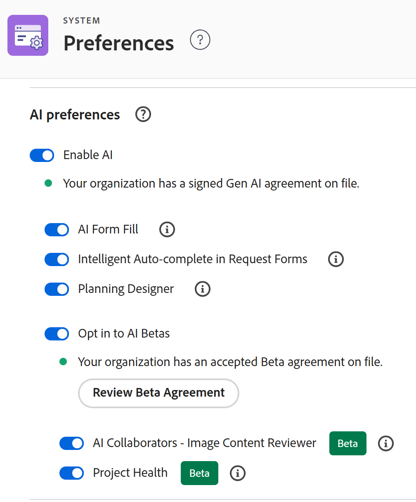
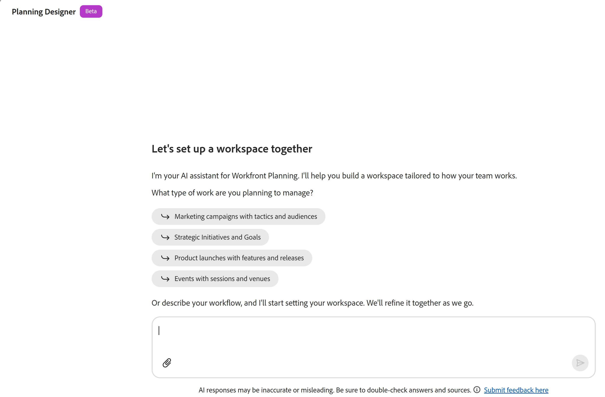

# Introdução ao Adobe Workfront Planning Designer

<!--remove the Beta tags in the screen shots on this page when this is released to GA - maybe March 2, 2026-->

>[!IMPORTANT]
>
>O Planning Designer está disponível no momento para todos os clientes em um estado Beta.
>
>As informações contidas neste artigo referem-se ao Adobe Workfront Planning, um recurso adicional do Adobe Workfront.
>
>Para obter uma lista dos requisitos para acessar o Workfront Planning, consulte [Visão geral do acesso ao Adobe Workfront Planning](/help/quicksilver/planning/access/access-overview.md).
> 
>Para obter informações gerais sobre o Workfront Planning, consulte [Introdução ao Adobe Workfront Planning](/help/quicksilver/planning/general/planning-overview.md).

Você pode usar o Adobe Planning Designer alimentado por IA para configurar facilmente seus espaços de trabalho e estruturas de dados. O Planning Designer oferece suporte a tudo, desde a criação e configuração de espaços de trabalho até a definição de campos e fórmulas, gerenciamento de registros, revisão do histórico de alterações e criação de exibições personalizadas.

Seja usado diretamente ou por meio do Assistente de IA, o Planning Designer oferece um ambiente flexível e eficiente para criar e manter informações estruturadas e conectadas.

Para obter informações sobre o Workfront Planning, consulte os seguintes artigos:

* [Informações gerais e índice de artigo para o Adobe Workfront Planning](/help/quicksilver/planning/planning-information.md)
* [Introdução ao Adobe Workfront Planning](/help/quicksilver/planning/general/planning-overview.md)
* [Visão geral de acesso do Adobe Workfront Planning](/help/quicksilver/planning/access/access-overview.md)

## Requisitos de acesso <!--edit theses??-->

+++ Expanda para visualizar os requisitos de acesso da funcionalidade neste artigo. 

<table style="table-layout:auto"> 
<col> 
</col> 
<col> 
</col> 
<tbody> 
<tr> 
   <td role="rowheader">
Pacotes Adobe Workfront
</td> 
   <td> 

Qualquer pacote do Workfront e do Planning

Qualquer pacote de Fluxo de Trabalho e Planejamento

   </td> </tr>

</tr> 
  <tr> 
   <td role="rowheader">
Licença do Adobe Workfront
</td> 
   <td>
Padrão
 
   
Administrador do Sistema para habilitar o Planning Designer para sua organização

  </td> 
  </tr> 
  <tr> 
   <td role="rowheader">
Permissões de objeto
</td> 
   <td>   
Gerenciar permissões para um espaço de trabalho</a> 
  
   
Os administradores do sistema têm permissões para todos os espaços de trabalho, incluindo aqueles que não criaram
  
   </td> 
  </tr>  
</tbody> 
</table>

Para obter mais informações sobre requisitos de acesso do Workfront, consulte [Requisitos de acesso na documentação do Workfront](/help/quicksilver/administration-and-setup/add-users/access-levels-and-object-permissions/access-level-requirements-in-documentation.md).

+++

## Habilitar o Planning Designer para sua organização

Como Administrador do Sistema, você pode ativar o Planning Beta para sua organização. Depois que essa configuração for ativada, todos na instância do Workfront poderão exibir os recursos do Planning Designer em sua área do Planning.

1. Faça logon como administrador do Workfront no Workfront.
1. Clique no **Menu Principal**  e em **Instalação**.
1. Vá para **Sistema** > **Preferências** > **Preferências de IA**.
1. Ative o **Habilitar IA** e verifique se você tem um Contrato Gen AI assinado com a Adobe.
1. Ative a configuração **Planning Designer**.

   

1. Clique em **Salvar**.

   Os recursos do Planning Designer para criar ou editar espaços de trabalho agora estão disponíveis para todos os usuários em sua organização que podem acessar o Planning.

<!--

## Turn off the Planing Designer for your organization

After your Workfront administrator accepts the AI Assistant agreement, the Planning Designer is turned on for everyone in your organization, by default. 

To turn it off: 

1. Log in to Workfront as a System Administrator. 
1. Click **Main Menu**  in the upper-left corner of the screen, then click **Setup**.
1. Click **System** >  in the left panel, then go to the **AI preferences** area.
1. Turn off the **Planning Onboarding** setting.
1. Click **Save**.

    This removes the Planning Designer for all users in the system.

-->

<!--

## Enroll in the Closed Beta program for the Planning Designer

Currently, you can request to participate in the Closed Beta program for the Planning Designer by sending us an email to sargism@adobe.com.

After we receive the email, our Engineering team will turn on the Planning Designer in your Workfront instance. 

>[!IMPORTANT]
>
>Your company must first accept the AI Assistant agreement before the Planning Designer is available in your system. 

-->

## Enviar feedback sobre o Planning Designer

Você pode enviar feedback sobre o Planning Designer durante o programa beta.

1. Faça logon no Workfront, clique no ícone **Menu Principal**  no canto superior esquerdo e clique em **Planning**.

   A área **Planning** é aberta.

1. Clique em **Criar com IA**. <!--update this tag name when they change it-->

   A janela **Planning Designer** é aberta.

1. Clique em **Enviar feedback aqui**, na parte inferior da página.
1. Adicione seu feedback no espaço fornecido e clique em **Enviar**.
Seu feedback é enviado às equipes de engenharia e de produtos.

## Considerações sobre o Planning Designer

* Para usar o Planning Designer, primeiro é necessário habilitar a IA para sua organização. Os recursos de IA devem estar disponíveis para todos em sua organização:

   * A Workfront deve disponibilizar os recursos de IA para sua organização.

     Para obter detalhes, consulte [Pré-requisitos do Assistente de IA](/help/quicksilver/workfront-basics/ai-assistant/ai-assistant-overview.md#prerequisites-to-ai-assistant).
   * Depois que a Workfront disponibilizar os recursos de IA para sua organização, o principal administrador do Workfront poderá acessá-la.

     Para obter informações, consulte [Configurar informações básicas do sistema](/help/quicksilver/administration-and-setup/get-started-wf-administration/configure-basic-info.md).
   * O administrador do Workfront deve aceitar o contrato de IA de Geração e, em seguida, ativar a IA e o Planning Designer para sua organização.

     Para obter mais informações, consulte [Habilitar ou desabilitar o Assistente de IA](/help/quicksilver/workfront-basics/ai-assistant/enable-or-disable-assistant.md).
* Depois que o Administrador do Sistema ativa a IA e o Planning Designer para a sua organização, o Planning Designer fica disponível para todos os usuários, por padrão.
* As ações executadas pelo Planning Designer também podem ser executadas pelo Assistente do AI, quando você o usa na área do Planning.
* As ações executadas pelo Assistente de IA na área de Planejamento ou aquelas executadas pelo Planning Designer estão no contexto das suas permissões do Workfront Planning e do seu nível de acesso ao Workfront.

  Para obter informações, consulte os seguintes artigos:

   * [Visão geral das permissões de compartilhamento no Adobe Workfront Planning](/help/quicksilver/planning/access/sharing-permissions-overview.md)
   * [Visão geral dos tipos de licença ao usar o Adobe Workfront Planning](/help/quicksilver/planning/access/license-type-overview.md)

* As alterações feitas pelo Assistente de IA ou pelo Planning Designer em nome do usuário são rastreadas no painel histórico do registro.

* As ações realizadas pelo Planning Designer são permanentes e podem ser irreversíveis. Por exemplo, a exclusão de um campo não pode ser revertida. Revise todas as ações propostas pela Designer antes de aceitá-las.

  >[!IMPORTANT]
  >
  >Ao criar, atualizar ou excluir um objeto por meio do Planning Designer, o prompt solicitará uma confirmação apenas para as ações que forem irreversíveis. Por exemplo, a exclusão de um tipo de registro ou de um espaço de trabalho é irreversível. A exclusão de um registro não é permitida. O Planning Designer solicitará confirmação apenas quando tentar excluir um tipo de registro ou espaço de trabalho.

* Quando você cria espaços de trabalho e tipos de registro usando o Planning Designer, as exibições e os campos também são criados automaticamente.

## Funcionalidade atualmente disponível para o Planning Designer

Você pode usar o Planning Designer ou o Assistente de IA para executar qualquer uma das seguintes ações:

* Criar e configurar espaços de trabalho

<!--On March 2: * Edit workspaces-->

* Criar tipos de registro, incluindo definição e adição de tipos de registro global a espaços de trabalho

* Criar campos ou campos de fórmula

* Criar, excluir, duplicar e restaurar registros

* Editar, atualizar, anexar um campo em um registro

* Vincular registros a outros registros

* Acessar histórico de alterações de registro

* Criar exibições personalizadas

* Criar registros importando um documento

  Por exemplo, você pode fazer upload de uma imagem de um organograma em sua empresa e o Planning Designer pode criar um espaço de trabalho com base nele.

  A criação de objetos a partir de um documento importado está disponível somente no Planning Designer, e não no AI Assistant.

  >[!IMPORTANT]
  >
  >Embora sejam compatíveis com tipos de arquivo .XLSX, eles não podem ser usados para importação de registros em larga escala por meio do Planning Designer.
  >Se você precisar importar um número substancial de registros no momento, recomendamos que faça isso usando os recursos manuais disponíveis no Planning.
  >
  >Para obter mais informações, consulte [Criar registros importando informações de um arquivo CSV ou do Excel](/help/quicksilver/planning/records/import-file-to-create-records.md).
  >Para obter limitações de tipo de arquivo, consulte a seção &quot;Obter sugestões com base em um documento que você carregou&quot; no [Use o Preenchimento de Formulário fornecido pela IA para preencher uma solicitação usando prompts ou documentos](/help/quicksilver/manage-work/requests/create-requests/autofill-from-prompt-document.md).

  <!--* Generate thumbnail and over image for a record (not available yet, maybe Q2) -->

## Criar ou atualizar objetos usando o Planning Designer

Você pode criar ou atualizar objetos no Workfront Planning usando o Planning Designer ou o Assistente de IA, a menos que especificado de outra forma.

1. Faça logon no Workfront, clique no ícone **Menu Principal**  no canto superior esquerdo e clique em **Planning**.

   A área **Planning** é aberta. <!--update screen shot when they change the name of the button-->

   

1. Clique em **Criar com IA** ou clique em **Criar espaço de trabalho**. Em seguida, use a janela de prompt na parte superior para indicar que tipo de espaço de trabalho você deseja criar. <!--update this when they change it to Generate with AI-->

   A janela **Planning Designer** é aberta. <!--remove the Beta tag here when this removes from Beta-->

   

1. No espaço fornecido, comece a digitar prompts para o Assistente de IA e, em seguida, clique em Enter quando terminar.

   <!--add screen shot-->

   Por exemplo, você pode digitar prompts semelhantes aos abaixo:

   * Crie e configure um espaço de trabalho com cinco tipos de registro para gerenciar campanhas

   * Criar campanhas de marketing para cada mês do ano atual

   * Adicionar um campo de campanha para o Status do espaço de trabalho de Design de marketing

   * Excluir todos os registros em um Status de Obsoleto

   * Atualizar todas as campanhas do Planning para um status Ativo

   * Conectar campanhas a personalidades no espaço de trabalho de Design de marketing

   * Exibir o histórico de alterações para a campanha &quot;Dia dos namorados&quot;

   * Crie uma exibição de linha do tempo para campanhas no espaço de trabalho de Design de marketing

   * Criar registros importando um documento. A criação de registros a partir de um documento importado está disponível somente no Planning Designer, e não no AI Assistant.

   <!--* Generate thumbnail and over image for a record (not available yet, maybe Q2) -->

1. Depois de receber uma resposta bem-sucedida, siga os links fornecidos na área de prompt para criar, atualizar ou revisar o objeto de sua solicitação.

   Quando você concorda em criar os objetos, as alterações são exibidas à direita da área de prompt.

   Você pode exibir espaços de trabalho, tipos de registro, campos, exibições e registros na área de visualização à direita do prompt.

   >[!TIP]
   >
   >Alguns objetos são criados imediatamente, sem necessidade de confirmação.

1. (Opcional) Digite prompts adicionais para editar ainda mais seus objetos.
1. (Opcional) Clique no **ícone Mostrar ou ocultar tela de visualização**  para abrir ou fechar a tela de visualização à direita.
1. Clique no **ícone Abrir espaço de trabalho em nova guia**  para abrir o espaço de trabalho que você está atualizando em uma nova guia.
1. Clique no ícone **Fechar** **X** para fechar o Planning Designer e abrir a área Espaços de Trabalho.
1. (Opcional) Para editar um espaço de trabalho, siga um destes procedimentos:

   * Abra o espaço de trabalho e faça alterações manualmente. Para obter informações, consulte [Editar espaços de trabalho](/help/quicksilver/planning/architecture/edit-workspaces.md).
   * Clique em **Editar com IA**. Isso abre a Designer do Planning. Repita as etapas acima para usar a IA e fazer mais alterações no espaço de trabalho.

