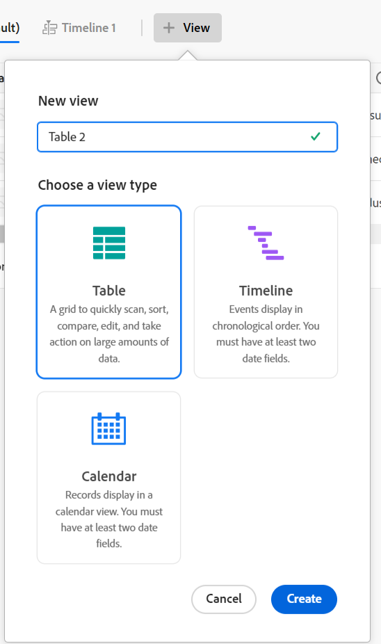
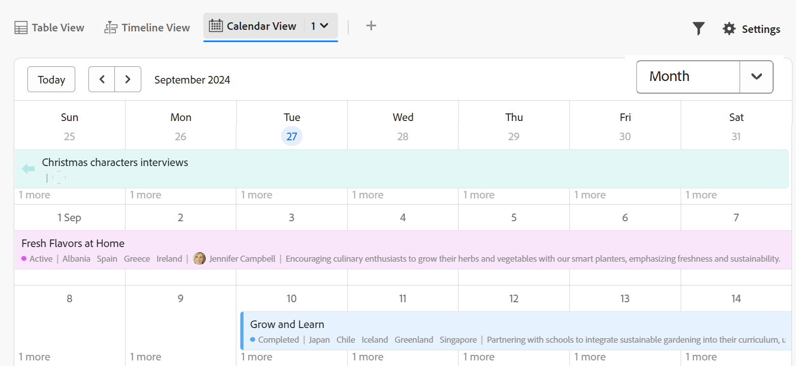

# Introdução ao Adobe Workfront Planning

<!--this article is linked to the WF Planning landing page - do not change URL or move it; send the team a new URL after we add the redirects for this page-->

<!--do not use the snippet for IMPORTANT as it links to this article-->

As informações destacadas nesta página referem-se a funcionalidades que ainda não estão disponíveis. Ela está disponível somente no ambiente de Pré-visualização para todos os clientes. Depois das versões mensais para produção, os mesmos recursos também ficam disponíveis no ambiente de produção para clientes que ativaram versões rápidas. 

Para obter informações sobre versões rápidas, consulte [Habilitar ou desabilitar versões rápidas para sua organização](/help/quicksilver/administration-and-setup/set-up-workfront/configure-system-defaults/enable-fast-release-process.md). 

>[!IMPORTANT]
>
>As informações contidas neste artigo referem-se ao Adobe Workfront Planning, um recurso adicional do Adobe Workfront.
>
>Para obter uma lista dos requisitos para acessar o Workfront Planning, consulte [Visão geral do acesso ao Adobe Workfront Planning](/help/quicksilver/planning/access/access-overview.md).

Este artigo contém informações gerais sobre o Workfront Planning.

Para obter a lista completa de artigos que contêm a documentação do Workfront Planning, consulte [Informações gerais e índice do artigo do Adobe Workfront Planning](/help/quicksilver/planning/planning-information.md).

## Introdução ao Adobe Workfront Planning

O Adobe Workfront Planning é um recurso adicional do Adobe Workfront. O objetivo do Workfront Planning é proporcionar uma visibilidade abrangente dos detalhes operacionais de uma organização e responder a questões de negócios críticas em cada etapa do ciclo de vida da gestão do trabalho.

O Workfront Planning pode responder a perguntas como:

* Quantas campanhas estamos executando na EMEA no quarto trimestre?
* Existe alguma sobreposição de público entre campanhas simultâneas?
* Como estão os programas de percepção atualmente?
* Como são os ativos de uma campanha específica? Qual deles ainda precisa ser aprovado?

Para responder a essas perguntas, a liderança precisa de uma solução que possa fornecer uma visão integral de todos os estágios do trabalho, desde o planejamento até a execução, da entrega até a medição dos resultados. Atualmente, as organizações dispõem de ferramentas que podem cobrir algumas partes do processo, mas muitas não têm boas conexões com todas as fases do trabalho, nem podem fornecer resultados confiáveis.

A seguir estão algumas das principais capacidades:

* Resolva o problema de gerenciar o trabalho em todas as etapas e para todas as partes interessadas que participam do processo de trabalho.
* Personalize totalmente seus fluxos de trabalho, desde a decisão sobre os tipos de objetos (ou tipos de registros) que sua organização usa até a configuração de como esses objetos se conectam entre si.
* Conecte-se a tipos de objetos de outros sistemas, criando uma estrutura coerente para todos os seus processos.

<!--
## Currently available Workfront Planning features
(*****for GA just make a list of what features ARE included in Planning and eliminate the last 2 columns; also update the title of this section*****)

(*****at GA: update the link below to the new place for release notes *****)

For information about new features and when they are released, see [Adobe Workfront Planning release activity for 2024](/help/quicksilver/planning/general/release-activity.md). 

The following features are currently available in Workfront Planning:

* Create workspaces             
* Create record types             
* Create record custom fields             
(************ * Import record types and fields using an Excel or CSV file*****)
          
* Display records in a table view            
* Display records in a timeline view            
* Display records in a calendar view            
* Filter, sort, and group records in a table view
* Filter, group, and color code records in the timeline view
* Filter records in the calendar view 
* Search for records in the table and timeline views             
* Connect records that belong to the same workspace  
* Connect records that belong to different workspaces   
* Connect Workfront Planning records to Workfront projects, programs, portfolios, companies, groups             
* Connect Workfront Planning records to Adobe Experience Manager assets          
    You must have an Adobe Experience Manager Assets license and an integration between AEM Assets and Workfront.
    For information, see [Adobe Workfront for Experience Manager Assets and Assets Essentials: article index](/help/quicksilver/documents/adobe-workfront-for-experience-manager-assets-essentials/workfront-for-aem-asset-essentials.md). 
* View record information in the Details tab
* View record connections in the Connections tab
* Customize the layout of a record's page             
* Share workspaces             
* Share views             
* Share views publicly with any external resource, even people who are not Workfront users         
* Duplicate views             
* Submit requests to create records            
* Export record details to Word and PDF.
* Add comments to records             
* Receive in-app notifications             
* Receive email notifications             
* Add thumbnails and cover pages to records             
* View the history of changes on a record             
* Rich Text formatting for Paragraph fields             
* Access Planning records from Workfront objects             
* Connect and disconnect Planning records from Workfront objects 
* Create Planning records by submitting a request form            
* Workfront Planning public API             
* Adobe Workfront Planning modules for Adobe Workfront Fusion             
* Workfront Planning AI Assistant
* Reporting on Workfront Planning information
    You can report on Planning information using the Canvas Dashboard. For information, see [Canvas Dashboards overview](/help/quicksilver/reports-and-dashboards/canvas-dashboards/canvas-dashboards-overview.md). 

-->

<!--OLD: 

|       Feature                                      |     Available now  |     Coming soon   |     In research  |
|----------------------------------------------------|:-----------------------------:|:--------------------------------:|:----------------:|
|     Create workspaces                              |   ✓                           |                                  |                  |
|     Create record types                |   ✓                           |                                  |                  |
|     Create record custom fields                    |   ✓                           |                                  |                  |
|     Import record types and fields using an Excel  or CSV file                              |                              |           ✓                       |                  |
|     Link records                                   |   ✓                           |                                  |                  |
|     View records in a table                        |   ✓                           |                                  |                  |
|     View records in a timeline                     |   ✓                           |                                  |                  |
|     View records in a calendar                     |   ✓                           |                                  |                  |
|     Filter records                                 |   ✓                           |                                  |                  |
|     Group records in the timeline view             |   ✓                           |                                  |                  |
|     Group records in the table view                | ✓                              |                                 |                  |
|     Sort records in the table view                                 |  ✓                             |                                 |                  |
|     Sort records in the timeline view                                 |                               |   ✓                              |                  |
|     Sort groupings in the table view                                 |                               |   ✓                              |                  |
|     Sort groupings in the timeline view                                 |                               |   ✓                              |                  |
|   Search for records in the table view    | ✓    |   |
|   Search for records in the timeline view    | ✓    |   |
|     Connect Workfront Planning records to Workfront projects, programs, portfolios, companies, groups  |   ✓                            |                                 |                  |
|     Connect Workfront Planning records to Adobe Experience Manager assets                                  |      ✓                         |                                  |                 |
|     Connect Planning records from different workspaces                                  |      ✓                         |                                  |                 |
|     Record page with detailed information                            |   ✓                           |                                  |                  |
|     Update the layout of the record's page              |    ✓                           |                                 |                  |
|  Share workspaces | ✓| |  |
|  Share views |✓ | |  |
|  Share views publicly with external resources |✓ | |  |
|  Duplicate views |✓ | |  |
|     Submit requests                                |                               |          ✓                        |                 |
|     Export record details to Word                                 |    ✓                           |                                  |                 |
|     Export record details to PDF                                 |                               |                                  |       ✓          |
|     Customize the color and icon of a record                                 |      ✓                         |                                  |                 |
|     Add comments to records                                 | ✓                              |                                  |                 |
|     Receive in-app notifications                                 | ✓                              |                                  |                 |
|     Receive email notifications                                 | ✓                              |                                  |                 |
|     Add thumbnails to records                                 | ✓                              |                                  |                 |
|     View history of changes on a record                                 | ✓                              |                                  |                 |
|     Rich Text formatting for Paragraph fields                                 |      ✓                         |                                  |                 |
|     Adobe Workfront Planning modules for Adobe Workfront Fusion                                 |      ✓                         |                                  |                 |
|     Copy and paste information from one field to another                                  |      ✓                         |                                  |                 |
|     Access Planning records from Workfront objects                                  |      ✓                         |                                  |                 |
|     Connect Planning records from Workfront objects                                  |      ✓                         |                                  |                 |
|     Workfront Planning public API                                 |      ✓                         |                                  |                 |
|     Workfront Planning AI Assistant*                                 |      ✓                         |                                  |                 |
|     Reporting on Workfront Planning information (Canvas Dashboard)                              |                               |       ✓                           |                 |
-->

## Habilite o Workfront Planning para os usuários em sua instância do Workfront

Depois que sua organização adquirir um pacote do Workfront Planning, como administrador do Workfront, você deverá garantir que os seguintes itens estejam em vigor antes que os usuários possam acessar o Workfront Planning:

* Atribua aos seguintes usuários um modelo de layout que inclua Planejamento no Menu Principal:

   * Atribua o modelo de layout aos usuários Light e Contribute.

     Os usuários padrão e os administradores do sistema têm o Planning habilitado por padrão.

  Para obter mais informações, consulte [Personalizar o menu principal usando um modelo de layout](/help/quicksilver/administration-and-setup/customize-workfront/use-layout-templates/customize-main-menu.md) e [Atribuir usuários a um modelo de layout](/help/quicksilver/administration-and-setup/customize-workfront/use-layout-templates/assign-users-to-layout-template.md).

* Atribua aos usuários uma licença do Workfront e permissões do Workfront Planning que lhes permitam visualizar ou criar objetos no Workfront Planning. Para obter mais informações sobre como conceder acesso e permitir que outras pessoas utilizem o Workfront Planning, consulte [Visão geral do acesso ao Adobe Workfront Planning](/help/quicksilver/planning/access/access-overview.md).

## Terminologia do Workfront Planning

Embora o Workfront Planning faça parte do Workfront, ele vem com conceitos e terminologia próprios. Não se esqueça de se familiarizar com esses conceitos antes de iniciar a configuração do Workfront Planning para sua organização.

A estrutura do Workfront Planning é totalmente personalizável. Você pode criar todos os tipos de registros, seus atributos e quaisquer campos associados a eles para atender às necessidades específicas da sua organização.

Existem limitações quanto ao número de objetos do Workfront Planning que você pode criar. Para obter mais informações, consulte [Visão geral das limitações de objetos Adobe Workfront Planning](/help/quicksilver/planning/general/limitations-overview.md).

A seguir estão os principais objetos e conceitos do Workfront Planning:

* [Espaços de trabalho](#workspaces)
* [Tipos de registro](#record-types)
* [Registros](#records)
* [Modelos de espaço de trabalho](#workspace-templates)
* [Campos](#fields)
* [Tipos de registro, registros e campos conectados](#connected-record-types-records-and-fields)
* [Campos de pesquisa](#lookup-fields)
* [Hierarquias](#hierarchies)
* [Exibições](#views)
* [Automações](#automations)
* [Formulários de solicitação](#request-forms)

### Espaços de trabalho

Os espaços de trabalho representam a estrutura de uma unidade organizacional. São coleções de tipos de registro que definem o ciclo de vida operacional de uma determinada organização.

Para obter mais informações, consulte [Criar áreas de trabalho](/help/quicksilver/planning/architecture/create-workspaces.md).

### Tipos de registro

Os tipos de registro são os tipos de objeto no Workfront Planning.

Os tipos de registro preenchem as áreas de trabalho.

Ao contrário do Workfront, onde os tipos de objeto são predefinidos, no Workfront Planning você pode criar seus próprios tipos de objeto.

Por exemplo, no Workfront, os tipos de objeto Programa, Portfólio, Projeto, Tarefa ou Problema já estão criados.

No Workfront Planning, você pode criar qualquer tipo de registro que atenda aos fluxos de trabalho da sua organização. Posteriormente, você poderá definir como os tipos de registros se relacionam entre si ou formam dependências.

Para obter mais informações, consulte [Visão geral dos tipos de registros](/help/quicksilver/planning/architecture/overview-of-record-types.md).

### Registros

Um registro é uma instância de um tipo de registro.

Depois de adicionar um tipo de registro a um espaço de trabalho, você pode começar a adicionar registros desse tipo na página do tipo de registro.

Por exemplo, “Campanha” pode ser um tipo de registro e “Campanha de verão para EMEA” é um registro do tipo de registro Campanha.

Para obter mais informações, consulte [Criar registros](/help/quicksilver/planning/records/create-records.md).

### Modelos de espaço de trabalho

Você pode criar um espaço de trabalho usando modelos predefinidos. Você pode usar os tipos de registros e campos predefinidos que vêm em um modelo ou pode adicionar os seus próprios.

O Adobe Workfront Planning contém os seguintes modelos:

* Básico: Gestão de Marketing
* Avançado: Gestão de Marketing
* Corporativo: Gestão de Marketing
* Gestão de vendas
* Gerenciamento de produtos

Para obter mais informações, consulte [Lista de modelos de espaços de trabalho](/help/quicksilver/planning/architecture/workspace-templates.md).

### Campos

Os campos são atributos que podem ser adicionados aos tipos de registro. Os campos contêm informações sobre o tipo de registro.

Considerações sobre campos de registro:

* Os campos que você adiciona para um tipo de registro são automaticamente associados a todos os registros desse tipo e podem ser usados para capturar dados sobre esses registros.

* Os campos são exibidos como colunas na visualização Tabela aplicada a uma página do tipo registro. Eles também são exibidos na página do registro.

* Os campos são exclusivos de um tipo de registro e não são transferidos de um para outro.

* Os campos são totalmente personalizáveis e podem ser acessados somente no Workfront Planning. Não é possível acessar os campos do Workfront Planning no Workfront.

Para obter mais informações, consulte [Criar campos](/help/quicksilver/planning/fields/create-fields.md).

Um novo tipo de registro está associado aos seguintes campos predefinidos, por padrão:

* Nome
* Descrição
* Data de início
* Data final
* Status

Você pode criar campos personalizados dos seguintes tipos:

* Texto de linha única
* Parágrafo
* Seleção múltipla
* Seleção única
* Data
* Número
* Porcentagem
* Moeda
* Caixa de seleção
* Fórmula
* Pessoas
* Criado por
* Data de criação
* Última modificação por
* Data da última modificação
* Aprovada por
* Data de aprovação
* ID do Registro
  <!--update the screen shot above-->

### Tipos de registro, registros e campos conectados

Você pode criar uma conexão entre as seguintes entidades no Workfront Planning:

* Dois tipos de registro do Workfront Planning.
* Um tipo de registro e um tipo de objeto de projeto, programa, portfólio, empresa ou grupo do Workfront.
* Um tipo de registro e um ativo ou pasta do Adobe Experience Manager.

  Você deve ter uma licença do Adobe Experience Manager para conectar tipos de registro com objetos do Experience Manager.

  

* Um tipo de registro e uma marca do Adobe GenStudio for Performance Marketing.

  Você deve ter uma licença do Adobe GenStudio for Performance Marketing para conectar tipos de registros às Marcas GenStudio.

  

Depois de estabelecer uma conexão entre os tipos de registro ou os tipos de registro e objeto, você pode conectar registros ou objetos individuais desses tipos uns aos outros. A conexão entre os registros é exibida como um campo de registro conectado, ou uma conexão.

Conectar tipos de registro é útil quando você tem vários tipos de objetos de trabalho que afetam uns aos outros. Por exemplo, você pode trabalhar com campanhas, e cada campanha pode atender a várias marcas. Para indicar essa relação, você pode conectar campanhas a marcas. Além disso, o trabalho de cada campanha pode ser planejado em vários projetos no Workfront. Para indicar isso, você pode conectar as campanhas aos projetos relevantes. Conectar tipos de registro e, em seguida, conectar registros individuais estabelece essa relação no Workfront Planning.

### Campos de pesquisa

Depois de estabelecer a conexão entre dois tipos de registro e conectar registros individuais, é possível fazer referência aos campos a partir dos registros conectados do registro a partir do qual você está se conectando.

Por exemplo, se você conectar um tipo de registro Campanha a um tipo de objeto Projeto do Workfront, é possível exibir o campo Orçamento dos projetos conectados nos registros da campanha.

>[!TIP]
>
>* Você não pode adicionar os seguintes tipos de campo como campos de pesquisa a partir dos tipos de registro ou objeto conectados:
>
>   * Criado por
>   * Última modificação por
>   * Campos de preenchimento automático do Workfront (incluindo campos como Proprietário do projeto ou Patrocinador do projeto)
>
>* Não é possível adicionar os seguintes tipos de campo como campos de pesquisa do registro conectado ou tipo de objeto na Produção,  mas você pode adicioná-los no ambiente de Visualização:
>
>   * Pessoas

Para obter informações sobre como conectar tipos de registros, registros e criar campos vinculados, consulte os seguintes artigos:

* [Conectar tipos de registro](/help/quicksilver/planning/architecture/connect-record-types.md)
* [Conectar registros](/help/quicksilver/planning/records/connect-records.md)

<!--not yet:* Fields are reusable across Record Types.  -->

### Hierarquias

Depois que os tipos de registro forem conectados em um espaço de trabalho, você poderá criar hierarquias que organizam essas conexões. As hierarquias organizam tipos de registro e objeto em relacionamentos pai-filho e podem conter até quatro níveis de tipos de objeto.

Se uma conexão entre dois tipos de registro ainda não existir, ela poderá ser criada conforme você configura a hierarquia. Uma vez definida, a hierarquia estabelece um caminho estruturado entre tipos de registro relacionados no espaço de trabalho.

As hierarquias geram navegações estruturais para seus respectivos registros que são exibidos em seus cabeçalhos. Dessa forma, os usuários sabem onde estão na hierarquia em qualquer estágio do fluxo de trabalho.

Para obter informações gerais sobre hierarquias e navegações estruturais, consulte [Visão geral sobre hierarquia e navegação estrutural](/help/quicksilver/planning/architecture/hierarchy-and-breadcrumb-overview.md).

### Exibições

Os registros são exibidos em sua respectiva página de tipo de registro em diferentes tipos de exibições.

As exibições contêm configurações personalizadas de um tipo específico de visualização, como a lista de campos (colunas), uma lista de registros (linhas), sua ordem (classificação), um filtro aplicado ou aplicável e um agrupamento.

A seguir estão os tipos de exibição que você pode aplicar à página do tipo de registro:

* **Exibição em tabela**: exibe registros e seus campos, incluindo campos conectados e de pesquisa, em formato de tabela. As linhas da tabela são os registros individuais e as colunas são os campos dos registros. A exibição em tabela é a exibição padrão.

  

* **Exibição da linha do tempo**: exibe registros que possuem pelo menos dois campos do tipo Data em uma linha do tempo cronológica. Você pode exibir até 5 tipos de registros conectados e seus registros na visualização da linha do tempo.

  

* **Exibição de calendário**: exibe registros que possuem pelo menos dois campos do tipo Data em formato de calendário.
  

<!-- add List view here when it's possible to display Planning RTs in it??-->

Para obter mais informações, consulte [Gerenciar exibições de registros](/help/quicksilver/planning/views/manage-record-views.md).

### Automações

Você pode configurar automações no Adobe Workfront Planning que, quando ativadas, criam registros no Workfront Planning quando acionadas a partir de um registro do Planning. Os registros criados são conectados automaticamente aos registros dos quais você está acionando a automação.

Você pode configurar e ativar a automação na página do tipo de registro no Workfront Planning.

Por exemplo, você pode criar uma automação que use uma campanha do Workfront Planning e crie uma Marca para associar à campanha.

Para obter informações sobre como criar objetos usando uma automação existente, consulte [Criar objetos usando as automações de registro do Adobe Workfront Planning](/help/quicksilver/planning/records/create-wf-objects-using-planning-automations.md).

### Formulários de solicitação

Você pode criar um formulário de solicitação e associá-lo a um tipo de registro no Adobe Workfront Planning. Em seguida, você pode compartilhar o formulário com outras pessoas, que podem enviar solicitações para criar registros desse tipo.

Para obter mais informações, consulte [Criar e gerenciar um formulário de solicitação no Adobe Workfront Planning](/help/quicksilver/planning/requests/create-request-form.md).

## Localizar o Adobe Workfront Planning

Para localizar o Adobe Planning, certifique-se de que sua organização tenha recebido acesso ao Workfront Planning e que o administrador do sistema ou do grupo tenha adicionado a área do Planning ao menu principal. Para obter informações, consulte [Visão geral do acesso ao Adobe Planning](/help/quicksilver/planning/access/access-overview.md).

Para localizar o Workfront Planning:

1. Faça login no Workfront.

{{step1-click-main-menu-shell-only}}

1. Clique em **Planning** .

   A página principal do Workfront Planning é aberta.

   

   >[!TIP]
   >
   >    O administrador do Workfront pode adicionar a área do Planning à opção Selecionar inicial no seu modelo de layout, para que você possa abrir o Planning assim que fizer login no Workfront. Para obter informações, consulte [Personalizar a página de destino usando um modelo de layout](/help/quicksilver/administration-and-setup/customize-workfront/use-layout-templates/customize-landing-page.md).

1. (Condicional e opcional) Se você for um administrador do Workfront, clique em uma das seguintes guias:
   * **Espaços de trabalho em que estou**: exibe os espaços de trabalho que você criou ou que foram compartilhados com você.
   * **Outros espaços de trabalho**: exibe todos os outros espaços de trabalho no sistema.

   Para todos os outros usuários, ambos os espaços de trabalho criados ou compartilhados com eles são exibidos na área **Espaços de Trabalho**.

1. (Opcional e recomendado) Continue com algumas das seguintes ações para criar sua estrutura de trabalho:

   1. Crie um espaço de trabalho do zero ou usando um modelo. Para obter informações, consulte [Criar espaços de trabalho](/help/quicksilver/planning/architecture/create-workspaces.md).

   1. Adicione seções ao novo espaço de trabalho. Para obter informações, consulte [Editar espaços de trabalho](/help/quicksilver/planning/architecture/edit-workspaces.md).
   1. Renomeie as seções já existentes no novo espaço de trabalho.
   1. Adicione tipos de registro ao novo espaço de trabalho. Para obter informações, consulte [Criar tipos de registro](/help/quicksilver/planning/architecture/create-record-types.md).

   1. Clique no nome de um tipo de registro para abrir sua página. Por padrão, a página do tipo de registro é aberta na visualização Tabela.

      Você também pode criar uma visualização Linha do tempo ou Calendário. Para obter informações, consulte [Gerenciar visualizações de registros](/help/quicksilver/planning/views/manage-record-views.md).

   1. Na visualização de tabela, comece a adicionar registros adicionando linhas

      Ou

      Comece a adicionar campos de registro adicionando colunas.

      Para obter informações, consulte os seguintes artigos:

      * [Criar registros](/help/quicksilver/planning/records/create-records.md)
      * [Criar campos](/help/quicksilver/planning/fields/create-fields.md).

## Recursos adicionais para o Workfront Planning

* [Informações gerais e índice de artigo do Adobe Workfront Planning](/help/quicksilver/planning/planning-information.md): um índice de todos os artigos que contêm documentação sobre o Workfront Planning, agrupados por área de interesse.
* [Visão geral do Assistente de IA do Adobe Workfront Planning](/help/quicksilver/planning/general/planning-ai-assistant-overview.md): com o Assistente de IA do Workfront Planning, você pode pesquisar registros ou criar, atualizar e excluir registros usando comandos, deixando que o assistente execute o trabalho para você.

  <!--
    >[!NOTE]
    >
    >    The Workfront AI Assistant has been temporarily removed and it will be available at a later date.-->

* [Módulos do Adobe Workfront Planning para Workfront Fusion](https://experienceleague.adobe.com/pt-br/docs/workfront-fusion/using/references/apps-and-their-modules/adobe-connectors/workfront-planning-modules): com os módulos do Adobe Workfront Planning, é possível acionar um cenário quando eventos ocorrem no Workfront Planning. Você também pode criar, ler, atualizar e excluir registros ou executar uma chamada de API personalizada para sua conta do Adobe Workfront Planning.

* [Noções básicas sobre a API do Adobe Workfront Planning](/help/quicksilver/planning/general/planning-api-basics.md): a meta da API do Adobe Workfront Planning é simplificar a criação de integrações com o Planning, introduzindo uma arquitetura REST-ful que opera sobre HTTP.

* [Comece a usar a integração entre o Adobe Workfront Planning e o Adobe GenStudio for Performance Marketing](/help/quicksilver/planning/planning-and-genstudio-integration/get-started-with-workfront-planning-and-genstudio-integration.md): você pode gerenciar registros do GenStudio for Performance Marketing no espaço de trabalho do GenStudio no Workfront Planning.

* **Recursos de relatórios do Workfront Planning**: agora você pode visualizar as informações do Workfront Planning em um relatório no Workfront usando o painel de tela do Workfront. Para obter informações, consulte [Visão geral dos Painéis da Tela](/help/quicksilver/reports-and-dashboards/canvas-dashboards/canvas-dashboards-overview.md).

