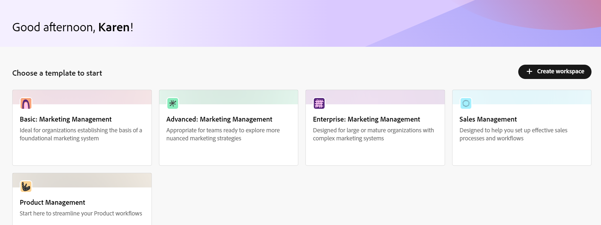

# Visão geral do Adobe Workfront Planning

<!--this article is linked to the WF Planning landing page - do not change URL or move it; send the team a new URL after we add the redirects for this page-->

<!--do not use the snippet for IMPORTANT as it links to this article-->

As informações destacadas nesta página referem-se a funcionalidades que ainda não estão disponíveis. Ela está disponível somente no ambiente de Pré-visualização para todos os clientes. Depois das versões mensais para produção, os mesmos recursos também ficam disponíveis no ambiente de produção para clientes que ativaram versões rápidas. 

Para obter informações sobre versões rápidas, consulte [Habilitar ou desabilitar versões rápidas para sua organização](/help/quicksilver/administration-and-setup/set-up-workfront/configure-system-defaults/enable-fast-release-process.md). 

>[!IMPORTANT]
>
>As informações neste artigo se referem ao Adobe Workfront Planning, um recurso adicional da Adobe Workfront.
>
>Para ter acesso total a todos os recursos no Workfront Planning, é necessário ter:
>
>* Um novo pacote e licença do Workfront. O Workfront Planning não está disponível para pacotes ou licenças herdadas do Workfront.
>* Um pacote do Workfront Planning.
>* A instância da Workfront de sua organização deve ser integrada à Adobe Unified Experience.
>
> Para obter uma lista completa dos requisitos para acessar o Workfront Planning, consulte [Visão geral do acesso ao Adobe Planning](/help/quicksilver/planning/access/access-overview.md).
> 

Este artigo contém informações gerais sobre o Workfront Planning.

Para obter a lista completa de artigos que contêm a documentação para o Workfront Planning, consulte [Adobe Workfront Planning: índice do artigo](/help/quicksilver/planning/planning-information.md).

## Introdução ao Adobe Workfront Planning

O Adobe Workfront Planning é um recurso adicional do Adobe Workfront. O objetivo do Workfront Planning é liberar uma visibilidade abrangente dos detalhes operacionais de uma organização e responder a perguntas comerciais críticas em cada estágio do ciclo de vida do gerenciamento de trabalho.

O Workfront Planning pode responder a perguntas como:

* Quantas campanhas estamos executando na EMEA no quarto trimestre?
* Temos sobreposições de público-alvo entre campanhas simultâneas?
* Como os programas de conscientização estão indo bem agora?
* Como os ativos se parecem para uma campanha específica? Quais deles ainda precisam ser aprovados?

Para responder a essas perguntas, a liderança precisa de uma solução que possa fornecer uma visão holística de cada estágio do trabalho, do planejamento à execução, da entrega à medição dos resultados. Atualmente, as organizações têm ferramentas que podem abranger algumas partes do processo, mas muitas não têm boas conexões com todas as fases do trabalho, nem podem fornecer resultados de forma confiável.

Veja a seguir alguns dos principais recursos:

* Resolva o problema de gerenciamento de trabalho em todos os estágios e para todas as partes interessadas que participam do processo de trabalho.
* Personalize totalmente seus workflows, desde decidir quais tipos de objeto (ou tipos de registro) sua organização usa até configurar como esses objetos se vinculam uns aos outros.
* Link para tipos de objetos de outros sistemas, criando uma estrutura coerente para todos os seus processos.

<!--
## Currently available Workfront Planning features
(*****for GA just make a list of what features ARE included in Planning and eliminate the last 2 columns; also update the title of this section*****)

(*****at GA: update the link below to the new place for release notes *****)

For information about new features and when they are released, see [Adobe Workfront Planning release activity for 2024](/help/quicksilver/planning/general/release-activity.md). 

The following features are currently available in Workfront Planning:

* Create workspaces             
* Create record types             
* Create record custom fields             
(************ * Import record types and fields using an Excel or CSV file*****)
          
* Display records in a table view            
* Display records in a timeline view            
* Display records in a calendar view            
* Filter, sort, and group records in a table view
* Filter, group, and color code records in the timeline view
* Filter records in the calendar view 
* Search for records in the table and timeline views             
* Connect records that belong to the same workspace  
* Connect records that belong to different workspaces   
* Connect Workfront Planning records to Workfront projects, programs, portfolios, companies, groups             
* Connect Workfront Planning records to Adobe Experience Manager assets          
    You must have an Adobe Experience Manager Assets license and an integration between AEM Assets and Workfront.
    For information, see [Adobe Workfront for Experience Manager Assets and Assets Essentials: article index](/help/quicksilver/documents/adobe-workfront-for-experience-manager-assets-essentials/workfront-for-aem-asset-essentials.md). 
* View record information in the Details tab
* View record connections in the Connections tab
* Customize the layout of a record's page             
* Share workspaces             
* Share views             
* Share views publicly with any external resource, even people who are not Workfront users         
* Duplicate views             
* Submit requests to create records            
* Export record details to Word and PDF.
* Add comments to records             
* Receive in-app notifications             
* Receive email notifications             
* Add thumbnails and cover pages to records             
* View the history of changes on a record             
* Rich Text formatting for Paragraph fields             
* Access Planning records from Workfront objects             
* Connect and disconnect Planning records from Workfront objects 
* Create Planning records by submitting a request form            
* Workfront Planning public API             
* Adobe Workfront Planning modules for Adobe Workfront Fusion             
* Workfront Planning AI Assistant
* Reporting on Workfront Planning information
    You can report on Planning information using the Canvas Dashboard. For information, see [Canvas Dashboards overview](/help/quicksilver/reports-and-dashboards/canvas-dashboards/canvas-dashboards-overview.md). 

-->

<!--OLD: 

|       Feature                                      |     Available now  |     Coming soon   |     In research  |
|----------------------------------------------------|:-----------------------------:|:--------------------------------:|:----------------:|
|     Create workspaces                              |   ✓                           |                                  |                  |
|     Create record types                |   ✓                           |                                  |                  |
|     Create record custom fields                    |   ✓                           |                                  |                  |
|     Import record types and fields using an Excel  or CSV file                              |                              |           ✓                       |                  |
|     Link records                                   |   ✓                           |                                  |                  |
|     View records in a table                        |   ✓                           |                                  |                  |
|     View records in a timeline                     |   ✓                           |                                  |                  |
|     View records in a calendar                     |   ✓                           |                                  |                  |
|     Filter records                                 |   ✓                           |                                  |                  |
|     Group records in the timeline view             |   ✓                           |                                  |                  |
|     Group records in the table view                | ✓                              |                                 |                  |
|     Sort records in the table view                                 |  ✓                             |                                 |                  |
|     Sort records in the timeline view                                 |                               |   ✓                              |                  |
|     Sort groupings in the table view                                 |                               |   ✓                              |                  |
|     Sort groupings in the timeline view                                 |                               |   ✓                              |                  |
|   Search for records in the table view    | ✓    |   |
|   Search for records in the timeline view    | ✓    |   |
|     Connect Workfront Planning records to Workfront projects, programs, portfolios, companies, groups  |   ✓                            |                                 |                  |
|     Connect Workfront Planning records to Adobe Experience Manager assets                                  |      ✓                         |                                  |                 |
|     Connect Planning records from different workspaces                                  |      ✓                         |                                  |                 | 
|     Record page with detailed information                            |   ✓                           |                                  |                  |
|     Update the layout of the record's page              |    ✓                           |                                 |                  |
|  Share workspaces | ✓| |  |
|  Share views |✓ | |  |
|  Share views publicly with external resources |✓ | |  |
|  Duplicate views |✓ | |  |
|     Submit requests                                |                               |          ✓                        |                 |
|     Export record details to Word                                 |    ✓                           |                                  |                 |
|     Export record details to PDF                                 |                               |                                  |       ✓          |
|     Customize the color and icon of a record                                 |      ✓                         |                                  |                 |
|     Add comments to records                                 | ✓                              |                                  |                 |
|     Receive in-app notifications                                 | ✓                              |                                  |                 |
|     Receive email notifications                                 | ✓                              |                                  |                 |
|     Add thumbnails to records                                 | ✓                              |                                  |                 |
|     View history of changes on a record                                 | ✓                              |                                  |                 |
|     Rich Text formatting for Paragraph fields                                 |      ✓                         |                                  |                 | 
|     Adobe Workfront Planning modules for Adobe Workfront Fusion                                 |      ✓                         |                                  |                 | 
|     Copy and paste information from one field to another                                  |      ✓                         |                                  |                 | 
|     Access Planning records from Workfront objects                                  |      ✓                         |                                  |                 |
|     Connect Planning records from Workfront objects                                  |      ✓                         |                                  |                 |
|     Workfront Planning public API                                 |      ✓                         |                                  |                 |
|     Workfront Planning AI Assistant*                                 |      ✓                         |                                  |                 |
|     Reporting on Workfront Planning information (Canvas Dashboard)                              |                               |       ✓                           |                 |
-->

## Habilitar o Workfront Planning para os usuários em sua instância do Workfront

Depois que sua organização comprar um pacote do Workfront Planning, como administrador do Workfront, certifique-se de que o seguinte esteja em vigor antes que os usuários possam acessar o Workfront Planning:

* Dependendo do ambiente usado, atribua aos seguintes usuários um modelo de layout que inclua o Planning no Menu Principal:

   * No ambiente de Produção, atribua o modelo a todos os usuários de todos os tipos de licença, incluindo Administradores do sistema.

   * No ambiente de Visualização, atribua o modelo aos usuários do Light e do Contribute. Os usuários padrão e os Administradores do Sistema têm o Planning habilitado por padrão. 

  Para obter mais informações, consulte [Personalizar o Menu Principal usando um modelo de layout](/help/quicksilver/administration-and-setup/customize-workfront/use-layout-templates/customize-main-menu.md) e [Atribuir usuários a um modelo de layout](/help/quicksilver/administration-and-setup/customize-workfront/use-layout-templates/assign-users-to-layout-template.md).

* Atribua aos usuários uma licença do Workfront e permissões do Workfront Planning que permitiriam a eles visualizar ou criar objetos no Workfront Planning. Para obter mais informações sobre como conceder acesso e permitir que outras pessoas usem o Workfront Planning, consulte [Visão geral sobre acesso ao Adobe Planning](/help/quicksilver/planning/access/access-overview.md).

## Terminologia do Workfront Planning

Embora o Workfront Planning faça parte da Workfront, ele vem com conceitos e terminologia proprietários. Familiarize-se com esses conceitos antes de começar a configurar o Workfront Planning na sua organização.

A estrutura do Workfront Planning é totalmente personalizável. Você pode criar todos os tipos de registros, seus atributos e quaisquer campos associados a eles para atender às necessidades exatas de sua organização.

Há limitações para quantos objetos do Workfront Planning você pode criar. Para obter mais informações, consulte [visão geral das limitações de objetos do Adobe Workfront Planning](/help/quicksilver/planning/general/limitations-overview.md).

A seguir estão os principais objetos e conceitos do Workfront Planning:

* **Workspace**: uma coleção de tipos de registro que define o ciclo de vida operacional de uma determinada organização. Um espaço de trabalho é o quadro de trabalho de uma unidade organizacional.

  

  Para obter mais informações, consulte [Criar espaços de trabalho](/help/quicksilver/planning/architecture/create-workspaces.md).

* **Tipo de Registro**: o nome dos tipos de objeto no Workfront Planning.

  Os tipos de registro preenchem espaços de trabalho.

  Diferentemente do Workfront, onde os tipos de objeto são predefinidos, no Workfront Planning você pode criar seus próprios tipos de objeto.

  Por exemplo, no Workfront, os tipos de objeto de Programa, Portfolio, Projeto, Tarefa ou Problema já foram criados.

  No Workfront Planning, é possível criar qualquer tipo de registro que atenda aos workflows da organização. Posteriormente, é possível definir como os tipos de registro se relacionam entre si ou as dependências do formulário.

  Para obter mais informações, consulte [Visão geral dos tipos de registro](/help/quicksilver/planning/architecture/overview-of-record-types.md).

* **Registro**: uma instância de um tipo de registro.

  

  Depois de adicionar um tipo de registro a um espaço de trabalho, você pode começar a adicionar registros desse tipo na página do tipo de registro.

  Por exemplo, &quot;Campanha&quot; pode ser um tipo de registro e &quot;Campanha de verão para EMEA&quot; é um registro do tipo de registro Campanha.

  Para obter mais informações, consulte [Criar registros](/help/quicksilver/planning/records/create-records.md).

* **Modelo do Workspace**: você pode criar um espaço de trabalho usando modelos predefinidos. Você pode usar os tipos de registro e campos predefinidos incluídos em um modelo ou pode adicionar os seus próprios.

  

  O Adobe Workfront Planning contém os seguintes modelos:

   * Básico: Gerenciamento de marketing
   * Avançado: Gerenciamento de marketing
   * Enterprise: Gerenciamento de marketing
   * Gerenciamento de vendas
   * Gerenciamento de produtos

  Para obter mais informações, consulte [Lista de modelos de espaço de trabalho](/help/quicksilver/planning/architecture/workspace-templates.md).

* **Campos**: os campos são atributos que podem ser adicionados aos tipos de registro. Os campos contêm informações sobre o tipo de registro. <!--check the shot below, "Connection" needs to be in lowercase-->

  

  Considerações sobre campos de registro:

   * Os campos adicionados para um tipo de registro tornam-se automaticamente associados a todos os registros desse tipo e podem ser usados para capturar dados sobre esses registros.

   * Os campos são exibidos como colunas na exibição Tabela aplicada a uma página do tipo registro. Eles também são exibidos na página do registro.

   * Os campos são exclusivos de um tipo de registro e não são transferidos de um tipo de registro para outro.

   * Os campos são totalmente personalizáveis e podem ser acessados somente no Workfront Planning. Não é possível acessar os campos do Workfront Planning no Workfront.

  Para obter mais informações, consulte [Criar campos](/help/quicksilver/planning/fields/create-fields.md).

  Por padrão, um novo tipo de registro é associado aos seguintes campos predefinidos:

   * Nome
   * Descrição
   * Data de início
   * Data final
   * Status

  Você pode criar campos personalizados dos seguintes tipos:

   * Texto de linha única
   * Parágrafo
   * Seleção múltipla
   * Seleção única
   * Data
   * Número
   * Porcentagem
   * Moeda
   * Caixa de seleção
   * Fórmula
   * Pessoas
   * Criado por
   * Data de criação
   * Modificado pela última vez por
   * Data da última modificação

* **Tipos de registros conectados**, **Registros conectados** e **Campos conectados**: você pode criar uma conexão entre as seguintes entidades no Workfront Planning:

   * Dois tipos de registro do Workfront Planning.
   * Um tipo de registro e um tipo de objeto de projeto, programa, portfólio, empresa ou grupo do Workfront.
   * Um tipo de registro e um ativo ou pasta da Adobe Experience Manager.

     Você deve ter uma licença do Adobe Experience Manager para conectar tipos de registro a objetos do Experience Manager.

     

  Depois de estabelecer uma conexão entre os tipos de registro, você pode conectar registros individuais ou objetos desses tipos uns aos outros. A conexão entre os registros é exibida como um campo de registro conectado ou uma conexão.

  A conexão de tipos de registro é útil quando há vários tipos de objetos de trabalho que afetam uns aos outros. Por exemplo, você pode trabalhar com campanhas do e cada campanha pode atender a várias marcas. Para indicar esse relacionamento, você pode conectar campanhas a marcas. Além disso, o trabalho para cada campanha pode ser planejado em vários projetos no Workfront. Para indicar isso, você pode conectar as campanhas aos projetos relevantes. A conexão de tipos de registro e, subsequentemente, a conexão de registros individuais realiza essa relação no Workfront Planning.

* **Campos de pesquisa** (ou campos vinculados): depois de estabelecer a conexão entre dois tipos de registro e conectar registros individuais, você poderá fazer referência aos campos a partir dos registros conectados a partir do registro do qual está se conectando.

  Por exemplo, se você conectar um tipo de registro de Campanha a um tipo de objeto Projeto do Workfront, será possível exibir o campo Orçamento dos projetos conectados nos registros da campanha.

  

  >[!TIP]
  >
  > Não é possível adicionar os seguintes tipos de campo como campos de pesquisa do registro conectado ou tipos de objeto:
  >
  >* Pessoas
  >* Criado por
  >* Modificado pela última vez por
  >* Campos de digitação antecipada do Workfront (incluindo campos como Proprietário do projeto ou Patrocinador do projeto)

  Para obter informações sobre como conectar tipos de registro, registros e criar campos vinculados, consulte os seguintes artigos:

   * [Conectar tipos de registro](/help/quicksilver/planning/architecture/connect-record-types.md)
   * [Conectar registros](/help/quicksilver/planning/records/connect-records.md)

<!--not yet:* Fields are reusable across Record Types.  -->

* **Exibições**: os registros são exibidos na respectiva página de tipo de registro em diferentes tipos de exibições.

  

  As exibições contêm configurações personalizadas de um tipo de exibição específico, como a lista de campos (colunas), uma lista de registros (linhas), sua ordem (classificação), um filtro aplicado ou aplicável e um agrupamento.

  A seguir estão os tipos de exibição que podem ser aplicados à página tipo de registro:

   * **Modo de exibição de tabela**: mostra registros e seus campos, incluindo campos conectados e de pesquisa, em formato de tabela. As linhas da tabela são os registros individuais e as colunas são os campos de registro. A exibição em tabela é a exibição padrão.

     

   * **Modo de exibição de Linha do Tempo**: mostra registros que têm pelo menos dois campos do tipo Data em uma linha do tempo cronológica. Você pode exibir até 5 tipos de registros conectados e seus registros na exibição de linha do tempo.

     

   * **Modo de exibição de calendário**: mostra registros que têm pelo menos dois campos do tipo Data em um formato de calendário.

     

Para obter mais informações, consulte [Gerenciar exibições de registros](/help/quicksilver/planning/views/manage-record-views.md).

## Localizar o Adobe Workfront Planning

Para localizar o Adobe Planning, verifique se sua organização recebeu acesso ao Workfront Planning e se o administrador do sistema ou do grupo adicionou a área do Planning ao Menu Principal. Para obter informações, consulte [Visão geral sobre acesso ao Adobe Planning](/help/quicksilver/planning/access/access-overview.md).

Para localizar o Workfront Planning:

1. Faça logon no Workfront.

{{step1-click-main-menu}}

1. Clique em **Planning** .

   A página principal do Workfront Planning é aberta.

   

   >[!TIP]
   >
   >    O administrador do Workfront pode adicionar a área Planejamento à opção Selecionar página de aterrissagem no modelo de layout, para que você possa abrir o Planning assim que fizer logon no Workfront. Para obter informações, consulte [Personalizar a página de aterrissagem usando um modelo de layout](/help/quicksilver/administration-and-setup/customize-workfront/use-layout-templates/customize-landing-page.md).

1. (Condicional e opcional) Se você for um administrador do Workfront, clique em uma das seguintes guias:
   * **Espaços de trabalho em que estou**: exibe os espaços de trabalho que você criou ou os compartilhados com você.
   * **Outros espaços de trabalho**: exibe todos os outros espaços de trabalho no sistema.

   Para todos os outros usuários, ambos os espaços de trabalho criados ou compartilhados com eles são exibidos na área **Espaços de Trabalho**.

1. (Opcional e recomendado) Continue com algumas das seguintes ações para criar sua estrutura de trabalho:

   1. Crie um espaço de trabalho do zero ou usando um modelo. Para obter informações, consulte [Criar espaços de trabalho](/help/quicksilver/planning/architecture/create-workspaces.md).

   1. Adicione seções ao novo espaço de trabalho. Para obter informações, consulte [Editar espaços de trabalho](/help/quicksilver/planning/architecture/edit-workspaces.md).
   1. Renomeie as seções existentes no novo espaço de trabalho.
   1. Adicione tipos de registro ao novo espaço de trabalho. Para obter informações, consulte [Criar tipos de registro](/help/quicksilver/planning/architecture/create-record-types.md).

   1. Clique no nome de um tipo de registro para abrir a página do tipo de registro. Por padrão, a página de tipo de registro é aberta na exibição Tabela.

      Você também pode criar uma exibição de Linha do tempo ou Calendário. Para obter informações, consulte [Gerenciar exibições de registros](/help/quicksilver/planning/views/manage-record-views.md).

   1. Na exibição de tabela, comece a adicionar registros adicionando linhas

      Ou

      Comece a adicionar campos de registro adicionando colunas.

      Para obter informações, consulte os seguintes artigos:

      * [Criar registros](/help/quicksilver/planning/records/create-records.md)
      * [Criar campos](/help/quicksilver/planning/fields/create-fields.md).

## Atividade de versão do Workfront Planning

<!--update this with the new release activity page - the article index for all Planning releases-->

Estamos lançando novos recursos regularmente no Workfront Planning.

Para obter uma lista atualizada dos recursos lançados, consulte [atividade de versão do Adobe Workfront Planning: índice do artigo](/help/quicksilver/product-announcements/product-releases/planning-release-activity/planning-release-activity-article-index.md).

## Recursos adicionais para o Workfront Planning

* [Adobe Workfront Planning: índice do artigo](/help/quicksilver/planning/planning-information.md): um índice de todos os artigos que contêm documentação sobre o Workfront Planning, agrupados por área de interesse.
* [Visão geral do Adobe Workfront Planning AI Assistant](/help/quicksilver/planning/general/planning-ai-assistant-overview.md): com o Workfront AI Assistant para Planning, você pode pesquisar registros ou criar, atualizar e excluir registros usando comandos e permitindo que o assistente faça o trabalho por você.
  <!--
    >[!NOTE]
    >
    >    The Workfront AI Assistant has been temporarily removed and it will be available at a later date.-->

* [Módulos do Adobe Workfront Planning para Workfront Fusion](https://experienceleague.adobe.com/en/docs/workfront-fusion/using/references/apps-and-their-modules/adobe-connectors/workfront-planning-modules): com os módulos do Adobe Workfront Planning, é possível acionar um cenário quando eventos ocorrem no Workfront Planning. Você também pode criar, ler, atualizar e excluir registros ou executar uma chamada de API personalizada para sua conta do Adobe Workfront Planning.

* [Noções básicas da API de Planejamento do Adobe Workfront](/help/quicksilver/planning/general/planning-api-basics.md): a meta da API de Planejamento do Adobe Workfront é simplificar a criação de integrações com o Planning, introduzindo uma arquitetura REST-ful que opera via HTTP.

* **Recursos de relatórios do Workfront Planning**: agora é possível exibir informações do Workfront Planning em um relatório no Workfront usando o Painel do Workfront Canvas. Para obter informações, consulte [Visão geral dos Painéis da Tela](/help/quicksilver/reports-and-dashboards/canvas-dashboards/canvas-dashboards-overview.md).

