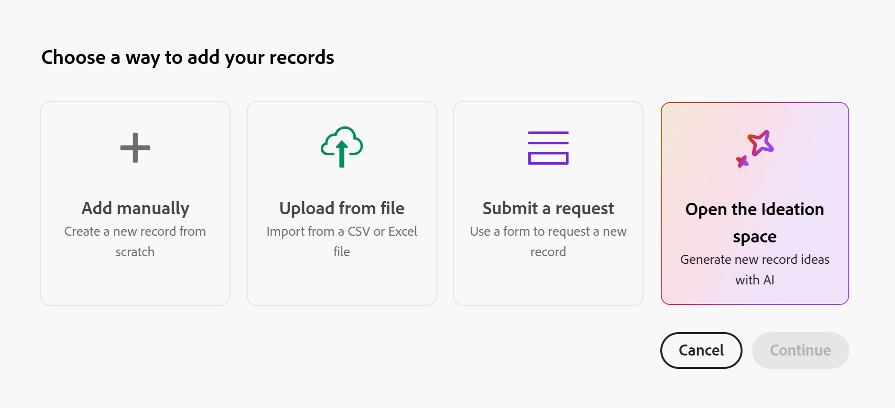
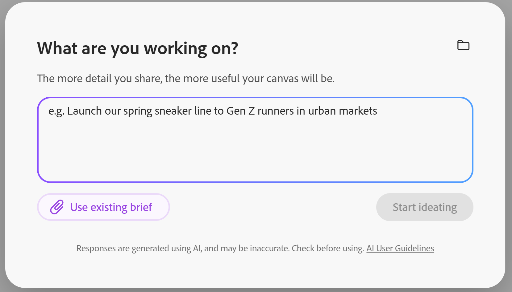

# Criar registros do Planning a partir de resumos de espaço de ideação

<!--
Will this release JUST to preview? If not - hide the preview portion below
-->

<!--
I started with this under Records first but what if Ideation will be added to other products and it will generate record types in those products? keep it here so it can be moved, if needed, to a standalone product one day?
-->

<!--
*********************** IMPORTANT ***************
THIS ARTICLE HAS 2 DRAFTS IN 2 SEPARATE AREAS FROM CLAUDE - THEY WERE CREATED AT DIFFERENT TIMES - WHICH ONE WOULD YOU KEEP OR MERGE THEM INTO ONE ARTICLE
-->

As informações nesta página se referem a funcionalidades que ainda não estão disponíveis. Ele está disponível somente como parte do programa **Espaço de ideação Beta**. 

Para obter mais informações, consulte [Introdução ao Espaço de ideação do Adobe Workfront Planning](/help/quicksilver/planning/ideation/get-started-with-planning-ideation.md).

{{planning-important-intro}}

Usando o Espaço de ideação, um novo recurso do Adobe Workfront Planning, você pode transformar resumos em registros do Planning. Os resumos exportados criam novos registros ou atualizam os existentes.

Este artigo descreve como criar ou editar registros existentes do Planning usando o espaço Ideação.

## Requisitos de acesso

+++ Expanda para exibir os requisitos de acesso para a funcionalidade neste artigo. 

<!--
are there additional license restrictions or packages to be purchased to have access to Ideation space?? If yes, update the table below
-->

<table style="table-layout:auto"> 
<col> 
</col> 
<col> 
</col> 
<tbody> 
    <tr> 
<tr> 
</tr>   
<tr> 
   <td role="rowheader">
Pacote do Adobe Workfront
</td> 
   <td> 
<ul> 
<li>
Qualquer Workfront ou Fluxo de trabalho com um pacote do Planning
</li>
Ou
<li>
Qualquer pacote do Planning quando adquirido como um produto independente
</li></ul>
   </td> 
    <!--
    <tr> 
    <td role="rowheader">
Additional products
</td> 
    <td><ul>
    <li>
Adobe GenStudio for Performance Marketing
</li>
    <li>
Adobe Customer Journey Analytics
</li>
    </ul>
    </td> 
    </tr> 
    -->
  <tr> 
   <td role="rowheader">
Licença do Adobe Workflow
</td> 
   <td>
Padrão

   </td> 
  </tr> 
<tr> 
   <td role="rowheader">
licença do Adobe Planning
</td> 
   <td>
Padrão

   </td> 
  </tr> 
<tr> 
   <td role="rowheader">
Configuração do nível de acesso
</td> 
   <td> 
   <ul>
   <li>
Você deve adicionar um Workflow e um tipo de licença do Planning ao nível de acesso quando tiver um Workflow e um pacote do Planning
   </li>
   <li>
A configuração Desativar espaço de ideação no seu nível de acesso deve ser desmarcada
</li>
</td> 
  </tr>  
   <tr> 
   <td role="rowheader">
Permissões de objeto
</td> 
   <td> 
Permissões do Contribute ou superior para o espaço de trabalho e tipo de registro ao qual você deseja adicionar registros 

      
Os administradores do sistema têm permissões para todos os espaços de trabalho, incluindo aqueles que não criaram

      
Exibir permissões para objetos do Workfront para adicioná-los a resumos <!--not sure if this is available-->

      
Permissões do editor no espaço de ideação para criar resumos

   </td> 
  </tr>  
    <!--
    <tr> 
    <td role="rowheader">
Adobe GenStudio for Performance Marketing user roles
</td> 
    <td>
<ul><li>Any GenStudio user role to access Campaigns, Products, and Personas</li>
    <li>GenStudio System Manager to access Activations and Events</li></ul>
    For information, see <a href="https://experienceleague.adobe.com/pt-br/docs/genstudio-for-performance-marketing/user-guide/intro/user-roles">User roles and permissions</a>. 
    

    </td> 
    </tr> 
    -->
</tbody> 
</table>

Para obter mais informações sobre requisitos de acesso do Workfront, consulte [Requisitos de acesso na documentação do Workfront](/help/quicksilver/administration-and-setup/add-users/access-levels-and-object-permissions/access-level-requirements-in-documentation.md).

+++   

## Considerações sobre o uso do espaço de ideação para criar registros

* Você só pode iniciar o espaço de ideação no Workfront Planning ou no Menu principal do Workfront, à medida que cria ou edita registros. O espaço de ideação não existe fora do Workfront.
* Para acessar o espaço Ideação, você deve ter um espaço de trabalho e um tipo de registro no Workfront Planning.
* Os novos registros sempre começam com conteúdo de espaço reservado, independentemente de como você os cria.
* Quando você exclui um registro de Planejamento vinculado a um resumo de ideação, o resumo permanece no espaço de ideação e sua tela associada no espaço de ideação não é excluída.
* A sincronização de informações ocorre somente a partir do espaço Ideação para o Workfront Planning. Não há sincronização reversa ou automática de um registro de Planejamento para o resumo do espaço de ideação.
* Os cenários a seguir existem quando os campos são criados, editados ou removidos no Workfront Planning:

  * Novos campos criados em registros vinculados aos resumos de ideação são adicionados diariamente ao resumo. Os novos campos aparecem vazios no resumo da ideação.
  * Os campos removidos permanecem no resumo e mantêm seus valores anteriores.
  * Campos renomeados atualizam seus nomes no resumo.
* Você pode adicionar documentos como cartões no espaço de ideação. Isso também inclui imagens.

  Os seguintes tipos de arquivos são compatíveis: PDF, Excel, CSV, PNG (e outros formatos de imagem), Word, PowerPoint. Vídeos não são compatíveis.

  Todos os documentos carregados são convertidos para o PDF no back-end para processamento.
* Você pode arrastar e soltar registros diretamente do Workfront Planning no espaço e eles aparecem da mesma forma que os arquivos carregados manualmente.

## Criar registros usando o espaço de ideação

1. Na página de aterrissagem do Workfront Planning, clique no cartão de um espaço de trabalho que você possa gerenciar.
1. Clique no cartão para um tipo de registro ao qual você pode adicionar registros.
1. Siga um destes procedimentos para criar um registro:

   * Em qualquer exibição da página de tipo de registro, clique em **Novo registro** no canto superior direito da página e na caixa **Escolher uma maneira de adicionar seus registros**, clique em **Abrir o espaço de ideação** e em **Continuar**.
   * Role para a parte inferior da tabela de registro e clique em **Nova linha** e em **Abrir o espaço de ideação**.

     >[!TIP]
     >
     >Selecionar **Não mostrar** ignora permanentemente o prompt futuro. Clicar no ícone Fechar **X** fecha esta caixa, mas ela reaparecerá da próxima vez que você adicionar um registro incorporado.

   

   O espaço de ideação é aberto em uma nova guia com um prompt vazio.

   O registro é criado imediatamente com texto de espaço reservado.

1. (Opcional) Clique em **Usar resumo existente** na caixa de prompt para procurar e adicionar um documento existente que o espaço de ideação usará para criar o resumo e o registro futuro. <!--CORRECT THIS PART: this is possible ONLY when you launch Ideation from the Main Menu, not from a record-->

   

1. (Opcional) Clique no **ícone Abrir telas anteriores** <!--accurate??-->  no canto superior direito da caixa de prompt, para abrir resumos existentes

1. No **Em que você está trabalhando?** , descreva o tipo de registro que deseja criar.

   Quanto mais detalhes você compartilhar, mais útil será a informação fornecida pelo espaço de ideação. Por exemplo, digite uma descrição da campanha que você está planejando: &quot;campanha de volta às aulas para uma agência de marketing&quot;.

1. Clique em **Iniciar idealização**.

   O Espaço de ideação funciona através das seguintes etapas enquanto compila sua ideia: <!--check some of these in the UI - there might have been UI text changes-->

   1. Entender sua meta e contexto
   2. Revisar seu espaço e os materiais selecionados
   3. Coletar evidências de documentos, Web e dados
   4. Sintetizar achados em um resumo de pesquisa
   5. Criar e refinar cartões com citações

   Durante esse processo, você verá o espaço Ideação pesquisando ativamente dados ou informações conectados do Workfront Planning disponíveis na Web.

   Por exemplo, ela pode procurar programas, produtos, perfis ou regiões existentes, bem como por conceitos semelhantes disponíveis online. <!--check on this with Et-->

   Quando a ideação é concluída, as seguintes coisas são adicionadas ao espaço de ideação:

   * Um resumo dos resultados de IA vinculado a vários cartões com informações detalhadas sobre os aspectos a serem considerados. Os cartões de detalhes são exibidos em uma nova seção. Um conector indica qual seção de placa pertence a qual resumo.

   * Um arquivo **Brief** no canto inferior esquerdo do espaço de ideação. O resumo é um rascunho do registro futuro e é exibido como a página Detalhes de um registro.

   

1. Continue a adicionar informações ao espaço de ideação para concluir a criação do seu resumo.

1. (Condicional) Quando o resumo for concluído, clique na imagem de visualização no canto inferior esquerdo e, em seguida, clique em uma das seguintes opções:

   * **Exportar para arquivo** para criar um arquivo
   * **Exportar para o Workfront Planning** para criar um registro do Planning

   Para obter informações sobre como adicionar itens ao resumo e exportá-lo, consulte [Criar resumos no espaço de ideação](/help/quicksilver/planning/ideation/create-briefs-in-ideation-space.md).

   Isso finaliza a criação do registro com as informações adicionais e o adiciona ao tipo de registro selecionado originalmente.

## Editar registros existentes no espaço de ideação

É possível abrir o espaço de ideação a partir de registros existentes para atualizá-los.

Não é possível editar registros em massa no espaço de ideação.

1. Vá para um registro existente no Workfront Planning e abra sua página de detalhes.

1. Clique em **Abrir no espaço de ideação**. Isso abre o espaço Ideação em uma nova guia.

   Se uma ideação para o registro já existir, ela abre esse espaço.

   Se nenhuma ideação existir, ela cria um espaço de ideação e um breve.

   >[!TIP]
   >
   >Os registros de edição de itens em massa usando o espaço de ideação não estão disponíveis.

   <!-- 
    I don't think these steps are still valid but the environment was not available to test: 
    - If a record is already linked to a Catalyze canvas, a link appears beneath the record title; clicking it opens the associated canvas.
    - If a linked canvas hasn't been exported/pushed back yet, the record shows a placeholder message ("This record has active Canvas...") even if the canvas itself has a real name in Catalyze.
    -->

1. Continue editando o resumo conforme descrito na seção [Criar registros usando o espaço de ideação](#create-records-using-the-ideation-space) deste artigo.

<!--
this is from Claude, but rephrased and included most of this above: 

## Step 5: Open the Workfront Planning Records panel

To bring real Workfront Planning records into your canvas (rather than just AI-generated ideas), click the **records icon** in the left-hand toolbar (third icon down). This opens the **Workfront Planning Records** panel, listing all **Connected Record types** available in your Planning environment — for example:

- Products
- Regions
- Personas
- Channels
- Activations
- Project
- Test Record
- Experience Manager Assets

## Step 6: Drag real records onto the canvas

Search or browse within a record type (e.g., **Products** or **Personas**), then drag the record you want directly onto the canvas. In the example, an existing **Nike product** record and a **Deep testing** persona record were both dragged in and positioned near the relevant concept cards.

This lets you visually connect your AI-generated ideas to the actual records that already exist in Workfront Planning, grounding the ideation in real data rather than hypothetical entities.

---

## Step 7: Refine with follow-up prompts

Use the **Ask anything** box in the bottom-right corner at any time to refine the canvas — for example, typing `regenerate` against a specific card to have Catalyze redo that section using updated context. Catalyze will re-run its reasoning steps (searching, synthesizing, citing) and update the affected cards in place.

---

## Step 8: Review the full canvas

Zoom out to see the complete picture: your original campaign goal, all AI-generated concept cards with citations, the real Workfront Planning records you've pulled in (Products, Personas, etc.), and a **Campaign Brief** summary card in the corner pulling it all together.

---

## Tips

- **Be specific in Step 2** — richer campaign descriptions produce more relevant, better-grounded cards.
- **Check citations** before trusting a generated fact — click **Sources** on any card.
- **Mix AI cards with real records** — dragging in actual Products, Personas, Regions, etc. keeps the canvas tied to your real Planning data, not just AI speculation.
- Responses are AI-generated and may be inaccurate — always verify against the linked sources before finalizing a record.

***************SECOND DRAFT FROM CLAUDE*******************
# Creating and Managing Records with Catalyze Ideation

> This workflow reflects the Closed Beta experience and is expected to evolve before Open Beta and GA. Confirm current behavior before publishing to customers.

This guide explains how to create and ideate on records using Catalyze within Workfront Planning. It covers all entry points, system behavior, data sync rules, and file-upload support.

## Before you start

- You must have access to a record list within Workfront Planning.
- Catalyze always opens in a **new browser tab** — this is consistent across every entry point.
- Any record created through Catalyze starts with **placeholder text** until you begin ideating.

## Option 1: Create a record via the top-level "New Record" button

1. Navigate to your record list in Workfront Planning.
2. Click the **New Record** button at the top of the page.
3. From the dropdown menu, select **Ideate in Catalyze**.
4. A new browser tab opens automatically, launching the Catalyze canvas.
5. A new record is created in Workfront Planning with placeholder text.
6. Begin ideation directly in Catalyze.

**Additional access from the record view:** Open the newly created record and, in its detail modal, click **Ideate in Catalyze**. This opens Catalyze in a new tab (same behavior as above).

## Option 2: Create a record via inline record creation (bottom of table)

1. Scroll to the bottom of the record table.
2. Click **New Record**.
3. The record is created immediately with placeholder text.
4. A pop-up appears with these options:
   - **Open Catalyze** — launches Catalyze in a new browser tab
   - **Don't Show Again** — permanently dismisses the future prompt
   - **X (Close)** — closes the pop-up; it will reappear next time
5. Click **Open Catalyze** to begin ideation.

## Working with existing records

**Contextual actions (bottom selection bar)**
- **Single record selected:** an "Ideate in Canvas" / "Open in Canvas" action appears.
  - If a canvas already exists, it opens that canvas.
  - If no canvas exists, it creates a new one.
- **Multiple records selected:** the Ideate/Open in Canvas action is **not available** — bulk ideation is not supported.

**Record detail panel**
- If no canvas is connected, an **Ideate in Catalyze** button appears in the record header.
- If a record is already linked to a Catalyze canvas, a link appears beneath the record title; clicking it opens the associated canvas.
- If a linked canvas hasn't been exported/pushed back yet, the record shows a placeholder message ("This record has active Canvas...") even if the canvas itself has a real name in Catalyze.

**When can you create a canvas for a record?**
A canvas can be created for a record that is in Workfront Planning and still in **draft** state (not yet marked "ready").

## Record deletion behavior

If a Planning record linked to a Catalyze canvas is deleted:
- The canvas remains intact in Catalyze.
- No data is removed from Catalyze.

## Data synchronization rules

**Sync direction:** One-way only, from Catalyze → Workfront Planning. There is no reverse or automatic sync from Planning back to Catalyze.

**Export process:**
1. In Catalyze, click **Export to Planning**.
2. Data is pushed to the connected Workfront Planning record.
3. The export **overwrites all existing field data** in the record.

**Important notes:**
- Changes made directly in Workfront Planning do **not** sync back to Catalyze.
- Data refresh in Workfront Planning is manual only (Beta behavior) — there is no scheduled/automatic sync.
- Schema updates do sync one direction: once connected, Planning schema changes propagate to Catalyze daily — added fields appear empty, removed fields keep their prior values, and renamed fields update in place.

## Uploading documents into the Catalyze canvas

- Files can be added as a "document card" on the canvas — this works the same whether the file is an image or another document type.
- You can drag and drop files directly from Workfront Planning onto the canvas, and they appear the same way as manually uploaded files.
- All uploaded documents are converted to PDF on the backend for processing.
- Supported file types (as of the Aug 2026 beta): **PDF, Excel, CSV, PNG (and likely other image formats), Word, PowerPoint.**
- **Not supported:** video files.
- You can include images directly in a prompt and Catalyze will recognize their content, though small-format legibility is still being refined.

## Key takeaways

- Use **Ideate in Catalyze** to connect records to the AI-assisted ideation workflow.
- Catalyze always launches in a separate browser tab.
- New records always start with placeholder content, regardless of entry point.
- Data flow between Catalyze and Planning is manual and one-directional (Catalyze → Planning).
- Deleting a Planning record does not delete its associated Catalyze canvas.

-->

<!--
Internal info: 

## The Ideation space and Adobe GenStudio

Adobe GenStudio for Performance Marketing is Adobe's end-to-end content supply chain solution, spanning five stages:

1. Strategy and Ideation
2. Workflow and Planning
3. Asset Management
4. Creation and Production
5. Delivery and Activation

The Ideation space fits in the **Strategy and Ideation** stage — the front door of the content supply chain — and is designed to work natively with the rest of GenStudio, so the briefs and strategic direction it generates flow directly into Workfront Planning for execution.
-->

