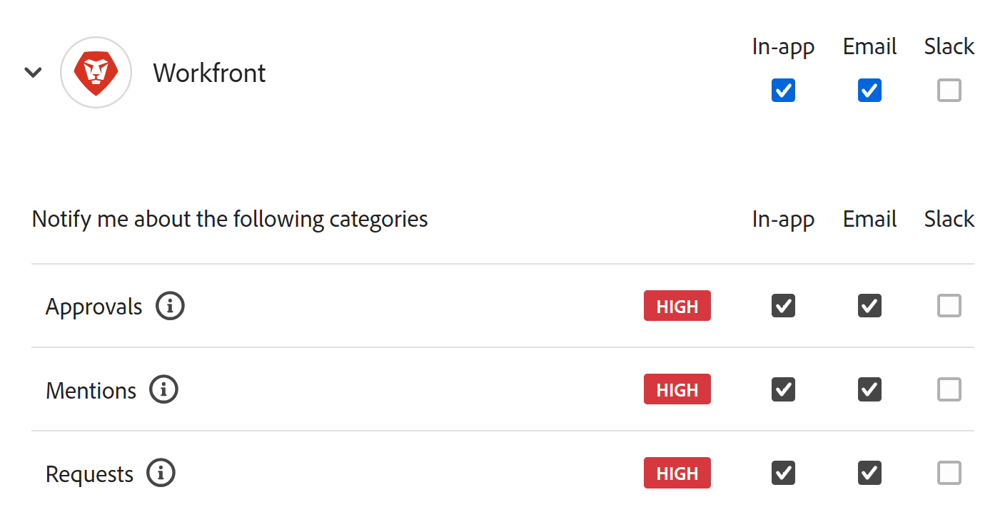

# Gerenciar preferências de notificação do Adobe Workfront Planning

<!--
The highlighted information on this page refers to functionality not yet generally available. It is available only in the Preview environment for all customers. After the release to Preview, the same features are also available monthly in the Production environment for customers who enabled fast releases.    

For information about fast releases, see [Enable or disable fast releases for your organization](/help/quicksilver/administration-and-setup/set-up-workfront/configure-system-defaults/enable-fast-release-process.md). 
-->

{{planning-important-intro}}

Este artigo descreve como gerenciar notificações do Adobe Workfront Planning, e não notificações do Adobe Workfront, em geral.

Você pode receber notificações no aplicativo ou por email quando as seguintes ações ocorrerem no Workfront Planning:

* Alguém adicionar você ou suas equipes a um comentário na página de gravação
* Alguém solicitar permissão para acessar uma visualização, um espaço de trabalho ou um registro
* Alguém concede a você permissão para acessar uma visualização, um espaço de trabalho ou um registro
* Você submete uma solicitação do Workfront Planning.
* Alguém aprovar ou rejeitar uma solicitação do Workfront Planning que você enviou.
* O status é alterado para uma solicitação do Workfront Planning enviada.

Você pode receber e gerenciar os seguintes tipos de notificações das atividades do Workfront Planning:

* No aplicativo
* Email

## Requisitos de acesso

+++ Expanda para exibir os requisitos de acesso para a funcionalidade neste artigo. 

<table style="table-layout:auto"> 
<col> 
</col> 
<col> 
</col> 
<tbody> 
    <tr> 
<tr> 
</tr>   
<tr> 
   <td role="rowheader">
Pacote do Adobe Workfront
</td> 
   <td> 

Qualquer Workfront e qualquer pacote do Planning
 
Qualquer fluxo de trabalho e qualquer pacote de planejamento

Para obter mais informações sobre o que está incluído em cada pacote do Workfront Planning, entre em contato com o representante de conta da Workfront. 
 
   </td> 
  <tr> 
   <td role="rowheader">
Licença do Adobe Workfront
</td> 
   <td>
Leve ou superior

   </td> 
  </tr> 
  <tr> 
   <td role="rowheader">
Permissões de objeto
</td> 
   <td>   
Exibir ou aumentar permissões para um espaço de trabalho</a> 
  
   
Os administradores do sistema têm permissões para todos os espaços de trabalho, incluindo aqueles que não criaram
 </td> 
  </tr> 
</tbody> 
</table>

Para obter mais informações sobre requisitos de acesso do Workfront, consulte [Requisitos de acesso na documentação do Workfront](/help/quicksilver/administration-and-setup/add-users/access-levels-and-object-permissions/access-level-requirements-in-documentation.md).

+++   

<!--
Old:
<table style="table-layout:auto"> 
<col> 
</col> 
<col> 
</col> 
<tbody> 
    <tr> 
<tr> 
<td> 
   
 Products
 </td> 
   <td> 
   <ul><li>
 Adobe Workfront
</li> 
   <li>
 Adobe Workfront Planning
</li></ul></td> 
  </tr>   
<tr> 
   <td role="rowheader">
Adobe Workfront plan*
</td> 
   <td> 

Any of the following Workfront plans:
 
<ul><li>Select</li> 
<li>Prime</li> 
<li>Ultimate</li></ul> 

Workfront Planning is not available for legacy Workfront plans
 
   </td> 
<tr> 
   <td role="rowheader">
Adobe Workfront Planning package*
</td> 
   <td> 

Any 
 

For more information about what is included in each Workfront Planning plan, contact your Workfront account manager. 
 
   </td> 
 <tr> 
   <td role="rowheader">
Adobe Workfront platform
</td> 
   <td> 

Your organization's instance of Workfront must be onboarded to the Adobe Unified Experience.
 

The users in your organization receive notifications from Workfront Planning only when your organization is onboarded to the Adobe Unified Experience. 

For more information, see <a href="/help/quicksilver/workfront-basics/navigate-workfront/workfront-navigation/adobe-unified-experience.md">Adobe Unified Experience for Workfront</a>. 
 
   </td> 
   </tr> 
  </tr> 
  <tr> 
   <td role="rowheader">
Adobe Workfront license*
</td> 
   <td>

Standard, Light, or Contributor
   
Workfront Planning is not available for legacy Workfront licenses
 
  </td> 
  </tr> 
  <tr> 
   <td role="rowheader">
Access level configuration
</td> 
   <td> 
There are no access level controls for Adobe Workfront Planning
   
</td> 
  </tr> 
<tr> 
   <td role="rowheader">
Object permissions
</td> 
   <td>   
View or higher permissions to a workspace</a> 
  
   
System Administrators have permissions to all workspaces, including the ones they did not create
 </td> 
  </tr> 
<tr>
   <td role="rowheader">
Layout template
</td>
   <td> Users with a Light or Contributor license must be assigned a layout template that includes Planning.
   
Standard users and System Administrators have the Planning areas enabled by default.

</li></ul>
  
</td>
  </tr>

</tbody> 
</table>
-->

Para obter mais informações sobre notificações do Workfront Planning, consulte também os seguintes artigos:

* Para obter informações sobre comentários em registros, consulte [Gerenciar comentários de registro](/help/quicksilver/planning/records/manage-record-comments.md).
* Para obter informações sobre notificações de aprovação, consulte os seguintes artigos:

  * [Aprovar uma solicitação no Adobe Workfront Planning](/help/quicksilver/planning/requests/approve-request.md)
  * [Enviar solicitações do Adobe Workfront Planning para criar registros](/help/quicksilver/planning/requests/submit-requests.md)
* Para obter informações sobre notificações no aplicativo do Workfront Planning, consulte [Gerenciar notificações no aplicativo do Adobe Workfront Planning](/help/quicksilver/planning/notifications/manage-planning-in-app-notifications.md).
* Para obter informações sobre notificações por email do Workfront Planning, consulte [Gerenciar notificações por email do Adobe Workfront Planning](/help/quicksilver/planning/notifications/manage-planning-email-notifications.md).

## Gerenciar preferências de notificação

>[!NOTE]
>
>Você gerencia as notificações do Workfront Planning usando a área Preferências da Adobe, e não a área Notificações da Workfront na página de perfil do usuário.

1. Faça logon no Workfront com suas credenciais da Adobe Experience Cloud.
1. Clique no ícone **menu de conta** ícone , no canto superior direito da tela, e clique em **Preferências**.
1. Na seção **Notificações**, clique em **Workfront**.
1. Selecione as notificações que deseja receber.
Ou
Desmarque as notificações que deseja parar de receber.

   
1. As seguintes notificações estão disponíveis para o Workfront:

   * **Aprovações**: você recebe uma notificação quando alguém envia uma solicitação do Planning para aprovação ou quando deseja solicitar acesso a um objeto do Planning.
   * **Menções**: você recebe uma notificação quando alguém marca você ou sua equipe em um comentário no Workfront Planning
   * **Solicitações**: você receberá uma notificação quando alguém executar uma das seguintes ações:

     * Solicita ou concede permissão a um objeto do Workfront Planning
     * Você submeteu uma solicitação do Workfront Planning
     * O status de uma solicitação do Workfront Planning que você submeteu alterações
     * Solicita, concede ou rejeita uma aprovação para uma solicitação do Workfront Planning

   Para obter mais informações sobre como gerenciar notificações, consulte [Preferências e notificações da conta](https://experienceleague.adobe.com/pt-br/docs/core-services/interface/features/account-preferences).

<!--
OLD: notifications are not available to non-IMS customers: 

When someone adds you to a comment in the record page, you may receive an in-app as well as an email notification about the comment. 

The following scenarios exist:   

* Adobe Unified Experience customers receive both an in-app notification and an email notification. They can manage their in-app and email notification preferences in the Preferences area of their Adobe Experience Cloud profile for the Workfront product. 

    For more information, see [Account preferences and notifications](https://experienceleague.adobe.com/en/docs/core-services/interface/features/account-preferences).

* Customers who are not on the Adobe Unified Experience receive only an email notification. They cannot manage their email notifications preferences and will always receive an email when someone adds them to a comment on a record in Workfront Planning.   

-->
