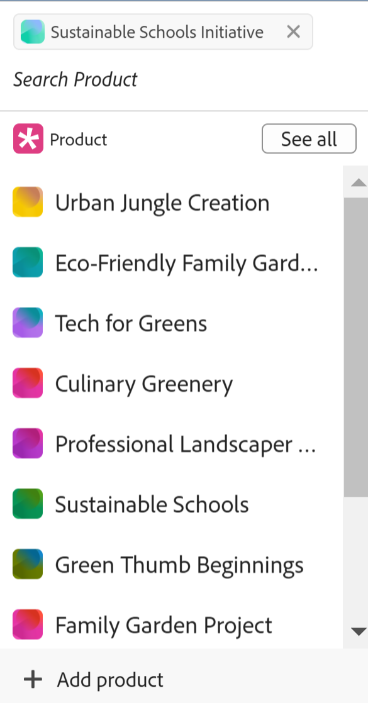
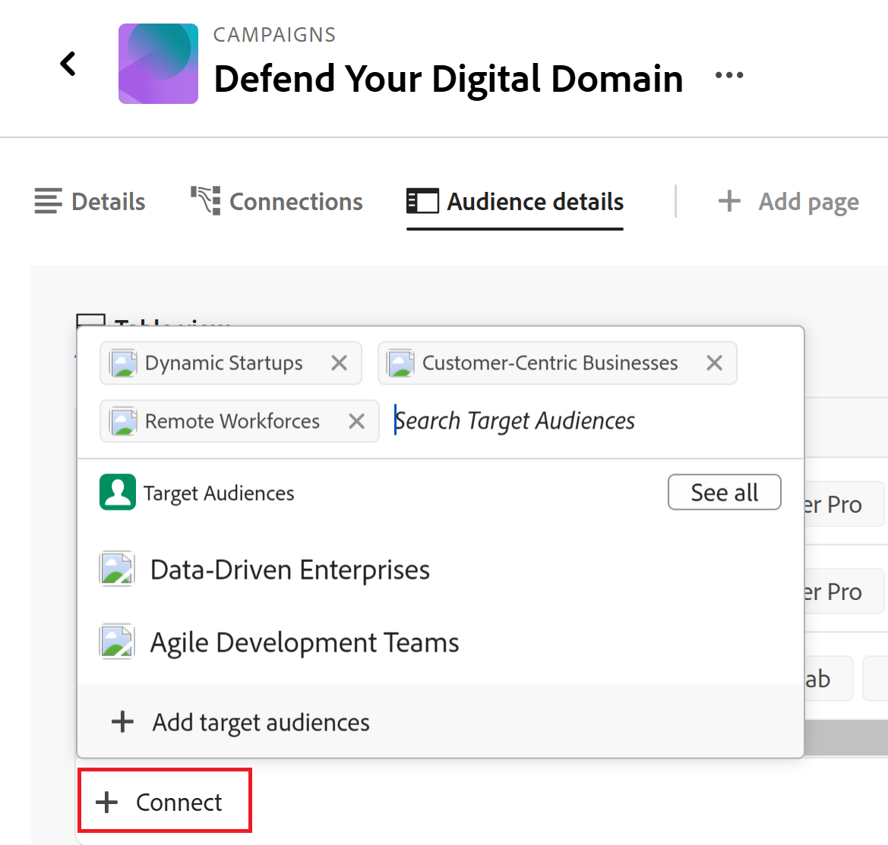

# Conectar registros

As informações destacadas nesta página referem-se a funcionalidades que ainda não estão disponíveis. Ela está disponível somente no ambiente de Pré-visualização para todos os clientes. Depois das versões mensais para produção, os mesmos recursos também ficam disponíveis no ambiente de produção para clientes que ativaram versões rápidas. 

Para obter informações sobre versões rápidas, consulte [Habilitar ou desabilitar versões rápidas para sua organização](/help/quicksilver/administration-and-setup/set-up-workfront/configure-system-defaults/enable-fast-release-process.md). 

{{planning-important-intro}}

É possível conectar registros do Adobe Workfront Planning uns aos outros ou a objetos de outros aplicativos. É possível exibir informações de um registro em outro registro ao conectá-los.

Este artigo descreve como conectar registros. Para obter informações mais gerais sobre como conectar registros, consulte [Visão geral dos registros conectados](/help/quicksilver/planning/records/connected-records-overview.md).

Primeiro, você deve conectar dois tipos de registro um ao outro ou um tipo de registro a um tipo de objeto de outro aplicativo. Isso cria campos de registro conectados. Em seguida, é possível conectar registros uns aos outros ou registros a outros objetos de outros aplicativos nos campos de registro conectados.

A conexão de registros é semelhante à conexão de registros a objetos de outro aplicativo.

Para obter informações sobre como conectar tipos de registro uns aos outros ou a tipos de objeto de outros aplicativos, consulte [Conectar tipos de registro](/help/quicksilver/planning/architecture/connect-record-types.md).

Para obter um exemplo de conexão de tipos de registro, consulte [Exemplo de conexão de tipos de registro e registros](/help/quicksilver/planning/architecture/example-connect-record-types-and-records.md).

Você pode conectar o seguinte:

* Registros do Adobe Workfront Planning entre si
* O Adobe Workfront Planning registra com objetos de outros aplicativos.

  Você pode conectar registros a objetos dos tipos listados abaixo a partir dos seguintes aplicativos:

   * Adobe Workfront

      * Projetos
      * Portfólios
      * Programas
      * Empresas
      * Grupos

   * Adobe Experience Manager Assets

      * Arquivos de imagem
      * Pastas

  <!--when you add more objects, fix the Access Requirements below which right now refer only to projects-->

## Requisitos de acesso

+++ Expanda para visualizar os requisitos de acesso.

Você deve ter o seguinte acesso para executar as etapas deste artigo:

<table style="table-layout:auto"> 
<col> 
</col> 
<col> 
</col> 
<tbody> 
    <tr> 
<tr> 
<td> 
   
 Produtos
 </td> 
   <td> 
   <ul><li>
 Adobe Workfront
</li> 
   <li>
 Planejamento do Adobe Workfront
</li>
   <li>
Adobe Experience Manager Assets, se você quiser conectar o AEM Assets aos registros do Planning

   
Você deve ter uma licença do Adobe Experience Manager Assets e uma integração entre o AEM Assets e o Workfront.
    Para obter informações, consulte <a href="/help/quicksilver/documents/adobe-workfront-for-experience-manager-assets-essentials/workfront-for-aem-asset-essentials.md">Adobe Workfront para Experience Manager Assets e Assets Essentials: índice do artigo</a>. 

   </li>  
   </ul></td> 
  </tr>   
<tr> 
   <td role="rowheader">
plano do Adobe Workfront*
</td> 
   <td> 

Qualquer um dos seguintes planos da Workfront:
 
<ul><li>Selecionar</li> 
<li>Prime</li> 
<li>Ultimate</li></ul> 

O Workfront Planning não está disponível para planos herdados do Workfront
 
   </td> 
<tr> 
   <td role="rowheader">
Pacote de planejamento do Adobe Workfront*
</td> 
   <td> 

Qualquer 
 

Para obter mais informações sobre o que está incluído em cada plano do Workfront Planning, entre em contato com seu gerente de conta da Workfront. 
 
   </td> 
 <tr> 
   <td role="rowheader">
plataforma Adobe Workfront
</td> 
   <td> 

A instância da Workfront de sua organização deve ser integrada à Adobe Unified Experience para acessar todos os recursos do Workfront Planning.
 

Para obter mais informações, consulte <a href="/help/quicksilver/workfront-basics/navigate-workfront/workfront-navigation/adobe-unified-experience.md">Experiência unificada da Adobe para Workfront</a>. 
 
   </td> 
   </tr> 
  </tr> 
  <tr> 
   <td role="rowheader">
Licença da Adobe Workfront*
</td> 
   <td> Padrão
   
O Workfront Planning não está disponível para licenças herdadas do Workfront
 
  </td> 
  </tr> 
  <tr> 
   <td role="rowheader">
Configuração do nível de acesso
</td> 
   <td> 
Não há controles de nível de acesso para objetos do Adobe Workfront Planning
 
   
Visualize ou aumente as permissões para os tipos de objeto que deseja vincular a partir do Workfront.
   
</td> 
  </tr> 
<tr> 
   <td role="rowheader">
Permissões de objeto
</td> 
   <td>   
Permissões do Contribute ou superior para um espaço de trabalho <!--and record type--> para conectar registros 
  
   
Permissões de exibição ou superiores para um espaço de trabalho <!--and record type--> para exibir todas as conexões a objetos e campos de outros aplicativos, independentemente do seu acesso no outro aplicativo. 

   
Visualize ou aumente as permissões para os objetos que deseja vincular a partir do Workfront ou do Experience Manager Assets. 

   
Os administradores do sistema têm permissões para todos os espaços de trabalho, incluindo aqueles que não criaram.
 </td> 
  </tr> 
<tr> 
   <td role="rowheader">
Modelo de layout
</td> 
   <td> 
Todos os usuários, incluindo administradores do Workfront, devem receber um modelo de layout que inclua a área Planejamento no Menu principal 
 </td> 
  </tr> 
</tbody> 
</table>

*Para obter mais informações sobre requisitos de acesso do Workfront, consulte [Requisitos de acesso na documentação do Workfront](/help/quicksilver/administration-and-setup/add-users/access-levels-and-object-permissions/access-level-requirements-in-documentation.md).

+++

## Considerações para conexão de registros

* Para conectar registros a outros registros ou objetos, você deve ter o seguinte:

   * Pelo menos um espaço de trabalho, tipo de registro e registro.

     Para obter mais informações, consulte os seguintes artigos:

      * [Criar espaços de trabalho](/help/quicksilver/planning/architecture/create-workspaces.md)
      * [Criar tipos de registro](/help/quicksilver/planning/architecture/create-record-types.md)
      * [Criar registros](/help/quicksilver/planning/records/create-records.md)

   * Conexões entre tipos de registro ou entre tipos de registro e objetos de outros aplicativos. Para obter informações, consulte [Tipos de registro de conexão](/help/quicksilver/planning/architecture/connect-record-types.md).

* É possível conectar um ou vários registros ou objetos entre si. Isso depende do tipo de conexão selecionado ao conectar os tipos de registro ou objeto. Para obter informações, consulte [Visão geral sobre tipos de registros do Connect](/help/quicksilver/planning/architecture/connect-record-types-overview.md).

## Conectar registros do Workfront Planning

Você pode conectar registros do Workfront Planning nas seguintes áreas de um registro do Planning:

* Os campos de registro conectados na exibição de tabela.
* A caixa ou página de visualização do registro nos campos de registro conectados na guia Detalhes.
* A caixa de visualização do registro ou a página na guia Conexões.
* A página do registro na guia Exibição de conexão. <!--this needs title edit when they rename the "Connection view" page type-->

### Conectar registros do Workfront Planning a partir da exibição de tabela ou da área Detalhes de um registro

{{step1-to-planning}}

1. Clique no espaço de trabalho cujos registros você deseja conectar.

   O espaço de trabalho é aberto e os tipos de registro são exibidos como cartões.
1. Clique no cartão de um tipo de registro para abrir a página do tipo de registro.
1. Clique no nome de uma exibição de tabela para abri-la.
1. (Opcional) Adicione registros ao tipo de registro selecionado adicionando uma nova linha à tabela. Para obter informações, consulte [Criar registros](/help/quicksilver/planning/records/create-records.md).
1. (Condicional) Depois de conectar o tipo de registro selecionado a outro tipo de registro, vá para o campo conectado de um registro e clique dentro do campo ou clique em **Conectar** para adicionar o registro.

   

1. Siga um destes procedimentos:

   * Clique no nome de um registro conectado na lista para adicioná-lo ao registro selecionado. O registro é adicionado automaticamente.
   * Comece a digitar o nome de um registro e clique nele quando ele for exibido na lista. O registro é adicionado automaticamente.

   >[!TIP]
   >
   >Se apenas a imagem do registro foi selecionada para exibição quando os tipos de registro foram conectados, somente a miniatura ou o ícone do registro será exibido no campo conectado. Para obter mais informações, consulte [Tipos de registro de conexão](/help/quicksilver/planning/architecture/connect-record-types.md).
   >

1. (Condicional) Se você selecionou Um para muitos ou Um para um para o tipo de conexão ao conectar os tipos de registro e tentar conectar um registro ou um objeto que já está conectado em outro lugar, você receberá um aviso de que a conexão novamente o removerá da conexão original. Clique em **Conectar** para permitir a remoção e conectar o registro, ou em **Cancelar** para voltar ao campo e selecionar outro registro.
1. (Opcional) Se você não encontrar um objeto para conexão e quiser adicioná-lo, clique em **+ Adicionar**

   Ou

   Comece digitando um nome para o objeto e clique em **+ Adicionar** para criá-lo e adicioná-lo.

   Para obter mais informações, consulte a seção &quot;Criar registros ao conectá-los a partir de outros registros&quot; no artigo [Criar registros](/help/quicksilver/planning/records/create-records.md).

   >[!TIP]
   >
   >    Você pode abrir a página de um registro e conectar outros registros fazendo o seguinte na exibição de tabela:
   >1. Clique no nome do registro na exibição.
   >1. Localize o campo de registro vinculado e clique duas vezes no campo (se já houver registros conectados)
   >Ou
   >Clique em **Conectar registros** (se o campo estiver vazio) para adicionar registros do tipo de objeto ou registro conectado.
   >
   >

1. (Opcional) Clique em **Ver tudo** para exibir todos os registros.

1. (Condicional) Se você clicou em **Ver tudo** na etapa anterior, a caixa **Conectar objetos** será exibida.

   

1. Comece a digitar o nome de um registro na caixa de pesquisa e selecione-o quando ele for exibido na lista

   Ou

   Selecione o nome de um ou vários registros na caixa e clique em **Conectar objetos**.

   São aditados os seguintes pontos:

   * Os registros vinculados são exibidos no campo de registro vinculado do registro selecionado em uma etapa anterior.
   * Os campos vinculados são preenchidos com as informações dos registros vinculados, se você tiver adicionado campos de pesquisa vinculados ao conectar os tipos de registro.

   A atualização dos registros vinculados atualiza os campos vinculados para os registros dos quais você está vinculando automaticamente. Não é possível editar manualmente campos vinculados.

   >[!TIP]
   >
   >* Usamos &quot;campos vinculados&quot; e &quot;campos de pesquisa&quot; alternadamente.
   >
   >* Quando você opta por conectar vários registros ao conectar os tipos de registro, os valores de campo dos vários objetos são exibidos separados por vírgulas ou são agregados de acordo com o agregador escolhido ao conectar os tipos de registro.

1. (Opcional) Feche a página de tipo de registro e vá para o espaço de trabalho selecionado.
1. Clique no cartão do tipo de registro ao qual você está vinculado.

   Por exemplo, se você conectou o registro **Campanha** ao registro Produto, clique no cartão **Produto**.

   O cartão de tipo de registro deve abrir na exibição de tabela. Caso contrário, selecione uma exibição de tabela.

   Observe que o campo de registro vinculado **Campanha** exibe os nomes das campanhas vinculadas aos produtos na página Tipo de registro do produto. Atualizar as informações de Campanha atualiza automaticamente o campo de registro vinculado Campanha para o tipo de registro Produto.

### Conectar registros do Workfront Planning a objetos do Workfront na exibição de tabela ou na área Detalhes de um registro

<!--when we will have more applications to link to from Planning, change the title to something like: Connect Workfront Planning records to objects from other applications-->

Depois de criar uma conexão entre um tipo de registro e um tipo de objeto do Workfront, você pode conectar registros individuais a objetos no Workfront. Os campos do Workfront conectados são automaticamente preenchidos nos registros dos quais você está vinculando os objetos.

>[!NOTE]
>
>Não é possível conectar tipos de objeto do Workfront com tipos de registro do Workfront Planning no Workfront.

{{step1-to-planning}}

1. Clique no espaço de trabalho cujos registros você deseja conectar.

   O espaço de trabalho é aberto e os tipos de registro são exibidos como cartões.
1. Clique no cartão de um tipo de registro para abrir a página do tipo de registro.
1. Selecione uma exibição de **Tabela** no menu suspenso **Exibir**.

1. Clique em **Novo registro** para adicionar registros individuais ao tipo de registro selecionado. Para obter informações, consulte [Criar registros](/help/quicksilver/planning/records/create-records.md).

1. (Condicional) Depois de conectar o tipo de registro selecionado a um tipo de objeto do Workfront, vá para o campo conectado em um registro e clique no campo ou clique em **Conectar** para adicionar objetos do Workfront.

   

1. Siga um destes procedimentos:

   * Clique em um objeto da lista para adicioná-lo ao registro selecionado. Os objetos são listados em ordem alfabética. O objeto é adicionado automaticamente.
   * Comece a digitar o nome de um objeto e clique nele quando ele for exibido na lista. O objeto é adicionado automaticamente.

   >[!TIP]
   >
   >Você pode abrir a página de um registro na exibição, clicar duas vezes no campo de registro vinculado ou clicar em **Conectar** no campo para adicionar objetos do tipo de objeto conectado.

1. (Opcional) Se você não encontrar um objeto para conexão e quiser adicioná-lo, clique em **+ Adicionar**

   Ou

   Comece digitando um nome para o objeto e clique em **+ Adicionar** para criar e adicionar um novo projeto, portfólio ou programa.

   Para obter informações, consulte [Criar objetos Workfront do Workfront Planning](/help/quicksilver/planning/records/create-workfront-objects-from-workfront-planning.md)

1. (Opcional) Clique em **Ver tudo** para exibir todos os objetos que você tem pelo menos permissões para exibir.

   Se você clicou em **Ver tudo** na etapa anterior, a caixa **Conectar objetos** será exibida.

   

1. Comece digitando o nome de um objeto Workfront na caixa de pesquisa e selecione-o quando ele for exibido na lista

   Ou

   Selecione o nome de um ou vários objetos na caixa e clique em **Conectar objetos**.

   >[!IMPORTANT]
   >
   >* Você só pode adicionar objetos Workfront para os quais tem acesso.
   >
   >* Depois de adicionar objetos do Workfront, todos os que têm permissões de Exibição ou superiores no espaço de trabalho poderão exibir os objetos do Workfront e suas informações de campo, independentemente de suas permissões ou acesso no Workfront.

   São aditados os seguintes pontos:

   * Os objetos Workfront selecionados são adicionados ao campo de registro vinculado.
   * Se você os tiver adicionado ao conectar o tipo de registro ao Workfront, os campos vinculados (ou os campos de pesquisa) dos objetos do Workfront serão automaticamente preenchidos com informações do Workfront.

   Para obter mais informações sobre como conectar tipos de registro a objetos de outro aplicativo, consulte [Conectar tipos de registro](/help/quicksilver/planning/architecture/connect-record-types.md).

1. (Opcional) Clique no nome de um objeto do Workfront conectado a um registro do Workfront Planning no campo vinculado de uma exibição de tabela ou no campo vinculado na página de registro.

   Essa ação abre o objeto do Workfront no Workfront, se você tiver pelo menos permissões de Exibição para o objeto.

   >[!TIP]
   >
   >* Quando você opta por conectar vários registros ao conectar os tipos de registro, os valores dos campos de pesquisa são exibidos separados por vírgulas ou são agregados de acordo com o agregador escolhido.
   >
   >* Um campo de registro vinculado não é criado para os objetos vinculados do Workfront no Workfront.

1. (Opcional) Na exibição de tabela do tipo de registro, passe o mouse sobre o cabeçalho da coluna do objeto Workfront vinculado, clique no menu suspenso e clique em **Editar campos de pesquisa**.

1. Adicionar campos de objeto do Workfront da área **Campos não selecionados**

   Ou

   Remova os campos de objeto do Workfront da área **Campos selecionados**.

   Isso adiciona ou remove campos vinculados dos registros do Workfront Planning. As informações associadas aos campos removidos permanecem no Workfront.

### Conectar registros do Workfront Planning a objetos do Adobe Experience Manager na exibição de tabela ou na área Detalhes de um registro

<!--when we will have more applications to link to from Planning, change the title to something like: Connect Workfront Planning records to objects from other applications-->

>[!IMPORTANT]
>
>Você deve ter uma licença do Adobe Experience Manager Assets, e a instância da Workfront de sua organização deve estar integrada à Adobe Business Platform ou à Adobe Admin Console para poder conectar os registros do Workfront Planning à Adobe Experience Manager Assets.
>
>Em caso de dúvidas sobre a integração com a Adobe Admin Console, consulte as [Perguntas frequentes sobre a Experiência Unificada do Adobe](/help/quicksilver/workfront-basics/navigate-workfront/workfront-navigation/unified-experience-faq.md).

Depois de criar uma conexão entre um tipo de registro e o Adobe Experience Manager Assets, você pode conectar registros individuais aos ativos do Experience Manager. Os campos de ativos que você conectou pelo Experience Manager Assets ao criar a conexão são preenchidos automaticamente no tipo de registro que você vinculou.

>[!NOTE]
>
>Os registros de planejamento e seus campos podem ser acessados no Experience Manager Assets quando o administrador do Workfront configura o mapeamento de metadados por meio da integração entre o Workfront e o Adobe Experience Manager Assets. Para obter mais informações, consulte [Configurar o mapeamento de metadados de ativos entre o Adobe Workfront e o Experience Manager Assets](https://experienceleague.adobe.com/docs/experience-manager-cloud-service/content/assets/integrations/configure-asset-metadata-mapping.html?lang=en).

Para conectar registros com ativos do Experience Manager:

{{step1-to-planning}}

1. Clique no espaço de trabalho cujos registros você deseja conectar.

   O espaço de trabalho é aberto e os tipos de registro são exibidos.
1. Clique no cartão de um tipo de registro para abrir a página do tipo de registro.
1. Selecione uma exibição de **Tabela** no menu suspenso **Exibir**, no canto superior direito da página de tipo de registro.

1. (Opcional) Clique em **Novo registro** para adicionar novos registros ao tipo de registro selecionado. Para obter informações, consulte [Criar registros](/help/quicksilver/planning/records/create-records.md).
1. (Condicional) Depois de conectar o tipo de registro selecionado ao Experience Manager Assets, vá para o campo conectado em um registro e clique no campo ou clique em **Conectar** para adicionar ativos do Experience Manager ao registro e, em seguida, clique no ícone **+**.

   >[!TIP]
   >
   >  Você pode adicionar e clicar no ícone **+** no campo de objeto vinculado na página de registro para conectar ativos ao registro.

   A caixa **Selecionar Assets** é exibida. <!--we might change this to Connect assets-->

   

1. Clique em para selecionar alguns dos seguintes tipos de ativos:

   * Imagens
   * Pastas

   É possível selecionar vários ativos.

   >[!IMPORTANT]
   >
   > É possível conectar somente ativos que você tenha acesso para visualizar no Experience Manager. Depois de conectados, todos os usuários do Workfront Planning podem exibir os ativos no Workfront Planning, independentemente do acesso deles ao Experience Manager Assets.

1. Clique em **Selecionar**. <!-- we might change this to Connect-->

   São aditados os seguintes pontos:

   * Os ativos do Experience Manager selecionados são adicionados ao campo de registro vinculado.
   * Os campos vinculados (ou campos de pesquisa) são preenchidos com informações dos ativos conectados do Experience Manager.

     Todas as informações existentes nos campos dos ativos do Experience Manager são exibidas nos campos vinculados ou de pesquisa automaticamente.

     >[!TIP]
     >
     >* Quando você seleciona conectar vários registros ao conectar os tipos de registro, os valores dos vários objetos são exibidos separados por vírgulas ou agregados de acordo com o agregador escolhido.
     >
     >* Um campo de registro vinculado aos registros vinculados do Workfront Planning não é criado para os ativos vinculados do Experience Manager no aplicativo do Experience Manager Assets.

1. (Opcional) Vá para o tipo de registro vinculado ao Experience Manager Assets a partir de e clique no nome de um ativo no campo de registro vinculado. Os detalhes do Experience Manager do ativo são exibidos em uma janela pop-up.

   

   Os seguintes campos são exibidos para um arquivo de imagem:

   * Uma miniatura da imagem
   * O nome do arquivo de imagem
   * Dimensões
   * Tamanho
   * Descrição
   * O caminho do arquivo no Experience Manager
   * O tipo de ativo
   * Data de criação
   * Data de modificação

1. (Opcional) Para abrir a página de registro de ativos da Experience Manager no Experience Manager, vá para a página de tipo de registro do registro que está vinculando, clique no nome de um ativo no campo de registro vinculado para abrir a janela pop-up e clique no ícone **Abrir no AEM**  para abrir o ativo.

   Isso abre o ativo Experience Manager no Adobe Experience Manager Assets.

1. (Opcional) Na exibição de tabela do tipo de registro, passe o mouse sobre o cabeçalho da coluna do ativo vinculado do Experience Manager, clique no menu suspenso e clique em **Editar campos de pesquisa**.

1. Adicionar campos de objeto do Experience Manager Assets da área **Campos não selecionados**

   Ou

   Remova os campos de objeto do Workfront da área **Campos selecionados**.

   Isso adiciona ou remove campos vinculados dos registros. As informações associadas aos campos removidos permanecem no Adobe Experience Assets.

### Conecte os registros do Workfront Planning a outros registros ou objetos a partir da guia Conexões da página de registro

1. Ir para qualquer exibição de um tipo de registro que tenha sido conectado a outros tipos de registro ou tipos de objeto do Planning de outros aplicativos.
1. Siga as etapas descritas nas subseções anteriores para localizar um registro na exibição que você deseja conectar a outros registros ou objetos.
1. Clique no nome de um registro.

   A página de visualização é aberta.
1. (Opcional) Clique no ícone **Abrir em nova guia**  para abrir a página do registro.
1. Clique na guia **Conexões** na visualização ou página do registro.

   

   Todos os tipos de registro ou objeto vinculados ao tipo de registro selecionado são exibidos como seções. Registros ou objetos conectados são exibidos em seus nomes de registro ou de tipo de objeto em cartões.

   >[!TIP]
   >
   >    Somente os registros conectados que têm registros individuais conectados são exibidos por padrão.

1. (Opcional) Clique em **Mostrar todas as conexões** para mostrar todos os tipos de registros conectados, incluindo aqueles sem registros conectados.

1. (Opcional) Clique na seta para baixo à esquerda de uma seção para recolhê-la.

1. (Condicional) Clique em **Conectar** para adicionar mais registros ou objetos do mesmo tipo.
1. (Opcional) Se você não puder encontrar um registro ou um objeto para se conectar e quiser adicioná-lo, clique em **+ Adicionar**

   Ou

   Comece digitando um nome para o objeto e clique em **+ Adicionar** para criar e adicioná-lo ao registro.

   Para obter mais informações, consulte a seção &quot;Criar registros ao conectá-los a partir de outros registros&quot; no artigo [Criar registros](/help/quicksilver/planning/records/create-records.md).
1. Siga as etapas descritas nas seções anteriores para conectar registros do Workfront Planning ou objetos do Workfront ou Experience Manager Assets.
Os registros e objetos são adicionados imediatamente.
1. (Opcional) Passe o mouse sobre o cartão conectado de um registro ou objeto, em seguida, clique no ícone **Desconectar registro**  para desconectá-lo do registro selecionado.

   

   O registro é imediatamente desconectado de todas as áreas do Workfront Planning ou de outros aplicativos onde pode ser exibido como conectado. Todos os valores de campo de pesquisa também são removidos.

### Conectar registros da guia Exibição de conexão na página de detalhes de um registro

<!--section needs title edit when they rename the "Connection view" page type-->

1. Ir para qualquer exibição de um tipo de registro que tenha sido conectado a outros tipos de registro ou tipos de objeto do Planning de outros aplicativos.
1. Siga as etapas descritas nas subseções anteriores para localizar um registro na exibição que você deseja conectar a outros registros ou objetos.
1. Clique no nome de um registro.

   A página de visualização é aberta.
1. Clique no ícone **Abrir em nova guia**  para abrir a página do registro.
1. Clique em uma guia Exibição de conexão existente na visualização ou página do registro. Primeiro, você deve criar uma página de exibição de conexão. Para obter informações, consulte [Gerenciar o layout da página de registro](/help/quicksilver/planning/records/manage-the-record-page.md).

   Uma página conectada do tipo de registro é exibida na exibição de tabela.
1. Clique em **Conectar** para adicionar ou remover registros.

   
1. (Opcional) Se não conseguir encontrar um registro conectado, clique em **+ Adicionar** para criá-lo e conectá-lo.

## Conectar registros de objetos do Workfront

Você deve ter as seguintes opções para conectar os registros do Workfront Planning a partir de objetos do Workfront:

* Conexões entre tipos de registro e tipos de objeto do Workfront estabelecidas no Workfront Planning.
* O administrador do Workfront ou do grupo deve adicionar qualquer um dos seguintes itens a um tipo de objeto do Workfront:

   * A seção Planejamento para os projetos, portfólios e programas do Workfront no Modelo de layout.

   * O campo personalizado Conexões do Planning a um formulário personalizado para um dos seguintes objetos:

      * Projeto
      * Portfólio
      * Programa
      * Grupo
      * Empresa

  Para obter mais informações, consulte [Gerenciar conexões de registro de objetos do Workfront](/help/quicksilver/planning/records/manage-records-in-planning-section.md).
