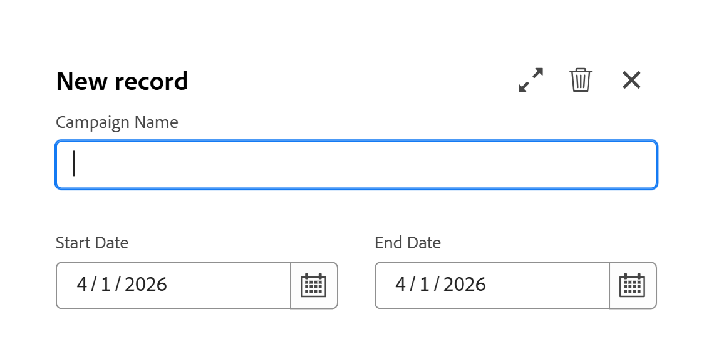

# Criar registros

<!--
The highlighted information on this page refers to functionality not yet generally available. It is available only in the Preview environment for all customers. After the monthly releases to Production, the same features are also available in the Production environment for customers who enabled fast releases.    

For information about fast releases, see [Enable or disable fast releases for your organization](/help/quicksilver/administration-and-setup/set-up-workfront/configure-system-defaults/enable-fast-release-process.md). 

-->

{{planning-important-intro}}

No Adobe Workfront Planning, um registro é uma instância de um tipo de registro.

Você pode criar registros seguindo um destes procedimentos:

* [Use o botão Novo registro ou Solicitar registro de qualquer exibição de tipo de registro](#create-records-using-the-new-record-or-request-record-button-from-any-record-type-view)
* [Adicioná-los em linha a partir da exibição de tabela do tipo de registro](#create-records-by-adding-them-inline-from-the-record-type-table-view)
* [Adicioná-los na exibição de linha do tempo do tipo de registro](#create-records-by-adding-them-in-the-record-type-timeline-view)
* [Adicioná-los na exibição de calendário do tipo de registro](#create-records-by-adding-them-in-the-record-type-calendar-view)
* [Copiar e colar uma lista de registros de uma lista externa](#create-records-by-copying-and-pasting-them-from-an-external-list)
* [Duplicar registros de uma exibição de tabela](#create-records-by-duplicating-them)
* [Conectá-los a partir de outros registros](#create-records-as-you-connect-them)
* [Enviar um formulário de solicitação para um tipo de registro](#create-records-by-submitting-a-request-form-to-a-record-type)
* [Importar informações de um arquivo CSV ou do Excel](#create-records-by-importing-records-from-a-csv-or-excel-file)
* [Usar automações](#create-records-by-using-automations)

Para obter informações sobre o gerenciamento de registros nas exibições de tabela ou linha do tempo, consulte os seguintes artigos:

* [Gerenciar a exibição de tabela](/help/quicksilver/planning/views/manage-the-table-view.md)
* [Gerenciar a exibição de linha do tempo](/help/quicksilver/planning/views/manage-the-timeline-view.md)

## Requisitos de acesso

+++ Expanda para exibir os requisitos de acesso para a funcionalidade neste artigo. 

<table style="table-layout:auto"> 
<col> 
</col> 
<col> 
</col> 
<tbody> 
    <tr> 
<tr> 
</tr>   
<tr> 
   <td role="rowheader">
Pacote do Adobe Workfront
</td> 
   <td> 

Qualquer Workfront e qualquer pacote do Planning
 
Qualquer fluxo de trabalho e qualquer pacote de planejamento

Para obter mais informações sobre o que está incluído em cada pacote do Workfront Planning, entre em contato com o representante de conta da Workfront. 
 
   </td> 
  <tr> 
   <td role="rowheader">
Licença do Adobe Workfront
</td> 
   <td>
Standard

   </td> 
  </tr> 
  <tr> 
   <td role="rowheader">
Permissões de objeto
</td> 
   <td> 
Permissões do Contribute ou superior para o espaço de trabalho e tipo de registro ao qual você deseja adicionar registros. 

   
Exiba ou aumente as permissões para o espaço de trabalho e o tipo de registro para criar registros usando o botão Solicitar registro na página de registro

   
Os administradores do sistema têm permissões para todos os espaços de trabalho, incluindo aqueles que não criaram

   
Gerencie permissões para objetos do Workfront (portfólios) para adicionar objetos secundários (projetos).

   </td> 
  </tr>  
</tbody> 
</table>

Para obter mais informações sobre requisitos de acesso do Workfront, consulte [Requisitos de acesso na documentação do Workfront](/help/quicksilver/administration-and-setup/add-users/access-levels-and-object-permissions/access-level-requirements-in-documentation.md).

+++   

<!--Old:
<table style="table-layout:auto"> 
<col> 
</col> 
<col> 
</col> 
<tbody> 
    <tr> 
<tr> 
<td> 
   
 Products
 </td> 
   <td> 
   <ul><li>
 Adobe Workfront
</li> 
   <li>
 Adobe Workfront Planning
</li></ul></td> 
  </tr>   
<tr> 
   <td role="rowheader">
Adobe Workfront plan*
</td> 
   <td> 

Any of the following Workfront plans:
 
<ul><li>Select</li> 
<li>Prime</li> 
<li>Ultimate</li></ul> 

Workfront Planning is not available for legacy Workfront plans
 
   </td> 
<tr> 
   <td role="rowheader">
Adobe Workfront Planning package*
</td> 
   <td> 

Any 
 

For more information about what is included in each Workfront Planning plan, contact your Workfront account manager. 
 
   </td> 
 <tr> 
   <td role="rowheader">
Adobe Workfront platform
</td> 
   <td> 

Your organization's instance of Workfront must be onboarded to the Adobe Unified Experience to be able to access Workfront Planning.
 

For more information, see <a href="/help/quicksilver/workfront-basics/navigate-workfront/workfront-navigation/adobe-unified-experience.md">Adobe Unified Experience for Workfront</a>. 
 
   </td> 
   </tr> 
  </tr> 
  <tr> 
   <td role="rowheader">
Adobe Workfront license*
</td> 
   <td> Standard
   
Workfront Planning is not available for legacy Workfront licenses
 
  </td> 
  </tr> 
  <tr> 
   <td role="rowheader">
Access level configuration
</td> 
   <td> 
There are no access level controls for Adobe Workfront Planning
 
   
Edit access in Workfront for the object types that you want to create (projects, programs, and portfolios) as you connect the records to them. 
  
</td> 
  </tr> 
<tr> 
   <td role="rowheader">
Object permissions
</td> 
   <td> 
Contribute or higher permissions to the workspace and record type where you want to add records. 

   
View or higher permissions to the workspace and record type to create records using the Request record button on the record page

   
System Administrators have permissions to all workspaces, including the ones they did not create

   
Manage permissions to Workfront objects (portfolios) to add children objects (projects).

   </td> 
  </tr> 

</tbody> 
</table> -->

## Criar registros usando o botão Novo registro ou Solicitar registro de qualquer exibição de tipo de registro

Os usuários com permissões de Exibição para o espaço de trabalho e o tipo de registro podem criar registros somente usando o botão Solicitar registro na página Tipo de registro.

Usuários com permissões para Contribute e Gerenciar no espaço de trabalho e tipo de registro podem criar registros usando o botão Novo registro na página Tipo de registro.

>[!IMPORTANT]
>
>Um gerenciador de espaço de trabalho deve criar um formulário de solicitação para o tipo de registro para que os usuários com permissões de Exibição adicionem registros usando um formulário de solicitação. Caso contrário, os usuários com permissão de exibição não poderão criar registros.

{{step1-to-planning}}

1. Clique no espaço de trabalho ao qual deseja adicionar registros.

   O espaço de trabalho é aberto e os tipos de registro são exibidos como cartões.

1. Clique em um cartão de tipo de registro. Para obter informações sobre como criar um tipo de registro, consulte [Criar tipos de registro](/help/quicksilver/planning/architecture/create-record-types.md).

   A página do tipo de registro é aberta na exibição acessada pela última vez. Por padrão, uma página do tipo de registro é aberta na exibição de tabela.
Todos os registros do tipo selecionado são exibidos na visualização.

1. (Condicional) Em qualquer exibição, clique no seguinte no canto superior direito da tela, dependendo do espaço de trabalho e das permissões de tipo de registro:

   * Clique em **Novo registro**, se você tiver permissões do Contribute ou superiores no espaço de trabalho e no tipo de registro

     Ou

   * Clique em **Solicitar registro**, se você tiver permissões de Exibição no espaço de trabalho e no tipo de registro.

1. (Condicional) Se você clicou em **Novo registro**, faça o seguinte:

   1. Clique em uma das seguintes maneiras de criar um registro, em seguida, clique em **Continuar**:

      * **Adicionar manualmente**. A caixa de visualização do registro é aberta.\
        Adicione informações sobre o registro, conforme descrito na seção [Criar registros, adicionando-os embutidos da exibição de tabela do tipo de registro](#create-records-by-adding-them-inline-from-the-record-type-table-view) deste artigo, a partir da etapa 6. <!--insure this stays accurate-->
      * **Carregar do arquivo**
Adicione registros, conforme descrito no artigo [Crie registros importando informações de um arquivo CSV ou do Excel](/help/quicksilver/planning/records/import-file-to-create-records.md), a partir da etapa 6. <!--ensure this stays accurate-->
      * **Enviar uma solicitação**
O formulário de solicitação do tipo de registro é aberto.

        Um gerenciador de espaço de trabalho deve criar um formulário de solicitação para poder adicionar um registro usando um formulário de solicitação.

        >[!TIP]
        >
        >Alguns tipos de registro podem ter vários formulários. Clique em um para abri-lo.

        Adicione o registro conforme descrito no artigo [Enviar solicitações do Adobe Workfront Planning para criar registros](/help/quicksilver/planning/requests/submit-requests.md), a partir da etapa 6. <!--ensure this stays accurate-->

      

1. (Condicional) Se você clicou em **Solicitar registro**, faça o seguinte:

   1. (Condicional) Se o tipo de registro tiver mais de um formulário de solicitação, clique em um para escolhê-lo.
   2. Continue adicionando informações no formulário para criar o registro, conforme descrito no artigo [Enviar solicitações do Adobe Workfront Planning para criar registros](/help/quicksilver/planning/requests/submit-requests.md), a partir da etapa 6. <!--ensure this stays accurate-->

1. (Condicional) Revise os novos registros.

   Dependendo de como você optou por adicionar o registro, algumas das situações a seguir podem ocorrer:

   * Um novo registro é adicionado ao tipo de registro, a menos que você opte por adicioná-lo usando um formulário de solicitação com um processo de aprovação. A aprovação deve ser concedida por todos os aprovadores antes que o registro seja criado.
   * Vários registros são adicionados ao tipo de registro se você tiver adicionado registros usando uma planilha CSV ou do Excel.
   * Uma nova solicitação será adicionada na guia Planejamento da área Solicitações do Workfront, se você tiver adicionado a solicitação enviando um formulário de solicitação.

<!-- this is not possible anymore: 

## Create records by connecting them from another application

You can import records from other applications by linking them to existing records. This creates a linked record for the other application's connected object. 

1. Create a record type, as described in the [Create record types](/help/quicksilver/planning/architecture/create-record-types.md).

1. Create records for the record type you created in the previous step. For information, see the section [Create records by manually adding them to a record type](#create-records-by-manually-adding-them-to-a-record-type) in this article. 

1. Create a connection to an object type from another application for the record type you created. For information, see [Connect record types](/help/quicksilver/planning/architecture/connect-record-types.md).

1. Add objects from another application to the records you created above using the linked record field you created in the previous step. For information, see [Connect records](/help/quicksilver/planning/records/connect-records.md). 

    The following items are created in Workfront Planning:

    * A read-only record type that refers to the other application's record type you linked to in the connected record field. 

      For example, if you connect a Planning record type to Workfront project, a read-only record type named "Workfront project" is created in the same workspace. You can access the read-only Workfront record types from the table view of the Planning records you're linking from. 
   
-->

## Criar registros adicionando-os em linha a partir da exibição de tabela do tipo de registro

É possível criar registros na exibição de tabela de uma página de tipo de registro, ao adicioná-los em linha.

Para obter informações sobre como editar informações de registro, consulte [Editar registros](/help/quicksilver/planning/records/edit-records.md).

{{step1-to-planning}}

1. Clique no espaço de trabalho ao qual deseja adicionar registros.

   O espaço de trabalho é aberto e os tipos de registro são exibidos como cartões.

1. Clique em um cartão de tipo de registro. Para obter informações sobre como criar um tipo de registro, consulte [Criar tipos de registro](/help/quicksilver/planning/architecture/create-record-types.md).

   A página do tipo de registro é aberta na exibição acessada pela última vez. Por padrão, uma página do tipo de registro é aberta na exibição de tabela.
Os registros do tipo selecionado são exibidos na visualização.

1. (Condicional) Na exibição de tabela, siga um destes procedimentos:

   * Clique em **Novo registro** na última linha da tabela ou após o último registro em um agrupamento

     >[!TIP]
     >
     >Quando você adiciona um novo registro após o último em um agrupamento ou subagrupamento, o Workfront preenche automaticamente os campos incluídos nos agrupamentos. Você pode editar esses campos manualmente, se necessário, e os registros podem ser removidos do agrupamento.

   * Clique em **Shift + Enter** no teclado a partir de qualquer coluna ou linha da tabela. Isso adiciona uma linha vazia sob o registro do qual você começa.
   * Passe o mouse sobre o campo principal de um registro, clique no menu **Mais**  à direita do campo e clique em **Inserir registro acima** ou **Inserir registro abaixo**.

   

   O Workfront faz o upload de uma miniatura em cada novo registro automaticamente. Posteriormente, você poderá modificar essas imagens. Para obter informações, consulte [Adicionar uma imagem de capa a um registro](/help/quicksilver/planning/records/add-a-cover-image-to-a-record.md).

   Um novo registro é adicionado à tabela.

1. Clique no campo principal do novo registro

   Ou

   Clique no ícone **Abrir detalhes**  à esquerda do nome do registro.

   A caixa de visualização é aberta na tabela.

1. Comece digitando informações sobre o novo registro nos campos que você vê na caixa de visualização.

   >[!NOTE]
   >
   >  * Não há campos obrigatórios para registros. No entanto, recomendamos adicionar informações para o campo principal de um registro, pois é útil identificar registros ao vincular registros uns aos outros. Para obter mais informações sobre campos primários, consulte [Gerenciar a exibição de tabela](/help/quicksilver/planning/views/manage-the-table-view.md) e [Visão geral do campo primário](/help/quicksilver/planning/fields/primary-field-overview.md).
   >
   >  * Os campos que se referem a outros tipos de registro ou campos calculados são campos somente leitura.

1. (Condicional) Ao adicionar registros à tabela, antes de abrir a caixa de visualização do registro, continue adicionando informações em cada linha e clique em **Enter** no teclado para salvar as alterações.

   Ou

   Clique no nome do novo registro ou no ícone **Abrir detalhes**  à esquerda do nome do registro para abrir a caixa de visualização e editar as informações do registro na área de detalhes.

   >[!TIP]
   >
   >Você pode acessar o ícone **Abrir detalhes** somente a partir do campo de nome do registro quando o campo Nome for um campo primário.

1. (Opcional) Na caixa de visualização do registro, clique no ícone **Abrir em nova guia**  no canto superior direito para abrir a página do registro em uma nova guia. Continuar editando o registro na página de registro. Para obter informações, consulte [Editar registros](/help/quicksilver/planning/records/edit-records.md).

   O Workfront salva suas alterações automaticamente.

1. (Opcional) Feche a caixa de visualização ou clique na seta para trás à esquerda do nome do registro, se você tiver aberto a página do registro.

1. (Opcional) Na exibição de tabela, use os seguintes atalhos de teclado para desfazer ou refazer a adição de novos registros ou suas informações ao adicioná-los na exibição de tabela:

   * CTRL + Z (⌘ + Z para Mac) para desfazer uma alteração
   * CTRL + Shift + Z (⌘ + Shift + Z para Mac) para refazer uma alteração

## Criar registros adicionando-os na exibição de linha do tempo do tipo de registro

Você pode criar registros na exibição de linha do tempo de uma página de tipo de registro clicando duas vezes na linha do tempo.

Para obter informações sobre como criar um modo de exibição de linha do tempo, consulte [Gerenciar o modo de exibição de linha do tempo](/help/quicksilver/planning/views/manage-the-timeline-view.md).

{{step1-to-planning}}

1. Clique no espaço de trabalho ao qual deseja adicionar registros.

   O espaço de trabalho é aberto e os tipos de registro são exibidos como cartões.

1. Clique em um cartão de tipo de registro.

   A página do tipo de registro é aberta na exibição acessada pela última vez.

1. Primeiro, clique para abrir uma exibição de linha do tempo ou criar uma exibição de linha do tempo.

   >[!NOTE]
   >
   >Você só poderá criar uma exibição de linha do tempo se houver pelo menos dois campos de data associados ao tipo de registro.
1. Clique duas vezes em qualquer lugar na linha do tempo.

   A caixa **Novo registro** é aberta. <!--might need a new screen shot for Production - might add a title etc-->

   
1. Atualize as seguintes informações:

   * **Nome**: insira o nome do registro. Se você deixá-lo vazio, o Workfront o nomeia como **Sem título** por padrão.

     >[!TIP]
     >
     >Se você exibir o Nome do registro nas barras de registro de acordo com as configurações da linha do tempo, o nome não ficará visível na barra de registro se deixado em branco.

   * **Campos de data do registro**: atualize as datas do registro.

     Os nomes dos campos de data são personalizados de acordo com os campos selecionados para as datas de Início e Término quando a exibição de linha do tempo foi criada.

     Por padrão, os valores de data são pré-selecionados dependendo de como você exibe a visualização da linha do tempo. Existem os seguintes cenários:

      * Por **Ano**: as datas de início e término do registro abrangem um mês.
      * Por **Trimestre**: as datas de início e término do registro abrangem uma semana.
      * Por **Mês**: as datas de início e término do registro são de três dias.

1. (Opcional) Clique em um dos seguintes ícones:

   * **Expandir**  para abrir os detalhes do registro na janela de visualização.
   * **Excluir**  para excluir o registro.
   * **Fechar**  para fechar a nova caixa de registro.

   O registro é adicionado imediatamente à linha do tempo, bem como às exibições de tabela e calendário, a menos que você tenha clicado no ícone **Excluir**.

1. (Opcional) Passe o mouse sobre uma das margens da barra de registro na linha do tempo, em seguida, arraste e solte as extremidades da barra para uma data diferente. Isso altera automaticamente as datas inicial e final do registro.

   Para obter informações, consulte [Editar registros](/help/quicksilver/planning/records/edit-records.md).

1. (Opcional) Clique na barra de registros na linha do tempo para abrir a janela de detalhes do registro e atualizar suas informações, excluí-la ou adicionar comentários.

   >[!TIP]
   >
   >Por padrão, o Workfront associa o registro a uma miniatura e a uma imagem de capa.
   >
   >A miniatura é exibida na exibição de linha do tempo somente quando está ativada nas Configurações da exibição.

## Criar registros adicionando-os na exibição de calendário do tipo de registro

Você pode criar registros na exibição de calendário de uma página de tipo de registro clicando duas vezes em qualquer lugar do calendário.

Para obter informações sobre como criar um modo de exibição de calendário, consulte [Gerenciar o modo de exibição de calendário](/help/quicksilver/planning/views/manage-the-calendar-view.md).

{{step1-to-planning}}

1. Clique no espaço de trabalho ao qual deseja adicionar registros.

   O espaço de trabalho é aberto e os tipos de registro são exibidos como cartões.

1. Clique em um cartão de tipo de registro.

   A página do tipo de registro é aberta na exibição acessada pela última vez.

1. Clique para abrir uma exibição de calendário ou criar uma exibição de calendário.

   >[!NOTE]
   >
   >Você só poderá criar uma exibição de calendário se houver pelo menos dois campos de data associados ao tipo de registro.
1. Clique duas vezes em qualquer lugar do calendário.

   A caixa **Novo registro** é aberta. <!--(********might need a new screen shot for Production - might add a title etc*********ALSO CHECK IF THE SAME ONE NEEDS REPLACING FOR TIMELINE?????)-->

   

1. Atualize as seguintes informações:

   * **Nome**: insira o nome do registro. Se você deixá-lo vazio, o Workfront o nomeia como **Sem título** por padrão.

     >[!TIP]
     >
     >Se você exibir o Nome do registro nas barras de registro de acordo com as configurações do calendário, o nome não ficará visível na barra de registro se deixado em branco.

   * **Campos de data do registro**: atualize as datas do registro.

     Os nomes dos campos de data são personalizados de acordo com os campos selecionados para as datas Inicial e Final quando a exibição de calendário foi criada.

     Por padrão, os valores de data são pré-selecionados dependendo de como você exibe a visualização do calendário. Existem os seguintes cenários:

      * Por **Mês**: as datas de início e término do registro abrangem um dia.
      * Por **Semana**: as datas de início e término do registro são de dois dias.

1. (Opcional) Clique em um dos seguintes ícones:

   * **Expandir**  para abrir os detalhes do registro na janela de visualização.
   * **Excluir**  para excluir o registro.
   * **Fechar**  para fechar a nova caixa de registro.

   O registro é adicionado ao calendário, bem como às exibições de tabela e linha do tempo imediatamente, a menos que você tenha clicado no ícone **Excluir**.
1. (Opcional e condicional) Escolha **Mês** no menu suspenso do canto superior, passe o mouse sobre uma das margens da barra de registro no calendário, em seguida, arraste e solte as extremidades da barra em uma data diferente. Isso altera automaticamente as datas inicial e final do registro.

   Para obter informações, consulte [Editar registros](/help/quicksilver/planning/records/edit-records.md).
1. (Opcional) Clique na barra de registros no calendário para abrir a janela de detalhes do registro e atualizar suas informações, excluí-lo ou adicionar comentários.

   >[!TIP]
   >
   >Por padrão, o Workfront associa o registro a uma miniatura e a uma imagem de capa.
   >
   >A miniatura é exibida na exibição de calendário somente quando está habilitada nas Configurações da exibição.

   <!--(*********when this is available in both monthly and weekly, add more steps to show resizing the timeline and dragging and dropping the record in the calendar*******)-->

## Criar registros copiando e colando-os de uma lista externa

1. Comece a criar registros na exibição Tabela, conforme descrito na seção [Criar registros adicionando-os manualmente a um tipo de registro](#create-records-by-manually-adding-them-to-a-record-type) neste artigo.

   Certifique-se de que a exibição de tabela tenha as colunas (ou os campos) que você deseja preencher com as novas informações de registro.

1. Clique em **Novo &lt; Nome do tipo de registro >** na última linha da tabela para adicionar quantas linhas novas à tabela você desejar que seus novos registros sejam.

   Por exemplo, adicione 10 linhas à exibição de tabela se desejar colar as informações de 10 novos registros de outro aplicativo.

1. Em outro aplicativo, crie uma lista de registros que deseja importar.

   Por exemplo, você pode usar uma planilha do Excel para criar sua lista.

   A lista deve conter informações em formato de tabela.

   >[!TIP]
   >
   > As colunas da lista devem conter informações para os campos existentes no Workfront.
   >
   > Certifique-se de que você tenha os campos desejados já criados no Workfront e que as informações na sua planilha sejam exibidas no formato correto que corresponda ao de cada campo no Workfront.

1. Em outro aplicativo, selecione várias linhas e colunas e cole as informações na exibição de tabela do tipo de registro, começando com o primeiro novo registro.

   As informações a seguir são importadas na área do Workfront Planning:

   * As linhas contêm os novos registros
   * As colunas preenchem informações para os campos dos registros.

## Criar registros duplicando-os

Para obter informações sobre duplicação de registros, consulte [Duplicar registros](/help/quicksilver/planning/records/copy-or-duplicate-records.md).

## Criar registros ao conectá-los

Você pode criar os seguintes tipos de objeto ao conectá-los a partir de outros registros:

* Registros do Workfront Planning
* Objetos do Workfront

Esta seção descreve como criar registros do Workfront Planning à medida que você os conecta a outros registros.

>[!NOTE]
>
>A criação de projetos e portfólios do Workfront à medida que você os conecta aos registros do Workfront Planning é semelhante à criação de registros do Planning à medida que você os conecta a outros registros.
>
>Para obter informações sobre como criar objetos do Workfront a partir do Workfront Planning, consulte [Criar objetos do Workfront a partir do Workfront Planning conforme você os conecta aos registros](/help/quicksilver/planning/records/create-workfront-objects-from-workfront-planning.md).

Você deve ter as seguintes opções antes de adicionar novos registros, conectando-os a partir de registros existentes:

* Tipos de registro conectados. Para obter informações, consulte [Tipos de registro de conexão](/help/quicksilver/planning/architecture/connect-record-types.md).
* Registros.
* O acesso e as permissões corretos no Workfront Planning e no Workfront, conforme descrito na seção [Requisitos de acesso](#access-requirements) deste artigo.

Para criar registros ao conectá-los a partir de outros registros:

1. Comece a conectar os registros do Workfront Planning, conforme descrito no artigo [Conectar registros](/help/quicksilver/planning/records/connect-records.md). Você pode conectar registros das seguintes áreas:

   * Um campo de conexão nas seguintes áreas do Workfront Planning:

      * A exibição de tabela
      * A página de detalhes ou a caixa de visualização de um registro

   * Um campo de conexão na seção Planejamento de um projeto, portfólio ou programa no Workfront.

     Para obter informações, consulte [Gerenciar conexões de registro de objetos do Workfront](/help/quicksilver/planning/records/manage-records-in-planning-section.md).

1. (Condicional) Se você não encontrar um registro ao tentar conectá-lo, clique em **+ Adicionar**

   Ou
Comece a digitar um nome e clique em **+ Adicionar**. O botão **+ Adicionar** é seguido pelo nome do tipo de registro ao qual você está se conectando. Por exemplo, &quot;Adicionar marcas&quot; ao adicionar uma marca a uma campanha existente. O nome digitado também segue o botão Adicionar.

   

   O registro é criado e adicionado ao campo de registro conectado.

   >[!IMPORTANT]
   >
   >* Você pode criar somente projetos, portfólios e programas no Workfront ao conectá-los a partir de um registro.
   >
   >* Não é possível criar grupos ou empresas ao conectá-los a partir de um registro no Workfront Planning.
   > 

1. (Opcional) Vá para a exibição de tabela do tipo de registro cujo registro você criou. Um novo registro é exibido na última linha da exibição.
1. (Opcional) Comece a adicionar informações para o novo registro na exibição de tabela
Ou
Clique no nome para abrir a página de detalhes e adicionar informações lá.

## Criar registros enviando um formulário de solicitação para um tipo de registro

Depois que alguém criar um formulário de solicitação para um tipo de registro e compartilhar um vínculo a ele com você, você poderá submeter uma solicitação que criará um registro para esse tipo de registro.

Para obter informações, consulte [Criar e gerenciar um formulário de solicitação no Adobe Workfront Planning](/help/quicksilver/planning/requests/create-request-form.md).

Tanto os usuários do Workfront quanto os usuários externos à sua organização podem enviar solicitações para tipos de registro do Planning e criar registros, se tiverem um link para o formulário de solicitação.

Para obter informações, consulte [Enviar solicitações do Adobe Workfront Planning para criar registros](/help/quicksilver/planning/requests/submit-requests.md).

## Criar registros ao importar tipos de registro de um arquivo CSV ou do Excel

É possível importar registros ao importar tipos de registro usando um arquivo CSV ou do Excel.

Para obter informações, consulte [Criar tipos de registro](/help/quicksilver/planning/architecture/create-record-types.md).

## Criar registros importando registros de um arquivo CSV ou do Excel

É possível importar registros de tipos de registros existentes ao importar informações de um arquivo CSV ou do Excel.

Para obter informações, consulte [Criar registros importando informações de um arquivo CSV ou do Excel](/help/quicksilver/planning/records/import-file-to-create-records.md).

## Criar registros usando automações

Você pode configurar automações no Workfront Planning que, quando ativadas, criam registros quando acionadas a partir de um registro do Planning. Os registros criados são conectados automaticamente aos registros dos quais você está acionando a automação.

Você pode configurar e ativar a automação na página do registro no Workfront Planning. O registro conectado criado é colocado no campo conectado do tipo de registro a partir do qual a automação é executada.

Para obter informações, consulte [Criar objetos usando as automações de registro do Adobe Workfront Planning](/help/quicksilver/planning/records/create-wf-objects-using-planning-automations.md).

