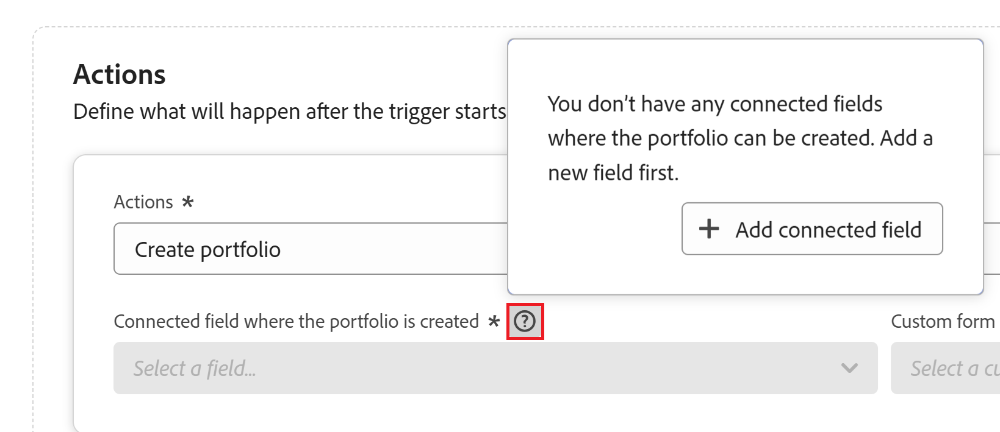

# Criar objetos usando automações de registro do Adobe Workfront Planning

<!--add screen shots when UI is finalized AND redo all the steps - some things got changed and moved around-->
<!--when you make this public, add this to the metadata above (and take the "hide" tags out):

feature: Workfront Planning
role: User, Admin
author: Alina, Becky
recommendations: noDisplay, noCatalog

-->

<!--add a new section to this article to mention a new way to create objects: help/quicksilver/planning/records/create-records.md-->
<!-- add a new section to this article to mention a new way to create WF objects from Planning: help/quicksilver/planning/records/create-workfront-objects-from-workfront-planning.md-->

<!-- if they give access to use the automation to people with LESS than Manage permissions to a workspace, split this article in two: the Configure section should be for admins and the "Use a Workfront Planning automation to create an object" should be for all other users-->

<!--The information on this page refers to functionality not yet generally available. It is available only in the Preview environment for all customers. After the monthly releases to Production, the same features are also available in the Production environment for customers who enabled fast releases.    

For information about fast releases, see [Enable or disable fast releases for your organization](/help/quicksilver/administration-and-setup/set-up-workfront/configure-system-defaults/enable-fast-release-process.md). -->

Você pode configurar automações no Adobe Workfront Planning que, quando ativadas, criam objetos no Workfront ou registros no Workfront Planning quando acionadas a partir de um registro do Planning. Os objetos ou registros criados são conectados automaticamente aos registros dos quais você está acionando a automação.

Você pode configurar e ativar a automação na página do registro no Workfront Planning. O objeto conectado criado é colocado no campo conectado do tipo de registro a partir do qual a automação é executada.

Por exemplo, você pode criar uma automação que use uma campanha do Workfront Planning e crie um projeto no Workfront para rastrear o progresso dessa campanha. O projeto seria conectado à campanha do Workfront Planning no campo Connected Project da campanha.

Para obter mais informações sobre registros conectados, consulte [Visão geral dos registros conectados](/help/quicksilver/planning/records/connected-records-overview.md).

## Requisitos de acesso

+++ Expanda para exibir os requisitos de acesso do Workfront Planning.

Você deve ter o seguinte acesso para executar as etapas deste artigo:

<table style="table-layout:auto"> 
<col> 
</col> 
<col> 
</col> 
<tbody> 
    <tr> 
<tr> 
<td> 
   
 Produtos
 </td> 
   <td> 
   <ul><li>
 Adobe Workfront
</li> 
   <li>
 Planejamento do Adobe Workfront
</li></ul></td> 
  </tr>   
<tr> 
   <td role="rowheader">
plano do Adobe Workfront*
</td> 
   <td> 

Qualquer um dos seguintes planos da Workfront:
 
<ul><li>Selecionar</li> 
<li>Prime</li> 
<li>Ultimate</li></ul> 

O Workfront Planning não está disponível para planos herdados do Workfront
 
   </td> 
<tr> 
   <td role="rowheader">
Pacote de planejamento do Adobe Workfront*
</td> 
   <td> 

Qualquer 
 

Para obter mais informações sobre o que está incluído em cada plano do Workfront Planning, entre em contato com seu gerente de conta da Workfront. 
 
   </td> 
 <tr> 
   <td role="rowheader">
plataforma Adobe Workfront
</td> 
   <td> 

A instância da Workfront de sua organização deve ser integrada à Adobe Unified Experience para acessar todos os recursos do Workfront Planning.
 

Para obter mais informações, consulte <a href="/help/quicksilver/workfront-basics/navigate-workfront/workfront-navigation/adobe-unified-experience.md">Experiência unificada da Adobe para Workfront</a>. 
 
   </td> 
   </tr> 
  </tr> 
  <tr> 
   <td role="rowheader">
Licença da Adobe Workfront*
</td> 
   <td> Padrão
   
O Workfront Planning não está disponível para licenças herdadas do Workfront
 
  </td> 
  </tr> 
  <tr> 
   <td role="rowheader">
Configuração do nível de acesso
</td> 
   <td> 
Não há controles de nível de acesso para o Adobe Workfront Planning
 
   
Edite o acesso no Workfront para os tipos de objeto que deseja criar (projetos, portfólios, programas). 
  
</td> 
  </tr> 
<tr> 
   <td role="rowheader">
Permissões de objeto
</td> 
   <td> 
Gerencie permissões no espaço de trabalho ao qual deseja adicionar registros. 
  
   
Os administradores do sistema têm permissões para todos os espaços de trabalho, incluindo aqueles que não criaram

   
Gerencie permissões para objetos do Workfront (portfólios) para adicionar objetos secundários (projetos).

   </td> 
  </tr> 
<tr> 
   <td role="rowheader">
Modelo de layout
</td> 
   <td> 
Todos os usuários, incluindo administradores do Workfront, devem receber um modelo de layout que inclua a área Planejamento no Menu principal 
 </td> 
  </tr> 
</tbody> 
</table>

*Para obter mais informações sobre requisitos de acesso do Workfront, consulte [Requisitos de acesso na documentação do Workfront](/help/quicksilver/administration-and-setup/add-users/access-levels-and-object-permissions/access-level-requirements-in-documentation.md).

+++

## Considerações sobre a criação de objetos e registros usando uma automação

* Para novos objetos do Workfront, o novo nome do objeto é igual ao nome do registro do qual você o cria.
* Para novos registros de Planejamento, você pode indicar qual campo de registro original deve ser usado para determinar o nome do novo registro.
* Novos objetos ou registros não substituem os existentes no mesmo campo. Acionar a mesma automação várias vezes para os mesmos registros adiciona os novos objetos ou registros no mesmo campo conectado do registro original, além dos criados antes.
* A automação adiciona objetos adicionais somente nos campos de tipo de conexão Muitos para muitos ou Um para muitos. Em todos os outros casos, a automação cria o objeto, mas não o conecta ao registro original a partir do qual a automação é acionada.

## Configurar uma automação no Workfront Planning

Você deve configurar uma automação para um tipo de registro no Workfront Planning, antes de usá-la para criar objetos.

{{step1-to-planning}}

1. Clique em um cartão de tipo de registro e no nome de um registro.

   A página de tipo de registro é aberta.
1. Clique no menu **Mais**  à direita do nome do tipo de registro e clique em **Gerenciar automações**.

   A lista de automações disponíveis para o tipo de registro selecionado é aberta.

1. Clique em **Nova automação** no canto superior direito da tela. A caixa **Nova automação** é aberta.
1. Atualize os seguintes campos:

   * Substitua **Automação sem título** pelo texto que você deseja que apareça no botão de automação. Os usuários clicarão nesse botão ao usar a automação para criar um objeto do Workfront ou um registro do Planning.
   * **Descrição**: adicione uma descrição para identificar a finalidade da automação.
1. Clique em **Salvar**.
A página de detalhes da automação é aberta.

1. Na página de detalhes da automação, atualize os seguintes campos na seção **Triggers**:

   * **Acionador**: selecione a ação que acionará a automação. Por exemplo, selecione **Botão, clique**. <!--update this step with a list of all possible triggers; right not only Button click is available-->

1. Atualizar os seguintes campos na seção **Ações**: <!--submitted bugs for these fields - see if they need changing here-->
   * **Tipo de objeto**: selecione o objeto que você deseja que a automação crie. Este campo é obrigatório.

     Você pode criar os seguintes objetos a partir dos registros do Workfront Planning:

      * Projeto
      * Portfólio
      * Programa
      * Grupo
      * Registro

     >[!TIP]
     >
     >Depois de salvar a automação, não é mais possível alterar o tipo de objeto nesse campo.

1. (Condicional) Dependendo do tipo de objeto que você deseja criar, atualize os seguintes campos:

   * **Projeto**:
      * **Campo conectado onde o objeto é criado**: este é o campo conectado onde o novo projeto será exibido. Este campo é obrigatório.
      * **Modelo a partir do qual criar o projeto**: selecione um modelo de projeto que a Workfront usará para criar o projeto.
   * **Portfolio**:
      * **Campo conectado onde o objeto é criado**: este é o campo conectado onde o novo portfólio será exibido. Este campo é obrigatório.
      * **Formulário personalizado para anexar ao novo portfólio**: selecione um formulário personalizado para anexar ao novo portfólio. Você deve criar um formulário personalizado do portfólio antes de selecioná-lo.
   * **Programa**:
      * **Campo conectado onde o objeto é criado**: este é o campo conectado onde o novo programa será exibido. Este campo é obrigatório.
      * **Portfólio de programas**: selecione um portfólio onde o novo programa será adicionado. Este campo é obrigatório.
      * **Formulário personalizado para anexar ao novo programa**: selecione um formulário personalizado para anexar ao novo programa. Você deve criar um formulário personalizado de programa antes de selecioná-lo.
   * **Grupo**:
      * **Campo conectado onde o objeto é criado**: este é o campo conectado onde o novo grupo será exibido. Este campo é obrigatório.
      * **Formulário personalizado para anexar ao novo grupo**: selecione um formulário personalizado para anexar ao novo programa. Você deve criar um formulário personalizado de programa antes de selecioná-lo.
   * **Registro**:
      * **Tipo de registro conectado**: selecione o tipo de registro que deseja criar.
      * **Campo conectado onde o registro é criado**: é o campo conectado onde o novo registro será exibido. Este campo é obrigatório. <!--this might need revision as right now it shows the field on the connected record table where the current record will display; submitted a bug to correct this label-->
      * **Mapear campos**
         * **Transferir de**: selecione campos do tipo de registro para o qual a automação é criada para mapeá-los para os campos do tipo de registro conectado.
      * **Transferir para**: selecione campos do registro recém-criado que serão preenchidos com informações do registro a partir do qual você está executando a automação.
1. (Opcional e condicional) Se você optou por criar um registro, clique em **Adicionar campos** para mapear campos de pesquisa adicionais de um registro para outro.
1. (Opcional e condicional) Se você não tiver um campo de conexão para um tipo de objeto do Workfront, clique no **ícone Criar um campo de conexão**  para adicionar um campo.

   O novo campo é automaticamente criado e nomeado como **Conectado &lt; nome do objeto do Workfront >**. Por exemplo, quando um campo conectado ao portfólio é criado para o registro, ele é chamado de &quot;Portfólio conectado&quot;.

1. Clique em **Salvar** no canto superior direito da página de detalhes de automação.

   A automação é exibida na lista de automações e está disponível para uso em registros.
1. (Opcional) Para editar, desativar ou excluir uma automação, faça o seguinte:

   1. Na lista de automações, passe o mouse sobre o nome de uma automação salva e clique no menu **Mais** .

   1. Clique em **Editar** para atualizar informações sobre e configurar campos na automação.
   1. Clique em **Desabilitar** para remover a automação do modo de exibição de tabela e impedir que os usuários a utilizem para criar registros ou objetos. Para torná-lo disponível novamente, clique novamente no menu **Mais**, no menu , depois clique em **Ativar**.
   1. Clique em **Excluir** para excluir a automação. Uma automação excluída não pode ser recuperada. Os registros criados por meio da automação permanecem conectados ao registro selecionado originalmente.

## Usar uma automação do Workfront Planning para criar um objeto ou um registro

1. No Workfront Planning, abra a página tipo de registro que contém os registros que você deseja usar para criar objetos do Workfront ou registros do Planning.
1. Abra a exibição de tabela.
1. Selecione um ou mais registros.

   Uma barra azul é exibida na parte inferior da tabela com botões adicionais, incluindo botões de automação.
1. Clique no botão de automação próximo ao canto inferior direito da tela.

   

   Uma mensagem de confirmação é exibida na parte inferior da tela, caso a automação tenha criado um objeto ou um registro com êxito.

   O novo objeto é exibido no campo conectado indicado na configuração do botão de automação. Talvez seja necessário atualizar a página antes de visualizar o novo objeto.

   >[!NOTE]
   >
   >Recomendamos verificar se o objeto foi criado e conectado conforme esperado.

1. (Opcional) Clique no novo objeto no campo conectado. A página do objeto é aberta e você pode fazer alterações adicionais no novo objeto.

<!--you might need to add something about notifications and emails?!-->

<!--****************************************FUTURE ARTICLE AFTER THE RELEASE TO PREVIEW ON FEBRUARY 20:*****************************************************  

You can configure automations in Adobe Workfront Planning that, when activated, create objects in Workfront or records in Workfront Planning when triggered from a Planning record. The created objects or records are automatically connected to the records you are triggering the automation from. 

You can configure and activate the automation in the record's page in Workfront Planning. The connected object that is created is placed in the connected field of the record type you run the automation from. 

For example, you could create an automation that takes a Workfront Planning campaign and creates a project in Workfront to track that campaign's progress. The project would be connected to the Workfront Planning campaign in the Connected Project field on the campaign.

For more information on connected records, see [Connected records overview](/help/quicksilver/planning/records/connected-records-overview.md).

## Access requirements

+++ Expand to view access requirements for Workfront Planning. 

You must have the following access to perform the steps in this article:  

 <table style="table-layout:auto"> 
<col> 
</col> 
<col> 
</col> 
<tbody> 
    <tr> 
<tr> 
<td> 
   
 Products
 </td> 
   <td> 
   <ul><li>
 Adobe Workfront
</li> 
   <li>
 Adobe Workfront Planning
</li></ul></td> 
  </tr>   
<tr> 
   <td role="rowheader">
Adobe Workfront plan*
</td> 
   <td> 

Any of the following Workfront plans:
 
<ul><li>Select</li> 
<li>Prime</li> 
<li>Ultimate</li></ul> 

Workfront Planning is not available for legacy Workfront plans
 
   </td> 
<tr> 
   <td role="rowheader">
Adobe Workfront Planning package*
</td> 
   <td> 

Any 
 

For more information about what is included in each Workfront Planning plan, contact your Workfront account manager. 
 
   </td> 
 <tr> 
   <td role="rowheader">
Adobe Workfront platform
</td> 
   <td> 

Your organization's instance of Workfront must be onboarded to the Adobe Unified Experience to be able to access all the capabilities of Workfront Planning.
 

For more information, see <a href="/help/quicksilver/workfront-basics/navigate-workfront/workfront-navigation/adobe-unified-experience.md">Adobe Unified Experience for Workfront</a>. 
 
   </td> 
   </tr> 
  </tr> 
  <tr> 
   <td role="rowheader">
Adobe Workfront license*
</td> 
   <td> Standard
   
Workfront Planning is not available for legacy Workfront licenses
 
  </td> 
  </tr> 
  <tr> 
   <td role="rowheader">
Access level configuration
</td> 
   <td> 
There are no access level controls for Adobe Workfront Planning
 
   
Edit access in Workfront for the object types that you want to create (projects, portfolios, programs). 
  
</td> 
  </tr> 
<tr> 
   <td role="rowheader">
Object permissions
</td> 
   <td> 
Manage permissions to the workspace you want to add records to. 
  
   
System Administrators have permissions to all workspaces, including the ones they did not create

   
Manage permissions to Workfront objects (portfolios) to add children objects (projects).

   </td> 
  </tr> 
<tr> 
   <td role="rowheader">
Layout template
</td> 
   <td> 
All users, including Workfront administrators,  must be assigned a layout template that includes the Planning area in the Main Menu 
 </td> 
  </tr> 
</tbody> 
</table> 

 *For more information about Workfront access requirements, see [Access requirements in Workfront documentation](/help/quicksilver/administration-and-setup/add-users/access-levels-and-object-permissions/access-level-requirements-in-documentation.md).   

+++

## Considerations about creating objects and records using an automation

* For new Workfront objects, the new object name is the same as the record name from which you create it. 
* For new Planning records, you can indicate what original record field should be used to determine the new record's name. 
* New objects or records don't override existing ones in the same field. Triggering the same automation multiple times for the same record adds the new objects or records in the same connected field of the original record, in addition to the ones created before. 
* The automation adds additional objects only in the Many to many or One to many connection type fields. In the all other cases, the automation creates the object, but it does not connect it to the original record from which the automation is triggered. 

## Configure an automation in Workfront Planning

You must configure an automation for a record type in Workfront Planning before you can use it to create objects.

{{step1-to-planning}}

1. Click a record type card, then click the name of a record. 

   The record type page opens. 
1. Click the **More** menu  to the right of the record type name, then click **Manage automations**. 

   The list of available automations for the selected record type opens.

1. Click **New automation** in the upper-right corner of the screen. The **New automation** box opens.
1. Update the following fields:

   * Replace **Untitled automation** with the text that you want to appear on the automation button. Users will click this button when using the automation to create a Workfront object or a Planning record.
   * **Description**: Add a description to identify the purpose of the automation.
1. Click **Save**.
   The automation details page opens. 

1. On the automation's details page, update the following fields in the **Triggers** section: 

   * **Trigger**: Select the action that will trigger the automation. For example, select **Button click**. *************update this step with a list of all possible triggers; right now only Button click is available*********

1. Update the following fields in the **Actions** section: **********submitted bugs for these fields - see if they need changing here***********
   * **Actions**: Select the action that you want Workfront to perform when triggering the automation. This is a required field. 
   Select one of the following actions: 

      * Create group
      * Create program
      * Create portfolio
      * Create project
      * Create record

      >[!TIP]
      >
      >After you saved the automation, you can no longer change the action selected in this field.

1. (Conditional) Depending on what action you selected, update the following fields:

   * **Create project**: 
      * **Connected field where the object is created**: This is the connected field where the new project will display. This is a required field. 
      * **Project template**: Select a project template that Workfront will use to create the project.  
   * **Create portfolio**:
      * **Connected field where the object is created**: This is the connected field where the new portfolio will display. This is a required field.
      * **Custom form to attach to the new portfolio**: Select a custom form to attach to the new portfolio. You must create a portfolio custom form before you can select it. 
   * **Create program**: 
      * **Connected field where the object is created**: This is the connected field where the new program will display. This is a required field.
      * **Program portfolio**: Select a portfolio where the new program will be added. This is a required field.
      * **Custom form to attach to the new program**: Select a custom form to attach to the new program. You must create a program custom form before you can select it. 
   * **Create group**:
      * **Connected field where the object is created**: This is the connected field where the new group will display. This is a required field.
      * **Custom form to attach to the new group**: Select a custom form to attach to the new program. You must create a program custom form before you can select it. 
   * **Create record**: 
      * **Record type**: Select the record type you want to create. 

      The **Settings** sub-section displays. Update the following fields in the **Settings** sub-section: 

      * **Field on the connected record type where the current record will show**: This is the connected field on the record type selected for the action where the current record will display. 
      
      For example, if you are creating an automation for campaigns to connect Product records from, this is the connected field on the Product record type where the campaigns will display, after the products are created using the automation. 
      
      This is a required field. 
      
      ******submitted a change in functionality and UI text for this - revise?? *******
      * **Map fields**
         * **Transfer from**: Select fields from the record type the automation is created for to map them to the fields of the connected record type. 
      * **Transfer to**: Select fields from the newly created record that will populate with information from the record you are running the automation from. 

      >[!TIP]
      >
      >The field types from the original record type must match the field types from the newly created record type.

1. (Optional and conditional) If you selected to create a record, click **Add fields** to map additional lookup fields from one record to another.
1. (Conditional) If you selected to create a record and there are no connection fields between the original record type and the record type selected in the **Actions** area, click the question mark icon to the right of the **Field on the connected record type where the current record will show** field, then click the **Add** icon  to add a connection field. 

   The new field is automatically created for the record type you selected in the **Actions** area, and named **Connected Record**. 
   
   A connected field for the selected record type is also created on the original record type from where you are configuring the automation. 
1. (Optional and conditional) If you selected to create a Workfront object and don't have a connection field for the selected Workfront object type, click the question mark icon to the right of the **Connected field where the < Workfront object type name > is created** field, and click the **Add** icon  to add a connection field. 

   

   The new field is automatically created and named **Connected < Workfront object name >**. For example, when a portfolio connected field is created for the record, it is named "Connected portfolio." 

1. Click **Save** in the upper-right corner of the automation details page. 

   The automation displays on the list of automations, and is available to use in records.

## Manage existing automations

{{step1-to-planning}}

1. Click a record type card, then click the name of a record. 

   The record type page opens. 
1. Click the **More** menu  to the right of the record type name, then click **Manage automations**. 

   The list of available automations for the selected record type opens.

1. (Optional) To edit, disable, or delete an automation, do one of the following:

   1. From the list of automations, hover over the name of a saved automation, then click the **More** menu .

   1. Click **Edit** to update information about and configure fields on the automation.

      >[!TIP]
      >
      >   You cannot change the action you originally selected for an automation. 
   

   1. Click **Disable** to remove the automation from the record's table view and prevent users from using it to create records or objects. 

   Records that have been created using a disabled automation remain connected to the record originally selected.
   
   To make it available again, click the **More** menu  again, then click **Activate**.
   1. Click **Delete** to delete the automation. A deleted automation cannot be recovered. 
   
   Records that have been created using a deleted automation remain connected to the record originally selected.  

## Use a Workfront Planning automation to create an object or a record

1. In Workfront Planning, open the record type page that contains the automation you want to use to autoamtically create and connect records or objects. 
1. Open the table view. 
1. Select one or more records.
   
   A blue bar displays at the bottom of the table with additional buttons, including automation buttons. 
1. Click the automation button near the lower-right corner of the screen. 

   

   The following things occur: 

   * A confirmation message displays at the bottom of the screen, if the automation successfully created an object or a record. 

   * The new object displays in the connected field you indicated in the setup of the automation button. You might need to refresh your page before viewing the new object. 

   * The record you are triggering the automation from is added to the connected field of the new record.

   >[!NOTE]
   >
   >We recommend checking that the objects or records were created and the connected as expected.

1. (Optional) Click the new object in the connected field. The object page opens and you can make additional changes to the new object. 

***********you might need to add something about notifications and emails?!*************

-->