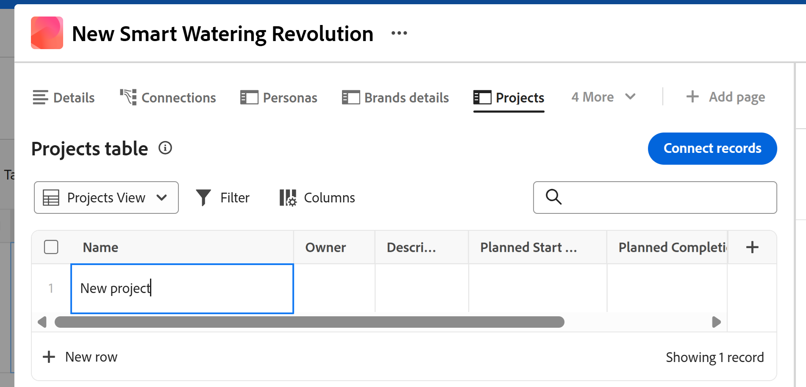

<!--update the metadata with real information when making this available in TOC and in the left nav-->

# Criar objetos Workfront a partir do Workfront Planning à medida que você os conecta aos registros

<!-- remove preview and production at release time-->

<!--The information highlighted on this page refers to functionality not yet generally available. It is available only in the Preview environment for all customers. After the monthly releases to Production, the same features are also available in the Production environment for customers who enabled fast releases.    

For information about fast releases, see [Enable or disable fast releases for your organization](/help/quicksilver/administration-and-setup/set-up-workfront/configure-system-defaults/enable-fast-release-process.md). -->

{{planning-important-intro}}

Você pode criar objetos do Adobe Workfront no Workfront Planning das seguintes maneiras:

* À medida que você conecta objetos do Workfront a partir de registros do Planning

  Este artigo descreve como criar objetos Workfront a partir do Workfront Planning à medida que você os conecta a partir de registros do Planning.
* Quando você usa automações da página de um registro.

  Para obter informações sobre como criar objetos do Workfront usando automações, consulte [Criar objetos usando as automações de registro do Adobe Workfront Planning](/help/quicksilver/planning/records/create-wf-objects-using-planning-automations.md).

>[!IMPORTANT]
>
>Você pode criar os seguintes objetos do Workfront no Workfront Planning ao conectá-los aos registros do Planning:
>
>* Projetos
>* Portfólios
>* Programas
>
>Você pode conectar os seguintes objetos do Workfront com registros do Planning, mas não pode criá-los no processo de conexão:
>
>* Grupos
>* Empresas
>

Considere o seguinte ao conectar e criar objetos do Workfront aos registros do Workfront Planning:

* Você pode conectar projetos, portfólios, programas, grupos e empresas do Workfront a partir de um campo de conexão das seguintes áreas do Workfront Planning:

   * A exibição de tabela de um tipo de registro
   * A página Detalhes ou a caixa de visualização de um registro
   * A guia Conexões de um registro

* Você pode criar projetos nas seguintes áreas do Workfront Planning:

   * A exibição de tabela de um tipo de registro
   * A área Detalhes de um registro no campo de conexão
   * A página de registro Conectado de um registro

* Você pode criar portfólios e programas das seguintes áreas do Workfront Planning:

   * A exibição de tabela de um tipo de registro
   * A área Detalhes de um registro no campo de conexão

Para obter informações sobre como conectar registros do Planning a objetos do Workfront, consulte [Conectar registros](/help/quicksilver/planning/records/connect-records.md).

## Requisitos de acesso

+++ Expanda para exibir os requisitos de acesso para a funcionalidade neste artigo. 

<table style="table-layout:auto"> 
<col> 
</col> 
<col> 
</col> 
<tbody> 
    <tr> 
<tr> 
</tr>   
<tr> 
   <td role="rowheader">
Pacote do Adobe Workfront
</td> 
   <td> 

Qualquer Workfront e qualquer pacote do Planning
 
Qualquer fluxo de trabalho e qualquer pacote de planejamento

Para obter mais informações sobre o que está incluído em cada pacote do Workfront Planning, entre em contato com o representante de conta da Workfront. 
 
   </td>

<tr> 
  <tr> 
   <td role="rowheader">
Licença do Adobe Workfront
</td> 
   <td>
Padrão

   </td> 
  </tr> 
  <tr> 
   <td role="rowheader">
Configuração do nível de acesso
</td> 
   <td> 
Não há controles de nível de acesso para o Adobe Workfront Planning
 
   
Edite o acesso com acesso para Criar objetos no Workfront para os tipos de objeto que você deseja criar (projetos, portfólios, programas). 
  
</td> 
  </tr> 
<tr> 
   <td role="rowheader">
Permissões de objeto
</td> 
   <td> 
Permissões do Contribute ou superior para o espaço de trabalho e tipo de registro ao qual você deseja adicionar registros. 
  
   
Os administradores do sistema têm permissões para todos os espaços de trabalho, incluindo aqueles que não criaram

   
Gerencie permissões para objetos do Workfront (portfólios) para adicionar objetos secundários (projetos).

   </td> 
  </tr>   
</tbody> 
</table>

Para obter mais informações sobre requisitos de acesso do Workfront, consulte [Requisitos de acesso na documentação do Workfront](/help/quicksilver/administration-and-setup/add-users/access-levels-and-object-permissions/access-level-requirements-in-documentation.md).

+++ 

<!--Old:

<table style="table-layout:auto"> 
<col> 
</col> 
<col> 
</col> 
<tbody> 
    <tr> 
<tr> 
<td> 
   
 Products
 </td> 
   <td> 
   <ul><li>
 Adobe Workfront
</li> 
   <li>
 Adobe Workfront Planning
</li></ul></td> 
  </tr>   
<tr> 
   <td role="rowheader">
Adobe Workfront plan*
</td> 
   <td> 

Any of the following Workfront plans:
 
<ul><li>Select</li> 
<li>Prime</li> 
<li>Ultimate</li></ul> 

Workfront Planning is not available for legacy Workfront plans
 
   </td> 
<tr> 
   <td role="rowheader">
Adobe Workfront Planning package*
</td> 
   <td> 

Any 
 

For more information about what is included in each Workfront Planning plan, contact your Workfront account manager. 
 
   </td> 
 <tr> 
   <td role="rowheader">
Adobe Workfront platform
</td> 
   <td> 

Your organization's instance of Workfront must be onboarded to the Adobe Unified Experience to be able to access Workfront Planning.
 

For more information, see <a href="/help/quicksilver/workfront-basics/navigate-workfront/workfront-navigation/adobe-unified-experience.md">Adobe Unified Experience for Workfront</a>. 
 
   </td> 
   </tr> 
  </tr> 
  <tr> 
   <td role="rowheader">
Adobe Workfront license*
</td> 
   <td> Standard
   
Workfront Planning is not available for legacy Workfront licenses
 
  </td> 
  </tr> 
  <tr> 
   <td role="rowheader">
Access level configuration
</td> 
   <td> 
There are no access level controls for Adobe Workfront Planning
 
   
Edit access with access to Create objects in Workfront for the object types that you want to create (projects, portfolios, programs). 
  
</td> 
  </tr> 
<tr> 
   <td role="rowheader">
Object permissions
</td> 
   <td> 
Manage permissions to the workspace and record type where you want to add records. 
  
   
System Administrators have permissions to all workspaces, including the ones they did not create

   
Manage permissions to Workfront objects (portfolios) to add children objects (projects).

   </td> 
  </tr> 
</tbody> 
</table> 

 *For more information about Workfront access requirements, see [Access requirements in Workfront documentation](/help/quicksilver/administration-and-setup/add-users/access-levels-and-object-permissions/access-level-requirements-in-documentation.md).  -->

## Pré-requisitos para criar objetos do Workfront ao conectá-los a registros do Workfront Planning

Você deve ter o seguinte antes de adicionar novos projetos ou portfólios, conectando-os a partir de registros existentes:

* Tipos de registros conectados a projetos, portfólios ou programas do Workfront. Para obter informações, consulte [Tipos de registro de conexão](/help/quicksilver/planning/architecture/connect-record-types.md).
* Registros para os tipos de registro conectados a objetos do Workfront. Para obter informações, consulte [Criar registros](/help/quicksilver/planning/records/create-records.md).
* O acesso e as permissões corretos no Workfront Planning e no Workfront, conforme descrito na seção [Requisitos de acesso](#access-requirements) deste artigo.

## Criar projetos à medida que você os conecta com registros do Workfront Planning

É possível criar projetos ao conectá-los a registros no Workfront Planning nas seguintes áreas do Workfront Planning:

* A exibição de tabela de um tipo de registro ou a área Detalhes de um registro no campo de conexão
* A página Registro conectado de um registro, na área Detalhes de um registro

### Criar projetos na área Detalhes de um registro ou na exibição de tabela de um tipo de registro

Para criar projetos ao conectá-los a partir de outros registros:

1. Vá para a página de detalhes de um registro ou para a tabela do tipo de registro e comece a conectar os registros do Workfront Planning aos projetos do Workfront, conforme descrito no artigo [Conectar registros](/help/quicksilver/planning/records/connect-records.md).

1. (Condicional) Clique em **Adicionar projeto**
Ou
Comece digitando o nome de um projeto e clique em **Adicionar projeto** se não conseguir encontrá-lo. O botão Adicionar é seguido pelo nome do projeto digitado.

   

   A caixa **Criar projeto** é aberta.

1. (Opcional) Atualize o **Nome do projeto**. Por padrão, o projeto é nomeado de acordo com o que você adicionou como item de pesquisa ao conectá-lo do registro.
1. (Opcional) Selecione um **Modelo de projeto**. Se você não selecionar um modelo, o Workfront criará um projeto em branco, sem tarefas.
1. Clique em **Criar**.
1. (Condicional) Se você optou por criar um projeto a partir de um modelo, siga as etapas do artigo [Criar um projeto usando um modelo](/help/quicksilver/manage-work/projects/create-projects/create-project-from-template.md) para concluir a adição do projeto.

   O novo projeto é criado e adicionado ao campo conectado do registro selecionado.

1. (Opcional) Clique no nome do novo projeto no Workfront Planning para abrir a página do projeto no Workfront e fazer atualizações adicionais no projeto.

### Criar projetos na página Registros conectados de um registro

1. Conecte o tipo de objeto Projeto a um tipo de registro do Workfront Planning na exibição de tabela.

   Para obter informações, consulte [Tipos de registro de conexão](/help/quicksilver/planning/architecture/connect-record-types.md).

1. Clique no nome de um registro em qualquer exibição. A caixa de visualização Detalhes é aberta.

1. Adicione uma **página Registros conectados** para projetos.

   Para obter informações, consulte [Adicionar uma página de registros conectados a um registro](/help/quicksilver/planning/records/add-a-connected-records-page-to-a-record.md).

   A página Registros conectados é exibida na exibição de tabela. Os projetos conectados são exibidos na tabela.

   

1. Clique em **Nova linha** na tabela de projetos para adicionar um projeto.

   Você só pode adicionar um projeto em branco nesta área. Não é possível adicionar um projeto usando um modelo.
1. (Opcional) Clique no nome do projeto na exibição de tabela para abrir o projeto no Workfront e adicionar mais informações.

## Crie portfólios à medida que você os conecta com registros do Workfront Planning

Você pode criar portfólios a partir da exibição de tabela de um tipo de registro ou da página Detalhes de um registro.

Para criar portfólios à medida que você os conecta a partir de registros do Planning:

1. Vá para a página de detalhes de um registro ou para a tabela do tipo de registro e comece a conectar os registros do Workfront Planning aos portfólios do Workfront, conforme descrito no artigo [Conectar registros](/help/quicksilver/planning/records/connect-records.md).

1. (Condicional) Clique em **Adicionar portfólio**

   Ou

   Comece digitando o nome de um portfólio e clique em **Adicionar portfólio** se não conseguir encontrá-lo. O botão Add é seguido pelo nome do portfólio digitado.

   

   O portfólio é criado e adicionado ao campo de conexão do registro selecionado.

1. (Opcional) Clique no nome do novo portfólio no Workfront Planning para abrir a página do portfólio no Workfront e fazer atualizações adicionais no portfólio.

## Criar programas à medida que você os conecta com registros do Workfront Planning

Você pode criar programas na exibição de tabela de um tipo de registro ou na página Detalhes de um registro.

Para criar programas à medida que você os conecta a partir dos registros do Planning:

1. Vá para a página de detalhes de um registro ou para a tabela do tipo de registro e comece a conectar os registros do Workfront Planning aos portfólios do Workfront, conforme descrito no artigo [Conectar registros](/help/quicksilver/planning/records/connect-records.md).

1. Clique em **Adicionar programa**

   Ou

   Comece digitando o nome de um programa e clique em **Adicionar programa** se não conseguir encontrá-lo. O botão Adicionar é seguido pelo nome do programa digitado.

   

   A caixa **Criar programa** é aberta.

1. Atualize o **Nome do programa**. Este campo é obrigatório.
1. Escolha um **Portfolio** no menu suspenso ou comece digitando o nome de um portfólio e selecione-o quando ele for exibido na lista. Este campo é obrigatório.
1. Clique em **Criar**.

   O programa é criado e adicionado ao campo de conexão do registro selecionado.

1. (Opcional) Clique no nome do novo programa no Workfront Planning para abrir a página do programa no Workfront e fazer atualizações adicionais.

