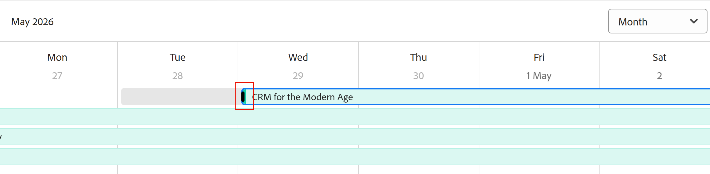

# Editar registros

As informações destacadas nesta página referem-se a funcionalidades que ainda não estão disponíveis. Ela está disponível somente no ambiente de Pré-visualização para todos os clientes. Depois das versões mensais para produção, os mesmos recursos também ficam disponíveis no ambiente de produção para clientes que ativaram versões rápidas. 

Para obter informações sobre versões rápidas, consulte [Habilitar ou desabilitar versões rápidas para sua organização](/help/quicksilver/administration-and-setup/set-up-workfront/configure-system-defaults/enable-fast-release-process.md). 

{{planning-important-intro}}

É possível editar informações de registro no Adobe Workfront Planning editando os valores dos campos associados aos registros.

Você deve criar tipos de registro antes de começar a criar e editar registros.

Para obter informações, consulte [Criar tipos de registro](/help/quicksilver/planning/architecture/create-record-types.md).

Para obter informações sobre como criar registros, consulte [Criar registros](/help/quicksilver/planning/records/create-records.md).

&lt;!— mencione aqui que os campos na exibição Detalhes são os mesmos da exibição de tabela — este artigo é vinculado da opção Gerenciar exibições de registro para fazer referência a essas informações—>

## Requisitos de acesso

+++ Expanda para visualizar os requisitos de acesso.

<table style="table-layout:auto"> 
<col> 
</col> 
<col> 
</col> 
<tbody> 
    <tr> 
<tr> 
<td> 
   
 Produtos
 </td> 
   <td> 
   <ul><li>
 Adobe Workfront
</li> 
   <li>
 Planejamento do Adobe Workfront
</li></ul></td> 
  </tr>   
<tr> 
   <td role="rowheader">
plano do Adobe Workfront*
</td> 
   <td> 

Qualquer um dos seguintes planos da Workfront:
 
<ul><li>Selecionar</li> 
<li>Prime</li> 
<li>Ultimate</li></ul> 

O Workfront Planning não está disponível para planos herdados do Workfront
 
   </td> 
<tr> 
   <td role="rowheader">
Pacote de planejamento do Adobe Workfront*
</td> 
   <td> 

Qualquer 
 

Para obter mais informações sobre o que está incluído em cada plano do Workfront Planning, entre em contato com seu gerente de conta da Workfront. 
 
   </td> 
 <tr> 
   <td role="rowheader">
plataforma Adobe Workfront
</td> 
   <td> 

A instância da Workfront de sua organização deve ser integrada à Adobe Unified Experience para acessar o Workfront Planning.
 

Para obter mais informações, consulte <a href="/help/quicksilver/workfront-basics/navigate-workfront/workfront-navigation/adobe-unified-experience.md">Experiência unificada da Adobe para Workfront</a>. 
 
   </td> 
   </tr> 
  </tr> 
  <tr> 
   <td role="rowheader">
Licença da Adobe Workfront*
</td> 
   <td> 
Standard
 
   
O Workfront Planning não está disponível para licenças herdadas do Workfront
 
  </td> 
  </tr> 
  <tr> 
   <td role="rowheader">
Configuração do nível de acesso
</td> 
   <td> 
Não há controles de nível de acesso para o Adobe Workfront Planning
   
</td> 
  </tr> 
<tr> 
   <td role="rowheader">
Permissões de objeto
</td> 
   <td>  
Permissões do Contribute ou superior para um espaço de trabalho e tipo de registro </a> 
  
   
Os administradores do sistema têm permissões para todos os espaços de trabalho, incluindo aqueles que não criaram
  </td> 
  </tr>

</tbody> 
</table>

*Para obter mais informações sobre requisitos de acesso do Workfront, consulte [Requisitos de acesso na documentação do Workfront](/help/quicksilver/administration-and-setup/add-users/access-levels-and-object-permissions/access-level-requirements-in-documentation.md).

+++   

## Considerações sobre a edição de registros

* É possível editar registros criados ou registros criados por outras pessoas, se você tiver recebido permissões para o espaço de trabalho.
* É possível editar campos de registro nas seguintes áreas:

   * A visualização do registro em uma exibição de registro
   * A página de detalhes do registro
   * Em linha, em uma exibição de tabela.
<!--* You can edit a record's dates from the following areas:
        * All areas listed above
        * In a timeline view, by resizing the record bars
         * In a calendar monthly view, by resizing the record bars
        For information, see [Create records](/help/quicksilver/planning/records/create-records.md). -->

<!-- when drag and drop is available replace the last 2 points with this:

* In a timeline view, by resizing the record bars or dragging and dropping the record bars in a new position
* In a calendar view, by resizing the record bars when viewing it by month, or by dragging and dropping the record bars in a new position
    For information, see [Create records](/help/quicksilver/planning/records/create-records.md).
-->

* Quando um usuário edita um registro em uma exibição, as alterações são visíveis imediatamente em todas as exibições e nas páginas de registro para todos os outros usuários.

* Os seguintes tipos de campos são atualizados automaticamente e não é possível editar seus valores manualmente:
   * Campos vinculados de outros registros
   * Campos do tipo fórmula
   * Campos do sistema (Criado por, Data de criação, Última modificação por, Última data de modificação)
* Se os registros exibidos estiverem vinculados a outros registros, as novas informações dos registros que você está editando serão refletidas nos registros vinculados.
* Não é possível editar registros em massa. <!--this will probably change-->
* Os URLs são reconhecidos como links em tipos de campo de texto de linha única somente quando começam com o seguinte: http://, https://, ftp:// ou www. .
* Você pode adicionar uma imagem de capa a cada registro. A imagem é exclusiva para cada registro e não se aplica a todos os registros do mesmo tempo.
* É possível editar a ordem dos campos em uma página de registro e adicionar uma imagem de capa para um registro. Para obter mais informações, consulte [Gerenciar o layout da página de registro](/help/quicksilver/planning/records/manage-the-record-page.md).

## Editar registros

É possível editar um registro das seguintes áreas:

* [A exibição de tabela](#edit-a-record-inline-in-the-table-view-of-a-record-type)
* [A visualização da linha do tempo](#edit-a-record-in-the-timeline-view-of-a-record-type)
* [A visão do calendário](#edit-a-record-in-the-calendar-view-of-a-record-type)
* [A visualização do registro em uma exibição](#edit-a-record-from-the-records-preview-in-a-view)
* [A página do registro](#edit-a-record-from-the-records-page)
* [Um objeto Workfront na seção Planejamento](#edit-a-record-from-a-workfront-object-in-the-planning-section)

Para editar as datas dos registros, faça o seguinte:

* [Redimensionar as barras de registros na linha do tempo e na exibição de calendário]

### Editar um registro incorporado na exibição de tabela de um tipo de registro

Ao editar registros na exibição de tabela, há uma indicação de qual campo está sendo editado por outros usuários no momento em que você está visualizando o registro.

Para obter mais informações, consulte [Gerenciar exibições de registros](/help/quicksilver/planning/views/manage-record-views.md).

Quando você adiciona um novo registro após o último em um agrupamento ou subagrupamento, o Workfront atualiza automaticamente os campos incluídos nos agrupamentos para os novos registros. Você pode editar esses campos manualmente, se necessário, e os registros podem ser removidos do agrupamento.

Para obter informações, consulte [Criar registros](/help/quicksilver/planning/records/create-records.md).

{{step1-to-planning}}

1. Clique no espaço de trabalho cujos registros você deseja editar

   O espaço de trabalho é aberto e os tipos de registro são exibidos como cartões.
1. Clique em um cartão de tipo de registro.

   A página de tipo de registro é aberta.
1. (Condicional) Clique na guia de um modo de exibição de tabela ou clique em **+ Modo de Exibição** para criar um modo de exibição de tabela. A exibição em tabela deve ser a padrão, a menos que você tenha visualizado o tipo de registro em outro tipo de exibição ao acessá-lo pela última vez.

   Os registros associados ao tipo de registro selecionado são exibidos na exibição de tabela.
1. Clique dentro da linha de um registro para começar a editar informações sobre o registro em linha.

   

   >[!TIP]
   >
   >  Não é possível editar as informações dos seguintes campos, pois eles são somente leitura e o Workfront os atualiza automaticamente:
   >  
   >  * Campos vinculados criados pela conexão de tipos de registro. Para obter mais informações, consulte [Tipos de registro de conexão](/help/quicksilver/planning/architecture/connect-record-types.md).
   >  * Campos dos seguintes tipos: Criado por, Data de criação, Última modificação por, Data da última modificação, Campos de fórmula.

1. (Opcional e condicional) Ao editar um campo do tipo Parágrafo, use as seguintes opções de formatação de **Rich Text**:

   * Negrito
   * Itálico
   * Sublinhar
   * Adicionar um link
   * Adicionar uma lista com marcadores
   * Adicionar uma lista numerada

   

1. (Opcional) Clique duas vezes em um campo de registro conectado para adicionar registros ou objetos conectados a outro registro. Para obter mais informações, consulte [Conectar registros](/help/quicksilver/planning/records/connect-records.md).
1. Pressione **Enter** no teclado ou clique fora de uma linha para salvar as alterações. As alterações são salvas automaticamente. Um indicador **Salvo** é exibido brevemente no canto superior direito da exibição de tabela para mostrar que as alterações foram salvas.

1. (Opcional) Para copiar e colar informações de um campo para outro, siga um destes procedimentos:

   * Copie um ou vários valores existentes de um campo e cole-os em um campo do mesmo tipo em outro registro
   * Clique no cabeçalho de uma coluna para selecioná-la e copiá-la, em seguida, clique no cabeçalho da coluna de outra coluna e cole o conteúdo da coluna copiada. As colunas devem conter tipos de campo semelhantes.
   * Com a tecla Shift pressionada, clique para selecionar várias linhas em uma tabela, copie as informações nas linhas selecionadas e, em seguida, clique em uma linha diferente e cole as informações selecionadas na nova linha e nas linhas seguintes depois disso.
   * Copie as informações de uma célula, selecione várias células e cole as mesmas informações em várias células. Você pode selecionar várias células e colar as mesmas informações em várias células de linhas e colunas adjacentes.
   * Selecione o canto inferior direito de uma célula existente que contenha as informações que você deseja copiar e, em seguida, arraste e solte-a nas células adjacentes onde deseja colar as mesmas informações. Todas as células devem conter o mesmo tipo de informação.

     

   * Copie uma ou várias células de uma origem externa (por exemplo, um arquivo do Excel) e cole-as em um dos seguintes tipos de campos:

      * Campos de conexão do Workfront Planning.
      * Campos de pessoas. Somente campos com um valor são permitidos.

     Não é possível copiar informações de uma fonte externa e colá-las em outros tipos de campo, incluindo campos de conexão do Workfront ou do AEM Assets.

   >[!NOTE]
   >
   >Considere o seguinte:
   >
   >* Use os seguintes atalhos de teclado para copiar e colar informações:
   >   * Copiar: CTRL + C (⌘ + C para Mac)
   >   * Colar: CTRL + V (⌘ + V para Mac)
   >
   >* Não é possível copiar e colar valores de campo na página de registro. Essa funcionalidade é compatível somente na exibição de tabela de um tipo de registro.
   >* Não é possível copiar e colar valores de campo para os seguintes tipos de campo:
   >
   >    * Campos de pesquisa criados ao conectar tipos de registro. Você pode copiar e colar campos de registro vinculados. Para obter mais informações, consulte [Tipos de registro de conexão](/help/quicksilver/planning/architecture/connect-record-types.md).
   >    * Campos dos seguintes tipos: Criado por, Data de criação, Última modificação por, Data da última modificação

1. (Opcional) Use os seguintes atalhos de teclado para desfazer ou refazer a edição ou a cópia e a colagem das informações do registro:

   * CTRL + Z (⌘ + Z para Mac) para desfazer uma alteração
   * CTRL + Shift + Z (⌘ + Shift + Z para Mac) para refazer uma alteração

   >[!TIP]
   >
   >    Você pode usar os atalhos do teclado várias vezes seguidas para desfazer várias alterações.

1. (Opcional) Adicione uma miniatura a um registro. Para obter informações, consulte [Adicionar uma miniatura a um registro](/help/quicksilver/planning/records/add-thumbnails-to-records.md).

### Editar um registro na exibição de linha do tempo de um tipo de registro

<!--add another step about drag and drop here when that is available-->

1. Abra a página de tipo de registro em uma exibição de linha do tempo. Para obter informações, consulte [Gerenciar a exibição da linha do tempo](/help/quicksilver/planning/views/manage-the-timeline-view.md).

1. Passe o mouse sobre as extremidades da barra de um registro, clique, arraste e solte sua margem em outra data. Isso atualiza automaticamente a data inicial ou final do registro.

   

<!--1. Click a record bar, then drag and drop it in another position to update its timeline and dates. The Start and End dates of the record update automatically.-->

1. Clique na barra de um registro para abrir sua área de detalhes e editar todos os campos.

   Para obter informações, consulte a seção [Editar um registro da visualização do registro em uma exibição](#edit-a-record-from-the-records-preview-in-a-view) neste artigo.

### Editar um registro na exibição de calendário de um tipo de registro

<!--add another step about drag and drop here when that is available-->

1. Abra a página de tipo de registro em uma exibição de calendário. Para obter informações, consulte [Gerenciar a exibição de calendário](/help/quicksilver/planning/views/manage-the-calendar-view.md).
1. (Condicional) Selecione **Mês** no menu suspenso superior direito.
1. Passe o mouse sobre as extremidades da barra de um registro, clique, arraste e solte suas margens em outra data. Isso atualiza automaticamente a data inicial ou final do registro.

   

1. Clique na barra de um registro para abrir sua área de detalhes e editar todos os campos.

   Para obter informações, consulte a seção [Editar um registro da visualização do registro em uma exibição](#edit-a-record-from-the-records-preview-in-a-view) neste artigo.

### Editar um registro da visualização do registro em uma exibição

{{step1-to-planning}}

1. Clique no espaço de trabalho cujos registros você deseja editar

   O espaço de trabalho é aberto e os tipos de registro são exibidos como cartões.

1. Clique em um cartão de tipo de registro.

   A página de tipo de registro é aberta.

1. Em uma exibição de qualquer tipo, clique no registro

   Ou

   Na exibição de tabela, clique no ícone **Abrir detalhes**  na primeira coluna. A visualização do registro é aberta na exibição.

   

1. (Opcional) Clique no menu **Mais** à direita do título do registro e clique em **Renomear**. Isso atualiza o campo que é exibido como o título do registro.

   O título do registro é o campo principal do registro quando exibido em uma exibição de tabela. Para obter informações, consulte [Visão geral do campo principal](/help/quicksilver/planning/fields/primary-field-overview.md).

1. Comece a editar as informações do campo na visualização do registro.

   >[!TIP]
   >
   >  Não é possível editar as informações dos seguintes campos, pois eles são somente leitura e o Workfront os atualiza automaticamente:
   >  
   >  * Campos de pesquisa de outros registros criados pela conexão de tipos de registro. Para obter mais informações, consulte [Tipos de registro de conexão](/help/quicksilver/planning/architecture/connect-record-types.md).
   >  * Campos dos seguintes tipos: Criado por, Data de criação, Última modificação por, Data da última modificação, Campos de fórmula.

1. (Opcional) Clique em **Adicionar capa** para adicionar uma imagem de capa ao registro. Para obter mais informações, consulte [Adicionar uma imagem de capa a um registro](/help/quicksilver/planning/records/add-a-cover-image-to-a-record.md).

1. (Opcional) Passe o mouse sobre o ícone de miniatura, em seguida, clique em **Mais**  > **Editar miniatura** para adicionar uma imagem em miniatura. Para obter informações, consulte [Adicionar uma miniatura a um registro](/help/quicksilver/planning/records/add-thumbnails-to-records.md).

   O Workfront salva suas alterações automaticamente.

1. (Opcional) Clique no **ícone de indicador em tempo real**  no canto superior direito da caixa de visualização do registro e habilite a configuração **Mostrar colaboradores** para realçar os campos que estão sendo editados por outros em tempo real.

   Os nomes e avatares de todos os usuários que acessam o registro ao mesmo tempo são exibidos nessa área.

   Quando a configuração estiver desabilitada, os avatares e os nomes serão listados na área de indicador em tempo real, e os campos que estão sendo editados não serão realçados.

   

1. (Opcional) Clique no menu **Exportar**  para exportar os detalhes do registro. Para obter informações, consulte [Exportar os detalhes de um registro](/help/quicksilver/planning/records/export-the-record-page.md).

1. (Opcional) Clique no ícone **Abrir em nova guia**  <!--check the icon; they are changing it--> no canto superior direito da visualização do registro para abrir a página do registro em uma nova guia. Continue editando o registro conforme descrito na seção [Editar um registro da página do registro](#edit-a-record-from-the-records-page) deste artigo.

### Editar um registro da página do registro

{{step1-to-planning}}

1. Clique no espaço de trabalho cujos registros você deseja editar

   O espaço de trabalho é aberto e os tipos de registro são exibidos como cartões.

1. Clique em um cartão de tipo de registro.

   A página de tipo de registro é aberta.

1. Siga um destes procedimentos:

   * Em qualquer exibição, acesse a visualização do registro, conforme descrito na seção [Editar um registro da visualização do registro em uma exibição](#edit-a-record-from-the-records-preview-in-a-view) deste artigo, em seguida, clique no ícone **Abrir em nova guia**  <!--check the icon; they are changing it--> no canto superior direito da visualização do registro para abrir a página do registro em uma nova guia.

   * Na exibição **Tabela**, passe o mouse sobre o nome de um registro e clique no menu **Mais**  e, em seguida, clique em **Exibir**

     

     A página de registro é aberta.

     

1. (Opcional) Clique no menu **Mais** à direita do título do registro e clique em **Renomear**. Isso atualiza o campo que é exibido como o título do registro.

   O título do registro é o campo principal do registro quando exibido em uma exibição de tabela. Para obter informações, consulte [Gerenciar a exibição de tabela](/help/quicksilver/planning/views/manage-the-table-view.md).

1. Clique em qualquer campo editável na página de registro para editá-lo.

   >[!TIP]
   >
   >  Não é possível editar as informações dos seguintes campos, pois eles são somente leitura e o Workfront os atualiza automaticamente:
   >  
   >  * Campos vinculados criados pela conexão de tipos de registro. Para obter mais informações, consulte [Tipos de registro de conexão](/help/quicksilver/planning/architecture/connect-record-types.md).
   >  * Campos dos seguintes tipos: Criado por, Data de criação, Última modificação por, Data da última modificação, Campos de fórmula.

1. (Opcional) Clique no ícone de informações à direita de qualquer campo que o exiba para exibir a descrição de um campo.
1. (Opcional) Clique em **Adicionar capa** para adicionar uma imagem de capa ao registro

   Ou

   Passe o mouse sobre a imagem de capa existente, em seguida, clique no menu **Mais**  > **Carregar** para adicionar uma nova imagem de capa para o registro.

   Para obter mais informações, consulte [Adicionar uma imagem de capa a um registro](/help/quicksilver/planning/records/add-a-cover-image-to-a-record.md).

1. (Opcional) Passe o mouse sobre uma miniatura existente ou sobre o **ícone de miniatura**  e clique no **Mais** menu  > **Editar miniatura** para adicionar uma miniatura para o registro.

   Para obter mais informações, consulte [Adicionar uma miniatura a um registro](/help/quicksilver/planning/records/add-thumbnails-to-records.md).

   O Workfront salva suas alterações automaticamente.

1. (Opcional) Clique no **ícone do indicador em tempo real**  no canto superior direito da página do registro e habilite a configuração **Mostrar colaboradores** para realçar os campos que estão sendo editados por outros em tempo real.

   Os nomes e avatares de todos os usuários que acessam o registro ao mesmo tempo são exibidos nessa área.

   Quando a configuração estiver desabilitada, os avatares e os nomes serão listados na área de indicador em tempo real, e os campos que estão sendo editados não serão realçados.

   

1. (Opcional) Clique no menu **Exportar**  para exportar os detalhes do registro. Para obter informações, consulte [Exportar os detalhes de um registro](/help/quicksilver/planning/records/export-the-record-page.md).

## Editar um registro de um objeto do Workfront na seção Planejamento

Depois de conectar registros a objetos do Workfront, você pode editar os registros do Workfront Planning no Workfront na seção Planejamento do objeto.

Para obter mais informações, consulte [Gerenciar conexões de registro de objetos do Workfront](/help/quicksilver/planning/records/manage-records-in-planning-section.md).

## Editar informações em campos de seleção única ou múltipla

<!--some of this information is also available in Edit fields article - update both when necessary-->

Ao editar informações em um campo de seleção única ou múltipla, é possível adicionar novas opções ao campo, sem precisar editar o campo.

>[!IMPORTANT]
>
>A funcionalidade descrita nesta seção está disponível somente na exibição de tabela. Não está disponível em nenhuma outra área em que campos de seleção única ou múltipla são exibidos.

**EXEMPLO**

Você pode ter um campo de seleção única chamado Status que tem as opções Novo e Fechado e deseja adicionar uma opção para um status Em andamento. Você pode adicionar a escolha executando um dos procedimentos a seguir:

* Edição do campo. Para obter informações, consulte [Editar campos](/help/quicksilver/planning/fields/edit-fields.md)
* Adicionar uma nova opção ao editar o registro na exibição de tabela, conforme descrito abaixo.

Para adicionar uma nova opção a um campo de seleção existente ao editar um registro:

1. Ir para uma página do tipo registro e abrir a exibição de tabela.
1. Adicione o campo de seleção única ou múltipla ao qual você deseja adicionar uma opção na exibição de tabela como uma nova coluna. Para obter informações, consulte [Criar campos](/help/quicksilver/planning/fields/create-fields.md).
1. Comece a editar o campo em linha clicando duas vezes na célula do campo.
1. Digite o nome da opção que deseja adicionar e clique em **Adicionar opção**.

   

   A nova opção é adicionada imediatamente ao campo de seleção única.

