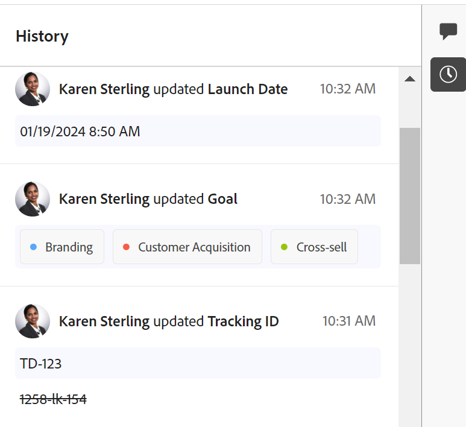

# Visão geral da seção Histórico

<!--
The highlighted information on this page refers to functionality not yet generally available. It is available only in the Preview environment for all customers, or in the Production environment for customers who enabled fast releases.

For information about fast releases, see [Enable or disable fast releases for your organization](/help/quicksilver/administration-and-setup/set-up-workfront/configure-system-defaults/enable-fast-release-process.md).
-->

{{planning-important-intro}}

É possível colaborar em registros do Adobe Workfront Planning, adicionando comentários ou respostas no painel direito de um registro. Você também pode exibir outras alterações feitas no registro e registradas pelo sistema nessa área.

O painel direito de um registro exibe as seguintes seções:

* **Comentários**: exibe comentários e respostas que os usuários adicionam aos registros. Para obter mais informações sobre o gerenciamento de comentários em registros do Workfront Planning, consulte [Gerenciar comentários de registro](/help/quicksilver/planning/records/manage-record-comments.md).
* **Histórico**: exibe as alterações registradas pelo sistema que os usuários fazem nos campos de registro.

## Requisitos de acesso

+++ Expanda para exibir os requisitos de acesso para a funcionalidade neste artigo. 

<table style="table-layout:auto"> 
<col> 
</col> 
<col> 
</col> 
<tbody> 
    <tr> 
<tr> 
</tr>   
<tr> 
   <td role="rowheader">
Pacote do Adobe Workfront
</td> 
   <td> 

Qualquer Workfront e qualquer pacote do Planning
 
Qualquer fluxo de trabalho e qualquer pacote de planejamento

Para obter mais informações sobre o que está incluído em cada pacote do Workfront Planning, entre em contato com o representante de conta da Workfront. 
 
   </td> 
  <tr> 
   <td role="rowheader">
Licença do Adobe Workfront
</td> 
   <td>
Colaborador ou posterior

   </td> 
  </tr> 
  <tr> 
   <td role="rowheader">
Permissões de objeto
</td> 
   <td>   
Exibir permissões ou mais altas para um espaço de trabalho e tipo de registro
  
   
Os administradores do sistema têm permissões para todos os espaços de trabalho, incluindo aqueles que não criaram
 </td> 
  </tr> 
  </tr>

</tbody> 
</table>

Para obter mais informações sobre requisitos de acesso do Workfront, consulte [Requisitos de acesso na documentação do Workfront](/help/quicksilver/administration-and-setup/add-users/access-levels-and-object-permissions/access-level-requirements-in-documentation.md).

+++  

<!--
Old:
<table style="table-layout:auto"> 
<col> 
</col> 
<col> 
</col> 
<tbody> 
    <tr> 
<tr> 
<td> 
   
 Products
 </td> 
   <td> 
   <ul><li>
 Adobe Workfront
</li> 
   <li>
 Adobe Workfront Planning
</li></ul></td> 
  </tr>   
<tr> 
   <td role="rowheader">
Adobe Workfront plan*
</td> 
   <td> 

Any of the following Workfront plans:
 
<ul><li>Select</li> 
<li>Prime</li> 
<li>Ultimate</li></ul> 

Workfront Planning is not available for legacy Workfront plans
 
   </td> 
<tr> 
   <td role="rowheader">
Adobe Workfront Planning package*
</td> 
   <td> 

Any 
 

For more information about what is included in each Workfront Planning plan, contact your Workfront account manager. 
 
   </td> 
 <tr> 
   <td role="rowheader">
Adobe Workfront platform
</td> 
   <td> 

Your organization's instance of Workfront must be onboarded to the Adobe Unified Experience to be able to access Workfront Planning.
 

For more information, see <a href="/help/quicksilver/workfront-basics/navigate-workfront/workfront-navigation/adobe-unified-experience.md">Adobe Unified Experience for Workfront</a>. 
 
   </td> 
   </tr> 
  </tr> 
  <tr> 
   <td role="rowheader">
Adobe Workfront license*
</td> 
   <td> 
Contributor or higher license

   
Workfront Planning is not available for legacy Workfront licenses
 
  </td> 
  </tr> 
  <tr> 
   <td role="rowheader">
Access level configuration
</td> 
   <td> 
There are no access level controls for Adobe Workfront Planning
   
</td> 
  </tr> 
<tr> 
   <td role="rowheader">
Object permissions
</td> 
   <td>   
View or higher permissions to a workspace and record type
  
   
System Administrators have permissions to all workspaces, including the ones they did not create
 </td> 
  </tr> 
<tr>
   <td role="rowheader">
Layout template
</td>
   <td> Users with a Light or Contributor license must be assigned a layout template that includes Planning.
   
Standard users and System Administrators have the Planning areas enabled by default.

</li></ul>
  
</td>
  </tr>
</tbody> 
</table>
-->

## Localizar a seção Histórico de um registro

{{step1-to-planning}}

1. Clique no cartão de um espaço de trabalho.

   O espaço de trabalho é aberto e os tipos de registro são exibidos em cartões.

1. Clique em um cartão de tipo de registro.
A página de tipo de registro é aberta e todos os registros desse tipo são exibidos.

1. Em qualquer exibição, clique no nome de um registro.

   A página do registro é aberta. A área Comentários é aberta por padrão no painel direito.
1. Clique no ícone **Mostrar Histórico** . Todas as alterações feitas nos campos do registro são exibidas no painel direito, começando pela mais recente.
1. (Opcional) Clique no ícone **Ocultar Histórico**  para fechar o painel direito.

## Considerações sobre a seção Histórico

Você pode revisar as alterações feitas nos campos de registro na seção History do painel direito da página de um registro.

* O Workfront Planning registra as seguintes informações na seção Histórico:

   * Quaisquer alterações de campo

   * Os valores antigos e novos dos campos, quando os valores são alterados. Os valores antigos são exibidos em formato tachado.

   * O nome completo do usuário que fez a alteração

   * Uma data e carimbo de data e hora de quando a alteração ocorreu.

* Os campos dos seguintes tipos sempre exibem o valor antigo (em formato tachado) e o novo valor:

   * Texto
   * Parágrafo
   * Moeda
   * Data
   * Número
   * Porcentagem
   * Seleção única

* Os campos dos seguintes tipos mostram o valor antigo no formato tachado somente se pelo menos um dos valores múltiplos tiver sido removido:

   * Seleção múltipla
   * Campos de registro vinculados
   * People

  Se a alteração adicionar apenas valores ao campo, o valor antigo não será exibido e somente o novo valor do campo será exibido.

* Os campos do tipo caixa de seleção nunca exibem o valor antigo no formato tachado. Se o campo for editado, somente o estado atual no momento em que a alteração foi feita será exibido.

  Para obter mais informações sobre campos do Workfront Planning, consulte [Criar campos](/help/quicksilver/planning/fields/create-fields.md).

* As alterações nos campos dos seguintes tipos não são exibidas na seção History:

   * Campos vinculados (pesquisa)
   * Fórmula
   * Criado por
   * Criado na data
   * Última modificação por
   * Data da última modificação

* Se um campo for removido do sistema, as atualizações feitas nesse campo permanecerão na seção Histórico. Não há nenhuma indicação de que o campo foi removido na seção Histórico de um registro.
