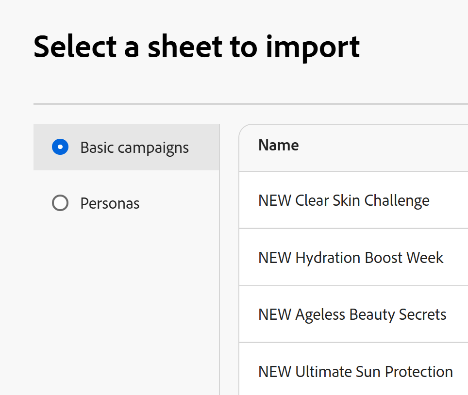

# Criar registros importando informações de um arquivo CSV ou do Excel

As informações nesta página se referem a funcionalidades que ainda não estão disponíveis. Ela está disponível somente no ambiente de Pré-visualização para todos os clientes. Depois das versões mensais para produção, os mesmos recursos também ficam disponíveis no ambiente de produção para clientes que ativaram versões rápidas. 

Para obter informações sobre versões rápidas, consulte [Habilitar ou desabilitar versões rápidas para sua organização](/help/quicksilver/administration-and-setup/set-up-workfront/configure-system-defaults/enable-fast-release-process.md). 

{{planning-important-intro}}

Os registros são instâncias individuais de tipos de registro, que são os tipos de objeto do Adobe Workfront Planning. No Workfront Planning, é possível criar registros importando informações de um arquivo CSV ou do Excel.

Para obter mais informações sobre como criar registros, consulte [Criar registros](/help/quicksilver/planning/records/create-records.md).

## Requisitos de acesso

+++ Expanda para visualizar os requisitos de acesso.

Você deve ter o seguinte acesso para executar as etapas deste artigo:

<table style="table-layout:auto"> 
<col> 
</col> 
<col> 
</col> 
<tbody> 
    <tr> 
<tr> 
<td> 
   
 Produtos
 </td> 
   <td> 
   <ul><li>
 Adobe Workfront
</li> 
   <li>
 Planejamento do Adobe Workfront
</li></ul></td> 
  </tr>   
<tr> 
   <td role="rowheader">
plano do Adobe Workfront*
</td> 
   <td> 

Qualquer um dos seguintes planos da Workfront:
 
<ul><li>Selecionar</li> 
<li>Prime</li> 
<li>Ultimate</li></ul> 

O Workfront Planning não está disponível para planos herdados do Workfront
 
   </td> 
<tr> 
   <td role="rowheader">
Pacote de planejamento do Adobe Workfront*
</td> 
   <td> 

Qualquer 
 

Para obter mais informações sobre o que está incluído em cada plano do Workfront Planning, entre em contato com seu gerente de conta da Workfront. 
 
   </td> 
 <tr> 
   <td role="rowheader">
plataforma Adobe Workfront
</td> 
   <td> 

A instância da Workfront de sua organização deve ser integrada à Adobe Unified Experience para acessar todos os recursos do Workfront Planning.
 

Para obter mais informações, consulte <a href="/help/quicksilver/workfront-basics/navigate-workfront/workfront-navigation/adobe-unified-experience.md">Experiência unificada da Adobe para Workfront</a>. 
 
   </td> 
   </tr> 
  </tr> 
  <tr> 
   <td role="rowheader">
Licença da Adobe Workfront*
</td> 
   <td> Padrão
   
O Workfront Planning não está disponível para licenças herdadas do Workfront
 
  </td> 
  </tr> 
  <tr> 
   <td role="rowheader">
Configuração do nível de acesso
</td> 
   <td> 
Não há controles de nível de acesso para o Adobe Workfront Planning
 
   
Edite o acesso no Workfront para os tipos de objeto que deseja criar (projetos, programas e portfólios) à medida que os registros são conectados a eles. 
  
</td> 
  </tr> 
<tr> 
   <td role="rowheader">
Permissões de objeto
</td> 
   <td> 
Permissões do Contribute ou superior para o espaço de trabalho <!--and record type--> onde você deseja adicionar registros. 
  
   
Os administradores do sistema têm permissões para todos os espaços de trabalho, incluindo aqueles que não criaram

   
Gerencie permissões para objetos do Workfront (portfólios) para adicionar objetos secundários (projetos).

   </td> 
  </tr> 
<tr> 
   <td role="rowheader">
Modelo de layout
</td> 
   <td> 
Todos os usuários, incluindo administradores do Workfront, devem receber um modelo de layout que inclua a área Planejamento no Menu principal 
 </td> 
  </tr> 
</tbody> 
</table>

*Para obter mais informações sobre requisitos de acesso do Workfront, consulte [Requisitos de acesso na documentação do Workfront](/help/quicksilver/administration-and-setup/add-users/access-levels-and-object-permissions/access-level-requirements-in-documentation.md).

+++

## Considerações sobre a importação de registros usando um arquivo Excel ou CSV

* Os cabeçalhos de colunas em cada planilha se tornam os campos associados aos registros.
* Cada linha em cada planilha se torna um registro exclusivo associado.
* Se o arquivo do Excel contiver mais de uma planilha, somente as informações de uma planilha selecionadas durante o processo de importação serão importadas.
* O arquivo não deve exceder o seguinte:
   * 25.000 linhas
   * 500 colunas
* O arquivo não deve ter mais de 5 MB.
* Planilhas vazias não são suportadas.
* Os campos dos seguintes tipos não são suportados e não podem ser mapeados para campos na planilha de importação:
   * Conexões e campos de pesquisa de registros conectados <!--or connected Workfront objects-->
   * Campos de fórmula
   * Data de criação, Criado por
   * Última data de modificação, Última modificação por
   * Pessoas
   * Se um campo de seleção única ou múltipla for importado e tiver mais opções do que um campo semelhante no Planning, as opções adicionais serão criadas durante a importação. Somente usuários com permissões para Gerenciar o espaço de trabalho podem importar novas opções.

## Criar registros importando um arquivo CSV ou do Excel

{{step1-to-planning}}

1. Clique no espaço de trabalho onde deseja criar registros,

   Ou

   Em um espaço de trabalho, expanda a seta apontando para baixo à direita do nome de um espaço de trabalho existente, procure um espaço de trabalho e selecione-o quando ele for exibido na lista.
1. Clique no cartão do tipo de registro para o qual deseja importar os registros.
1. Clique em **Novo registro** no canto superior direito da tela.
1. Clique em **Carregar do arquivo** e depois em **Continuar**. <!--add screen shot when all three buttons are added - with the Submit a request button-->
1. Arraste e solte um arquivo Excel ou CSV salvo anteriormente no computador ou clique em **Selecionar um arquivo CSV ou Excel** para procurar um.
1. Clique em **Visualizar e editar**.
1. (Condicional) Se o arquivo importado tiver mais de uma planilha, selecione o botão de opção da planilha que deseja importar na caixa **Selecione uma planilha a ser importada** e clique em **Avançar**. Caso contrário, continue para a próxima etapa.

   
1. Em **Mapear os campos do Planning para os cabeçalhos de coluna**, selecione o **campo do Planning** que melhor corresponda às informações em cada uma das colunas da planilha.

   

   Cada linha representa um novo registro. Somente os primeiros 10 registros são exibidos na caixa Preview and edit.

1. (Opcional e condicional) Se você tiver permissões de Gerenciamento para o espaço de trabalho, selecione a opção **Criar opções ausentes** no canto inferior esquerdo da tela. Quando ativado, as opções ausentes de campos de seleção única e múltipla são adicionadas.

   >[!NOTE]
   >
   >Por exemplo, se o tipo de registro selecionado tiver um campo Status de seleção única com as opções Novo, Em Andamento e Fechado e um campo Status importado de um arquivo também tiver uma opção Status de Suspensão, a opção Status de Suspensão também será adicionada.
   >
   >Se você não tiver permissões Gerenciar para o espaço de trabalho, poderá importar registros, mas as opções adicionais não serão criadas. Em vez disso, você receberá a seguinte mensagem no canto superior direito da caixa Mapear os campos do Planning para seus cabeçalhos de coluna: **As opções que não existem nos campos de conexão, de seleção única ou de seleção múltipla não serão adicionadas**.

1. Clique em **Importar**.

   As seguintes informações são importadas para o Workfront Planning:

   * Novos registros exibidos na parte inferior da exibição de tabela do tipo de registro selecionado.
   * Novos valores de campo para campos existentes associados a cada registro.
   * Novas opções de um campo de seleção única ou múltipla que não existia no Planning.  <!--when we add connected records - add those here too-->

   Você pode começar a gerenciar campos e registros na página de tipos de registro.

   Todos os usuários com acesso ao Workfront Planning e ao espaço de trabalho agora podem exibir e editar os registros importados e suas informações.

   <!--when we add connected records and the info icon in the tool changes, also add those items to the Import step and to the NOTE above it-->
